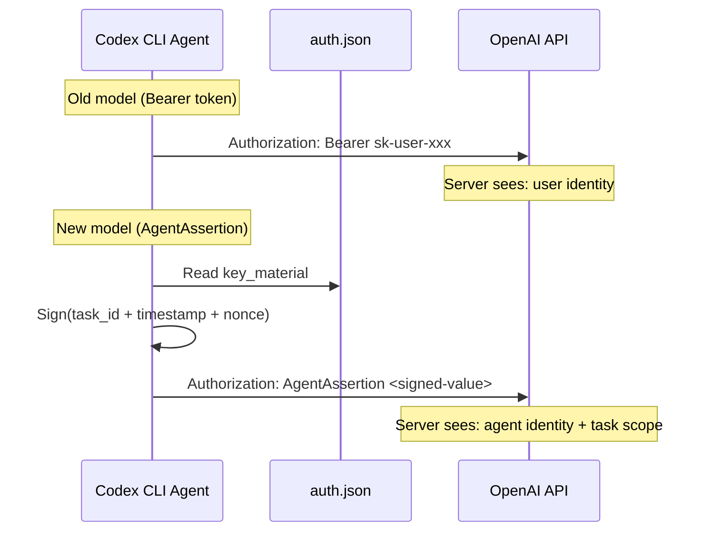
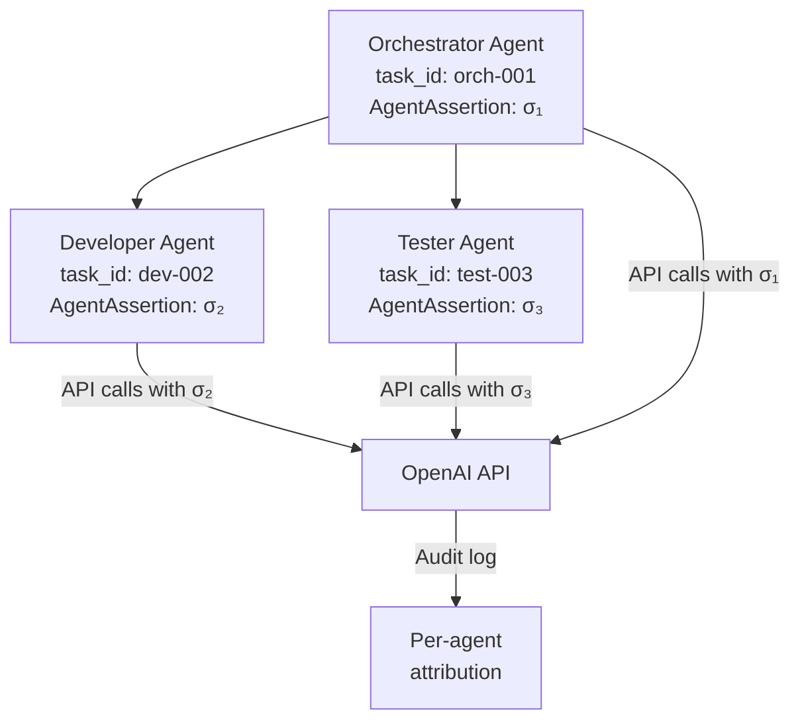

# Agent Identity Authentication: How Codex CLI Agents Authenticate as Themselves in v0.123


## Introduction

For most of Codex CLI's life, every API request left the agent wearing a borrowed identity — a user's OAuth token or API key stapled to outbound calls. The agent had no identity of its own. That changes with the three-PR stack landing in v0.123 alpha this week[^1][^2][^3].

PRs #18757, #18785, and #18811 introduce `AuthMode::AgentIdentity`, a first-class authentication mode where the agent holds its own cryptographic key material and produces signed `AgentAssertion` values instead of forwarding bearer tokens. This is not a minor refactor — it rewires how every backend caller in the Codex codebase constructs its `Authorization` header.

This article explains the architecture, walks through the practical implications, and shows how to prepare your workflows for the migration. It builds on the [companion articles covering the original Biscuit token theory and the `use_agent_identity` feature flag](2026-04-11-codex-cli-agent-identity-biscuit-tokens.md) from April 11.

## Why User-Delegated Auth Breaks at Scale

The fundamental problem is well-understood in the identity community: OAuth 2.0 was designed for human users clicking consent screens, not autonomous agents running overnight[^4][^5].

Three specific failure modes hit Codex CLI teams:

1. **Token expiry during long sessions.** A seven-hour ExecPlan session can outlive a short-lived OAuth token. The agent stalls mid-task waiting for a human to re-authenticate.
2. **Missing attribution.** When three subagents share one API key, audit logs record the same identity for all three. Post-incident forensics cannot distinguish which agent performed which action[^6].
3. **Over-provisioned scope.** User tokens carry all the user's permissions. An agent tasked with running tests inherits the ability to delete production infrastructure — the 15× over-provisioning problem identified in the Aethelgard research[^7].

Agent identity authentication addresses all three by giving each agent its own durable identity with its own scoped credentials.

## The v0.123 Architecture

### The Three-PR Stack

The implementation arrived in three carefully sequenced PRs:

| PR | Purpose | Key Change |
|---|---|---|
| #18757[^1] | Isolate prior attempt | Reverts the broad integration from PR #17387 into a standalone `codex-agent-identity` helper crate |
| #18785[^2] | Add explicit auth mode | Introduces `AuthMode::AgentIdentity` and `CodexAuth::AgentIdentity` with durable key material in `auth.json` |
| #18811[^3] | Migrate backend callers | Replaces all `Bearer {token}` patterns with a generic `Authorization` header value that accommodates `AgentAssertion` |

PR #18757 is the most architecturally significant — it acknowledges that the first attempt (PR #17387) tried to do too much in one go and isolates the identity logic into a dedicated crate. This is a sign of engineering maturity: the team shipped, learned, reverted, and rebuilt with cleaner boundaries.

### The AgentIdentity Record

When agent identity mode is enabled, Codex CLI stores a durable identity record in `auth.json`:

```json
{
  "auth_mode": "agent_identity",
  "agent_identity": {
    "key_material": "<Ed25519-private-key-base64>",
    "account_id": "acct_abc123",
    "email": "ci-agent@example.com",
    "plan_type": "team",
    "fedramp": false,
    "registered_at": "2026-04-21T10:30:00Z"
  }
}
```

The key fields:

- **`key_material`** — the agent's Ed25519 private key, generated at registration time. This never leaves the host.
- **`account_id`** and **`email`** — server-issued claims linking the agent to an organisational account without granting the agent the user's full token.
- **`plan_type`** and **`fedramp`** — cached account metadata so the agent can make routing decisions (e.g., which API endpoints to hit) without round-tripping to the auth server.

### AgentAssertion vs Bearer Token

The critical architectural shift is from bearer tokens to signed assertions:



A bearer token is a capability — anyone holding it can use it. An `AgentAssertion` is a proof — the agent demonstrates it holds the private key by signing a payload that includes the current task ID, a timestamp, and a nonce[^2]. The server verifies the signature against the registered public key. This means:

- **Stolen assertions are useless.** They are bound to a specific task and time window.
- **Each process gets a unique task ID.** PR #18785 allocates a per-process task ID at startup, so even parallel agents on the same host produce distinct, traceable assertions[^2].
- **No shared secrets cross the wire.** The private key stays in `auth.json` on the host.

### Per-Process Task IDs

One detail worth highlighting: the task ID allocated at startup is not merely a logging convenience. It serves as the binding between the agent process and its assertions. If you run five parallel Codex agents in worktrees, each gets a distinct task ID, and the API server can attribute every request to the correct agent instance.

This directly solves the attribution problem that plague multi-agent setups — you can now answer "which agent called which endpoint at what time" from server-side logs alone.

## How This Connects to Biscuit Tokens

The [earlier articles](2026-04-11-biscuit-tokens-agent-identity.md) explored how Eclipse Biscuit tokens provide offline attenuation and Datalog-based policy enforcement for agent delegation chains[^8]. The v0.123 `AgentAssertion` mechanism is architecturally aligned with Biscuit's model:

| Biscuit Concept | v0.123 Implementation |
|---|---|
| Authority block (root key) | Agent's Ed25519 key material in `auth.json` |
| Attenuation blocks | Task-scoped assertion with process-bound task ID |
| Datalog checks | Server-side policy enforcement on assertion claims |
| Offline verification | Public key verification without auth server round-trip |

Whether `AgentAssertion` internally serialises as a Biscuit token or uses a proprietary format is not disclosed in the public PRs. The pattern, however, is unmistakably the same: signed, scoped, attenuable credentials that the holder can narrow but never widen.

## The Industry Context

Codex CLI is not operating in isolation. The broader agent identity ecosystem is maturing rapidly:

**GitGuardian's AAuth proposal** (April 2026) argues that "agents are first-class identities and every HTTP request is signed by the agent's key pair"[^6] — precisely the model Codex is implementing.

**The Decentralised Identity Foundation** published guidance on using DIDs and Verifiable Credentials for agent authentication, arguing that OAuth 2.0's human-centric consent model is fundamentally broken for autonomous systems[^4].

**Stytch's Agent Authentication Guide** documents the shift from Client Credentials Grant (agents acting on behalf of users) to agent-as-principal (agents authenticating as themselves)[^5].

The convergence is clear: the industry is moving from "agents borrow user tokens" to "agents have their own cryptographic identity." Codex CLI's v0.123 implementation is one of the first production-grade implementations in a widely-used coding agent.

## Practical Migration Guide

### Checking Your Current Auth Mode

```bash
# View current auth configuration
codex config get auth_mode

# Check if agent identity is available in your version
codex --version  # Requires v0.123.0+
```

### Registering an Agent Identity

⚠️ The exact registration flow is not yet documented in public release notes — the following is inferred from PR descriptions and may change before stable release.

```bash
# Register a new agent identity (expected flow)
codex auth register-agent --account ci-team@example.com

# This generates Ed25519 key material and stores it in auth.json
# The public key is registered with OpenAI's auth server
```

### Configuration in `config.toml`

```toml
[auth]
mode = "agent_identity"

# Optional: restrict which agents can use this identity
# task_id_prefix = "ci-"  # Only CI agents
```

### Migration Checklist

For teams currently using API keys or OAuth tokens:

1. **Audit your `auth.json` locations.** Each agent host or CI runner needs its own identity registration. Shared API keys across runners should be replaced with per-runner agent identities.
2. **Update any scripts that parse `Authorization` headers.** PR #18811 changes the header format from `Bearer {token}` to `AgentAssertion {value}`[^3]. Middleware, proxies, or logging tools that pattern-match on `Bearer` will need updating.
3. **Review gateway configurations.** If you route through LiteLLM, Bifrost, or OpenRouter, verify they can forward non-Bearer authorization headers. ⚠️ Some gateways may strip or reject unfamiliar auth schemes.
4. **Test subagent delegation.** In multi-agent setups, each subagent should register its own identity. The orchestrator does not share its key material with workers.
5. **Update audit tooling.** Server-side logs will now contain agent-specific task IDs instead of a shared user identity. Update dashboards and alerts accordingly.

## Subagent Delegation Architecture

The most powerful implication of agent identity is for multi-agent orchestration. Consider an agentic pod with an orchestrator, a developer agent, and a tester agent:



Each agent authenticates independently. The orchestrator can verify subagent assertions without contacting the auth server (offline verification via public keys). If the tester agent is compromised, its key can be revoked without affecting the developer agent or orchestrator.

## Security Considerations

### Key Material Protection

The `auth.json` file now contains cryptographic private keys. Treat it with the same care as SSH private keys:

```bash
# Ensure restrictive permissions
chmod 600 ~/.config/codex/auth.json

# In CI, inject via secrets management
# Never commit auth.json to version control
```

### Assertion Replay Window

AgentAssertions include timestamps, but the exact replay window is not publicly documented. ⚠️ Assume the server enforces a short window (likely seconds to minutes). Clock drift between the agent host and the API server could cause authentication failures — ensure NTP synchronisation on all agent hosts.

### Revocation

Unlike bearer tokens that require a revocation list, agent identity revocation works at the public key level. Deregistering an agent's public key from the server immediately invalidates all future assertions from that agent, regardless of what the agent's local `auth.json` contains.

## What This Means for Your Workflow

For **individual developers**, the impact is minimal in the short term. API key authentication will continue to work. Agent identity becomes relevant when you run multiple parallel sessions and want per-session attribution in your billing dashboard.

For **teams**, agent identity is a significant step toward auditable agentic workflows. Every API call is now traceable to a specific agent instance and task, not just a shared team API key.

For **enterprises** with compliance requirements (SOC 2, HIPAA, FedRAMP), agent identity provides the cryptographic non-repudiation that auditors demand. The `fedramp` field in the identity record suggests OpenAI is building this with regulated environments in mind[^2].

## Conclusion

The v0.123 agent identity PRs represent the completion of a journey that started with the `use_agent_identity` feature flag ten days ago. The architecture has been rebuilt from scratch — PR #18757's revert-and-isolate approach shows the team prioritising clean abstractions over speed[^1].

The shift from bearer tokens to signed assertions is not just a security improvement. It is a fundamental change in the agent's relationship with the systems it interacts with: from borrowing a human's identity to asserting its own. For teams building production agentic workflows, this is the authentication model you have been waiting for.

Keep an eye on the [Codex CLI changelog](https://github.com/openai/codex/blob/main/CHANGELOG.md) for the stable v0.123 release — and start planning your migration from shared API keys to per-agent identities now.

## Citations

[^1]: PR #18757 — "Revert broad agent identity changes", openai/codex, April 20 2026. [https://github.com/openai/codex/pull/18757](https://github.com/openai/codex/pull/18757)

[^2]: PR #18785 — "Add explicit AgentIdentity auth mode", openai/codex, April 21 2026. [https://github.com/openai/codex/pull/18785](https://github.com/openai/codex/pull/18785)

[^3]: PR #18811 — "Migrate Codex backend auth header callers", openai/codex, April 21 2026. [https://github.com/openai/codex/pull/18811](https://github.com/openai/codex/pull/18811)

[^4]: "Authorising Autonomous Agents at Scale", Decentralised Identity Foundation, November 2025 (updated February 2026). [https://blog.identity.foundation/building-ai-trust-at-scale-4/](https://blog.identity.foundation/building-ai-trust-at-scale-4/)

[^5]: "AI Agent Authentication Guide", Stytch, 2026. [https://stytch.com/blog/ai-agent-authentication-guide/](https://stytch.com/blog/ai-agent-authentication-guide/)

[^6]: "AI Agents Authentication: How Autonomous Systems Prove Identity", GitGuardian, April 16 2026. [https://blog.gitguardian.com/ai-agents-authentication-how-autonomous-systems-prove-identity/](https://blog.gitguardian.com/ai-agents-authentication-how-autonomous-systems-prove-identity/)

[^7]: Sidik, A. & Rokach, L. "Aethelgard: Learned Capability Governance for AI Coding Agents", arXiv:2604.11839, April 2026.

[^8]: Eclipse Biscuit — authorization tokens with decentralised verification. [https://www.biscuitsec.org/](https://www.biscuitsec.org/)
