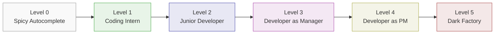
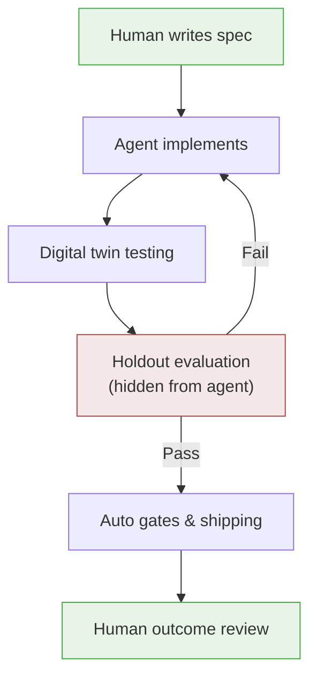
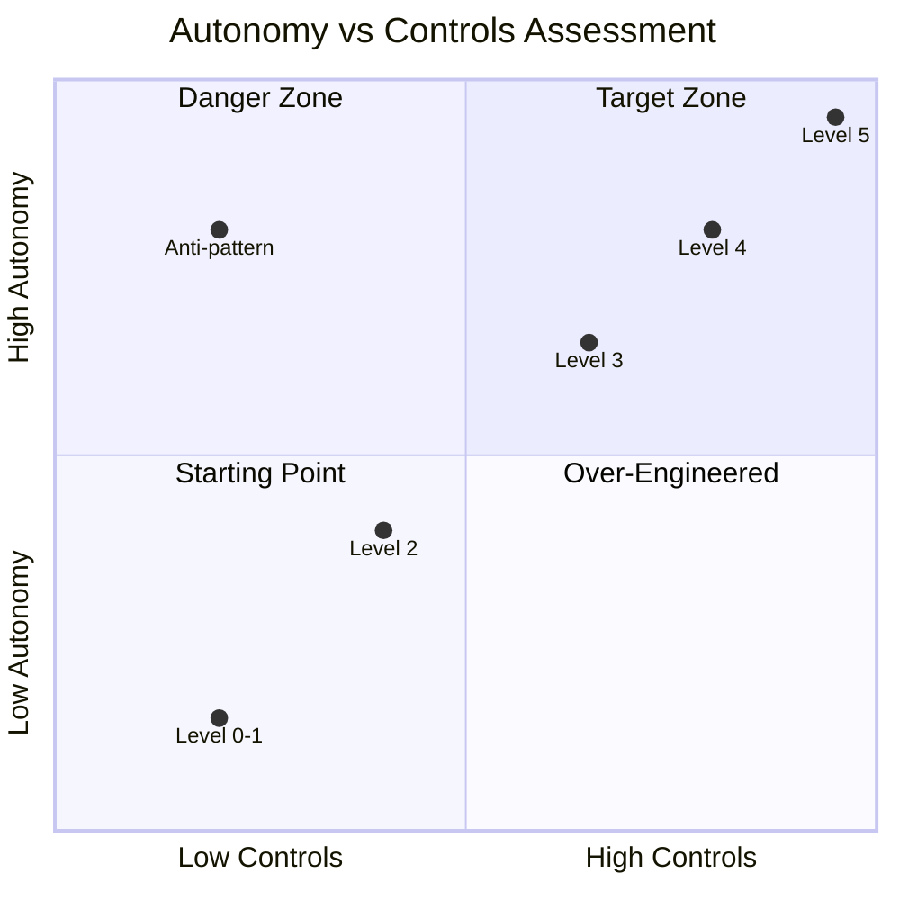

# The AI Codebase Maturity Model: Mapping Five Levels of Agent Autonomy to Codex CLI


Most teams plateau at prompt-and-review. They install Codex CLI, generate a few fixes, manually inspect the diffs, and call themselves "AI-native." In reality, they are stuck at Level 2 of a five-level progression that ends with lights-out pipelines shipping code without human review.

The AI Codebase Maturity Model (ACMM), published by Andy Anderson in April 2026[^1], provides a framework for understanding where your team sits and what infrastructure you need to advance. This article maps each ACMM level to concrete Codex CLI configuration, showing what to build at each stage.

## Why Maturity Models Matter for Agent Workflows

The central insight from Anderson's research is striking: "the intelligence of an AI-driven development system resides not in the AI model itself, but in the infrastructure of instructions, tests, metrics, and feedback loops that surround it"[^1]. Upgrading your model from `codex-mini-latest` to `o3` matters far less than upgrading your feedback infrastructure.

The ACMM validated this through a 4-month case study on KubeStellar Console, a CNCF Kubernetes dashboard built entirely with Claude Code and GitHub Copilot. The result: 91% code coverage, 63 CI/CD workflows, 32 nightly test suites, and bug-to-fix times under 30 minutes around the clock[^1].

Each ACMM level is defined by its **feedback loop topology** — the specific mechanisms that must exist before the next level becomes possible. You cannot skip levels.

## The Five Levels



### Level 0 — Spicy Autocomplete

The AI suggests the next line; the human accepts or rejects. This is GitHub Copilot circa 2022 — inline completions with no agentic behaviour[^2].

**Feedback loop:** None. The model predicts tokens; the human is the only feedback mechanism.

**Codex CLI mapping:** You are not using Codex CLI at this level. If you are running `codex "fix the bug"` and reading every line of the diff yourself, you have graduated to Level 1.

### Level 1 — Coding Intern

The human delegates discrete, well-scoped tasks. The AI handles assigned work; the human remains the system integrator[^2].

**Feedback loop:** Human review of AI-generated code. Architecture decisions are explicitly human-owned.

**Codex CLI configuration:**

```toml
# config.toml — Level 1: maximum human oversight
[model]
name = "codex-mini-latest"

[approval]
default = "suggest"  # Always show diffs before applying
```

At this level, your `AGENTS.md` is minimal:

```markdown
# AGENTS.md
- Run `npm test` before proposing changes
- Do not modify files outside `src/`
```

### Level 2 — Junior Developer

The AI handles multi-file changes and codebase navigation, but humans still review all code. Throughput improves significantly, yet review and context management become bottlenecks[^2]. Many teams describe themselves as AI-native but operate here.

**Feedback loop:** Test results flow back to the agent. The agent can iterate on failures.

**Codex CLI configuration:**

```toml
[approval]
default = "auto-edit"  # Auto-apply file edits, require approval for shell commands
```

```markdown
# AGENTS.md — Level 2
## Build & Test
- `npm run build` must pass before any PR
- `npm test` runs the full suite; iterate until green
- Do not modify test files without explicit instruction

## Navigation
- Source code lives in `src/`, tests in `tests/`, config in `config/`
- Database models are in `src/models/`
- API routes are in `src/routes/`
```

The critical investment at Level 2 is the file map in `AGENTS.md`. Research shows navigation errors account for 27–52% of agent failures[^3], and explicit path guidance reduces navigation steps by 33–44%[^4].

### Level 3 — Developer as Manager

The dynamic reverses. Humans direct the AI and review at the feature/PR level; the AI submits complete, end-to-end pull requests[^2]. Guardrails emerge: linting, test gates, policy checks. Most teams plateau here.

**Feedback loop:** CI pipeline results, linter output, and automated test gates provide structured feedback. The agent receives pass/fail signals from external systems.

**Codex CLI configuration:**

```toml
[approval]
default = "full-auto"  # Agent operates autonomously within sandbox

[sandbox]
permissions = "locked-down"
allow_network = ["api.github.com", "registry.npmjs.org"]
```

At Level 3, hooks become essential:

```bash
#!/bin/bash
# .codex/hooks/pre-commit.sh
npm run lint --fix
npm run typecheck
npm test -- --coverage --coverageThreshold='{"global":{"branches":80}}'
```

```markdown
# AGENTS.md — Level 3
## Workflow
- Create a feature branch for every task
- Run the full CI suite before marking complete
- Coverage must not decrease below 80%
- All new public functions require JSDoc comments

## Architecture
- Follow the repository pattern for data access
- Use dependency injection; no direct imports of concrete implementations
- API changes require OpenAPI spec updates in `docs/api.yaml`
```

The OpenAI best practices documentation reinforces this: "Write tests first, confirm they all fail before any implementation starts, commit the failing tests as a checkpoint, and ask Codex to implement until all tests pass"[^5]. Tests create an external source of truth that stays accurate regardless of session length.

### Level 4 — Developer as Product Manager

Write specifications, leave, then verify test passage. Code becomes opaque; evaluation focuses on outcomes[^2]. Spec quality and evaluation completeness become the primary work unit.

**Feedback loop:** Specification-driven. Specs are versioned, reviewed artefacts. "Passing" must correlate with correctness — this requires investment in evaluation infrastructure that goes beyond unit tests.

**Codex CLI configuration:**

```toml
[model]
name = "o3"  # Full reasoning for complex spec interpretation

[approval]
default = "full-auto"

[sandbox]
permissions = "locked-down"
```

At Level 4, `AGENTS.md` references specs as first-class artefacts:

```markdown
# AGENTS.md — Level 4
## Specification-Driven Development
- Read the spec in `specs/<feature>.md` before implementation
- Every acceptance criterion in the spec must have a corresponding test
- Do not deviate from spec without creating a `DEVIATION.md` explaining why
- After implementation, run `npm run eval` which executes scenario-based tests

## Quality Gates
- Unit test coverage ≥ 90%
- Integration tests pass against staging environment
- Performance benchmarks must not regress beyond 5%
- Security scan (`npm audit`) must report zero high/critical vulnerabilities
```

Thread automations[^6] become practical at this level — schedule Codex to wake on recurring intervals, process a spec backlog, and submit PRs while the team sleeps.

### Level 5 — The Dark Factory

A lights-out pipeline: humans own specifications, machines own implementation[^2]. The name originates from manufacturing — a factory so automated the lights can be off because nobody is inside[^7].



**Feedback loop:** Holdout evaluation scenarios exist outside the codebase; the agent cannot game the criteria. Digital twins simulate real services for full integration testing without production contact[^2].

StrongDM's Software Factory demonstrates this in production. Their charter contains two rules: "Code must not be written by humans" and "Code must not be reviewed by humans"[^8]. A three-person team ships security software using the Attractor agent, with specs stored as meticulous markdown files and validation handled by holdout scenarios the agent cannot access[^8].

⚠️ No public evidence exists of a team reaching full Level 5 with Codex CLI specifically. The tooling requirements — holdout evaluation infrastructure, digital twins, and deterministic shipping gates — exceed what any single coding agent provides today.

## The Three-Axis Assessment

The ACMM evaluates maturity across three axes, each scored 0–5[^2]:

| Axis | What It Measures | Codex CLI Lever |
|------|-----------------|-----------------|
| **Autonomy (A)** | How much control you delegate | Approval modes: `suggest` → `auto-edit` → `full-auto` |
| **Controls (C)** | Testing, CI/CD, evaluation gates | Hooks, `codex exec` CI integration, coverage thresholds |
| **Governance (G)** | Audit trails, policy, risk management | OTEL traces, Guardian approval, permission profiles |

The critical insight: **the danger zone is high autonomy with weak controls**. A team at A3 but only C1 — running `full-auto` approval with minimal test coverage — is inviting silent failures[^2]. The asymmetric feedback problem compounds this: code-level errors produce clear signals, but business-logic mistakes fail silently[^9].



## Practical Progression Guide

### From Level 1 → Level 2: Invest in Navigation

1. Add a file map to `AGENTS.md` — explicit paths reduce navigation failures by a third[^4]
2. Switch approval to `auto-edit` so the agent iterates on edit failures without blocking
3. Ensure `npm test` (or equivalent) runs reliably and returns clear pass/fail signals

### From Level 2 → Level 3: Build the Harness

1. Implement pre-commit hooks that enforce linting, type-checking, and coverage thresholds
2. Integrate `codex exec` into CI/CD for headless validation[^10]
3. Add structured architecture guidance to `AGENTS.md` — not just paths but patterns and constraints
4. Switch to `full-auto` approval within a locked-down sandbox

The harness — the system of constraints, feedback loops, documentation, and lifecycle management around the agent — matters more than the agent itself[^11].

### From Level 3 → Level 4: Specification Infrastructure

1. Create versioned spec files that define acceptance criteria
2. Build scenario-based evaluation beyond unit tests
3. Implement thread automations for autonomous spec processing[^6]
4. Add deviation tracking so the agent documents when it cannot meet a spec requirement

### From Level 4 → Level 5: The Holdout Problem

The gap from Level 4 to Level 5 is the holdout evaluation infrastructure. The agent must not be able to game its own tests. StrongDM solves this by storing scenarios outside the codebase entirely[^8]. For Codex CLI users, this likely means:

1. External evaluation services that the agent cannot inspect
2. Digital twin environments for integration testing
3. Deterministic shipping gates with human-defined acceptance thresholds
4. Audit trails via OTEL traces for post-hoc review

⚠️ This infrastructure is bespoke and expensive. Most teams will — and should — operate comfortably at Level 3 or 4 for the foreseeable future.

## Where Testing Fits

Anderson's case study identified testing as the single most important investment: "the volume of test cases, the coverage thresholds, and the reliability of test execution proved to be the single most important investment in the entire journey"[^1].

This aligns with Codex CLI best practices. Tests create an external source of truth that remains accurate regardless of how long a session runs. Each red-to-green cycle gives the agent unambiguous feedback it can act on autonomously[^5].

For Codex CLI users, the testing progression maps directly to maturity levels:

| Level | Testing Approach | Codex CLI Pattern |
|-------|-----------------|-------------------|
| 1 | Manual verification | Human reviews diff |
| 2 | Agent runs existing tests | `npm test` in AGENTS.md |
| 3 | Agent writes and runs tests with coverage gates | Pre-commit hooks + CI |
| 4 | Scenario-based evaluation | `codex exec` + external eval suite |
| 5 | Holdout evaluation + digital twins | External infrastructure |

## Conclusion

The AI Codebase Maturity Model reframes the question from "which model should I use?" to "what feedback infrastructure have I built?" Most Codex CLI teams are at Level 2 — capable agents held back by weak feedback loops. The path forward is not a model upgrade but a harness upgrade: better `AGENTS.md` files, structured hooks, CI integration, and eventually specification-driven workflows.

The dark factory is a compelling vision, but the practical value of the ACMM is in the intermediate levels. Moving from Level 2 to Level 3 — adding proper hooks, coverage gates, and CI integration — delivers the largest marginal improvement for most teams today.

---

## Citations

[^1]: Anderson, A. (2026). "The AI Codebase Maturity Model: From Assisted Coding to Self-Sustaining Systems." arXiv:2604.09388. [https://arxiv.org/abs/2604.09388](https://arxiv.org/abs/2604.09388)

[^2]: Shapiro, D. (2026). "AI Coding Maturity — Dark Factory." [https://drompincen.github.io/dark-factory/](https://drompincen.github.io/dark-factory/)

[^3]: Kim, S. et al. (2026). "The Amazing Agent Race." arXiv:2604.10261. [https://arxiv.org/abs/2604.10261](https://arxiv.org/abs/2604.10261)

[^4]: Jin, H. (2026). "Formal Architecture Descriptors as Navigation Primitives for AI Coding Agents." arXiv:2604.13108. [https://arxiv.org/abs/2604.13108](https://arxiv.org/abs/2604.13108)

[^5]: OpenAI. (2026). "Best practices – Codex." [https://developers.openai.com/codex/learn/best-practices](https://developers.openai.com/codex/learn/best-practices)

[^6]: OpenAI. (2026). "Codex for (almost) everything." [https://openai.com/index/codex-for-almost-everything/](https://openai.com/index/codex-for-almost-everything/)

[^7]: MindStudio. (2026). "What Is a Dark Factory Codebase?" [https://www.mindstudio.ai/blog/what-is-a-dark-factory-codebase](https://www.mindstudio.ai/blog/what-is-a-dark-factory-codebase)

[^8]: Willison, S. (2026). "How StrongDM's AI team build serious software without even looking at the code." [https://simonwillison.net/2026/Feb/7/software-factory/](https://simonwillison.net/2026/Feb/7/software-factory/)

[^9]: Ivanov, A., Rana, S. & Prabhakaran, V. (2026). "Can Coding Agents Be General Agents?" arXiv:2604.13107. [https://arxiv.org/abs/2604.13107](https://arxiv.org/abs/2604.13107)

[^10]: OpenAI. (2026). "Automating Code Quality and Security Fixes with Codex CLI on GitLab." [https://developers.openai.com/cookbook/examples/codex/secure_quality_gitlab](https://developers.openai.com/cookbook/examples/codex/secure_quality_gitlab)

[^11]: OpenAI. (2026). "Harness engineering: leveraging Codex in an agent-first world." [https://openai.com/index/harness-engineering/](https://openai.com/index/harness-engineering/)
