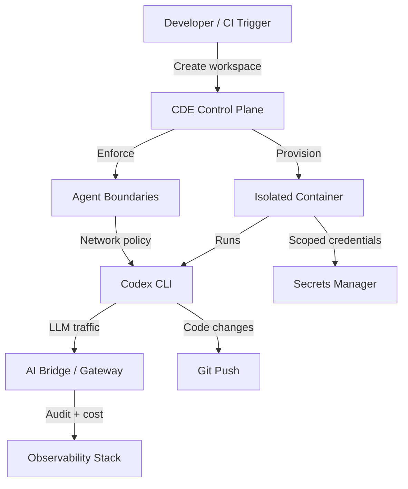
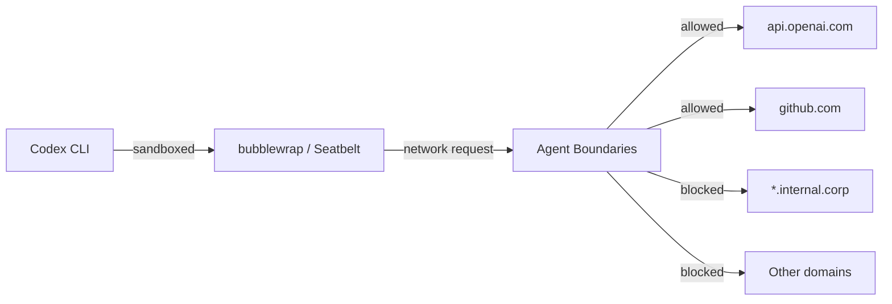
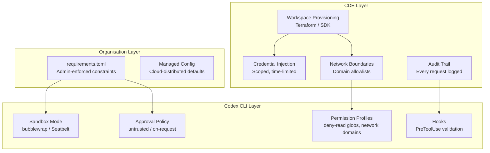

# Cloud Development Environments for AI Coding Agents: Running Codex CLI on Coder, Daytona, and Ephemeral Infrastructure


---

Running Codex CLI on your laptop works brilliantly for solo development. But the moment you scale to teams of agents operating across multiple repositories — or need enterprise-grade audit trails, credential scoping, and resource governance — your local machine stops being the right execution surface. Cloud Development Environments (CDEs) have quietly become the default infrastructure layer for AI coding agents in 2026[^1], and understanding how to deploy Codex CLI inside them is now a core platform engineering skill.

This article covers why CDEs matter for agent workloads, how to configure Codex CLI on the major platforms, and the governance patterns that keep autonomous agents from becoming autonomous liabilities.

## Why CDEs for Agent Workloads?

Codex CLI ships with its own sandbox — bubblewrap on Linux, Seatbelt on macOS[^2] — so why add another layer? Three reasons compound at team scale:

**Blast radius containment.** Simon Willison's "lethal trifecta" framework identifies the danger when an agent has access to sensitive code, exposure to untrusted content (prompt injection risk), and the ability to make external communications[^3]. A CDE isolates each of those surfaces at the infrastructure level, not just the process level.

**Credential scoping.** CDEs provision time-limited, narrowly-scoped access tokens per workspace[^1]. An agent working on your billing service never sees credentials for your identity service. This is materially different from a local `~/.codex/config.toml` that holds a single API key with broad access.

**Audit and cost attribution.** Coder's AI Bridge, which reached general availability in v2.30, intercepts all LLM API traffic to provide centralised audit logging, token tracking, and cost attribution per workspace[^4]. When you are running dozens of agent sessions across a team, this telemetry is not optional.



## Platform Comparison

The CDE landscape has consolidated around a handful of serious options. Here is how they compare for agent workloads:

| Platform | Hosting Model | Agent Support | Codex Module | Governance |
|----------|---------------|---------------|--------------|------------|
| **Coder** | Self-hosted (any cloud) | First-class (AI Bridge + Agent Boundaries) | Registry module[^5] | Enterprise-grade |
| **Daytona** | Managed + self-hosted | SDK integration | SDK guide[^6] | Sandbox-level |
| **GitHub Codespaces** | Managed (GitHub) | DevContainer-based | Manual install | GitHub-scoped |
| **DevPod** | Client-side orchestration | Any backend | Manual install | Provider-dependent |
| **CloudCLI** | Managed | Pre-installed agents | Built-in[^7] | Basic |

## Running Codex CLI on Coder

Coder provisions workspaces via Terraform templates, which means you define your agent infrastructure as code[^5]. The Coder Registry includes a dedicated Codex CLI module that handles installation, connection, and lifecycle management.

### Terraform Template Integration

Add the Codex module to an existing Coder template:

```hcl
module "codex" {
  source   = "registry.coder.com/coder-labs/codex/coder"
  version  = "1.2.0"
  agent_id = coder_agent.main.id

  experiment_pre_install_script = <<-EOT
    # Pre-install project dependencies
    npm ci --ignore-scripts
  EOT
}

resource "coder_agent" "main" {
  os   = "linux"
  arch = "amd64"

  startup_script = <<-EOT
    # Agent-specific AGENTS.md and config
    cp /workspace/.codex/config.toml ~/.codex/config.toml
  EOT
}
```

The module references Coder's AgentAPI for connection reporting and lifecycle management[^5]. When a workspace starts, Codex CLI is installed, configured, and ready to accept tasks via the app-server protocol or direct TUI access.

### AI Bridge Configuration

Coder's AI Bridge acts as an LLM gateway that sits between Codex CLI and the model provider[^4]. Configure it with a single environment variable in your workspace:

```bash
# In your Coder template's environment block
OPENAI_BASE_URL="https://coder.internal/ai-bridge/v1"
```

This routes all Codex API traffic through the bridge, which provides:

- Centralised, queryable audit logs for every agent HTTP request[^4]
- Cost and token tracking per workspace, per user, per template
- Provider abstraction — connect to OpenAI, Anthropic, or AWS Bedrock without reconfiguring agents

### Agent Boundaries

Agent Boundaries enforce network-level policies, treating agents as untrusted actors[^4]. This operates at the infrastructure level, complementing (not replacing) Codex CLI's own sandbox:



The key insight: Codex CLI's sandbox controls what the agent process can do. Agent Boundaries control what the workspace container can reach. Defence in depth.

## Running Codex CLI on Daytona

Daytona takes a different approach — it provides sandboxed execution environments accessible via SDK, API, and CLI[^6]. The Codex integration is SDK-driven rather than Terraform-driven.

### Setting Up a Codex Sandbox

```bash
# Environment variables
export DAYTONA_API_KEY=your_daytona_key
export SANDBOX_OPENAI_API_KEY=your_openai_key
```

The Daytona SDK creates a sandbox, configures Codex, and manages the session lifecycle programmatically[^6]:

```typescript
import { Daytona } from '@daytona/sdk';

const daytona = new Daytona();
const sandbox = await daytona.create({
  language: 'typescript',
  envVars: {
    OPENAI_API_KEY: process.env.SANDBOX_OPENAI_API_KEY,
  },
});

// Write Codex configuration into the sandbox
await sandbox.fs.writeFile(
  '/home/daytona/.codex/config.toml',
  `developer_instructions = "You are running in a Daytona sandbox. Use /home/daytona for file operations."`
);
```

⚠️ **Security note:** The OpenAI API key is accessible to any code executed inside the sandbox[^6]. For production use, consider short-lived tokens via Codex CLI's dynamic bearer token refresh mechanism rather than static keys.

### Thread Persistence

Daytona sandboxes support persistent Codex sessions via thread ID storage[^6]:

```typescript
const options: ThreadOptions = {
  workingDirectory: '/home/daytona',
  skipGitRepoCheck: true,
  sandboxMode: 'danger-full-access',
};
```

Thread state persists across interactions via `/tmp/codex-thread-id`, enabling multi-turn agent workflows within a single sandbox lifecycle.

## DevContainer-Based Approaches

For teams already using DevContainers (GitHub Codespaces, DevPod, or any compatible host), Codex CLI can be added via a feature or manual installation:

```json
{
  "name": "codex-agent",
  "image": "mcr.microsoft.com/devcontainers/base:ubuntu",
  "features": {
    "ghcr.io/openai/codex-devcontainer-feature:1": {}
  },
  "postCreateCommand": "codex --version",
  "remoteEnv": {
    "OPENAI_API_KEY": "${localEnv:OPENAI_API_KEY}"
  }
}
```

The critical consideration with DevContainers is bubblewrap compatibility. Codex CLI's Linux sandbox requires unprivileged user namespace support[^2], which may need enabling in containerised environments:

```bash
# If bubblewrap fails inside the container
sudo sysctl -w kernel.apparmor_restrict_unprivileged_userns=0
```

Alternatively, use Codex CLI's `--sandbox-mode danger-full-access` and rely on the container itself as the isolation boundary — a valid pattern when the CDE enforces its own network and filesystem policies.

## Governance Architecture

The combination of CDE-level governance and Codex CLI's built-in controls creates a layered defence model:



### Recommended Policy Stack

For enterprise deployments, layer these controls:

1. **CDE level:** Provision ephemeral workspaces with scoped credentials and network allowlists. Destroy workspaces after task completion.
2. **Organisation level:** Deploy `requirements.toml` via MDM or cloud-managed configuration to enforce minimum sandbox mode and approval policy[^8].
3. **Codex CLI level:** Use named permission profiles with deny-read globs for sensitive paths and explicit domain allowlists for network access[^2].
4. **Hook level:** Implement PreToolUse hooks for business-logic validation that neither CDE policies nor sandbox rules can express.

## Scaling Patterns

### Ephemeral Agent Pools

The most powerful CDE pattern for Codex CLI is the ephemeral agent pool: spin up a workspace, execute a task via `codex exec`, tear it down. This maps naturally to CI/CD pipelines:

```bash
# GitHub Actions example with Coder
- name: Create agent workspace
  run: coder create codex-agent-${{ github.run_id }} --template codex-task

- name: Execute Codex task
  run: |
    coder ssh codex-agent-${{ github.run_id }} -- \
      codex exec "Fix the failing test in src/auth/login.test.ts" \
      --approval-mode full-auto

- name: Destroy workspace
  if: always()
  run: coder delete codex-agent-${{ github.run_id }} --yes
```

### Persistent Agent Workspaces

For long-horizon tasks — multi-day refactors, continuous monitoring loops — use persistent workspaces with thread automations. The CDE handles lifecycle management (auto-stop after idle, auto-start on trigger), whilst Codex CLI's session resume picks up where it left off.

### Cost Projections

Running Codex CLI in CDEs adds infrastructure cost on top of API token spend. Approximate figures for a 10-developer team:

| Component | Monthly Cost (Approx.) |
|-----------|----------------------|
| Coder Premium (self-hosted) | $50–100/seat[^4] |
| Compute (ephemeral, ~4 vCPU per workspace) | $200–500 |
| API tokens (o3/o4-mini mix) | $500–2,000 |
| **Total** | **$1,200–3,500** |

⚠️ These figures are indicative and vary significantly based on workload intensity, cloud provider pricing, and model selection.

## When Not to Use a CDE

CDEs add operational complexity. Skip them when:

- **Solo developer, single repo.** Codex CLI's built-in sandbox is sufficient.
- **Air-gapped environments** where cloud CDE access is not available (use local Docker sandboxes instead[^9]).
- **Quick prototyping** where provisioning overhead exceeds the task duration.

The decision point is typically team size × repository count × compliance requirements. Once any of those dimensions grows past a threshold, CDE infrastructure pays for itself in governance alone.

## Citations

[^1]: InfraGap, "What is a CDE? Cloud Development Environment Guide," April 2026. [https://infragap.com/cde/](https://infragap.com/cde/)

[^2]: OpenAI, "Sandbox – Codex CLI," OpenAI Developers, April 2026. [https://developers.openai.com/codex/concepts/sandboxing](https://developers.openai.com/codex/concepts/sandboxing)

[^3]: Coder, "AI Agents Are Already in Your Codebase. Is Your Infrastructure Ready?" Coder Blog, 2026. [https://coder.com/blog/ai-agents-are-already-in-your-codebase-is-your-infrastructure-ready](https://coder.com/blog/ai-agents-are-already-in-your-codebase-is-your-infrastructure-ready)

[^4]: Coder, "AI Governance Reaches GA in 2.30," Coder Changelog, April 2026. [https://coder.com/changelog/coder-2-30](https://coder.com/changelog/coder-2-30)

[^5]: Coder, "Codex CLI Module," Coder Registry, 2026. [https://registry.coder.com/modules/coder-labs/codex](https://registry.coder.com/modules/coder-labs/codex)

[^6]: Daytona, "Build a Coding Agent Using Codex SDK and Daytona," Daytona Docs, 2026. [https://www.daytona.io/docs/en/guides/codex/codex-sdk-interactive-terminal-sandbox/](https://www.daytona.io/docs/en/guides/codex/codex-sdk-interactive-terminal-sandbox/)

[^7]: CloudCLI, "Cloud Dev Environments for AI Coding Agents," 2026. [https://cloudcli.ai/](https://cloudcli.ai/)

[^8]: OpenAI, "Managed configuration – Codex," OpenAI Developers, April 2026. [https://developers.openai.com/codex/enterprise/managed-configuration](https://developers.openai.com/codex/enterprise/managed-configuration)

[^9]: OpenAI, "Running Codex CLI in Devcontainers and Docker Sandboxes," OpenAI Developers, April 2026. [https://developers.openai.com/codex/cli/features](https://developers.openai.com/codex/cli/features)
