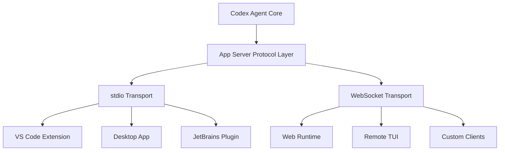
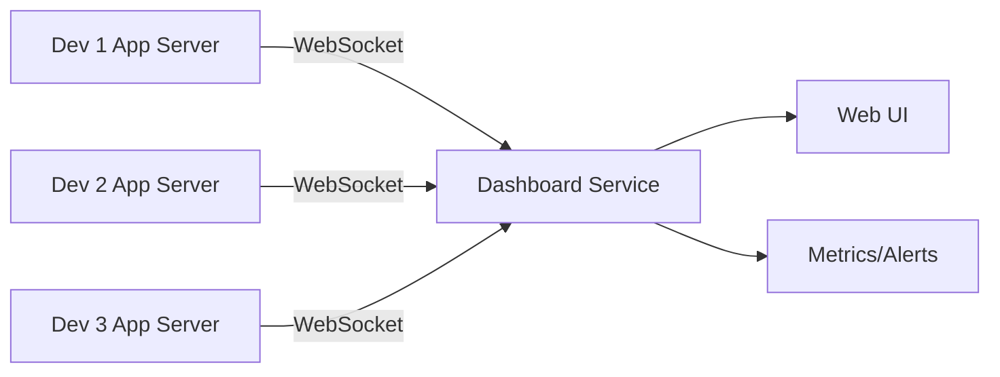
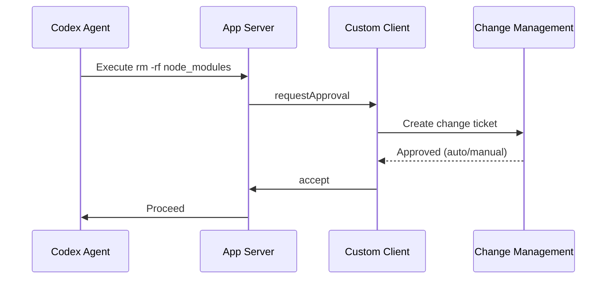

# Codex App Server Architecture: Building Custom Client Integrations with JSON-RPC


---

The Codex App Server is the protocol layer that decouples OpenAI's coding agent logic from its client surfaces[^1]. Every Codex experience — the CLI TUI, VS Code extension, desktop app, web interface, and third-party IDE integrations from JetBrains and Apple — communicates through this single bidirectional JSON-RPC 2.0 API[^2]. Understanding this architecture unlocks the ability to build bespoke integrations: custom dashboards, team orchestration layers, or entirely new agent surfaces tailored to your workflow.

## Why App Server Exists

OpenAI initially experimented with exposing Codex as an MCP server but found that maintaining MCP semantics for rich IDE interactions proved difficult[^2]. Agent interactions are fundamentally different from simple request/response exchanges — they require structured representation of user input, incremental progress, artifacts, approval flows, and streaming diffs[^1]. The App Server protocol was designed from first principles to handle these requirements whilst remaining language-agnostic and backward-compatible.

## Architecture Overview



The architecture follows three deployment patterns[^2]:

1. **Local clients** (VS Code, desktop): Bundle platform-specific binaries, launch as child processes with bidirectional stdio channels
2. **IDE partners** (Xcode, JetBrains): Decouple release cycles by pointing to newer App Server binaries independently
3. **Web/remote runtime**: Browser or remote TUI communicates via WebSocket with containerised App Servers

## The Three Conversation Primitives

The protocol structures all interactions through a hierarchy of three primitives[^3]:

### Items

The atomic unit of input or output. Each Item has an explicit lifecycle: `started` → optional streaming `delta` events → `completed`. Items represent:

- User messages
- Agent messages (streamed token-by-token)
- Command executions
- File changes (diffs)
- Approval requests
- Tool calls

### Turns

A Turn groups the sequence of Items produced by a single unit of agent work, initiated by user input. One user message triggers one Turn containing potentially dozens of Items as the agent reasons, executes commands, and produces output.

### Threads

The durable container for an ongoing session. Threads support creation, resumption, forking, and archival with persisted event history, enabling stateless client reconnection without losing state[^3].

## Transport Options

### stdio (Default)

Newline-delimited JSON (JSONL) over stdin/stdout. This is the production transport for local integrations:

```bash
codex app-server
```

### WebSocket (Experimental)

One JSON-RPC message per text frame, with bounded queues and overload handling[^3]:

```bash
codex app-server --listen ws://127.0.0.1:4500
```

The WebSocket listener provides HTTP health checks at `/readyz` and `/healthz` endpoints[^3], making it suitable for containerised deployments behind load balancers.

## Building a Custom Client

### Step 1: Launch the Server

```bash
# stdio mode (recommended for local integrations)
codex app-server

# WebSocket mode (for remote or web integrations)
codex app-server --listen ws://127.0.0.1:4500 \
  --ws-auth capability-token \
  --ws-token-file /path/to/token
```

### Step 2: Initialise the Connection

Every transport connection must begin with an `initialize` request[^3]:

```json
{
  "method": "initialize",
  "id": 1,
  "params": {
    "clientInfo": {
      "name": "my-custom-client",
      "title": "My Integration",
      "version": "1.0.0"
    },
    "capabilities": {
      "experimentalApi": true
    }
  }
}
```

The server responds with platform information and a user-agent string. Follow with an `initialized` notification:

```json
{
  "method": "initialized"
}
```

### Step 3: Start a Thread and Turn

```json
{
  "method": "thread/start",
  "id": 2,
  "params": {
    "config": {
      "model": "o3",
      "sandboxPolicy": "workspaceWrite",
      "personality": "pragmatic"
    }
  }
}
```

Then begin a turn with user input:

```json
{
  "method": "turn/start",
  "id": 3,
  "params": {
    "threadId": "<thread-id-from-response>",
    "input": [
      {
        "type": "text",
        "text": "Refactor the auth module to use dependency injection"
      }
    ]
  }
}
```

### Step 4: Handle Streaming Notifications

The server emits notifications as the agent works[^3]:

```
← {"method": "turn/started", "params": {...}}
← {"method": "item/started", "params": {"type": "agentMessage", ...}}
← {"method": "item/agentMessage/delta", "params": {"text": "I'll start by..."}}
← {"method": "item/completed", "params": {...}}
← {"method": "item/started", "params": {"type": "commandExecution", ...}}
← {"method": "item/commandExecution/outputDelta", "params": {"output": "..."}}
← {"method": "item/commandExecution/requestApproval", "id": 4, "params": {...}}
```

### Step 5: Handle Approval Requests

When the agent needs permission to execute a command or write a file, the server sends a request and pauses[^1]:

```json
{
  "method": "item/commandExecution/requestApproval",
  "id": 4,
  "params": {
    "command": "npm install express",
    "workingDirectory": "/project"
  }
}
```

Respond with one of: `accept`, `acceptForSession`, `decline`, or `cancel`:

```json
{
  "id": 4,
  "result": {
    "decision": "acceptForSession"
  }
}
```

## Remote TUI Mode

For remote development scenarios, the App Server enables a split architecture where the server runs on your development machine and the TUI runs locally[^4]:

```bash
# On the remote host
codex app-server --listen ws://0.0.0.0:4500 \
  --ws-auth signed-bearer-token \
  --ws-shared-secret-file /etc/codex/ws-secret

# On your local machine (via SSH tunnel)
ssh -L 4500:localhost:4500 devbox
codex --remote wss://localhost:4500 \
  --remote-auth-token-env CODEX_REMOTE_TOKEN
```

Security constraints: tokens are only transmitted over `wss://` URLs or `ws://` connections to localhost, `127.0.0.1`, or `::1`[^4]. For production deployments, use TLS termination or SSH port forwarding rather than exposing unencrypted WebSocket listeners.

## Authentication Modes

The App Server supports three authentication patterns[^3]:

| Mode | Flag | Use Case |
|------|------|----------|
| API Key | `apikey` | Direct OpenAI credential for headless/CI |
| ChatGPT Managed | `chatgpt` | OAuth with auto-refresh for interactive use |
| External Tokens | `chatgptAuthTokens` | Host-supplied tokens for enterprise SSO |

For WebSocket connections specifically:

```bash
# Capability token (shared secret)
codex app-server --listen ws://127.0.0.1:4500 \
  --ws-auth capability-token \
  --ws-token-file ./my-token

# Signed bearer token (JWT with HMAC validation)
codex app-server --listen ws://127.0.0.1:4500 \
  --ws-auth signed-bearer-token \
  --ws-shared-secret-file ./hmac-secret
```

## Schema Generation for Type Safety

Generate typed client bindings from the protocol schema[^3]:

```bash
# TypeScript definitions
codex app-server generate-ts --out ./schemas

# JSON Schema (for any language)
codex app-server generate-json-schema --out ./schemas
```

This eliminates the need to manually maintain type definitions as the protocol evolves. Pin your App Server binary version to ensure schema compatibility across releases.

## Error Handling and Backpressure

The server implements backpressure through JSON-RPC error code `-32001` ("Server overloaded") when request ingestion saturates[^3]. Clients should implement exponential backoff with jitter:

```typescript
async function sendWithBackoff(message: object, maxRetries = 5) {
  for (let attempt = 0; attempt < maxRetries; attempt++) {
    const response = await send(message);
    if (response.error?.code !== -32001) return response;
    const delay = Math.min(1000 * 2 ** attempt, 30000);
    const jitter = delay * (0.5 + Math.random() * 0.5);
    await sleep(jitter);
  }
  throw new Error('Server overloaded after max retries');
}
```

Additionally, handle `codexErrorInfo` variants for graceful degradation[^3]:

- `ContextWindowExceeded` — trigger compaction or fork
- `UsageLimitExceeded` — queue work or switch models
- `HttpConnectionFailed` — retry with connectivity checks
- `SandboxError` — escalate to operator

## Practical Integration Patterns

### Team Dashboard

Build a read-only dashboard that monitors multiple developer sessions:



Subscribe to `turn/completed` notifications across sessions to track token usage, completion rates, and active work. The `thread/list` method supports pagination with filters by model and source[^3].

### CI/CD Orchestrator

Wrap `command/exec` for running Codex outside thread context with sandbox isolation[^3]:

```json
{
  "method": "command/exec",
  "id": 10,
  "params": {
    "command": "npm test",
    "workingDirectory": "/project",
    "timeout": 120000,
    "tty": false,
    "streamStdoutStderr": true
  }
}
```

### Custom Approval Gateway

Route approval requests through your organisation's change management system before accepting:



## Current Limitations

- WebSocket transport remains experimental — do not rely on it for production workloads without thorough testing[^4]
- Remote connections are in alpha; enable with `[features] remote_connections = true` in `~/.codex/config.toml`[^5]
- Custom client threads may appear as "vscode" in Desktop history due to a known client identification issue[^6]
- The `experimentalApi` capability gates access to newer methods like `thread/backgroundTerminals/clean` and `dynamicToolCall`[^3]

## Conclusion

The Codex App Server transforms Codex from a terminal tool into a programmable agent platform. Whether you're building a team monitoring dashboard, an enterprise approval gateway, or a completely novel IDE integration, the JSON-RPC protocol provides a stable, language-agnostic foundation. Start with stdio for local prototyping, generate typed schemas for your language of choice, and graduate to WebSocket when remote or multi-client scenarios demand it.

---

## Citations

[^1]: OpenAI Engineering Blog, "Unlocking the Codex harness: how we built the App Server" (2026). [https://openai.com/index/unlocking-the-codex-harness/](https://openai.com/index/unlocking-the-codex-harness/)

[^2]: InfoQ, "OpenAI Publishes Codex App Server Architecture for Unifying AI Agent Surfaces" (February 2026). [https://www.infoq.com/news/2026/02/opanai-codex-app-server/](https://www.infoq.com/news/2026/02/opanai-codex-app-server/)

[^3]: OpenAI Developers, "App Server – Codex" (2026). [https://developers.openai.com/codex/app-server](https://developers.openai.com/codex/app-server)

[^4]: OpenAI Developers, "Command line options – Codex CLI" (2026). [https://developers.openai.com/codex/cli/reference](https://developers.openai.com/codex/cli/reference)

[^5]: OpenAI Developers, "Remote connections – Codex" (2026). [https://developers.openai.com/codex/remote-connections](https://developers.openai.com/codex/remote-connections)

[^6]: GitHub Issue #16614, "Clarify expected codex app-server thread visibility in Desktop history" (2026). [https://github.com/openai/codex/issues/16614](https://github.com/openai/codex/issues/16614)
