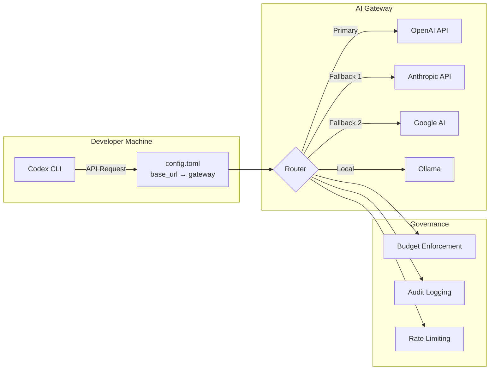
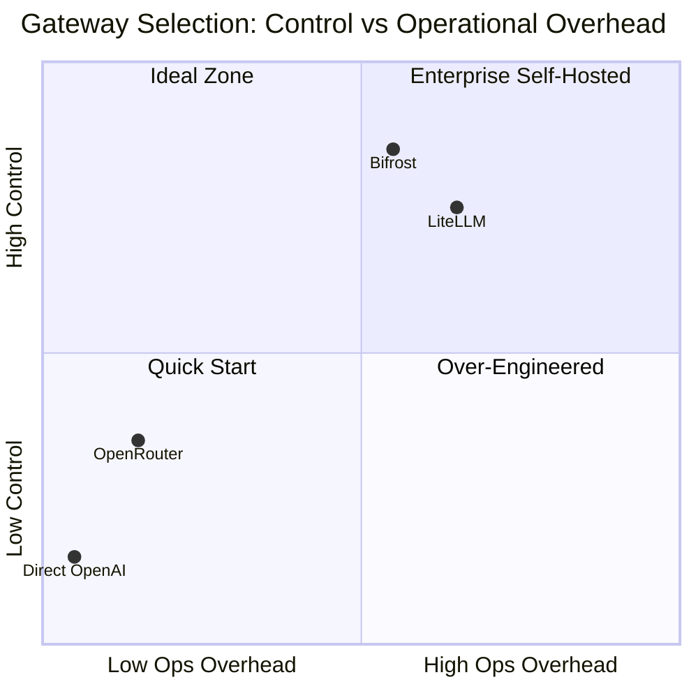

# Routing Codex CLI Through AI Gateways: Multi-Provider Access, Cost Control, and Failover


---

Codex CLI ships with first-class support for OpenAI models, but production teams rarely want a single point of failure, a single billing dimension, or a single model family. AI gateways sit between Codex CLI and the upstream provider, adding failover chains, spend governance, observability, and access to 100+ models from a single `config.toml` change. This article covers the provider configuration primitives Codex exposes, the three leading gateway options, and concrete patterns for teams routing agent traffic at scale.

## Why Gateway Routing Matters

Out of the box, Codex CLI sends every request directly to OpenAI's API using two environment variables (`OPENAI_API_KEY` and optionally `OPENAI_BASE_URL`)[^1]. This works for individual developers, but creates several governance gaps at team and enterprise scale:

- **No per-user spend attribution** — costs aggregate into a single API key with no breakdown by developer, project, or session[^2].
- **No provider failover** — if OpenAI's API degrades during a long agentic session, the session stalls with no automatic retry to an alternative provider[^2].
- **Single-model constraint** — Codex defaults to OpenAI models, but some tasks benefit from Anthropic's extended thinking, Google's grounding, or local models for air-gapped environments[^3].
- **Missing compliance logging** — regulated industries need immutable audit trails of every request and response flowing through agent tooling[^2].

An AI gateway solves all four by intercepting Codex's OpenAI-compatible API calls and adding routing, budgeting, and observability transparently.

## Codex CLI Provider Configuration Primitives

Before choosing a gateway, understand the three configuration mechanisms Codex provides natively.

### 1. The `openai_base_url` Override

The simplest approach — redirect the built-in OpenAI provider to any OpenAI-compatible endpoint without defining a new provider:

```toml
# ~/.codex/config.toml
openai_base_url = "https://your-gateway.example.com/v1"
```

Alternatively, set the environment variable for a single session:

```bash
export OPENAI_BASE_URL="https://your-gateway.example.com/v1"
codex
```

This preserves the `openai` provider ID and all its defaults[^1]. Use this when your gateway presents an OpenAI-compatible interface and you want minimal configuration change.

### 2. Custom Provider Definitions

For non-OpenAI providers or gateways requiring distinct authentication, define a named provider in `config.toml`:

```toml
model = "claude-sonnet-4-5"
model_provider = "anthropic_via_gateway"

[model_providers.anthropic_via_gateway]
name = "Anthropic via Bifrost"
base_url = "http://localhost:8080/anthropic/v1"
env_key = "BIFROST_VIRTUAL_KEY"
wire_api = "responses"
```

The `wire_api` key must be set to `"responses"` for providers that support the OpenAI Responses API wire format[^4]. Three provider IDs are reserved and cannot be overridden: `openai`, `ollama`, and `lmstudio`[^4].

### 3. Command-Based Authentication

Enterprise environments often use short-lived tokens from credential helpers rather than static API keys. Codex supports this natively:

```toml
[model_providers.corp_gateway]
name = "Corporate AI Gateway"
base_url = "https://ai-gateway.corp.internal/v1"
wire_api = "responses"

[model_providers.corp_gateway.auth]
command = "/usr/local/bin/fetch-codex-token"
args = ["--audience", "codex-cli"]
timeout_ms = 5000
refresh_interval_ms = 300000
```

The auth command receives no stdin and must write the bearer token to stdout. Codex refreshes the token automatically at the configured interval[^4]. This integrates cleanly with HashiCorp Vault, AWS IAM, and Azure Managed Identity workflows.



## Gateway Option 1: Bifrost

Bifrost is a high-performance, open-source AI gateway written in Go by Maxim AI. It connects to 20+ LLM providers through a single OpenAI-compatible API and adds only 11 microseconds of overhead at 5,000 requests per second[^2].

### Quick Setup

```bash
# Terminal 1 — start the gateway
npx -y @maximhq/bifrost

# Terminal 2 — interactive CLI configures Codex automatically
npx -y @maximhq/bifrost-cli
```

The Bifrost CLI detects installed coding agents (Codex CLI, Claude Code, Gemini CLI) and configures environment variables and `config.toml` entries automatically[^5].

### Manual Configuration

```toml
# ~/.codex/config.toml
model = "anthropic/claude-sonnet-4-5-20250929"
model_provider = "bifrost"

[model_providers.bifrost]
name = "Bifrost Gateway"
base_url = "http://localhost:8080/openai/v1"
env_key = "BIFROST_VIRTUAL_KEY"
wire_api = "responses"
```

### Key Capabilities

| Feature | Detail |
|---|---|
| **Virtual keys** | Per-user keys encoding model restrictions, dollar-based spend caps (daily/weekly/monthly), and rate limits[^2] |
| **Hierarchical budgets** | Individual → team → organisation enforcement tiers[^2] |
| **Automatic failover** | Define fallback chains; Bifrost retries transparently when the primary provider fails[^5] |
| **Observability** | Prometheus metrics, OpenTelemetry trace export to Datadog/New Relic/Honeycomb[^2] |
| **Compliance** | Immutable audit logs, SOC 2 / GDPR support, Vault integration for secrets[^2] |
| **Deployment** | In-VPC deployment for data residency requirements[^2] |

A critical constraint: non-OpenAI models **must support tool use** for Codex to function correctly, since the agent loop relies heavily on tool calls[^5].

### Switching Models Mid-Session

With Bifrost routing, you can switch models during a TUI session using the `/model` slash command:

```
/model anthropic/claude-sonnet-4-5-20250929
/model gemini/gemini-2.5-pro
/model openai/gpt-5.3-codex
```

This lets you use a cheaper model for scaffolding and switch to a frontier model for complex reasoning — all within the same session[^5].

## Gateway Option 2: LiteLLM

LiteLLM is a Python-based open-source proxy supporting 100+ providers through a unified OpenAI-compatible interface[^6]. It is the most widely adopted gateway in Python-heavy development environments.

### Setup

```bash
# Install and start the proxy
pip install litellm
litellm --config litellm_config.yaml
```

Define model routing in `litellm_config.yaml`:

```yaml
model_list:
  - model_name: gpt-5.3-codex
    litellm_params:
      model: openai/gpt-5.3-codex
      api_key: "${OPENAI_API_KEY}"

  - model_name: claude-sonnet
    litellm_params:
      model: anthropic/claude-sonnet-4-5
      api_key: "${ANTHROPIC_API_KEY}"

  - model_name: gemini-pro
    litellm_params:
      model: gemini/gemini-2.5-pro
      api_key: "${GOOGLE_API_KEY}"
```

Point Codex at the proxy:

```bash
export OPENAI_BASE_URL=http://localhost:4000
export OPENAI_API_KEY="$YOUR_LITELLM_KEY"
codex --model claude-sonnet
```

### Key Capabilities

- **Virtual keys** with per-key spend tracking and budget limits[^6]
- **Fallback routing** — define ordered provider lists per model alias
- **Semantic caching** — reduces cost and latency for repeated prompts
- **Spend dashboards** — built-in UI for usage analytics
- **SSO integration** — OIDC, Okta, Azure AD for enterprise key management

⚠️ LiteLLM requires version 1.66.3.dev5 or higher for full Codex CLI compatibility with the Responses API wire format[^6].

## Gateway Option 3: OpenRouter

OpenRouter is a hosted routing service requiring no self-hosted infrastructure. It routes requests across multiple providers with automatic failover[^3].

### Setup

```toml
# ~/.codex/config.toml
model = "openai/gpt-5.3-codex"
model_provider = "openrouter"

[model_providers.openrouter]
name = "OpenRouter"
base_url = "https://openrouter.ai/api/v1"
env_key = "OPENROUTER_API_KEY"
```

```bash
export OPENROUTER_API_KEY="$YOUR_OPENROUTER_KEY"
codex
```

### Key Capabilities

- **Zero infrastructure** — fully hosted, no gateway to deploy[^3]
- **Provider failover** — automatic rerouting when a provider is unavailable
- **Team controls** — centralised budget management via the OpenRouter dashboard[^3]
- **Usage tracking** — real-time visibility through the Activity Dashboard
- **Model flexibility** — access any model on the OpenRouter catalogue without reconfiguration

### Limitations

OpenRouter does not support advanced provider routing features like weighted load balancing or custom fallback chain definitions from within Codex CLI's configuration[^3]. For teams needing fine-grained routing control, a self-hosted gateway (Bifrost or LiteLLM) provides more flexibility.

## Gateway Comparison



| Criterion | OpenRouter | Bifrost | LiteLLM |
|---|---|---|---|
| **Deployment** | Hosted SaaS | Self-hosted (Go binary) | Self-hosted (Python) |
| **Provider count** | 200+ | 20+ | 100+ |
| **Latency overhead** | Variable (network hop) | 11µs at 5K RPS[^2] | ~1–5ms typical |
| **Virtual keys** | ✅ | ✅ | ✅ |
| **Custom fallback chains** | ❌ | ✅ | ✅ |
| **Semantic caching** | ❌ | ✅ | ✅ |
| **OTEL export** | ❌ | ✅ | ✅ |
| **Data residency** | ❌ (US-hosted) | ✅ (in-VPC) | ✅ (self-hosted) |
| **Setup time** | 5 minutes | 15 minutes | 20 minutes |

## Production Patterns

### Pattern 1: Two-Tier Model Routing

Route planning and critical reasoning to a frontier model while sending narrower tasks to a faster, cheaper model:

```toml
# Primary profile — frontier model for complex work
model = "openai/gpt-5.4"
model_provider = "gateway"

[model_providers.gateway]
name = "Bifrost"
base_url = "http://gateway.internal:8080/openai/v1"
env_key = "BIFROST_KEY"
wire_api = "responses"
```

Configure the gateway's routing rules to map model aliases to providers:

```yaml
# Bifrost routing config
routes:
  - alias: "openai/gpt-5.4"
    primary: "openai"
    fallback: ["azure-openai-eastus", "azure-openai-westeu"]
  - alias: "fast-codex"
    primary: "cerebras/gpt-5.3-codex-spark"
    fallback: ["groq/llama-4-maverick"]
```

Codex CLI's built-in two-tier routing sends planning work to GPT-5.4 and supporting tasks to GPT-5.4 mini[^7]. A gateway extends this by adding cross-provider fallback to each tier.

### Pattern 2: Regional Failover for Global Teams

```yaml
# LiteLLM config for regional routing
model_list:
  - model_name: codex-primary
    litellm_params:
      model: openai/gpt-5.3-codex
      api_base: https://us.api.openai.com/v1
      api_key: "${OPENAI_API_KEY}"
    model_info:
      region: us-east

  - model_name: codex-primary
    litellm_params:
      model: openai/gpt-5.3-codex
      api_base: https://eu.api.openai.com/v1
      api_key: "${OPENAI_API_KEY_EU}"
    model_info:
      region: eu-west

router_settings:
  routing_strategy: "latency-based-routing"
```

LiteLLM routes each request to the lowest-latency deployment, providing both performance and data residency compliance[^6].

### Pattern 3: Budget Enforcement with Virtual Keys

Prevent runaway agentic sessions from exhausting monthly budgets:

```bash
# Create a virtual key with daily spend cap
curl -X POST http://gateway.internal:8080/key/generate \
  -H "Authorization: Bearer $ADMIN_KEY" \
  -d '{
    "models": ["gpt-5.3-codex", "gpt-5.4-mini"],
    "max_budget": 50.00,
    "budget_duration": "daily",
    "metadata": {"team": "platform", "user": "dev-alice"}
  }'
```

Distribute virtual keys to each developer. The gateway enforces limits and returns a `429` when the budget is exhausted, which Codex CLI surfaces as a clear error rather than silently failing[^2].

### Pattern 4: Air-Gapped Local Fallback

For environments where internet connectivity is intermittent, configure a local model as the final fallback:

```toml
model = "gpt-5.3-codex"
model_provider = "gateway"

[model_providers.gateway]
name = "Gateway with local fallback"
base_url = "http://localhost:8080/openai/v1"
env_key = "GATEWAY_KEY"
wire_api = "responses"

[model_providers.local_ollama]
name = "Ollama (offline fallback)"
base_url = "http://localhost:11434/v1"
```

The gateway routes to OpenAI when available, falls back to Ollama with a capable local model (e.g., Llama 4 Maverick) when connectivity drops. This complements the patterns described in the Codex CLI offline mode guide.

## Azure Configuration

For teams on Azure OpenAI, Codex supports direct Azure provider configuration without a gateway:

```toml
model = "gpt-5.3-codex"
model_provider = "azure"

[model_providers.azure]
name = "Azure OpenAI"
base_url = "https://YOUR_PROJECT.openai.azure.com/openai"
env_key = "AZURE_OPENAI_API_KEY"
query_params = { api-version = "2025-04-01-preview" }
wire_api = "responses"
request_max_retries = 4
stream_max_retries = 10
stream_idle_timeout_ms = 300000
```

However, adding a gateway in front of Azure provides failover to direct OpenAI or other providers when Azure capacity is constrained[^4].

## Observability Through the Gateway

A gateway becomes the single instrumentation point for all agent traffic. Key metrics to capture:

- **Token consumption per session** — identify runaway agents before they exhaust budgets
- **Cache hit rate** — measure how effectively prompt caching reduces costs (Codex's append-only prompt architecture already achieves high cache hit rates with the same provider[^8])
- **Latency percentiles** — detect provider degradation before sessions stall
- **Error rates by provider** — validate that failover chains are actually activating
- **Model distribution** — track which models your team uses most to negotiate volume pricing

Both Bifrost and LiteLLM export these via OpenTelemetry, integrating directly with existing Grafana, Datadog, or New Relic dashboards[^2][^6].

## Security Considerations

Routing agent traffic through a gateway introduces a new component in the trust chain:

1. **Transport encryption** — ensure TLS between Codex CLI and the gateway, not just between the gateway and upstream providers.
2. **Credential isolation** — upstream API keys should live only in the gateway's secret store, never in developer environments. Developers receive virtual keys with limited scope[^2].
3. **Request logging** — gateways that log prompts and responses must comply with your data handling policy. Disable prompt logging for sensitive codebases.
4. **Gateway availability** — a self-hosted gateway is now a single point of failure. Run it with redundancy (at minimum two replicas behind a load balancer) or accept the trade-off of falling back to direct API access.

## Getting Started

For a solo developer wanting multi-provider access with minimal setup:

```bash
# OpenRouter — 5-minute path
export OPENROUTER_API_KEY="$YOUR_OPENROUTER_KEY"
# Add [model_providers.openrouter] to config.toml and start coding
```

For a team wanting cost governance and failover:

```bash
# Bifrost — 15-minute path
npx -y @maximhq/bifrost          # Start gateway
npx -y @maximhq/bifrost-cli      # Configure Codex automatically
```

For a platform team wanting maximum control:

```bash
# LiteLLM — deploy as infrastructure
docker run -p 4000:4000 \
  -v ./litellm_config.yaml:/app/config.yaml \
  ghcr.io/berriai/litellm:main-latest \
  --config /app/config.yaml
```

The gateway pattern is not mandatory for productive Codex CLI usage, but it becomes essential once you have more than a handful of developers running agentic sessions daily. Start with the simplest option that meets your constraints and add complexity only when the governance data demands it.

## Citations

[^1]: [Advanced Configuration – Codex CLI | OpenAI Developers](https://developers.openai.com/codex/config-advanced)
[^2]: [Bifrost AI Gateway for Codex CLI: Governance, Cost Control, and Provider Flexibility at Scale](https://www.getmaxim.ai/articles/bifrost-ai-gateway-for-codex-cli-governance-cost-control-and-provider-flexibility-at-scale/)
[^3]: [Integration with Codex CLI | OpenRouter Documentation](https://openrouter.ai/docs/guides/coding-agents/codex-cli)
[^4]: [Configuration Reference – Codex CLI | OpenAI Developers](https://developers.openai.com/codex/config-reference)
[^5]: [Using OpenAI Codex CLI with Multiple Model Providers Using Bifrost](https://www.getmaxim.ai/articles/using-openai-codex-cli-with-multiple-model-providers-using-bifrost/)
[^6]: [OpenAI Codex Tutorial – LiteLLM Documentation](https://docs.litellm.ai/docs/tutorials/openai_codex)
[^7]: [Codex CLI Subagents – OpenAI Developers](https://developers.openai.com/codex/subagents)
[^8]: [Codex CLI Prompt Caching: Maximise Cache Hits and Cost Reduction](https://codex.danielvaughan.com/2026/04/21/codex-cli-prompt-caching-maximise-cache-hits-cost-reduction/)
