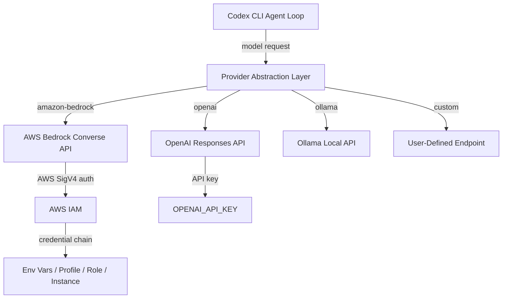

# Amazon Bedrock Provider for Codex CLI: Multi-Cloud Model Access


---

Running Codex CLI against Amazon Bedrock has been one of the most requested features since the tool launched. Issue #10400, filed in February 2026, accumulated steady upvotes from enterprise teams locked into AWS credits or contractually bound to keep traffic within their VPC [^1]. On 21 April 2026, PR #18744 merged a first-party `amazon-bedrock` provider into Codex CLI, eliminating the need for the fragile gateway workarounds that had plagued the community for months [^2].

This article covers the new provider architecture, walks through configuration, explains what broke with the old proxy approaches, and offers practical patterns for teams running Codex across multiple cloud providers.

## Why Native Bedrock Matters

Before the native provider, teams wanting Codex-on-Bedrock had three options — all of them broken in meaningful ways.

### The Gateway Problem

Community guides recommended routing Codex through **bedrock-access-gateway** (a Lambda-based OpenAI-compatible proxy), **Mantle**, or **LiteLLM** [^3]. The fundamental issue: Codex CLI's agent loop uses OpenAI's **Responses API**, not the older Chat Completions API. All three gateways translate incoming requests to Chat Completions wire format, which means:

- Streaming tool calls arrive with different chunk boundaries, causing parse failures
- The `reasoning` content block type is silently dropped
- Function call IDs don't round-trip correctly through the translation layer

A detailed comparison by AWS community builders concluded that none of the three gateways reliably supported Codex CLI's full feature set as of April 2026 [^4].

### What the Native Provider Solves

PR #18744, authored by `celia-oai` and approved by `pakrym-oai`, adds `amazon-bedrock` as a **built-in provider** with hardcoded defaults for display name, endpoint URL construction, and wire format [^2]. Crucially, it handles AWS authentication natively — using the standard AWS credential chain rather than bolting API keys onto HTTP headers. This means:

- **No proxy Lambda to deploy or maintain**
- **No Responses API translation issues** — the provider speaks Bedrock's native Converse API directly
- **IAM role assumption works** — including cross-account roles, SSO profiles, and EC2 instance profiles
- **VPC traffic stays in-network** — requests go to your regional Bedrock endpoint, not through a public gateway

## Configuration

The provider is available in v0.123.0-alpha (alpha.3 onwards) [^5]. It has not yet shipped in a stable release — v0.122.0 (20 April 2026) is the latest stable [^6].

### Minimal Setup

```toml
# ~/.codex/config.toml
model_provider = "amazon-bedrock"
model = "anthropic.claude-sonnet-4-20250514"
```

This uses your default AWS credential chain — environment variables, `~/.aws/credentials`, IAM role, or EC2 instance profile.

### Named AWS Profile

For teams managing multiple AWS accounts, specify a named profile:

```toml
# ~/.codex/config.toml
model_provider = "amazon-bedrock"
model = "anthropic.claude-sonnet-4-20250514"

[model_providers.amazon-bedrock.aws]
profile = "codex-bedrock"
```

This maps to the `[codex-bedrock]` section in your `~/.aws/credentials` or `~/.aws/config` file [^2].

### Region Selection

Bedrock model availability varies by AWS region. Set your region through the standard AWS mechanisms:

```bash
# Environment variable
export AWS_REGION=us-west-2

# Or in ~/.aws/config
[profile codex-bedrock]
region = us-west-2
```

### Profile-Based Multi-Provider Switching

Codex CLI's profile system lets you switch between OpenAI and Bedrock with a flag:

```toml
# ~/.codex/config.toml

# Default: OpenAI direct
model = "o3"
model_provider = "openai"

[profiles.bedrock]
model = "anthropic.claude-sonnet-4-20250514"
model_provider = "amazon-bedrock"

[profiles.bedrock.model_providers.amazon-bedrock.aws]
profile = "codex-bedrock"

[profiles.bedrock-cheap]
model = "anthropic.claude-haiku-3-20250722"
model_provider = "amazon-bedrock"
model_reasoning_effort = "low"
```

Switch at launch:

```bash
# Use OpenAI (default)
codex "fix the auth bug"

# Use Bedrock
codex --profile bedrock "fix the auth bug"

# Use cheap Bedrock for quick queries
codex --profile bedrock-cheap "explain this function"
```

## Architecture

The provider integration fits into Codex CLI's existing model provider abstraction layer. Understanding this layer helps when troubleshooting or building custom integrations.



Key architectural details:

- **Built-in providers** have hardcoded defaults for endpoint URL construction and wire format. As of v0.123.0-alpha, the built-in list is: `openai`, `ollama`, `lmstudio`, and `amazon-bedrock` [^7].
- **AWS authentication is restricted** to the Bedrock provider — custom providers cannot use the AWS auth configuration block [^2].
- The provider constructs the Bedrock endpoint URL from the configured region and model ID, handling the `bedrock-runtime` service prefix automatically.

## IAM Policy Requirements

The Bedrock provider needs `bedrock:InvokeModelWithResponseStream` permission (streaming is always enabled in the agent loop). A minimal IAM policy:

```json
{
  "Version": "2012-10-17",
  "Statement": [
    {
      "Effect": "Allow",
      "Action": [
        "bedrock:InvokeModel",
        "bedrock:InvokeModelWithResponseStream"
      ],
      "Resource": "arn:aws:bedrock:*::foundation-model/*"
    }
  ]
}
```

For production, scope the `Resource` to specific model ARNs and regions. ⚠️ The exact IAM actions required may change before the stable release — verify against the v0.123.0 release notes when they ship.

## Enterprise Patterns

### Pattern 1: AWS Credits Burn-Down

Many teams have substantial AWS credits from startup programmes or enterprise agreements. Running Codex against Bedrock lets you consume those credits for AI coding assistance rather than paying separately through OpenAI:

```toml
# Team config: burn AWS credits for routine work, OpenAI for heavy reasoning
[profiles.default]
model = "anthropic.claude-sonnet-4-20250514"
model_provider = "amazon-bedrock"

[profiles.heavy]
model = "o3"
model_provider = "openai"
model_reasoning_effort = "high"
```

### Pattern 2: Data Residency Compliance

For teams with data residency requirements, Bedrock keeps all traffic within your chosen AWS region. Combined with Codex CLI's sandbox, this creates a compliant pipeline:

```toml
model_provider = "amazon-bedrock"
model = "anthropic.claude-sonnet-4-20250514"
sandbox = "strict"

[model_providers.amazon-bedrock.aws]
profile = "eu-west-codex"
```

```bash
# ~/.aws/config
[profile eu-west-codex]
region = eu-west-1
role_arn = arn:aws:iam::123456789012:role/CodexBedrockEU
source_profile = sso-main
```

### Pattern 3: Multi-Provider Failover

Combine the Bedrock provider with OpenAI for resilience. While Codex CLI doesn't have built-in failover, a wrapper script handles it:

```bash
#!/usr/bin/env bash
# codex-resilient.sh
codex --profile bedrock "$@" 2>/dev/null || codex --profile openai "$@"
```

For more sophisticated routing with budget enforcement and automatic failover, consider running Codex through an AI gateway such as Bifrost or LiteLLM in front of the native providers [^8].

### Pattern 4: Cross-Account Model Access

Large organisations often centralise Bedrock model access in a shared services account. Use IAM role chaining:

```bash
# ~/.aws/config
[profile codex-bedrock]
role_arn = arn:aws:iam::987654321098:role/SharedBedrockAccess
source_profile = dev-account
region = us-east-1
```

The Codex Bedrock provider respects the full AWS credential chain, including role assumption with MFA if configured [^2].

## Available Models

Bedrock model IDs follow the format `provider.model-name`. Models confirmed available on Bedrock as of April 2026 include [^9]:

| Model ID | Use Case |
|---|---|
| `anthropic.claude-sonnet-4-20250514` | General coding, balanced cost/quality |
| `anthropic.claude-haiku-3-20250722` | Fast queries, subagent delegation |
| `meta.llama3-3-70b-instruct-v1:0` | Open-weight alternative |
| `amazon.nova-pro-v1:0` | AWS-native option |

⚠️ Not all Bedrock models support the tool-calling capabilities that Codex CLI's agent loop requires. Verify model compatibility in your region before configuring.

## Migration from Gateway Workarounds

If you've been running one of the community gateway solutions, migration is straightforward:

1. **Remove the gateway infrastructure** — delete the Lambda, ECS task, or Docker container running bedrock-access-gateway, Mantle, or LiteLLM
2. **Update config.toml** — replace your custom provider block with the native `amazon-bedrock` configuration shown above
3. **Remove `OPENAI_BASE_URL` overrides** — the native provider doesn't use this; clear it from your shell profile
4. **Test with `/status`** — launch Codex and run `/status` to confirm the provider and model are correctly resolved

## Known Limitations

As this is an alpha-track feature, expect rough edges:

- **No stable release yet** — v0.123.0-alpha.6 is the latest alpha as of 21 April 2026 [^5]. The stable release timeline is unannounced.
- **Bedrock-specific rate limits** apply — these differ from OpenAI's limits and vary by model, region, and account tier
- **Cross-region inference** routing is not yet handled by the provider — you must configure the correct region manually
- **Model availability varies by region** — not all models are available in all Bedrock regions
- **Reasoning tokens** — behaviour with extended thinking / reasoning models on Bedrock may differ from OpenAI-hosted models. ⚠️ This has not been extensively tested in the alpha.

## What's Next

The Bedrock provider landing alongside PR #18744 marks Codex CLI's first step toward genuine multi-cloud model access. Issue #10400 also requests **Google Cloud Vertex AI** support — no PR has appeared yet, but the provider abstraction layer is now proven [^1]. The custom provider system already supports arbitrary OpenAI-compatible endpoints [^7], and the Bedrock integration demonstrates that non-OpenAI wire formats can be integrated as first-party providers.

For teams evaluating Codex CLI in AWS-heavy environments, the native Bedrock provider removes the last significant friction point. Install the alpha, point it at your Bedrock endpoint, and let the agent loop do its work — no gateway required.

## Citations

[^1]: GitHub Issue #10400 — "Support for GCP Vertex AI and/or Amazon Bedrock." [https://github.com/openai/codex/issues/10400](https://github.com/openai/codex/issues/10400)

[^2]: PR #18744 — "feat: add a built-in Amazon Bedrock model provider." [https://github.com/openai/codex/pull/18744](https://github.com/openai/codex/pull/18744)

[^3]: DEV Community — "Use OpenAI Codex CLI with Amazon Bedrock Models." [https://dev.to/aws-builders/use-openai-codex-cli-with-amazon-bedrock-models-pay-as-you-go-48eb](https://dev.to/aws-builders/use-openai-codex-cli-with-amazon-bedrock-models-pay-as-you-go-48eb)

[^4]: DEV Community — "Bedrock for AI Coding Tools: Mantle vs Gateway vs LiteLLM." [https://dev.to/aws-builders/bedrock-for-ai-coding-tools-mantle-vs-gateway-vs-litellm-a-decision-guide-for-aws-credit-burners-1h01](https://dev.to/aws-builders/bedrock-for-ai-coding-tools-mantle-vs-gateway-vs-litellm-a-decision-guide-for-aws-credit-burners-1h01)

[^5]: GitHub Releases — Codex CLI v0.123.0-alpha.6. [https://github.com/openai/codex/releases](https://github.com/openai/codex/releases)

[^6]: Codex CLI Changelog — v0.122.0 (April 20, 2026). [https://developers.openai.com/codex/changelog](https://developers.openai.com/codex/changelog)

[^7]: Codex CLI Advanced Configuration — Custom Providers. [https://developers.openai.com/codex/config-advanced](https://developers.openai.com/codex/config-advanced)

[^8]: DEV Community — "Supercharge Codex CLI with Bifrost." [https://dev.to/kuldeep_paul/supercharge-openai-codex-cli-how-to-run-any-llm-provider-with-codex-cli-using-bifrost-3bbn](https://dev.to/kuldeep_paul/supercharge-openai-codex-cli-how-to-run-any-llm-provider-with-codex-cli-using-bifrost-3bbn)

[^9]: AWS Bedrock Model Documentation. [https://docs.aws.amazon.com/bedrock/latest/userguide/models-supported.html](https://docs.aws.amazon.com/bedrock/latest/userguide/models-supported.html)
