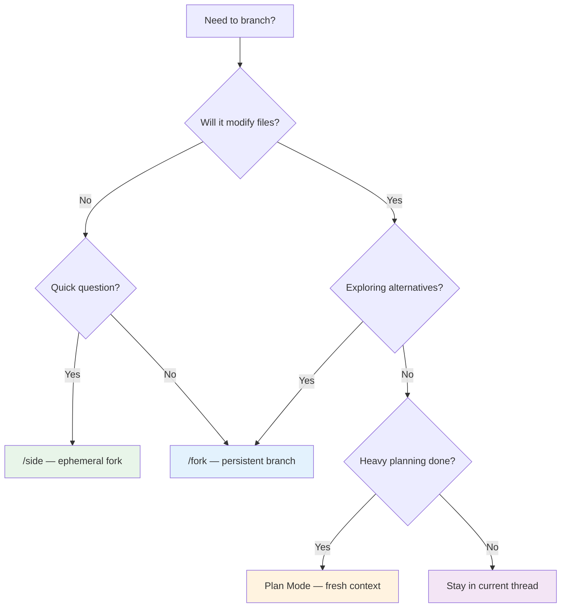

# Codex CLI Conversation Branching: /side, /fork, and Plan Mode Workflows


---

Codex CLI v0.122.0, released on 20 April 2026[^1], introduced the `/side` slash command — an ephemeral fork that lets you ask a quick question mid-task without polluting your main thread. Combined with the existing `/fork` command and Plan Mode's new fresh-context implementation option, Codex now offers a complete conversation branching toolkit. This article explains when to reach for each mechanism, how they differ under the hood, and the workflow patterns that emerge when you compose them.

## The Problem: Context Is Expensive and Fragile

Every token in your conversation history costs money and competes for space in the model's context window. OpenAI's best practices recommend keeping "one thread per coherent unit of work"[^2] — but real development rarely follows a single track. You interrupt yourself to check API docs, you want to try two architectural approaches side by side, or your planning phase consumes so much context that the implementation suffers.

Before v0.122, your options were limited: fork a full persistent thread (heavy), open a second terminal session (disjointed), or manually `/compact` and hope the summariser kept what you needed. The new branching primitives fill the gaps.

## The Three Branching Mechanisms

### 1. `/side` — Ephemeral Forks for Quick Questions

The `/side` command, shipped in v0.122.0, creates an in-memory fork that inherits your current conversation context as read-only reference[^3]. It was built in response to Issue #18125, where a user asked for a way to "ask something on the side without polluting the main context"[^4].

```bash
# Open an empty side thread
/side

# Or ask directly
/side What's the signature of the tokio::spawn function?
```

Key characteristics:

- **Ephemeral**: the side thread exists only in memory — it has no on-disk session file[^3]. When you close it, it vanishes.
- **Non-interfering**: the main agent continues running in the background. Your side question doesn't inject tokens into the primary transcript.
- **Limited commands**: only `/copy`, `/diff`, `/mention`, and `/status` are available inside a side conversation[^4]. No file edits, no tool calls that modify the workspace.
- **Quick exit**: press `Esc` or `Ctrl+C` to return to the parent thread[^3].

The underlying mechanism uses the `thread/fork` endpoint with `ephemeral: true`, which creates a temporary fork without persisting it to the session store[^5]. Because the thread is in-memory only, `thread.path` is `null`.

#### When to Use `/side`

- Checking documentation or API signatures mid-task
- Asking "what does this error mean?" without derailing the agent
- Quick calculations or format conversions
- Verifying assumptions before committing to an approach

### 2. `/fork` — Persistent Branches for Parallel Exploration

The `/fork` command, available since v0.107.0[^6], clones your current conversation into a new thread with a fresh ID, leaving the original transcript untouched[^7]. Unlike `/side`, a fork is persistent — it creates a full session on disk that you can `/resume` later.

```bash
# Fork from the current point
/fork

# Fork with an initial prompt
/fork Try implementing this with a recursive approach instead
```

You can also fork from an earlier point in the transcript by pressing `Esc` to walk back through messages, then hitting `Enter` to fork from that position[^2].

#### When to Use `/fork`

- Exploring two or more architectural alternatives in parallel
- Trying a risky refactor whilst keeping a safe fallback
- Spawning parallel work streams via subagents (forks can be delegated to subagent threads)[^6]
- Creating a "checkpoint" before a destructive operation

### 3. Plan Mode Fresh-Context Implementation

Plan Mode (`/plan` or `Shift+Tab`) tells the model to gather context, ask clarifying questions, and build a plan before writing any code[^2]. In v0.122.0, Plan Mode gained the ability to start implementation in a fresh context, with context-usage visibility shown before you decide whether to carry the planning thread forward[^1].

```bash
# Enter plan mode
/plan Refactor the authentication module to use JWT refresh tokens

# After planning completes, you see context usage:
# "Planning used 34% of context window. Start fresh or continue?"
```

This addresses a real workflow problem: a thorough planning phase can consume 30–50% of the context window with file reads, architecture discussion, and clarifying questions. By the time you start implementing, the model has less room for the actual code changes.

#### When to Use Fresh-Context Implementation

- After lengthy planning sessions that consumed significant context
- When the plan is well-documented in PLANS.md and doesn't need to live in the conversation
- For large refactors where implementation context matters more than planning context

## How They Compose: Decision Framework



The branching primitives sit on a spectrum from lightweight to heavyweight:

| Feature | `/side` | `/fork` | Plan Mode Fresh |
|---|---|---|---|
| **Persistence** | In-memory only | On-disk session | New thread |
| **File modifications** | Blocked | Allowed | Allowed |
| **Context inheritance** | Read-only reference | Full clone | Optional carry-forward |
| **Cost** | Minimal (small context) | Full (cloned context) | Minimal (fresh start) |
| **Resume later** | No | Yes (`/resume`) | Yes |
| **Slash commands** | Limited (4 commands) | Full | Full |

## Practical Workflow Patterns

### Pattern 1: Plan → Fresh-Implement → Side-Verify

This three-phase pattern keeps each stage lean:

```bash
# Phase 1: Plan (consumes context reading files, discussing architecture)
/plan Migrate the payment service from Stripe v2 to v3 API

# Phase 2: Start fresh implementation (planning context dropped)
# → Select "Start fresh" when prompted

# Phase 3: Quick verification without polluting implementation context
/side Does Stripe v3 still require idempotency keys for PaymentIntents?
```

### Pattern 2: Fork-and-Compare

When you need to evaluate two approaches before committing:

```bash
# Discuss the problem, gather context
> Analyse the performance bottleneck in the order processing pipeline

# Fork to try approach A
/fork Optimise using database query batching

# In original thread, try approach B
> Optimise using an in-memory cache with Redis

# Compare results, then continue with the winner
```

Both forks share the same analysis context but diverge at the solution. You can run them in parallel terminal tabs or use `/agent` to switch between active threads[^2].

### Pattern 3: Side-Quest During Long Operations

When the agent is mid-way through a multi-file refactor and you need to check something:

```bash
# Agent is working on a large migration...
/side What's the correct syntax for a PostgreSQL partial index?

# Get the answer, press Esc, agent continues uninterrupted
```

This pattern is particularly valuable during `codex exec` operations where interrupting the main thread would reset progress.

### Pattern 4: Subagent Delegation with Fork Isolation

For complex tasks, fork into isolated subagent threads that each handle a bounded piece of work:

```bash
# Main thread: orchestration
> We need to update the API, the client SDK, and the documentation

# Fork subagents for each domain
/fork Update the REST API endpoints for v3 compatibility
/fork Regenerate the TypeScript client SDK from the new OpenAPI spec
/fork Update the developer documentation with new endpoints
```

Each fork operates in its own context, preventing the documentation updates from consuming tokens needed for API code changes. Use git worktrees to prevent file conflicts between parallel forks[^2].

## Context Budget Arithmetic

Understanding the cost of each branching strategy helps you choose wisely:

- **`/side`**: inherits the parent's context as read-only but only adds the side question and response. Typical cost: 500–2,000 tokens for the side exchange itself.
- **`/fork`**: clones the full conversation history. If your thread is at 50,000 tokens, the fork starts at 50,000 tokens too. However, prompt caching means the shared prefix hits cache[^8].
- **Plan Mode fresh start**: drops the planning context entirely. Implementation starts near zero tokens, inheriting only what you explicitly provide (e.g., a PLANS.md file reference).

The prompt caching architecture means that `/fork` is cheaper than it appears — the shared prefix between parent and child threads benefits from exact-prefix caching, reducing API costs significantly[^8].

## Anti-Patterns to Avoid

**Over-forking**: creating a fork for every minor question. Use `/side` for quick lookups — forks are for genuine divergence in work direction.

**Ignoring context usage**: before v0.122, developers often carried bloated planning context into implementation. Use the new context-usage visibility to make informed decisions about when to start fresh.

**Side conversations that should be forks**: if your "quick question" turns into a 10-message discussion with file reads, you've outgrown `/side`. Start a proper `/fork` instead.

**Running parallel forks on the same files without worktrees**: this causes merge conflicts and file corruption. Always pair parallel forks with `git worktree` isolation[^2].

## Configuration and Compatibility

The `/side` command requires Codex CLI v0.122.0 or later[^1]. No additional configuration is needed — it works out of the box in the TUI.

For the app-server protocol, ephemeral forks use the existing `thread/fork` endpoint with the `ephemeral: true` flag[^5]. Custom clients built on the JSON-RPC protocol can leverage this for their own side-conversation UX.

The limited slash command set inside `/side` (only `/copy`, `/diff`, `/mention`, `/status`) is a deliberate design choice — it prevents side conversations from accidentally modifying the workspace while the main agent is active[^4].

## What's Next

The v0.123.0 alpha builds, currently in pre-release[^1], suggest further refinements to the branching model. The community has requested features like merging fork results back into a parent thread (Issue #4972)[^9] and checkpoint-based rollback (Issue #10084)[^10]. As conversation branching matures, expect tighter integration with the subagent system and automated branch pruning for cost management.

---

## Citations

[^1]: OpenAI, "Codex CLI Releases," GitHub, April 2026. [https://github.com/openai/codex/releases](https://github.com/openai/codex/releases)

[^2]: OpenAI, "Best practices — Codex," OpenAI Developers, 2026. [https://developers.openai.com/codex/learn/best-practices](https://developers.openai.com/codex/learn/best-practices)

[^3]: @LLMJunky (am.will), "Codex Update 0.122.0 — Side Quests," X (Twitter), April 2026. [https://x.com/LLMJunky/status/2046350440875364564](https://x.com/LLMJunky/status/2046350440875364564)

[^4]: xubohan, "Add a way to ask side questions without affecting the main session context," GitHub Issue #18125, April 2026. [https://github.com/openai/codex/issues/18125](https://github.com/openai/codex/issues/18125)

[^5]: OpenAI, "codex-rs/app-server/README.md," GitHub, 2026. [https://github.com/openai/codex/blob/main/codex-rs/app-server/README.md](https://github.com/openai/codex/blob/main/codex-rs/app-server/README.md)

[^6]: @LLMJunky (am.will), "Codex 0.107.0 — FORKS," X (Twitter), 2026. [https://x.com/LLMJunky/status/2028618921251574214](https://x.com/LLMJunky/status/2028618921251574214)

[^7]: OpenAI, "Slash commands in Codex CLI," OpenAI Developers, 2026. [https://developers.openai.com/codex/cli/slash-commands](https://developers.openai.com/codex/cli/slash-commands)

[^8]: OpenAI, "Prompt Caching 201," OpenAI Cookbook, 2026. [https://cookbook.openai.com/examples/prompt_caching_201](https://cookbook.openai.com/examples/prompt_caching_201)

[^9]: "Request: expose conversation fork/backtrack API in @openai/codex-sdk," GitHub Issue #4972. [https://github.com/openai/codex/issues/4972](https://github.com/openai/codex/issues/4972)

[^10]: "Feature request: Custom conversation titles + checkpoint rollback / branching in Codex Extension chat," GitHub Issue #10084. [https://github.com/openai/codex/issues/10084](https://github.com/openai/codex/issues/10084)
