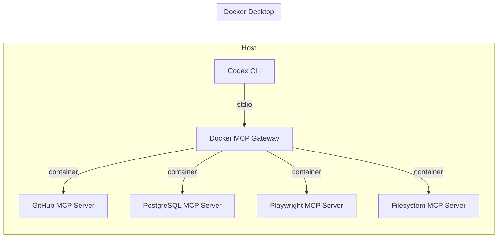
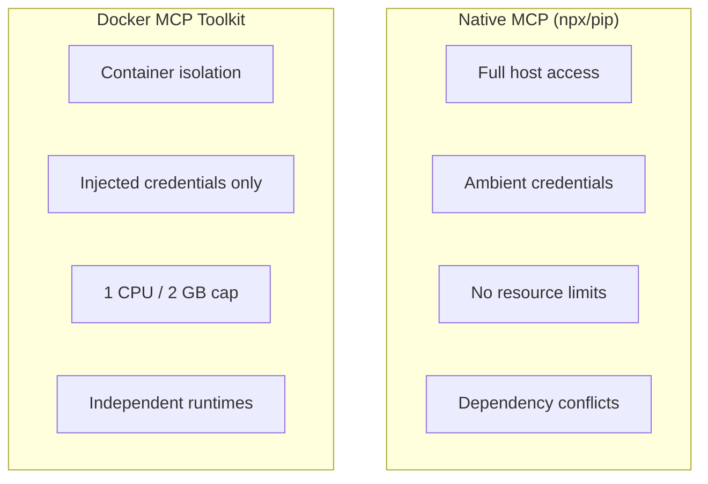
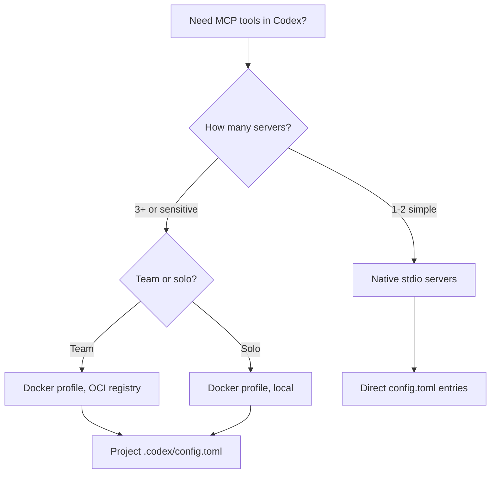

# Codex CLI and Docker MCP Toolkit: Secure Containerised Tool Servers at Scale


---

The Model Context Protocol gives Codex CLI access to external tools — databases, filesystems, APIs, browsers — but running MCP servers as bare `npx` or `pip` processes on a developer's machine introduces dependency conflicts, credential sprawl, and zero isolation between the agent and the host. Docker's MCP Toolkit solves this by packaging 300+ verified MCP servers as container images, fronted by a single gateway process that handles routing, credential injection, and resource limits[^1]. This article covers the full integration path: from first configuration to team-scale profile sharing and production hardening.

---

## Why Containerise MCP Servers?

Running MCP servers natively means trusting arbitrary npm packages with host filesystem access, ambient environment variables (including API keys for unrelated services), and unconstrained CPU/memory. Three problems emerge at scale:

1. **Credential leakage** — a poorly-written MCP server can read `~/.aws/credentials` or Docker socket mounts not intended for it.
2. **Dependency rot** — two MCP servers requiring conflicting Node.js or Python versions fight on the same machine.
3. **Resource runaway** — an agent loop calling a misbehaving tool can saturate the host, crashing unrelated workloads.

Docker's MCP Toolkit addresses all three by running each server in an isolated container with restricted privileges, no host filesystem access by default, 1 CPU and 2 GB memory limits, and centralised credential management through the Gateway[^2].

---

## Architecture Overview



The Gateway is a single process that Codex CLI communicates with over stdio. Internally it routes tool calls to the appropriate containerised server, launching containers on demand and injecting credentials at runtime[^3]. Since all MCP traffic passes through one gateway, it becomes a single enforcement point for threat detection and access control[^2].

---

## Prerequisites

- Docker Desktop with the MCP Toolkit beta feature enabled[^4]
- Codex CLI v0.121.0 or later (for reliable stdio MCP support)
- The `docker` CLI available on `$PATH`

Enable the toolkit in Docker Desktop under **Settings → Beta features → Docker MCP Toolkit**[^4].

---

## Basic Configuration

### Step 1: Create a Profile

Profiles group MCP servers for a specific project or workflow:

```bash
docker mcp profile create --name codex-dev
```

### Step 2: Add Servers from the Catalogue

Browse the catalogue (300+ verified servers)[^1] and add what you need:

```bash
docker mcp profile server add codex-dev \
  --server catalog://mcp/docker-mcp-catalog/github-official \
  --server catalog://mcp/docker-mcp-catalog/postgres \
  --server catalog://mcp/docker-mcp-catalog/playwright
```

### Step 3: Wire Into Codex CLI

Add the gateway to your `~/.codex/config.toml`:

```toml
[mcp_servers.MCP_DOCKER]
command = "docker"
args = ["mcp", "gateway", "run", "--profile", "codex-dev"]
startup_timeout_sec = 30
tool_timeout_sec = 120
```

The `startup_timeout_sec = 30` is deliberate — the full catalogue can take longer than Codex's default 10-second timeout to initialise, which causes handshake failures with the default setting[^5].

### Step 4: Verify

```bash
codex --chat
/mcp
```

You should see `MCP_DOCKER` listed with a `connected` status and tools from each server in your profile.

---

## Profile Management for Teams

Docker profiles are shareable as OCI artefacts, making them ideal for standardising tool access across a development team:

```bash
# Export to file
docker mcp profile export codex-dev ./codex-dev-profile.yaml

# Push to a private registry
docker mcp profile push codex-dev registry.internal.com/mcp-profiles/codex-dev:v2

# Team members pull and use
docker mcp profile pull registry.internal.com/mcp-profiles/codex-dev:v2
```

This pairs naturally with Codex CLI's project-scoped configuration. Add a `.codex/config.toml` to your repository specifying the profile name, and every developer with Docker Desktop gets identical tool access:

```toml
# .codex/config.toml (committed to repo)
[mcp_servers.MCP_DOCKER]
command = "docker"
args = ["mcp", "gateway", "run", "--profile", "codex-dev"]
startup_timeout_sec = 30
```

---

## Security Model

The Docker MCP Toolkit implements defence in depth through both passive (build-time) and active (runtime) measures[^2]:

### Passive Security

| Control | Detail |
|---------|--------|
| Image provenance | Servers sourced from the Docker MCP Catalogue are built from verified sources with supply-chain attestation[^1] |
| Minimal base images | Attack surface reduced by stripping unnecessary binaries |
| Version pinning | Catalogue references include digest-level pinning |

### Active Security

| Control | Detail |
|---------|--------|
| Container isolation | Each server runs in its own namespace — restricted privileges, limited network, no host filesystem[^2] |
| Resource caps | 1 CPU, 2 GB memory per container[^2] |
| Credential injection | Secrets injected at runtime by the Gateway, never baked into images or exposed via environment variables[^6] |
| Output scanning | Responses checked for leaked secrets before returning to the client[^2] |
| OAuth handling | Built-in OAuth support with secure credential storage — no hardcoded tokens[^6] |

### Comparison with Native MCP Servers



---

## Practical Workflow Patterns

### Pattern 1: Database-Backed Agent Sessions

Add PostgreSQL and Redis MCP servers to a profile for a backend development workflow:

```bash
docker mcp profile server add backend-dev \
  --server catalog://mcp/docker-mcp-catalog/postgres \
  --server catalog://mcp/docker-mcp-catalog/redis
```

Configure credentials via the Docker Desktop MCP Toolkit UI or CLI:

```bash
docker mcp profile config backend-dev \
  --set postgres.POSTGRES_CONNECTION_STRING="postgresql://dev:pw@host:5432/app"
```

Now Codex can query your schema, generate migrations, and validate SQL — all without your database credentials appearing in `config.toml` or shell history.

### Pattern 2: Selective Catalogue for Faster Startup

The full Docker MCP Catalogue (300+ servers) causes startup timeouts[^5]. Instead, run the gateway with only the servers you need:

```bash
docker mcp gateway run \
  --catalog mcp/docker-mcp-catalog \
  --servers github-official --servers playwright --servers filesystem
```

Or better, create a lean profile that contains only your required servers.

### Pattern 3: Custom Internal Catalogue

Enterprises can build private catalogues containing approved, audited MCP servers:

```bash
# Create custom catalogue
docker mcp catalog create registry.internal.com/mcp/approved:v1 \
  --title "Approved MCP Servers" \
  --server catalog://mcp/docker-mcp-catalog/github-official \
  --server docker://internal-tools/jira-mcp:1.2.0

# Push to internal registry
docker mcp catalog push registry.internal.com/mcp/approved:v1

# Developers use it
docker mcp gateway run --catalog registry.internal.com/mcp/approved:v1
```

This gives platform teams control over which tools agents can access, whilst individual developers still get self-service configuration.

---

## Known Issues and Workarounds

The integration is production-ready but has documented sharp edges:

| Issue | Symptom | Workaround |
|-------|---------|------------|
| Startup timeout[^5] | `MCP client for MCP_DOCKER failed to start: request timed out` | Set `startup_timeout_sec = 30` or higher; reduce profile to needed servers only |
| Container resource leak[^7] | Docker containers for MCP servers are not released until Codex exits | Restart Codex between long sessions; monitor with `docker ps` |
| Tool discovery failure[^8] | Codex ignores configured gateway and guesses local binaries | Ensure `config.toml` uses exact key `MCP_DOCKER`; restart Codex after config changes |
| Silent tool exclusion[^9] | Tools listed but non-functional due to parsing errors | Check `codex --log-level debug` output; report upstream |

---

## Integration with Codex Subagents

When Codex spawns subagents, each gets its own MCP connection to the Docker gateway. Be aware that this means multiple container instances may be running simultaneously[^7]. For resource-constrained environments, configure the gateway with `--max-instances` or use project-scoped profiles that expose fewer tools to subagents:

```toml
# .codex/config.toml for subagent-heavy workflows
[mcp_servers.MCP_DOCKER]
command = "docker"
args = ["mcp", "gateway", "run", "--profile", "lean-tools"]
startup_timeout_sec = 20
tool_timeout_sec = 60
enabled_tools = ["github_create_pull_request", "github_search_code", "postgres_query"]
```

The `enabled_tools` allowlist prevents subagents from accessing tools they don't need — applying least-privilege at the MCP layer.

---

## CI/CD Integration

For headless `codex exec` pipelines, configure the Docker MCP gateway as part of your CI environment:


```yaml
# .github/workflows/codex-review.yml
jobs:
  review:
    runs-on: ubuntu-latest
    services:
      mcp-gateway:
        image: docker/mcp-gateway:latest
        options: --profile ci-review
    steps:
      - uses: actions/checkout@v4
      - name: Run Codex review
        env:
          OPENAI_API_KEY: ${{ secrets.OPENAI_API_KEY }}
        run: |
          codex exec "Review this PR for security issues" \
            --config .codex/ci-config.toml
```


---

## Decision Framework



Use native servers for simple, trusted, single-tool setups. Switch to Docker MCP Toolkit when you need isolation, credential management, team standardisation, or are running more than a handful of servers.

---

## Citations

[^1]: Docker, "Docker MCP Catalog: Discover and Run Secure MCP Servers," Docker Blog, 2025. https://www.docker.com/blog/docker-mcp-catalog-secure-way-to-discover-and-run-mcp-servers/

[^2]: Docker, "MCP Toolkit: Run MCP Servers Securely," Docker Blog, 2025. https://www.docker.com/blog/mcp-toolkit-mcp-servers-that-just-work/

[^3]: Docker, "MCP Gateway Documentation," Docker Docs, 2026. https://docs.docker.com/ai/mcp-catalog-and-toolkit/mcp-gateway/

[^4]: Docker, "Get started with Docker MCP Toolkit," Docker Docs, 2026. https://docs.docker.com/ai/mcp-catalog-and-toolkit/get-started/

[^5]: "MCP client times out when launching Docker MCP Toolkit gateway," GitHub Issue #5444, openai/codex, 2026. https://github.com/openai/codex/issues/5444

[^6]: Docker, "MCP Security: Risks, Challenges, and How to Mitigate," Docker Blog, 2026. https://www.docker.com/blog/mcp-security-explained/

[^7]: "STDIO MCP Servers (Docker cmd) per sub-agent never release until Codex is exited entirely," OpenAI Developer Community, 2026. https://community.openai.com/t/stdio-mcp-servers-docker-cmd-per-sub-agent-never-release-until-codex-is-exited-entirely/1375209

[^8]: "Codex fails to detect and use configured MCP gateway, repeatedly guessing binaries instead," GitHub Issue #5161, openai/codex, 2026. https://github.com/openai/codex/issues/5161

[^9]: "MCP tools silently excluded due to errors," GitHub Issue #4176, openai/codex, 2026. https://github.com/openai/codex/issues/4176
