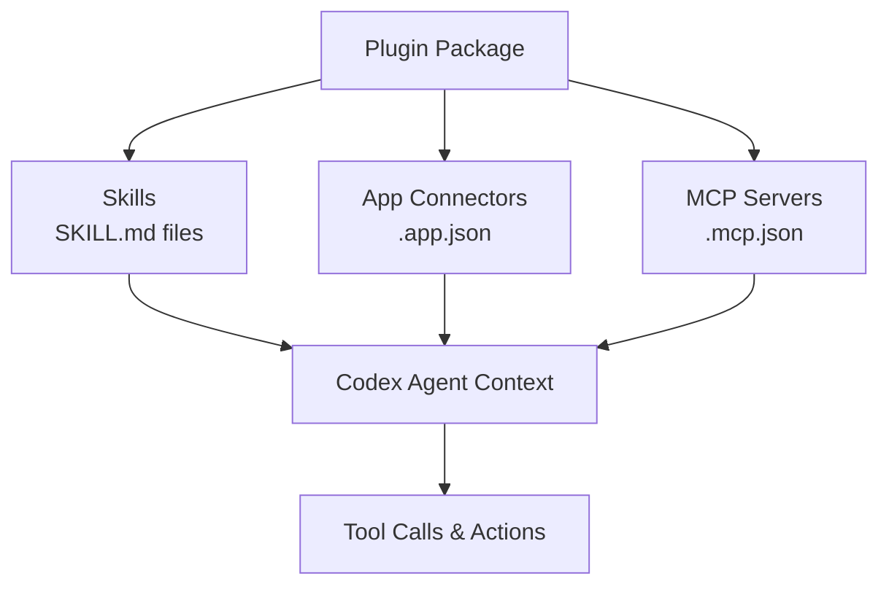
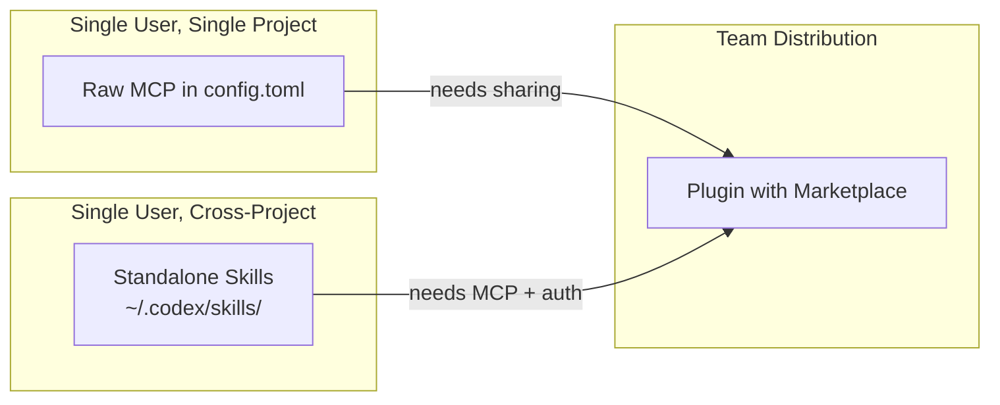

# Codex CLI Plugin System: Building, Sharing, and Managing Reusable Agent Workflows


Codex CLI v0.122 elevated plugins from an app-only curiosity to a first-class workflow primitive across the entire Codex surface — CLI, desktop app, and IDE extension[^1]. A plugin bundles skills, app connectors, and MCP servers into a single distributable unit, turning what used to be three separate configuration exercises into one install command. With over 90 curated plugins now available and a local marketplace mechanism for teams, the plugin system is rapidly becoming the primary distribution channel for reusable agent workflows[^2].

This article covers the plugin architecture, how to manage plugins from the CLI, how to build your own, and the patterns that make plugins work well in team environments.

---

## What a Plugin Actually Is

A plugin is a packaging unit that combines up to three component types[^3]:

- **Skills** — reusable instruction sets (SKILL.md files) that Codex loads contextually when relevant to a task
- **Apps** — external service connectors (GitHub, Slack, Gmail, Google Drive) providing authenticated data access and actions
- **MCP servers** — Model Context Protocol services exposing tools and shared context from external systems

Any combination is valid. A plugin might bundle only skills, only an MCP server, or all three. The manifest declares which components are present, and Codex handles discovery, loading, and lifecycle management.



This architecture matters because it solves a real problem: prior to plugins, sharing a workflow meant distributing an AGENTS.md snippet, a config.toml MCP section, and possibly an OAuth setup guide as separate artefacts. Plugins collapse that into a single installable unit with a manifest that declares everything Codex needs[^3].

---

## Managing Plugins from the CLI

### Browsing and Installing

The `/plugins` slash command opens the plugin directory within an active TUI session[^3]:

```
/plugins
```

From there, browse available plugins across registered marketplaces, install them, and authenticate any bundled app connectors. The flow mirrors what the desktop app provides, adapted for the terminal.

### Invoking Plugins

Plugins surface through two mechanisms[^3]:

1. **Implicit invocation** — describe the outcome you want ("Summarise my unread Gmail threads") and Codex selects the appropriate plugin tools automatically
2. **Explicit invocation** — type `@` followed by a plugin or skill name to target a specific capability directly

Explicit invocation is generally preferable in scripted workflows and AGENTS.md instructions where determinism matters.

### Enabling and Disabling

Plugin state persists in `~/.codex/config.toml`. To disable a plugin without uninstalling it[^3]:

```toml
[plugins."gmail@openai-curated"]
enabled = false
```

This requires a Codex restart. The pattern is useful for temporarily silencing plugins that add noise to specific workflows — a common complaint when plugins bundle broad skill sets that trigger on unrelated prompts.

---

## Plugin Internals: The Manifest

Every plugin requires a `.codex-plugin/plugin.json` manifest at its root[^4]. A minimal manifest looks like this:

```json
{
  "name": "my-review-tools",
  "version": "1.0.0",
  "description": "Code review patterns for the platform team",
  "skills": "./skills/"
}
```

The complete schema supports additional metadata[^4]:

| Field | Purpose |
|---|---|
| `name`, `version`, `description` | Package identity |
| `author`, `homepage`, `repository`, `license` | Provenance |
| `skills` | Relative path to skills directory |
| `mcpServers` | Relative path to `.mcp.json` |
| `apps` | Relative path to `.app.json` |
| `keywords` | Discovery tags |
| `interface` | Marketplace presentation: `displayName`, `shortDescription`, `category`, `capabilities`, `brandColor`, `defaultPrompt` |

### Directory Structure

```
my-review-tools/
├── .codex-plugin/
│   └── plugin.json          # Required manifest
├── skills/
│   └── security-review/
│       └── SKILL.md          # Skill instructions
│   └── perf-review/
│       └── SKILL.md
├── .mcp.json                 # Optional MCP config
├── .app.json                 # Optional app connectors
└── assets/
    └── logo.png
```

Keep only `plugin.json` inside `.codex-plugin/`. Everything else lives at the plugin root. All manifest paths must be `./`-prefixed and relative to the root[^4].

### Skills Inside Plugins

Each skill lives in `skills/<skill-name>/SKILL.md` with YAML frontmatter[^4]:

```yaml
---
name: security-review
description: Perform a security-focused code review against OWASP Top 10.
---

Review the changed files for security vulnerabilities. Focus on:
- Injection flaws (SQL, command, template)
- Authentication and session management
- Sensitive data exposure
- Access control gaps

Report findings as a numbered list with severity ratings.
```

Codex loads these contextually — the `security-review` skill activates when the user's prompt or the `@` invocation signals relevance.

---

## Local Marketplaces: Team Distribution

The plugin marketplace is not limited to OpenAI's curated directory. Teams can create **local marketplaces** — JSON manifests that register plugins from local paths or private repositories[^4].

### Repository-Scoped Marketplace

Create `.agents/plugins/marketplace.json` at your repository root:

```json
{
  "name": "platform-team",
  "interface": {
    "displayName": "Platform Team Plugins"
  },
  "plugins": [
    {
      "name": "review-tools",
      "source": {
        "source": "local",
        "path": "./plugins/review-tools"
      },
      "policy": {
        "installation": "INSTALLED_BY_DEFAULT",
        "authentication": "ON_FIRST_USE"
      },
      "category": "Code Quality"
    },
    {
      "name": "deploy-helper",
      "source": {
        "source": "local",
        "path": "./plugins/deploy-helper"
      },
      "policy": {
        "installation": "AVAILABLE",
        "authentication": "ON_INSTALL"
      },
      "category": "DevOps"
    }
  ]
}
```

### Personal Marketplace

For plugins shared across all your projects, use `~/.agents/plugins/marketplace.json` with the same schema[^4].

### Installation Policies

The `policy.installation` field controls initial state[^4]:

- **`INSTALLED_BY_DEFAULT`** — active immediately for every team member who opens the repo
- **`AVAILABLE`** — listed in `/plugins` but requires manual installation
- **`NOT_AVAILABLE`** — hidden from the directory (useful for deprecated plugins)

Codex caches installed plugins at `~/.codex/plugins/cache/$MARKETPLACE_NAME/$PLUGIN_NAME/$VERSION/`. For local plugins, `$VERSION` resolves to `local`, and Codex loads from the cache path rather than the source[^4].

---

## Case Study: codex-plugin-cc

OpenAI's official `codex-plugin-cc` plugin demonstrates the architecture in practice. It integrates Codex into Claude Code, enabling cross-tool code review and task delegation[^5].

The plugin bundles:

- **Five slash-command skills**: `/codex:review` for standard reviews, `/codex:adversarial-review` for challenging design decisions, `/codex:rescue` for delegating investigation and fix tasks, `/codex:status` and `/codex:result` for job management[^5]
- **A subagent** (`codex:codex-rescue`) that appears in the host tool's agent list, handling delegated work through the local Codex runtime[^5]
- **No MCP servers** — the companion script manages communication between Claude Code and the Codex binary directly[^5]

Installation from Claude Code:

```bash
/plugin marketplace add openai/codex-plugin-cc
/plugin install codex@openai-codex
/reload-plugins
/codex:setup
```

This plugin is architecturally instructive because it shows plugins crossing tool boundaries. The same packaging model — manifest, skills directory, optional MCP — works whether the consumer is Codex itself or another tool that supports the plugin protocol[^5].

---

## Building Your Own Plugin

### Scaffolding

The fastest path uses the built-in `$plugin-creator` skill[^4]:

```
@plugin-creator Create a plugin called "db-review" that reviews
database migration files for backwards compatibility issues.
```

This generates the `.codex-plugin/plugin.json` manifest and skills directory. For manual creation, follow the directory structure above.

### Adding an MCP Server

To bundle an MCP server, create `.mcp.json` at the plugin root and reference it in the manifest:

```json
{
  "mcpServers": {
    "schema-checker": {
      "command": "npx",
      "args": ["-y", "@my-org/schema-checker-mcp"],
      "env": {
        "DATABASE_URL": "${DATABASE_URL}"
      }
    }
  }
}
```

Then in `plugin.json`:

```json
{
  "name": "db-review",
  "version": "1.0.0",
  "description": "Database migration review with schema validation",
  "skills": "./skills/",
  "mcpServers": "./.mcp.json"
}
```

### Testing Locally

1. Place your plugin directory under `./plugins/` in a test repository
2. Create `.agents/plugins/marketplace.json` pointing to it
3. Restart Codex and browse `/plugins` to verify it appears
4. Install and test each skill with representative prompts

After code changes, restart Codex to reload from the local directory[^4]. There is no hot-reload mechanism yet.

---

## Plugins vs Raw MCP vs Skills: When to Use What

The three extension mechanisms overlap. Here is when each is appropriate:



| Scenario | Mechanism | Why |
|---|---|---|
| Quick personal tool integration | Raw MCP in `config.toml` | Lowest ceremony — one TOML block[^6] |
| Reusable instructions across your projects | Standalone SKILL.md files | No manifest overhead[^4] |
| Team-shared workflow with auth | Plugin with local marketplace | Single install, includes skills + MCP + OAuth[^4] |
| Cross-tool integration (e.g., Codex ↔ Claude Code) | Plugin with companion script | Standardised packaging enables tool-agnostic distribution[^5] |

The general principle: start with the simplest mechanism that works, and promote to a plugin when distribution or bundling becomes necessary.

---

## The Road Ahead: Repository-Scoped Plugin Config

A notable gap as of v0.122 is that marketplace registrations and plugin enable/disable states live in user-scoped config (`~/.codex/config.toml`), not project-scoped config[^7]. This means teams cannot commit plugin setup to their repository — each developer must install plugins manually.

Issue #18115 proposes extending `.codex/config.toml` to support marketplace and plugin declarations[^7]:

```toml
# .codex/config.toml (project-scoped — proposed)

[marketplaces.platform_team]
source = "github.com/my-org/codex-plugins"

[plugins."review-tools@platform_team"]
enabled = true

[plugins."deploy-helper@platform_team"]
enabled = true
```

⚠️ This syntax is proposed, not yet implemented. Until it ships, teams should document their plugin setup in AGENTS.md or a dedicated onboarding script.

Self-serve plugin publishing to the official marketplace is also forthcoming — currently, distribution is limited to local marketplaces and direct repository references[^4].

---

## Practical Recommendations

1. **Start with a skill, not a plugin.** If your workflow is a set of instructions without external dependencies, a `SKILL.md` file is simpler and faster to iterate on. Promote to a plugin when you need to bundle MCP servers or app connectors.

2. **Use `INSTALLED_BY_DEFAULT` sparingly.** Default-installed plugins add to every session's context. Reserve this for genuinely universal team workflows — code review standards, security policies — not nice-to-haves.

3. **Pin plugin versions.** Local marketplaces use `local` as the version for file-based plugins. For team stability, consider tagging plugin directories with git tags and referencing specific commits in your marketplace manifest.

4. **Scope MCP servers tightly.** A plugin that bundles an MCP server with broad tool access will trigger approval prompts. Use `tool_allow` and `tool_deny` lists in your `.mcp.json` to expose only what the plugin's skills actually need[^6].

5. **Test with `codex exec`.** Validate plugin behaviour in headless mode before distributing to the team. A plugin that works interactively but fails in CI is a plugin that will erode trust.

---

## Citations

[^1]: OpenAI, "Codex v0.122.0 Release Notes," GitHub Releases, April 20, 2026. [https://github.com/openai/codex/releases](https://github.com/openai/codex/releases)

[^2]: SmartScope, "OpenAI Codex Desktop App Major Update (April 2026)," April 2026. [https://smartscope.blog/en/generative-ai/chatgpt/codex-desktop-major-update-april-2026/](https://smartscope.blog/en/generative-ai/chatgpt/codex-desktop-major-update-april-2026/)

[^3]: OpenAI, "Plugins — Codex | OpenAI Developers," April 2026. [https://developers.openai.com/codex/plugins](https://developers.openai.com/codex/plugins)

[^4]: OpenAI, "Build Plugins — Codex | OpenAI Developers," April 2026. [https://developers.openai.com/codex/plugins/build](https://developers.openai.com/codex/plugins/build)

[^5]: OpenAI, "codex-plugin-cc: Use Codex from Claude Code to review code or delegate tasks," GitHub, March 2026. [https://github.com/openai/codex-plugin-cc](https://github.com/openai/codex-plugin-cc)

[^6]: OpenAI, "Model Context Protocol — Codex | OpenAI Developers," April 2026. [https://developers.openai.com/codex/mcp](https://developers.openai.com/codex/mcp)

[^7]: yshrsmz, "Repository-scoped marketplace and plugin configuration in project config," GitHub Issue #18115, April 16, 2026. [https://github.com/openai/codex/issues/18115](https://github.com/openai/codex/issues/18115)
