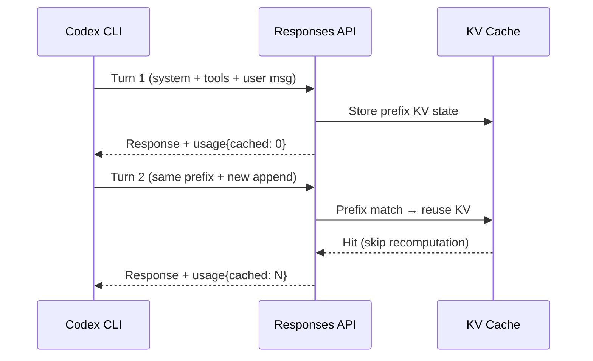
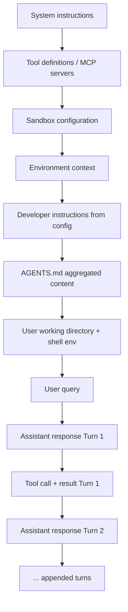
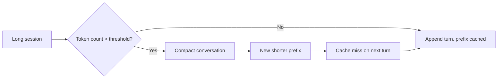

# Prompt Caching in Codex CLI: How the Agent Loop Stays Linear and How to Maximise Cache Hits


Every Codex CLI session resends the full conversation history on each turn. Without mitigation, this is quadratic in cost and latency. The engineering solution — exact-prefix prompt caching — keeps the agent loop closer to linear, cutting input token costs by up to 90%[^1]. This article explains how the mechanism works under the hood, how Codex CLI's prompt architecture is specifically designed to exploit it, and what you can do to maximise your cache hit rate.

## How OpenAI Prompt Caching Works

Prompt caching is automatic for all API requests containing 1,024 tokens or more[^2]. There is no opt-in flag and no additional fee for cache writes. The mechanism relies on **exact prefix matching**: when a request arrives whose initial tokens are byte-for-byte identical to a recently processed prefix, the inference server reuses the pre-computed key-value (KV) state rather than recomputing it from scratch[^1].



### Key Parameters

| Parameter | Value |
|-----------|-------|
| Minimum cacheable prefix | 1,024 tokens |
| Cache granularity | 128-token increments |
| Retention (in-memory) | 5–10 minutes idle, max 1 hour[^2] |
| Extended retention | Up to 24 hours (select models)[^2] |
| Cached token discount | 50% off input price[^3] |
| Latency reduction | Up to 80% time-to-first-token[^1] |

### Request Routing

Requests are routed to inference engines based on a hash of the first ~256 tokens of the prompt[^4]. The `prompt_cache_key` parameter (when provided) is combined with this hash to increase routing stickiness — meaning requests sharing the same prefix are more likely to land on the same engine and reuse cached KV state[^4].

## How Codex CLI Exploits Prefix Caching

The "Unrolling the Codex Agent Loop" engineering post[^5] reveals that prompt structure is treated as a **first-class performance surface**. The design principle is straightforward: the old prompt must be an exact prefix of the new prompt.

### Prompt Layout (Ordered for Cache Stability)



Everything from system instructions through to the first user message is **static across all turns** of a session. This forms the cacheable prefix. Each subsequent turn **appends** new messages without modifying earlier ones[^5].

### Why Append-Only Matters

If Codex inserted mid-conversation configuration changes (for example, updating sandbox permissions after turn 3), the prefix from that point forward would differ from the cached version, invalidating all downstream cache entries. Instead, Codex appends runtime configuration changes as new messages, preserving the exact prefix[^5].

### Practical Impact

A typical Codex CLI session with a 4,000-token static prefix and 20 turns benefits as follows:

| Approach | Total input tokens billed | Effective cost |
|----------|--------------------------|----------------|
| No caching (quadratic) | ~820,000 | Full rate |
| With prefix caching (~85% hit) | ~820,000 billed but ~697,000 at cached rate | ~57% reduction |

The actual savings compound further because the static prefix grows as a proportion of total input on early turns (where most tokens are system/tools).

## Configuration Patterns for Maximum Cache Hits

### 1. Use Consistent AGENTS.md Content

AGENTS.md files are aggregated into the developer-role prefix. If these files change between sessions (or between parallel sessions), prefix matching breaks. Keep AGENTS.md stable:

```toml
# config.toml — pin AGENTS.md discovery to specific paths
[project]
agents_files = ["AGENTS.md", "docs/AGENTS.md"]
```

Avoid dynamically generated AGENTS.md content that changes on every invocation.

### 2. Leverage `prompt_cache_key` for Parallel Sessions

When running multiple Codex CLI sessions against the same repository, they share the same system instructions and tool definitions. Setting a consistent `prompt_cache_key` increases the probability that these sessions hit the same cached prefix[^4]:

```bash
# Both sessions share routing affinity
CODEX_PROMPT_CACHE_KEY="myproject-main" codex "fix the auth bug"
CODEX_PROMPT_CACHE_KEY="myproject-main" codex "add unit tests for auth"
```

⚠️ Keep the request rate for any single prefix + cache key combination below ~15 requests per minute to avoid cache overflow onto additional machines[^4].

### 3. Avoid Mid-Session Tool Changes

Adding or removing MCP servers mid-session can invalidate the prefix. Configure all MCP servers before starting:

```toml
# config.toml — declare all servers upfront
[mcp.servers.github]
command = "gh-mcp-server"

[mcp.servers.jira]
command = "jira-mcp-server"
```

Disabled servers still occupy prefix space but maintain stability. Prefer disabling over removing.

### 4. Keep System Instructions Stable

Custom system instructions in `config.toml` become part of the prefix. If you version these instructions (e.g., appending timestamps or build numbers), every change invalidates the cache:

```toml
# BAD — timestamp invalidates cache every session
[instructions]
content = "You are a coding agent. Session started: 2026-04-21T10:30:00Z"

# GOOD — stable prefix, session context in user message
[instructions]
content = "You are a coding agent. Follow the project's contribution guidelines."
```

### 5. Use Auto-Compaction Strategically

When a session exceeds the context window threshold, Codex triggers automatic compaction via the `/responses/compact` endpoint[^5]. The compacted output becomes a new, shorter prefix — but this **resets the cache** because the prefix changes.

```toml
# config.toml — set compaction threshold high enough to avoid premature resets
[model]
auto_compact_limit = 180000  # tokens before compaction triggers
```

Setting this too low means frequent compactions and frequent cache invalidations. Setting it too high risks context overflow. For GPT-5.4 with its 1M-token context[^6], a threshold of 150,000–200,000 tokens balances cost against cache stability.

## Monitoring Cache Performance

### Per-Turn Token Tracking

Codex CLI tracks per-turn token usage with explicit fields for cached versus non-cached input[^5]:

```
Turn 7: input=45,230 (cached=41,102) output=1,847 reasoning=3,200
         cache_hit_rate=90.9%  effective_cost=$0.0034
```

Use `/status` in the TUI to see aggregate session statistics including cumulative cache hit rate.

### OpenTelemetry Integration

If you have OTEL export configured, cache metrics appear as span attributes:

```
codex.tokens.input_cached: 41102
codex.tokens.input_uncached: 4128
codex.cache.hit_rate: 0.909
```

These feed directly into Grafana or Datadog dashboards for team-wide cost monitoring[^7].

## Cost Arithmetic

With the April 2026 token-based pricing[^3]:

| Model | Input (per 1M) | Cached Input (per 1M) | Output (per 1M) |
|-------|----------------|----------------------|-----------------|
| GPT-5.3-Codex | \$1.75 | \$0.875 | \$14.00 |
| GPT-5.4 | \$1.25 | \$0.625 | \$10.00 |
| GPT-5.3-Codex-Spark | ~\$0.75 | ~\$0.375 | ~\$3.00 |

At an 85% cache hit rate on a 20-turn session averaging 50,000 input tokens per turn:

- **Without caching**: 1,000,000 input tokens × \$1.25/M = \$1.25
- **With 85% cache**: 150,000 × \$1.25/M + 850,000 × \$0.625/M = \$0.19 + \$0.53 = **\$0.72** (42% savings)

For teams running multiple parallel agents, the savings compound: shared prefixes across agents mean each additional session benefits from caches warmed by previous sessions[^4].

## Anti-Patterns That Destroy Cache Hits

1. **Dynamic timestamps in system prompts** — Unique per-session, invalidates every prefix
2. **Randomised tool ordering** — MCP server discovery order must be deterministic
3. **Frequent MCP reconnection** — Server restarts change tool definitions in the prefix
4. **Aggressive compaction thresholds** — Each compaction resets the prefix
5. **Per-file AGENTS.md with git-generated content** — Auto-generated line counts or timestamps break stability
6. **Proxy-routing instability** — Third-party proxies that don't forward `prompt_cache_key` lose routing affinity[^8]

## The Interplay with Context Compaction

Prompt caching and context compaction are complementary but in tension:



The optimal strategy is to delay compaction as long as possible (exploiting caching) while staying within the context window. For most workflows on GPT-5.4 with 1M context[^6], you can sustain 30–50 turns before compaction becomes necessary — by which point you've accumulated significant cache savings on every intervening turn.

## Recommendations by Workflow Type

| Workflow | Cache strategy |
|----------|---------------|
| Quick bug fixes (3–5 turns) | Default config; high natural cache rate |
| Code review sessions (10–15 turns) | Set `auto_compact_limit` to 120K; stable AGENTS.md |
| Long refactoring (30+ turns) | Use `prompt_cache_key`; accept one compaction reset mid-session |
| Parallel CI agents (codex exec) | Share `prompt_cache_key` per pipeline; identical tool configs |
| Multi-agent pods | Per-agent `prompt_cache_key`; shared AGENTS.md for prefix alignment |

## Summary

Codex CLI's append-only prompt architecture transforms what would be a quadratic cost curve into a near-linear one. The engineering is intentional: every design decision — from static prefix ordering to append-only configuration changes — serves cache efficiency. By understanding the mechanics and avoiding the anti-patterns above, you can reliably achieve 80–90% cache hit rates and cut input token costs by 40–55% on typical sessions.

## Citations

[^1]: OpenAI, "Prompt Caching," API documentation, [https://developers.openai.com/api/docs/guides/prompt-caching](https://developers.openai.com/api/docs/guides/prompt-caching)

[^2]: OpenAI, "Prompt caching | OpenAI API," technical reference, [https://platform.openai.com/docs/guides/prompt-caching](https://platform.openai.com/docs/guides/prompt-caching)

[^3]: OpenAI, "Pricing – Codex | OpenAI Developers," April 2026, [https://developers.openai.com/codex/pricing](https://developers.openai.com/codex/pricing)

[^4]: OpenAI, "Prompt Caching 201," OpenAI Cookbook, [https://developers.openai.com/cookbook/examples/prompt_caching_201](https://developers.openai.com/cookbook/examples/prompt_caching_201)

[^5]: Michael Bolin, "Unrolling the Codex agent loop," OpenAI Engineering Blog, April 2026, [https://openai.com/index/unrolling-the-codex-agent-loop/](https://openai.com/index/unrolling-the-codex-agent-loop/)

[^6]: OpenAI, "Introducing GPT-5.4," [https://openai.com/index/introducing-gpt-5-4/](https://openai.com/index/introducing-gpt-5-4/)

[^7]: OpenAI, "Features – Codex CLI | OpenAI Developers," [https://developers.openai.com/codex/cli/features](https://developers.openai.com/codex/cli/features)

[^8]: ddhigh.com, "Fixing OpenCode Prompt Cache Misses When Using GPT via Third-Party Proxy," March 2026, [https://www.ddhigh.com/en/2026/03/26/fix-opencode-prompt-caching-with-third-party-proxy/](https://www.ddhigh.com/en/2026/03/26/fix-opencode-prompt-caching-with-third-party-proxy/)
