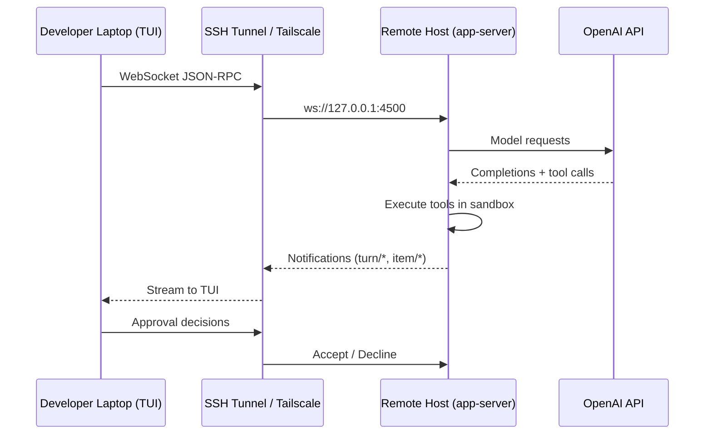
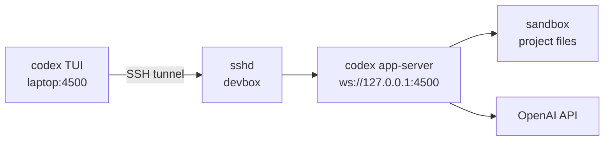

# Codex CLI Remote Connections: Running Agents on Remote Hosts with SSH, WebSocket, and Secure Tunnels


---

Your code lives on a beefy cloud devbox. Your credentials sit in a vault accessible only from a private subnet. Your CI runners spin up ephemeral containers with no GUI. Meanwhile, you're on a laptop in a coffee shop. Codex CLI's remote connections feature — alpha since v0.121.0 and improved in v0.122.0[^1] — bridges this gap by splitting the agent into two halves: an **app-server** executing tool calls on the remote host, and a **TUI** rendering the conversation locally. This article covers every moving part: SSH bootstrapping, WebSocket transport, authentication modes, secure tunnelling patterns, and the operational pitfalls that will bite you in production.

---

## Architecture: The Split-Process Model

Remote Codex works by decoupling the agent runtime from the terminal interface. The app-server process handles model inference, sandbox execution, file I/O, and MCP tool calls on the machine where the code lives. The TUI process handles rendering, keyboard input, and approval prompts on the machine where the developer sits[^2].



Communication uses bidirectional JSON-RPC 2.0 over either stdio (for local use) or WebSocket frames (for remote use)[^3]. Every interaction follows the Thread → Turn → Item hierarchy: a Thread is the conversation, a Turn is one user request plus agent work, and Items are the individual messages, commands, and file changes within a turn[^3].

---

## Enabling Remote Connections

Remote connections are gated behind a feature flag. Add the following to `~/.codex/config.toml` on both machines[^4]:

```toml
[features]
remote_control = true
```

If you're using the Codex desktop app rather than the CLI, the same flag enables the **Settings → Connections** panel. Alternatively, switch to the beta appcast for early access[^5].

---

## Method 1: SSH-Bootstrapped Connections (Codex App)

The simplest path — suitable when you already have SSH access to a devbox and use the Codex desktop app.

### Prerequisites

1. A working SSH config entry:

```
Host devbox
  HostName devbox.example.com
  User you
  IdentityFile ~/.ssh/id_ed25519
```

Codex reads concrete host aliases from `~/.ssh/config` and resolves them with OpenSSH. Pattern-only hosts (e.g. `Host *`) are ignored[^4].

1. Codex CLI installed and authenticated on the remote host. The app bootstraps the remote server through your login shell, so `codex` must be on the remote PATH[^4].

### Authentication on Headless Remotes

Standard `codex login` spawns a local HTTP server on port 1455, waiting for an OAuth callback — impossible on a headless machine without port forwarding. Use Device Code flow instead[^6]:

```bash
ssh devbox
codex login --device-auth
```

This generates a one-time code valid for 15 minutes and an authorisation URL. Complete sign-in from any browser — the CLI and browser communicate through OpenAI's servers, requiring no direct network path between them[^6].

⚠️ **Important:** You must enable Device Code Authorisation in your ChatGPT Security Settings before this will work.

### Connecting

In the Codex app: **Settings → Connections → Add SSH Host → Select remote project folder**. The app starts the app-server over SSH and connects automatically[^4].

---

## Method 2: Manual App-Server + Remote TUI (CLI-to-CLI)

For terminal-only workflows, you control both halves yourself. This gives maximum flexibility — you choose the transport, authentication, and tunnelling strategy.

### Step 1: Start the App-Server on the Remote Host

```bash
# On the remote machine
codex app-server --listen ws://127.0.0.1:4500
```

The `--listen` flag accepts `stdio://` (default, for local piping) or `ws://IP:PORT` for WebSocket transport[^2]. Binding to `127.0.0.1` is critical — never bind to `0.0.0.0` without authentication[^7].

### Step 2: Create an SSH Tunnel

```bash
# On your laptop
ssh -N -L 4500:127.0.0.1:4500 devbox
```

This forwards local port 4500 to the remote listener. The `-N` flag suppresses a shell session since you only need the tunnel.

### Step 3: Connect the TUI

```bash
# On your laptop, in a separate terminal
codex --remote ws://127.0.0.1:4500
```

The `--remote` flag is supported for `codex`, `codex resume`, and `codex fork`[^2]. You can also pass `--cd /path/to/project` to set the remote working directory before the agent starts[^2].



---

## WebSocket Authentication

For SSH-tunnelled connections to localhost, no authentication is required — the tunnel itself provides the security boundary[^7]. For direct network connections (e.g., over a VPN or Tailscale), Codex supports two authentication modes.

### Capability Token

A shared secret stored in a file on the server, transmitted as a bearer token by the client:

```bash
# Generate a token
openssl rand -base64 32 > /etc/codex/ws-token

# Start the server
codex app-server \
  --listen ws://0.0.0.0:4500 \
  --ws-auth capability-token \
  --ws-token-file /etc/codex/ws-token
```

On the client side, set the token in an environment variable and reference it:

```bash
export CODEX_WS_TOKEN="$(cat /path/to/ws-token)"
codex --remote ws://devbox.tailnet:4500 \
  --remote-auth-token-env CODEX_WS_TOKEN
```

Tokens are only transmitted over `wss://` URLs or `ws://` connections to localhost addresses[^2]. Attempting to send a token over plain `ws://` to a non-localhost address will fail — this is a deliberate safety rail.

### Signed Bearer Token (JWT)

For enterprise deployments where multiple clients connect to shared servers, use HMAC-signed JWTs:

```bash
codex app-server \
  --listen wss://0.0.0.0:4500 \
  --ws-auth signed-bearer-token \
  --ws-shared-secret-file /etc/codex/hmac-secret \
  --ws-issuer "codex-infra" \
  --ws-audience "codex-devbox-pool" \
  --ws-max-clock-skew-seconds 30
```

The server validates `iss` and `aud` claims and rejects tokens outside the skew window[^2]. This mode integrates naturally with corporate identity providers that can mint JWTs.

---

## Secure Tunnelling Patterns

### Pattern 1: SSH Port Forwarding (Simplest)

Best for individual developers with existing SSH access. No additional infrastructure required.

```bash
# Forward local 4500 → remote 4500
ssh -N -L 4500:127.0.0.1:4500 devbox
```

**Trade-off:** One tunnel per connection. If the SSH session drops, the TUI disconnects. Consider `autossh` for automatic reconnection:

```bash
autossh -M 0 -N -L 4500:127.0.0.1:4500 \
  -o "ServerAliveInterval 30" \
  -o "ServerAliveCountMax 3" \
  devbox
```

### Pattern 2: Tailscale / WireGuard Mesh (Team Scale)

For teams sharing devbox pools, a mesh VPN eliminates per-connection SSH tunnels. Codex's own documentation recommends Tailscale or similar mesh networking tools over direct internet exposure[^4].

```bash
# Remote: bind to Tailscale IP
codex app-server \
  --listen ws://100.64.1.50:4500 \
  --ws-auth capability-token \
  --ws-token-file /etc/codex/ws-token

# Local: connect directly over the tailnet
codex --remote ws://devbox.tailnet:4500 \
  --remote-auth-token-env CODEX_WS_TOKEN
```

The Tailscale connection is already encrypted with WireGuard, so `ws://` (rather than `wss://`) is acceptable within the tailnet — though the token still provides authentication[^8].

### Pattern 3: Reverse Proxy with TLS Termination (Enterprise)

For shared infrastructure behind a load balancer:

```nginx
# nginx.conf snippet
upstream codex_servers {
    server 10.0.1.10:4500;
    server 10.0.1.11:4500;
}

server {
    listen 443 ssl;
    server_name codex.internal.example.com;

    location /ws {
        proxy_pass http://codex_servers;
        proxy_http_version 1.1;
        proxy_set_header Upgrade $http_upgrade;
        proxy_set_header Connection "upgrade";
        proxy_read_timeout 86400s;
    }
}
```

Use signed bearer tokens here — the reverse proxy terminates TLS, and the JWT validates client identity at the app-server layer.

---

## Session Management Across Reconnections

Remote sessions survive TUI disconnections. The app-server keeps the thread alive, and you can reconnect using `codex resume`:

```bash
# List all sessions (including from other directories)
codex resume --all

# Jump straight to the last session
codex resume --last --remote ws://127.0.0.1:4500

# Target a specific session
codex resume thr_abc123 --remote ws://127.0.0.1:4500
```

Resumed sessions preserve the original transcript, plan history, and prior approval decisions[^9]. If you're running multiple agents on the same remote host, each app-server instance needs its own port.

In v0.122.0, resumed and forked app-server threads replay token usage immediately, so the context and status UI starts with the correct state rather than showing zeroes until the next turn[^1].

---

## The exec-server: Headless Remote Execution

For CI/CD and automation pipelines, the experimental `codex exec-server` subcommand combines headless execution with remote connectivity[^1]. Rather than running a one-shot `codex exec` command, `exec-server` keeps a persistent process accepting tasks over the same JSON-RPC protocol:

```bash
# On the CI runner
codex exec-server --listen ws://127.0.0.1:4501
```

This is particularly useful for:

- **Shared CI agents** that handle multiple fix requests without cold-starting each time
- **Orchestration layers** that dispatch tasks to a pool of Codex workers
- **Long-running watchers** that respond to events (webhook, file change, cron) by executing agent tasks

⚠️ The `exec-server` subcommand is experimental as of v0.122.0 and its API may change.

---

## Troubleshooting

### Shell Initialisation Failures

The most common connection failure: the app-server starts through the remote user's login shell, and something in `.bashrc` or `.zshrc` breaks non-interactive execution. Guard shell transitions with an environment check[^5]:

```bash
# In ~/.bashrc — prevent exec zsh from breaking Codex
if [ -x "$(command -v zsh)" ] && [ -z "${BASH_EXECUTION_STRING:-}" ]; then
    exec zsh -l
fi
```

### WebSocket 1006 Errors

ECONNRESET or WebSocket close code 1006 typically means the remote process crashed during startup. Check:

1. `codex` is on the remote PATH (test with `ssh devbox 'codex --version'`)
2. The remote Codex version matches or exceeds v0.121.0[^5]
3. No port conflict on the listener address

### Overload Rejection

The app-server uses bounded request queues. Under heavy load, it returns JSON-RPC error code `-32001` ("Server overloaded; retry later")[^3]. Clients should implement exponential backoff with jitter. If you're hitting this regularly, you likely need multiple app-server instances behind a load balancer.

### Clipboard Over SSH

The TUI's `Ctrl+O` (copy last agent response) works over SSH but relies on OSC 52 terminal escape sequences. Ensure your terminal emulator supports OSC 52 — most modern terminals (iTerm2, WezTerm, Ghostty, Windows Terminal) do, but tmux requires `set -g set-clipboard on`[^1].

---

## Security Checklist

Remote connections expand the attack surface. Before deploying:

- [ ] **Never expose unauthenticated listeners on shared or public networks**[^4]
- [ ] Bind app-server to `127.0.0.1` and use SSH tunnels, or use capability/JWT auth with VPN
- [ ] Use least-privilege SSH accounts — the agent executes with whatever permissions the SSH user has
- [ ] Rotate WebSocket tokens regularly; store them outside version control
- [ ] In v0.122.0, security-sensitive flows were tightened: `logout` revokes managed ChatGPT tokens, and project hooks plus exec policies require trusted workspaces[^1]
- [ ] Review sandbox policies — remote app-servers respect the same `workspaceWrite`, `readOnly`, and `externalSandbox` modes as local execution[^3]
- [ ] For multi-tenant server pools, use signed bearer tokens with per-team `iss`/`aud` claims

---

## Putting It All Together: A Complete Remote Workflow

Here's a practical end-to-end setup for a developer using a cloud devbox:

```bash
# === ONE-TIME SETUP (on the devbox) ===
# Install Codex CLI
npm install -g @openai/codex

# Authenticate via device code (no port forwarding needed)
codex login --device-auth

# Enable remote connections
cat >> ~/.codex/config.toml << 'EOF'
[features]
remote_control = true
EOF

# Generate a WebSocket token
mkdir -p /etc/codex
openssl rand -base64 32 > /etc/codex/ws-token

# === START THE SERVER ===
codex app-server \
  --listen ws://127.0.0.1:4500 &

# === ON YOUR LAPTOP ===
# Option A: SSH tunnel (simplest)
ssh -N -L 4500:127.0.0.1:4500 devbox &

# Connect the TUI
codex --remote ws://127.0.0.1:4500 --cd /home/you/project

# Option B: Tailscale (team-friendly)
codex --remote ws://devbox.tailnet:4500 \
  --remote-auth-token-env CODEX_WS_TOKEN \
  --cd /home/you/project
```

The agent now executes on the devbox — reading files, running tests, applying patches — while you interact through your local terminal. Disconnect your laptop, reconnect later with `codex resume --last --remote ws://127.0.0.1:4500`, and pick up exactly where you left off.

---

## Citations

[^1]: OpenAI, "Changelog — Codex," April 2026. [https://developers.openai.com/codex/changelog](https://developers.openai.com/codex/changelog)

[^2]: OpenAI, "Command line options — Codex CLI," April 2026. [https://developers.openai.com/codex/cli/reference](https://developers.openai.com/codex/cli/reference)

[^3]: OpenAI, "App Server — Codex," April 2026. [https://developers.openai.com/codex/app-server](https://developers.openai.com/codex/app-server)

[^4]: OpenAI, "Remote connections — Codex," April 2026. [https://developers.openai.com/codex/remote-connections](https://developers.openai.com/codex/remote-connections)

[^5]: Yiğit Konur, "Using remote SSH with Codex app," April 2026. [https://yigitkonur.com/using-remote-ssh-with-codex-app](https://yigitkonur.com/using-remote-ssh-with-codex-app)

[^6]: Vibe Sparking AI, "Remote Setup: OpenAI Codex CLI + OpenClaw Integration via SSH," April 2026. [https://www.vibesparking.com/en/blog/tools/openclaw/2026-04-05-openclaw-codex-remote-setup/](https://www.vibesparking.com/en/blog/tools/openclaw/2026-04-05-openclaw-codex-remote-setup/)

[^7]: OpenAI, "Unlocking the Codex harness: how we built the App Server," April 2026. [https://openai.com/index/unlocking-the-codex-harness/](https://openai.com/index/unlocking-the-codex-harness/)

[^8]: Tailscale, "Tailscale SSH Documentation," 2026. [https://tailscale.com/docs/features/tailscale-ssh](https://tailscale.com/docs/features/tailscale-ssh)

[^9]: OpenAI, "Features — Codex CLI," April 2026. [https://developers.openai.com/codex/cli/features](https://developers.openai.com/codex/cli/features)
