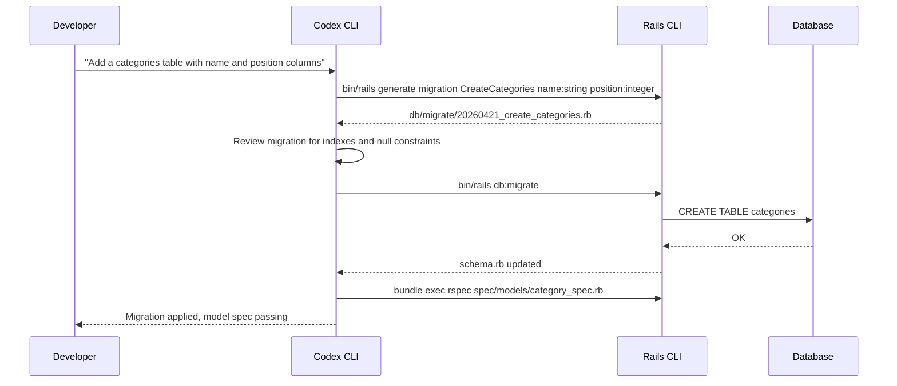
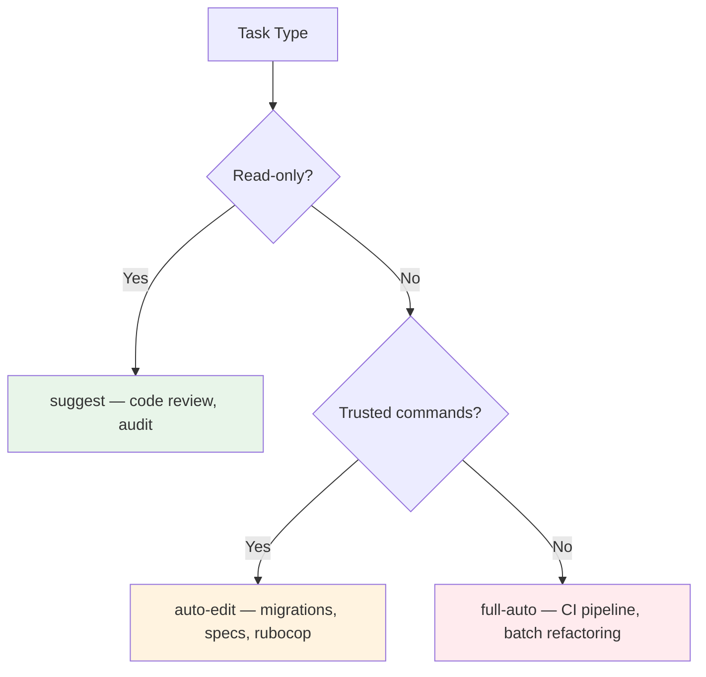

# Codex CLI for Ruby on Rails Teams: AGENTS.md, Bundler Sandboxing, and RSpec Workflows


---

Ruby on Rails remains one of the most productive full-stack frameworks in production, powering applications from Shopify to GitHub.[^1] Yet most Codex CLI guidance assumes Python or TypeScript. This article fills the gap for Rails teams: an AGENTS.md template tuned for Rails conventions, the Bundler proxy configuration that every Ruby developer hits on first run, RSpec and Minitest integration patterns, and workflow recipes for migrations, security audits, and N+1 query detection.

All examples target Rails 8.x (currently 8.1.3, released March 2026)[^2] with Codex CLI v0.122.0+[^3] and the default `gpt-5.4` model.[^4]

---

## The First Wall: Bundler and the Network Sandbox

Codex CLI's default `suggest` approval mode runs commands inside a sandboxed environment that blocks direct outbound network access.[^5] Traffic must route through Codex's internal managed proxy. Most HTTP clients respect `http_proxy` and `https_proxy` environment variables — but Bundler has historically been inconsistent about honouring them, particularly on older Ruby versions.[^6]

The symptom is always the same:

```
Could not fetch specs from https://rubygems.org/
```

### Fix: Route Bundler Through the Proxy

Add this to your project's SessionStart hook or Codex Cloud setup script:

```bash
#!/usr/bin/env bash
set -euo pipefail

export http_proxy="http://proxy:8080"
export https_proxy="http://proxy:8080"
export BUNDLE_HTTP_PROXY="http://proxy:8080"
export BUNDLE_HTTPS_PROXY="http://proxy:8080"

# Pre-install dependencies so the agent doesn't wait
bundle install --jobs 4 --retry 3
```

The `BUNDLE_HTTP_PROXY` and `BUNDLE_HTTPS_PROXY` variables are the definitive way to force Bundler through a proxy, bypassing any `.gemrc` ambiguity.[^6] Once dependencies are cached in `vendor/bundle` or the system gem path, subsequent `bundle exec` calls work without network access.

For local CLI sessions where you already have gems installed, an alternative is to set `network_enabled = true` in your Codex profile and use the managed network proxy with a domain allowlist:[^7]

```toml
[profiles.rails]
network_enabled = true
network_allowed_domains = ["rubygems.org", "index.rubygems.org"]
```

---

## AGENTS.md Template for Rails Repositories

Place this at your repository root. It encodes the conventions that prevent the most common agent mistakes in Rails projects.

```markdown
# AGENTS.md

## Project Structure

This is a Ruby on Rails 8.x application using:
- Ruby 3.3+
- PostgreSQL (primary database)
- RSpec for testing (spec/ directory)
- RuboCop + Standard for linting
- Stimulus + Turbo for frontend (Hotwire stack)

Key directories:
- app/models/ — ActiveRecord models
- app/controllers/ — request handlers
- app/views/ — ERB templates
- app/jobs/ — ActiveJob background workers
- db/migrate/ — database migrations (timestamped)
- spec/ — RSpec test files mirroring app/ structure

## Build and Test

Always run targeted tests first:

    bundle exec rspec spec/models/user_spec.rb

Run the full suite only when asked or before committing:

    bundle exec rspec

Run linting:

    bundle exec rubocop --autocorrect

## Database

Never edit db/schema.rb directly — it is auto-generated.
Create migrations with Rails generators:

    bin/rails generate migration AddEmailIndexToUsers

Always run migrations after creating them:

    bin/rails db:migrate

Check migration status:

    bin/rails db:migrate:status

## Conventions

- Use `params.expect()` instead of `params.require().permit()` (Rails 8 style)
- Use Solid Queue for background jobs, not Sidekiq
- Use Solid Cache for caching, not Redis
- Follow Standard Ruby style (superset of RuboCop defaults)
- Write request specs for API endpoints, system specs for UI flows
- All database columns that appear in WHERE clauses need indexes
```

Adjust framework choices (RSpec vs Minitest, PostgreSQL vs SQLite) to match your project. The key insight is encoding Rails-specific conventions — like never editing `schema.rb` — that a general-purpose model would not know.[^8]

### Subdirectory Overrides

For Rails engines or monorepo structures, add per-engine AGENTS.md files:

```
engines/
  payments/
    AGENTS.md    # "This engine uses Minitest, not RSpec.
                 #  Run: bin/rails test engines/payments/test/"
  notifications/
    AGENTS.md    # "Uses ActionMailer previews in test/mailers/previews/"
```

Codex merges these hierarchically — subdirectory instructions override root-level ones for files within that subtree.[^9]

---

## RSpec Integration Patterns

### Running Tests Intelligently

The agent needs to know which test command to run. Without guidance, it often falls back to `rake test` (Minitest) or runs the entire suite on every change. Your AGENTS.md handles this, but you can reinforce it with a PreToolUse hook that intercepts test commands:

```bash
#!/usr/bin/env bash
# .codex/hooks/pre-tool-use.sh
# Warn if the agent tries to run the full suite unnecessarily

if [[ "$CODEX_TOOL_NAME" == "shell" ]]; then
  if echo "$CODEX_TOOL_INPUT" | grep -qE "^bundle exec rspec$"; then
    echo "WARNING: Running the full RSpec suite. Consider running only the relevant spec file."
  fi
fi
```

### Factory Bot and Fixtures

Rails agents frequently generate test files with inline `let` blocks that create records manually. If your project uses FactoryBot, add this to AGENTS.md:

```markdown
## Test Data

Use FactoryBot for test data. Never create records with `Model.create!` in specs.
Factories live in spec/factories/.

Example:
    let(:user) { create(:user, :confirmed) }

Use traits for common variations. Check existing factories before creating new ones.
```

---

## Workflow Recipes

### Recipe 1: Migration Generation and Validation



The agent generates the migration, runs it, and validates — all in a single turn. The AGENTS.md instruction to "always run migrations after creating them" ensures the schema stays in sync.

### Recipe 2: Security Audit with Brakeman

Brakeman is the standard static analysis security scanner for Rails, detecting 33 categories of vulnerabilities including SQL injection, XSS, and mass assignment.[^10] Wire it into a Codex workflow:

```bash
codex exec "Run brakeman --no-pager --format json on this project. \
  Summarise any high-confidence warnings and suggest fixes. \
  For each fix, create a separate commit."
```

For CI pipelines, combine with `bundler-audit` for dependency vulnerability checking:

```bash
codex exec "Run 'bundle audit check --update' and 'brakeman -q'. \
  If either reports issues, fix them and run the test suite to confirm nothing breaks."
```

### Recipe 3: N+1 Query Detection

N+1 queries are the most common Rails performance problem. The Bullet gem detects them at runtime,[^11] but Codex can also find them statically:

```bash
codex "Review all controller actions in app/controllers/ for potential N+1 queries. \
  Check that any association accessed in views or serializers has a corresponding \
  includes/preload/eager_load in the controller. Flag any missing eager loads."
```

For an automated approach, add Bullet to your test environment and instruct Codex to treat Bullet warnings as test failures:

```ruby
# spec/rails_helper.rb
if Bullet.enable?
  config.before(:each) { Bullet.start_request }
  config.after(:each) do
    Bullet.perform_out_of_channel_notifications if Bullet.notification?
    Bullet.end_request
  end
end
```

### Recipe 4: RuboCop Autocorrect Pipeline

```bash
codex exec --profile rails \
  "Run 'bundle exec rubocop --autocorrect-all'. \
   If any offences remain that cannot be auto-corrected, fix them manually. \
   Then run the test suite to confirm no regressions."
```

This is particularly effective for upgrading RuboCop versions or adopting Standard Ruby across a legacy codebase — the agent handles the mechanical fixes whilst preserving test-passing status.[^12]

---

## Approval Mode Selection for Rails

Rails projects involve frequent file creation (migrations, specs, views) and shell commands (`bin/rails`, `bundle exec`). The three approval modes map to Rails workflows as follows:



For most interactive development, `auto-edit` strikes the right balance — the agent can create and modify files freely but asks before running shell commands like `bin/rails db:migrate` or `bundle exec rspec`.[^5]

---

## Configuration Reference

A complete `config.toml` profile for Rails development:

```toml
[profiles.rails]
model = "gpt-5.4"
approval_mode = "auto-edit"
network_enabled = true
network_allowed_domains = [
  "rubygems.org",
  "index.rubygems.org"
]

[profiles.rails-ci]
model = "gpt-5.4-mini"
approval_mode = "full-auto"
network_enabled = true
network_allowed_domains = ["rubygems.org"]
```

The CI profile uses `gpt-5.4-mini` for cost efficiency on mechanical tasks like lint fixes and test generation, whilst the interactive profile uses the full `gpt-5.4` for reasoning-heavy work like architecture decisions and complex refactoring.[^4]

---

## Common Pitfalls

1. **Editing `schema.rb` directly.** The agent will sometimes try to modify `db/schema.rb` instead of creating a migration. The AGENTS.md instruction prevents this, but reinforce with a deny-read policy if needed:

   ```toml
   # Prevent accidental schema.rb edits
   deny_edit_patterns = ["db/schema.rb"]
   ```

2. **Running `rails s` inside the sandbox.** The agent occasionally tries to start a development server to verify changes. This blocks indefinitely. Add to AGENTS.md: "Never start a long-running server process."

3. **Gem version hallucination.** AI models sometimes generate `Gemfile` entries with non-existent gem versions.[^13] Always run `bundle install` after any Gemfile change and treat failures as blocking.

4. **Ignoring `bin/` binstubs.** Rails projects use `bin/rails`, `bin/rake`, and `bin/rspec` to ensure the correct gem versions. Add to AGENTS.md: "Always use `bin/` binstubs or `bundle exec` prefix for all Ruby commands."

---

## Citations

[^1]: [Ruby on Rails — Official Site](https://rubyonrails.org/) — Rails powers applications including Shopify, GitHub, Basecamp, and HEY.

[^2]: [Rails Versions 8.0.5 and 8.1.3 Released — Ruby on Rails Blog](https://rubyonrails.org/2026/3/24/Rails-Versions-8-0-5-and-8-1-3-have-been-released) — Latest stable releases as of March 2026.

[^3]: [Release 0.122.0 — openai/codex GitHub](https://github.com/openai/codex/releases/tag/rust-v0.122.0) — Stable release with plugin marketplace, deny-read policies, and isolated exec runs.

[^4]: [Models — Codex CLI Official Docs](https://developers.openai.com/codex/models) — gpt-5.4 as flagship model; gpt-5.4-mini for fast, cost-efficient tasks.

[^5]: [CLI Features — Codex Official Docs](https://developers.openai.com/codex/cli/features) — Approval modes and sandbox behaviour for Codex CLI.

[^6]: [Bundler: Install gems behind a proxy — makandracards](https://makandracards.com/makandra/38275-bundler-install-gems-behind-proxy) — BUNDLE_HTTP_PROXY and BUNDLE_HTTPS_PROXY environment variables for proxy configuration.

[^7]: [Advanced Configuration — Codex Official Docs](https://developers.openai.com/codex/config-advanced) — Network proxy domain allowlists and profile-scoped configuration.

[^8]: [Custom Instructions with AGENTS.md — Codex Official Docs](https://developers.openai.com/codex/guides/agents-md) — AGENTS.md loading, hierarchical merging, and best practices.

[^9]: [AGENTS.md — Official Specification](https://agents.md/) — Open standard for agent instruction files with directory-scoped overrides.

[^10]: [Brakeman — Static Analysis Security Scanner](https://brakemanscanner.org/) — Detects 33 categories of Rails security vulnerabilities; v8.0.2 released February 2026.

[^11]: [Bullet gem — GitHub (flyerhzm/bullet)](https://github.com/flyerhzm/bullet) — Runtime N+1 query detection for ActiveRecord and Mongoid.

[^12]: [RuboCop Configuration — Official Docs](https://docs.rubocop.org/rubocop/latest/configuration.html) — RuboCop autocorrect modes and configuration file structure.

[^13]: [Safe Dependency Management with Codex CLI — Codex Blog](https://codex.danielvaughan.com/2026/04/20/codex-cli-dependency-management-security-lockfile-discipline/) — AI agents hallucinate package versions at a 28% rate; lockfile discipline patterns.
