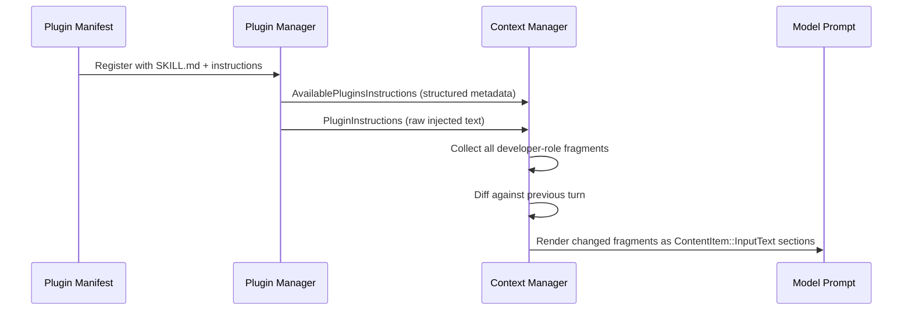
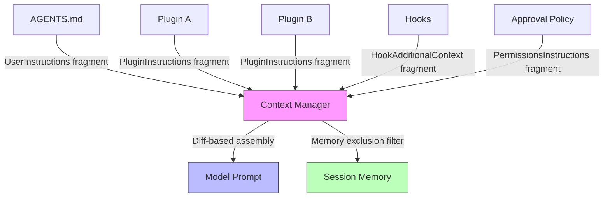

# Context Fragment Injection: Modular DeveloperInstructions via Plugins


---

Until today, Codex CLI assembled its system prompt as a single monolithic `DeveloperInstructions` blob — one giant string stuffed into the developer-role message before every turn. It worked, but it created three problems that grew worse as the plugin ecosystem matured: compaction could not selectively drop stale instructions, plugins had no clean injection point, and debugging which instruction influenced a turn required reading thousands of tokens of concatenated text.

Two PRs merged into the v0.123.0 alpha series on 21 April 2026 fix this by decomposing the monolith into roughly twenty typed **context fragments**, each self-describing and independently addressable [^1][^2]. This article explains the architecture, walks through the key abstractions, and shows what it means for plugin authors and teams managing large instruction surfaces.

## Why Monolithic Instructions Hit a Wall

Codex CLI's context manager sits between the user and the model. Every turn, it assembles a prompt comprising environment state, developer instructions, user instructions (AGENTS.md), skill payloads, plugin guidance, and more [^3]. Before v0.123, all developer-side content was concatenated into a single `DeveloperInstructions` struct and rendered as one `ContentItem::InputText` block.

Three consequences followed:

1. **All-or-nothing compaction.** When the conversation neared the context window limit, the compaction system could either keep or drop the entire developer message. Individual sections — say, image-generation guidance that was irrelevant to a pure refactoring session — could not be evicted independently [^4].

2. **Plugin context as an afterthought.** Plugin-injected text was appended to the blob with no structural boundary. Two plugins injecting overlapping guidance could conflict silently, and there was no way for the context manager to attribute token cost to a specific plugin.

3. **Opaque debugging.** When a model response seemed influenced by an unexpected instruction, tracing it back required manually searching the concatenated prompt. No markers delineated where one instruction ended and another began.

## The Fragment Architecture

### The `ContextualUserFragment` Trait

PR #18794 introduced a new `codex-rs/core/src/context/` module and a trait that every fragment must implement [^1]:

```rust
pub trait ContextualUserFragment {
    const ROLE: &'static str;         // "developer" or "user"
    const START_MARKER: &'static str; // e.g., "<personality_spec>"
    const END_MARKER: &'static str;   // e.g., "</personality_spec>"

    fn body(&self) -> String;
    fn matches_text(text: &str) -> bool;
    fn render(&self) -> String;       // START_MARKER + body + END_MARKER
    fn into(self) -> ResponseItem;
}
```

The key design decisions:

- **XML-like markers** wrap each fragment's rendered output, making fragments machine-recognisable within the serialised prompt. The compaction layer can pattern-match on markers to identify, measure, and selectively retain or drop individual fragments.
- **Role separation.** Fragments declare themselves as `developer` or `user` role. Developer-role fragments form the system-level instruction surface; user-role fragments carry conversation-scoped context like AGENTS.md or environment state.
- **Type-erased matching** via a companion `FragmentRegistration` trait enables the context manager to iterate over all registered fragment types without knowing their concrete structs.

### The Fragment Catalogue

PR #18813 then decomposed the monolithic `DeveloperInstructions` into individual typed structs [^2]. The full catalogue as of v0.123.0-alpha.6:

| Fragment | Role | Purpose |
|---|---|---|
| `PermissionsInstructions` | developer | Sandbox mode and approval policy |
| `AvailablePluginsInstructions` | developer | Lists enabled plugins with usage guidance |
| `AvailableSkillsInstructions` | developer | Lists skills via SKILL.md discovery |
| `CollaborationModeInstructions` | developer | Collaboration mode configuration |
| `PersonalitySpecInstructions` | developer | Communication style overrides |
| `PluginInstructions` | developer | Raw plugin-injected text (unmarked) |
| `AppsInstructions` | developer | App integration instructions |
| `ImageGenerationInstructions` | developer | Image generation guidance |
| `ModelSwitchInstructions` | developer | Mid-session model switch context |
| `NetworkRuleSaved` | developer | Persisted network access rules |
| `ApprovedCommandPrefixSaved` | developer | Persisted approved command prefixes |
| `GuardianFollowupReviewReminder` | developer | Auto-review follow-up prompts |
| `HookAdditionalContext` | developer | Hook-injected extra context |
| `SpawnAgentInstructions` | developer | Sub-agent spawning instructions |
| `EnvironmentContext` | user | CWD, platform, shell, git state |
| `UserInstructions` | user | AGENTS.md content |
| `SkillInstructions` | user | Active skill payloads |

This is not merely a cosmetic refactor. Each struct is independently constructible, testable, and — crucially — individually evictable during compaction.

## How Plugin Context Injection Works

The fragment that matters most for plugin authors is `PluginInstructions`. It differs from every other fragment in one critical way: it uses **empty markers** [^2].

```rust
impl ContextualUserFragment for PluginInstructions {
    const ROLE: &'static str = "developer";
    const START_MARKER: &'static str = "";
    const END_MARKER: &'static str = "";
    // ...
}
```

This means plugin-injected text appears in the prompt as raw content without wrapping tags. The design is intentional — plugins need their instructions to read naturally to the model without structural noise. A separate fragment, `AvailablePluginsInstructions`, handles the structured metadata (plugin names, descriptions, invocation syntax) and does use markers (`PLUGINS_INSTRUCTIONS_OPEN_TAG` / `PLUGINS_INSTRUCTIONS_CLOSE_TAG`) [^1].

The injection flow:



### Diff-Based Updates

The context manager does not blindly re-inject every fragment on every turn. The `context_manager/updates.rs` module performs **diff-based updates** — it compares the current fragment set against the previous turn's state and only injects fragments whose content has changed [^1]. This matters for prompt caching: unchanged fragments preserve the exact-prefix cache hit that keeps Codex CLI's agent loop near-linear in cost [^6].

## Selective Memory Exclusion

Not all fragments belong in conversation memory. The source code maintains two static registries [^2]:

- `CONTEXTUAL_USER_FRAGMENTS` — all recognised user-role fragments, used by compaction to distinguish injected context from genuine user messages.
- `MEMORY_EXCLUDED_CONTEXTUAL_USER_FRAGMENTS` — fragments stripped before memory generation. Currently this includes `UserInstructions` (AGENTS.md) and `SkillInstructions`, described in the code as "prompt scaffolding rather than conversation content."

This distinction is significant for long-running sessions. When Codex CLI generates a memory summary for session persistence, it excludes the scaffolding that would be re-injected fresh on resume. The result: leaner memory files that capture what happened, not how the agent was configured [^4].

## Per-Fragment Compaction: The Road Ahead

The fragment architecture clearly enables per-fragment compaction as a future capability. Each fragment can be independently:

1. **Identified** via marker-based `matches_text()`.
2. **Measured** for token cost.
3. **Prioritised** based on relevance to the current task.
4. **Evicted** without disturbing adjacent fragments.

⚠️ As of v0.123.0-alpha.6, the compaction system still uses OpenAI's opaque encrypted compaction mechanism [^4]. Per-fragment selective compaction is architecturally enabled but not yet implemented in the public codebase. Expect this to land in a future stable release.

## Practical Implications for Plugin Authors

If you are building Codex CLI plugins [^5], the fragment architecture changes your mental model:

### 1. Keep Injected Instructions Minimal

Your plugin's instructions now occupy a distinct, measurable fragment. The context manager can — and eventually will — evict bloated fragments under token pressure. Write tight, task-specific instructions rather than comprehensive reference material.

```toml
# plugin.toml — keep instructions focused
[plugin]
name = "database-reviewer"
instructions = """
When reviewing database migrations:
- Check for missing indexes on foreign keys
- Flag destructive operations (DROP, TRUNCATE) for approval
- Verify rollback safety
"""
```

### 2. Leverage the Structured Metadata Layer

`AvailablePluginsInstructions` automatically generates structured guidance for the model about your plugin's capabilities. Ensure your manifest's `description` and `skills` fields are precise — the model uses this metadata to decide when to invoke your plugin [^5].

### 3. Anticipate Fragment-Level Observability

With each fragment carrying its own markers, future OTEL traces will likely attribute token usage per fragment. Design your plugin with the expectation that teams will monitor its context cost and set budgets accordingly.

## Implications for Team Configuration

For teams managing AGENTS.md alongside multiple plugins, the fragment architecture introduces a cleaner separation of concerns:



Each source of instructions is independently updatable. Changing your approval policy does not invalidate the prompt cache for your AGENTS.md content. Updating a plugin's instructions does not require the environment context to be re-rendered.

## Migration Notes

The fragment refactor is an internal architecture change — it requires **no action from end users**. Your existing `config.toml`, AGENTS.md files, and plugin manifests continue to work unchanged. The difference is entirely in how the context manager assembles and manages the prompt behind the scenes [^1][^2].

However, if you have been writing custom MCP tools that inspect or modify the developer message, be aware that the message structure has changed from a single text block to multiple `ContentItem::InputText` sections within the same developer-role message.

## Key Takeaways

1. **The monolith is dead.** Developer instructions are now ~20 typed fragments, each self-describing with role, markers, and body.
2. **Plugins inject context cleanly.** `PluginInstructions` provides a structured injection point; `AvailablePluginsInstructions` handles metadata.
3. **Diff-based updates preserve cache hits.** Only changed fragments are re-injected each turn.
4. **Memory exclusion is fragment-aware.** Scaffolding (AGENTS.md, skills) is stripped from memory generation.
5. **Per-fragment compaction is architecturally enabled** but not yet implemented in the alpha.

The context fragment architecture is one of those infrastructure changes that most users will never notice directly but that fundamentally improves the platform's ability to scale. As the plugin ecosystem grows and instruction surfaces expand, the ability to independently manage, measure, and evict individual context fragments will prove essential.

## Citations

[^1]: PR #18794 — "Organize context fragments." GitHub, openai/codex. Merged 2026-04-21. [https://github.com/openai/codex/pull/18794](https://github.com/openai/codex/pull/18794)

[^2]: PR #18813 — "Split DeveloperInstructions into individual fragments." GitHub, openai/codex. Merged 2026-04-21. [https://github.com/openai/codex/pull/18813](https://github.com/openai/codex/pull/18813)

[^3]: "Unrolling the Codex Agent Loop." OpenAI Engineering Blog. [https://openai.com/index/unrolling-the-codex-agent-loop/](https://openai.com/index/unrolling-the-codex-agent-loop/)

[^4]: "Context compaction in agent frameworks." DEV Community. [https://dev.to/crabtalk/context-compaction-in-agent-frameworks-4ckk](https://dev.to/crabtalk/context-compaction-in-agent-frameworks-4ckk)

[^5]: "Build Plugins — Codex CLI." OpenAI Developers. [https://developers.openai.com/codex/plugins/build](https://developers.openai.com/codex/plugins/build)

[^6]: "Prompt Caching in Codex CLI: How the Agent Loop Stays Linear and How to Maximise Cache Hits." Codex Resources, 2026-04-21. [https://danielvaughan.github.io/codex-resources/articles/2026-04-21-codex-cli-prompt-caching-maximise-cache-hits-cost-reduction/](https://danielvaughan.github.io/codex-resources/articles/2026-04-21-codex-cli-prompt-caching-maximise-cache-hits-cost-reduction/)
