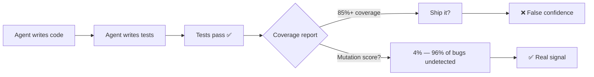
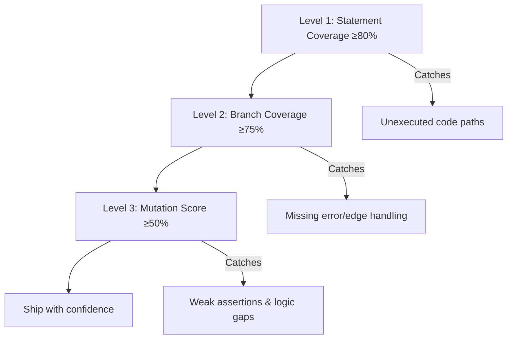

# Mutation Testing with Codex CLI: Why Your AI-Generated Tests Are Lying and How to Fix Them


---

AI coding agents are excellent at generating tests that hit every line of your code. They are also excellent at generating tests that assert almost nothing. A test suite with 100% line coverage but a 4% mutation score executes every statement and misses 96% of potential bugs[^1]. This article shows how to integrate mutation testing into Codex CLI workflows so that AI-generated tests actually verify behaviour rather than merely exercising code paths.

## The Coverage Illusion

When you ask Codex CLI to "add tests for this module," it optimises for the signal it can measure: line and branch coverage. The result is typically impressive — 85–95% statement coverage in minutes. But coverage measures execution, not verification.

CodeRabbit's December 2025 analysis of AI-generated pull requests found that AI-authored code introduces 1.7× more bugs than human-written code, with logic errors up 75% and security findings 57% more prevalent[^2]. The tests that ship alongside that code often embed the same logic errors — the "logic mirror" problem where the agent writes code and then immediately tests it using identical assumptions[^3].



Statement coverage answers: "Was this line executed?" Mutation testing answers: "If this line were wrong, would a test catch it?"

## How Mutation Testing Works

Mutation testing tools introduce small, systematic changes — *mutants* — to your source code:

- Changing `>` to `>=`
- Flipping `+` to `-`
- Replacing `true` with `false`
- Removing `return` statements
- Swapping conditional operators

Your test suite runs against each mutant. If a test fails, the mutant is **killed** — your tests detected the fault. If all tests pass, the mutant **survives** — your tests missed it[^4].

**Mutation score** = (Killed Mutants / Total Mutants) × 100

A mutation score of 70% means your tests detect 70% of the faults that mutation testing can simulate. Research from Outsight AI demonstrated that feeding surviving mutants back to AI code generators improved mutation scores from 70% to 78% in a single iteration[^2].

## The Toolchain by Language

| Language | Tool | Install | CI-friendly |
|---|---|---|---|
| JavaScript/TypeScript | Stryker Mutator v9.6+ | `npm i -D @stryker-mutator/core` | Yes |
| Java/Kotlin | PIT (pitest) v1.19+ | Maven/Gradle plugin | Yes |
| Python | mutmut 3+ | `pip install mutmut` | Yes |
| C#/.NET | Stryker.NET | `dotnet tool install` | Yes |

### Stryker for TypeScript Projects

Stryker is the dominant mutation testing tool for JavaScript and TypeScript ecosystems. Version 9.6.1, released April 2026, includes TypeScript checker integration that eliminates mutants producing type errors before running tests — saving significant execution time[^5].

```bash
# Initialise Stryker in your project
npx stryker init

# Run mutation testing on a specific file
npx stryker run -m src/store/serial.ts

# Run on all changed files (Git-aware)
npx stryker run --incremental
```

### PIT for Java Projects

PIT's `scmMutationCoverage` goal enables incremental CI runs that only mutate changed code — essential for keeping build times manageable in large codebases[^6].

```xml
<plugin>
    <groupId>org.pitest</groupId>
    <artifactId>pitest-maven</artifactId>
    <version>1.19.1</version>
    <dependencies>
        <dependency>
            <groupId>org.pitest</groupId>
            <artifactId>pitest-junit5-plugin</artifactId>
            <version>1.2.1</version>
        </dependency>
    </dependencies>
</plugin>
```

### mutmut for Python Projects

mutmut 3+ uses a fork-based execution model that makes it up to 10× faster than Java's PIT for equivalent codebases. Its 2025 updates use static analysis to flag equivalent mutants, reducing the manual review burden[^7].

```bash
# Run mutation testing
mutmut run

# Show surviving mutants
mutmut results

# Show a specific surviving mutant
mutmut show 42
```

## Integrating Mutation Testing with Codex CLI

### Pattern 1: The Generate-Mutate-Fix Loop

The most effective workflow uses Codex CLI in a tight feedback loop with mutation testing. Rather than asking the agent to write tests and trusting the result, you verify with mutations and feed survivors back.

```bash
# Step 1: Ask Codex to generate tests
codex "Write comprehensive tests for src/payments/charge.ts including edge cases,
error paths, and boundary conditions"

# Step 2: Run mutation testing on the module
npx stryker run -m src/payments/charge.ts

# Step 3: Feed surviving mutants back to Codex
codex "These mutants survived in src/payments/charge.ts — the tests didn't catch them.
Fix the test suite to kill these mutants: $(npx stryker run -m src/payments/charge.ts --reporters clear-text 2>&1 | grep 'Survived')"
```

### Pattern 2: AGENTS.md Mutation Policy

Encode mutation testing expectations directly in your `AGENTS.md` to make the agent aware of mutation quality requirements from the start:

```markdown
## Test Quality Standards

When writing or modifying tests:
1. Run the existing test suite first to confirm it passes
2. Write tests that cover both happy paths AND error paths
3. Every conditional branch must have a test that fails when the condition is inverted
4. After writing tests, verify mutation score meets thresholds:
   - Critical paths (auth, payments, data integrity): 70% minimum
   - Standard features: 50% minimum
   - Experimental code: 30% minimum
5. If mutation score is below threshold, examine surviving mutants and add targeted assertions

Do NOT write tests that merely execute code — every test must assert specific expected behaviour.
```

### Pattern 3: Codex Exec in CI with Mutation Gates

Use `codex exec` to create a self-healing mutation testing pipeline that automatically fixes surviving mutants:

```yaml
# .github/workflows/mutation-gate.yml
name: Mutation Testing Gate
on:
  pull_request:
    paths: ['src/**']

jobs:
  mutation-test:
    runs-on: ubuntu-latest
    steps:
      - uses: actions/checkout@v4

      - name: Install dependencies
        run: npm ci

      - name: Run mutation testing on changed files
        id: mutate
        run: |
          CHANGED=$(git diff --name-only origin/main -- 'src/**/*.ts' | tr '\n' ',')
          npx stryker run -m "$CHANGED" --reporters json,clear-text
          SCORE=$(jq '.schemaVersion' < reports/mutation/mutation.json)
          echo "score=$SCORE" >> "$GITHUB_OUTPUT"

      - name: Auto-fix surviving mutants
        if: steps.mutate.outputs.score < 50
        run: |
          SURVIVORS=$(cat reports/mutation/mutation.json | jq -r '.files | to_entries[] | .value.mutants[] | select(.status=="Survived") | .description')
          codex exec "The following mutants survived in the test suite. Add or fix tests to kill them: $SURVIVORS"
```

### Pattern 4: Pre-Push Hook with Targeted Mutation

Running full mutation testing on every commit is impractical. Target only changed modules at the pre-push stage[^3]:

```bash
#!/bin/bash
# .githooks/pre-push

CHANGED_FILES=$(git diff --cached --name-only --diff-filter=ACM -- '*.ts' '*.tsx')

if [ -z "$CHANGED_FILES" ]; then
  exit 0
fi

echo "Running mutation testing on changed files..."
npx stryker run -m $(echo "$CHANGED_FILES" | tr '\n' ',')

SCORE=$(jq '.schemaVersion' < reports/mutation/mutation.json)
THRESHOLD=50

if (( $(echo "$SCORE < $THRESHOLD" | bc -l) )); then
  echo "❌ Mutation score $SCORE% is below threshold $THRESHOLD%"
  echo "Run 'npx stryker run --reporters clear-text' to see surviving mutants"
  exit 1
fi

echo "✅ Mutation score: $SCORE%"
```

## The Three-Level Verification Stack

Mutation testing works best as the third layer of a verification stack, not a replacement for coverage metrics:



**Level 1 — Statement coverage** (≥80%): Ensures code is exercised. Easy to achieve with AI-generated tests but insufficient alone[^3].

**Level 2 — Branch coverage** (≥75%): Forces tests through both sides of conditionals. Agents targeting statement coverage typically achieve only 45–55% branch coverage while showing 85% statement coverage[^3].

**Level 3 — Mutation score** (≥50% standard, ≥70% critical paths): Validates that assertions actually detect faults. The metric AI agents cannot game without writing genuinely meaningful tests[^2].

## Recommended Mutation Score Thresholds

Based on current industry practice and the performance characteristics of AI-generated tests:

| Code Category | Minimum Mutation Score | Rationale |
|---|---|---|
| Authentication & authorisation | 70% | Security-critical; AI introduces 1.88× more password handling errors[^2] |
| Payment processing | 70% | Financial integrity; AI misses boundary conditions consistently |
| Data integrity & persistence | 60% | State management errors are the hardest for AI to self-detect |
| Standard business logic | 50% | Balanced cost/benefit for typical feature code |
| UI components | 40% | Mutation testing is less effective on rendering logic |
| Experimental/prototype code | 30% | Avoid over-investing in disposable code |

## Performance Considerations

Mutation testing is computationally expensive. A module with 200 mutants and a 30-second test suite requires 100 minutes of sequential execution. Three strategies keep this practical:

1. **Incremental mode**: Only mutate files changed since the last run. Stryker's `--incremental` flag and PIT's `scmMutationCoverage` both support this[^5][^6].

2. **Coverage-guided mutation**: Stryker uses coverage data to run only tests that exercise each mutant, reducing per-mutant execution time by 60–80%[^5].

3. **Scoped execution**: Restrict mutation testing to specific modules rather than the entire codebase. In the Codex CLI context, this means mutating only the files the agent touched:

```bash
# Only mutate files Codex modified in this session
codex exec "List all files you modified" | xargs -I{} npx stryker run -m {}
```

## A Worked Example

Consider a TypeScript caching module where Codex CLI generates tests:

```typescript
// src/cache.ts
export function shouldEvict(entry: CacheEntry, maxAge: number): boolean {
  if (maxAge === Infinity) return false;
  const age = Date.now() - entry.createdAt;
  return age > maxAge;
}
```

Codex generates a test with 100% line coverage:

```typescript
test('shouldEvict returns true for expired entries', () => {
  const entry = { createdAt: Date.now() - 10000 };
  expect(shouldEvict(entry, 5000)).toBe(true);
});
```

Stryker creates mutants including `age > maxAge` → `age >= maxAge`. The test passes for both — the mutant survives because no test checks the boundary condition where `age === maxAge`[^8].

Feeding the surviving mutant back to Codex:

```bash
codex "The mutant 'age > maxAge → age >= maxAge' survived in shouldEvict.
Add a test that kills this mutant."
```

Codex adds:

```typescript
test('shouldEvict returns false when age equals maxAge exactly', () => {
  const now = Date.now();
  const entry = { createdAt: now - 5000 };
  expect(shouldEvict(entry, 5000)).toBe(false);
});
```

The boundary condition is now tested. The mutant is killed.

## Anti-Patterns to Avoid

**Running mutation testing only in nightly CI.** By the time results arrive, the agent has moved on. Run mutation testing immediately after test generation for the tightest feedback loop.

**Targeting 100% mutation score.** Equivalent mutants — mutations that produce functionally identical behaviour — make 100% impossible and chasing it wastes agent time and compute budget.

**Mutating the entire codebase on every PR.** Restrict mutations to changed files. Use `--incremental` flags religiously.

**Ignoring surviving mutants in non-critical code.** The thresholds exist for a reason. Not every surviving mutant warrants a new test — some represent intentional design decisions, as in the Stryker cache example where an `Infinity` optimisation was correctly identified as acceptable[^8].

## Citations

[^1]: Effective test generation using pre-trained Large Language Models and mutation testing — [ScienceDirect](https://www.sciencedirect.com/science/article/abs/pii/S0950584924000739)

[^2]: How to Test AI-Generated Code the Right Way in 2026 — [Two Cents Software](https://www.twocents.software/blog/how-to-test-ai-generated-code-the-right-way/)

[^3]: AI Agents Generate Code That Passes Your Tests. That Is the Problem — [DEV Community](https://dev.to/toniantunovic/ai-agents-generate-code-that-passes-your-tests-that-is-the-problem-56jb)

[^4]: Keep your coding agent on task with mutation testing — [Test Double](https://testdouble.com/insights/keep-your-coding-agent-on-task-with-mutation-testing)

[^5]: Stryker Mutator — [stryker-mutator.io](https://stryker-mutator.io/)

[^6]: PIT Mutation Testing — [pitest.org](https://pitest.org/)

[^7]: Mutation Testing with Mutmut: Python for Code Reliability 2026 — [johal.in](https://johal.in/mutation-testing-with-mutmut-python-for-code-reliability-2026/)

[^8]: Keep your coding agent on task with mutation testing (Stryker cache example) — [Test Double](https://testdouble.com/insights/keep-your-coding-agent-on-task-with-mutation-testing)
