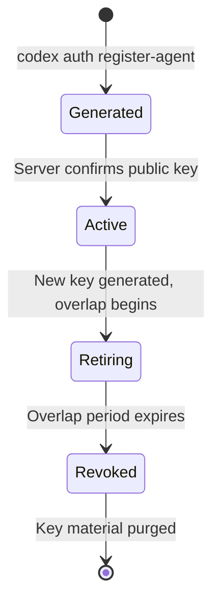
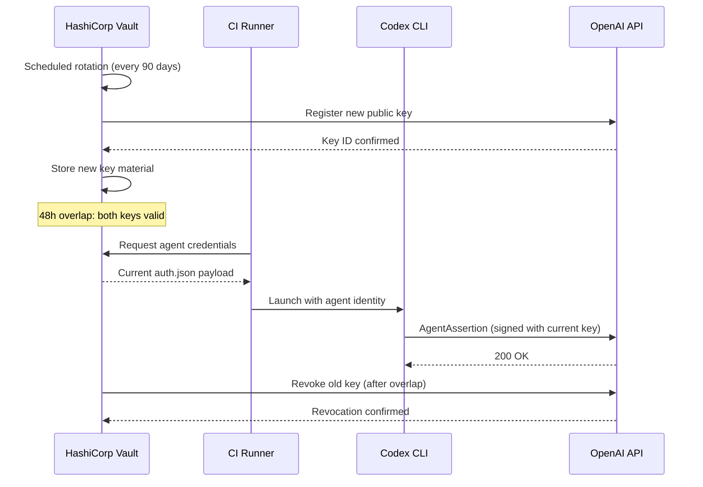
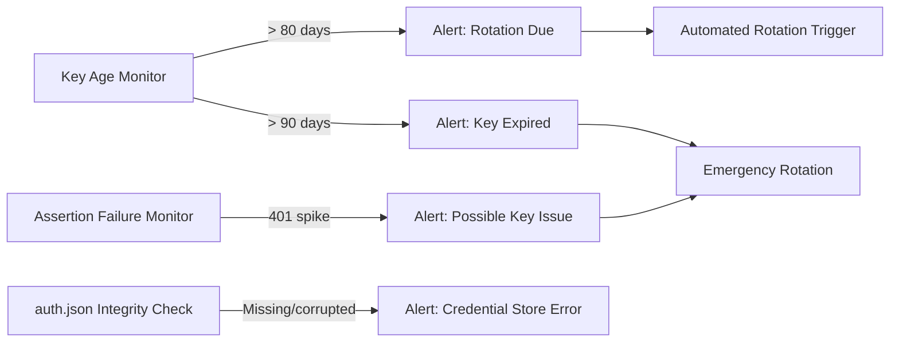

# Agent Identity Key Rotation and Security Operations for Codex CLI


## Introduction

The v0.123 release of Codex CLI introduced `AuthMode::AgentIdentity`, giving each agent its own Ed25519 key pair and replacing forwarded bearer tokens with signed `AgentAssertion` values[^1][^2]. The [companion article on agent identity authentication](2026-04-21-agent-identity-authentication-codex-cli-v0123-agentassertion.md) covers the architecture; this article addresses the operational question enterprises immediately ask: *how do we rotate these keys, and what do we do when one is compromised?*

Key material that never rotates is key material waiting to be exploited. Ed25519 private keys stored in `auth.json` are high-value targets — they grant autonomous API access scoped to an organisational account[^2]. A robust rotation strategy is not optional; it is the price of admission for running agent identities in production.

## The Key Lifecycle Model

Agent identity keys follow a four-phase lifecycle that mirrors established cryptographic key management practice[^3][^4]:



Each phase has distinct operational requirements:

| Phase | Duration | Agent Behaviour | Server Behaviour |
|---|---|---|---|
| **Generated** | Seconds | Key pair created locally | Public key registered, not yet trusted |
| **Active** | 30–90 days (policy-dependent) | Signs all `AgentAssertion` values | Verifies assertions against this key |
| **Retiring** | 24–48 hours | New key signs; old key still valid | Accepts assertions from both keys |
| **Revoked** | Permanent | Old key material deleted | Rejects assertions from old key |

The overlap period during the **Retiring** phase is critical. It provides a rollback window if the new key proves problematic and allows in-flight assertions signed with the old key to complete without 401 errors[^3].

## Scheduled Rotation

### Rotation Cadence

Industry guidance recommends rotating API keys on a 60–90-day cycle[^5][^6]. For agent identity Ed25519 keys, a 90-day cycle strikes a reasonable balance between security posture and operational overhead. Organisations subject to compliance frameworks (SOC 2, FedRAMP) may require shorter cycles — consult your auditor.

### Manual Rotation Workflow

⚠️ The exact CLI subcommands for key rotation are inferred from the v0.123 architecture and PR descriptions. They may change before stable release.

```bash
# Step 1: Generate a new key pair while the old one remains active
codex auth rotate-agent-key --overlap 48h

# Step 2: Verify the new key is functional
codex auth verify-agent-identity

# Step 3: After the overlap period, revoke the old key
codex auth revoke-key --key-id <old-key-id>

# Step 4: Confirm only the new key is active
codex auth list-keys
```

The `--overlap` flag ensures both keys are accepted by the server during the transition. This follows the "add before you remove" principle that underpins zero-downtime key rotation[^3].

### Automated Rotation with Secrets Managers

In production, manual rotation does not scale. Integrating Codex agent identity key rotation with a secrets manager automates the process and provides an audit trail.

#### HashiCorp Vault

HashiCorp Vault already offers a dynamic secrets plugin for OpenAI API keys that creates, rotates, and revokes credentials on demand[^7]. The same pattern applies to agent identity keys:

```bash
# Vault policy for Codex agent key rotation
vault write codex-agent/config \
  rotation_schedule="0 0 * * 6" \
  overlap_period="48h"

# CI runner fetches current agent identity at job start
vault read -format=json codex-agent/creds/ci-runner \
  | jq -r '.data' > ~/.codex/auth.json
```



#### AWS Secrets Manager

For AWS-native environments, use Secrets Manager with a Lambda rotation function[^8]:

```bash
# Store agent identity in Secrets Manager
aws secretsmanager create-secret \
  --name codex/agent-identity/ci-runner \
  --secret-string file://~/.codex/auth.json

# Configure automatic rotation every 90 days
aws secretsmanager rotate-secret \
  --secret-id codex/agent-identity/ci-runner \
  --rotation-lambda-arn arn:aws:lambda:eu-west-1:123456789:function:codex-key-rotator \
  --rotation-rules '{"ScheduleExpression":"rate(90 days)"}'
```

The Lambda function should implement the four-step rotation pattern: `createSecret` → `setSecret` (register new public key with OpenAI) → `testSecret` (verify agent assertion works) → `finishSecret` (promote new version, schedule old key revocation)[^8].

## Incident Response: Compromised Key Material

When an agent's Ed25519 private key is suspected or confirmed compromised, response time matters. A stolen key allows an attacker to forge `AgentAssertion` values and impersonate the agent until the key is revoked.

### Immediate Response Runbook

```bash
# 1. Revoke the compromised key immediately (no overlap period)
codex auth revoke-key --key-id <compromised-key-id> --force

# 2. Generate and register a replacement key
codex auth register-agent --account <account-email> --replace

# 3. Distribute the new auth.json to all runners using this identity
# (via your secrets manager — never copy manually)
vault write codex-agent/creds/ci-runner @new-auth.json

# 4. Audit recent activity from the compromised identity
# Query OpenAI's usage API filtering by the agent's account_id
curl -H "Authorization: Bearer $OPENAI_ADMIN_KEY" \
  "https://api.openai.com/v1/organization/usage?agent_id=<account-id>&start=$(date -d '-7 days' +%s)"
```

### Post-Incident Analysis

After containment, conduct a thorough investigation:

1. **Determine the compromise vector.** Was `auth.json` exposed in logs, committed to a repository, or extracted from an unsecured runner? The `cli_auth_credentials_store` setting should be `keyring` on shared systems — file-based storage with 0o600 permissions is insufficient if the host itself is compromised[^9].

2. **Review assertion logs.** Since `AgentAssertion` values include task IDs and timestamps[^2], cross-reference API server logs to identify assertions not corresponding to legitimate agent runs.

3. **Scope the blast radius.** Agent identity keys are scoped to an organisational account, not to a user's full permissions[^2]. Determine what the compromised agent identity was authorised to access and whether those resources were affected.

4. **Update controls.** If compromise occurred through file exposure, migrate to keyring-based storage. If through a CI runner, implement ephemeral credential injection via your secrets manager rather than persisted `auth.json` files.

## Hardening Agent Identity Storage

### Credential Store Configuration

Codex CLI offers three credential storage backends[^9]:

```toml
# config.toml — prefer keyring on shared infrastructure
cli_auth_credentials_store = "keyring"

# For MCP server credentials too
mcp_oauth_credentials_store = "keyring"
```

| Backend | Security | Best For |
|---|---|---|
| `file` | Plaintext at `~/.codex/auth.json` (0o600) | Single-user dev machines |
| `keyring` | OS credential store (Keychain, libsecret, Windows Credential Manager) | Shared machines, production |
| `auto` | Prefers keyring, falls back to file | General use |

### CI/CD-Specific Hardening

For ephemeral CI runners, never persist `auth.json` to disk longer than the job lifetime[^10]:

```bash
#!/bin/bash
# CI job wrapper: inject credentials, run, clean up
trap 'rm -f ~/.codex/auth.json' EXIT

# Fetch fresh credentials from secrets manager
vault read -format=json codex-agent/creds/ci-runner \
  | jq -r '.data' > ~/.codex/auth.json
chmod 600 ~/.codex/auth.json

# Run the Codex task
codex --approval-mode full-auto -q "Run the test suite"
```

Key principles for CI/CD environments[^10]:

- **One identity per runner.** Never share `auth.json` across concurrent jobs.
- **Ephemeral injection.** Fetch credentials at job start, delete at job end.
- **No repository storage.** Agent identity files must never be committed. Use pre-commit hooks with tools like GitGuardian or Trufflehog to catch accidental commits[^6].
- **Audit logging.** Enable verbose auth logging during rotation windows to catch failures early.

## Monitoring Key Health

Proactive monitoring prevents rotation failures from becoming outages:



Useful monitoring checks:

- **Key age**: Compare `registered_at` in `auth.json` against your rotation policy. Alert at 80% of the rotation interval.
- **Assertion failure rate**: A sudden increase in 401 responses indicates either a key issue or a server-side revocation.
- **File integrity**: On systems using file-based storage, verify `auth.json` permissions remain 0o600 and the file has not been modified outside of Codex processes.

## Summary

Agent identity key rotation is not a feature you configure once and forget. It requires:

1. **A defined rotation cadence** (90 days is a sensible default) with automated execution via a secrets manager.
2. **An overlap period** (48 hours minimum) to prevent downtime during transitions.
3. **An incident response runbook** that your team has rehearsed, not just documented.
4. **Keyring-based storage** on any machine that is not a single-user development laptop.
5. **Monitoring** that alerts before keys expire and detects anomalous assertion patterns.

The v0.123 agent identity architecture gives Codex CLI agents a proper cryptographic identity[^1][^2]. Keeping that identity secure is an ongoing operational discipline, not a one-time setup task.

## Citations

[^1]: OpenAI Codex CLI PR #18757 — Isolate agent identity into standalone crate. [GitHub](https://github.com/openai/codex/pull/18757)
[^2]: OpenAI Codex CLI PR #18785 — Add `AuthMode::AgentIdentity` with durable key material. [GitHub](https://github.com/openai/codex/pull/18785)
[^3]: Sulc, D. "JWKS and Zero-Downtime Key Rotation." [davidsulc.com](https://www.davidsulc.com/blog/jws-apis-jwks-basics)
[^4]: Kiteworks. "Encryption Key Rotation Best Practices: When and How to Change Your Keys Without Disruption." [kiteworks.com](https://www.kiteworks.com/regulatory-compliance/encryption-key-rotation-strategies/)
[^5]: SecureBin. "API Key Rotation Best Practices: Automate Secret Lifecycle." [securebin.ai](https://securebin.ai/blog/api-key-rotation-best-practices/)
[^6]: OpenAI. "Best Practices for API Key Safety." [OpenAI Help Center](https://help.openai.com/en/articles/5112595-best-practices-for-api-key-safety)
[^7]: HashiCorp. "Managing OpenAI API Keys with HashiCorp Vault's Dynamic Secrets Plugin." [hashicorp.com](https://www.hashicorp.com/en/blog/managing-openai-api-keys-with-hashicorp-vault-s-dynamic-secrets-plugin)
[^8]: AWS. "Rotate AWS Secrets Manager secrets." [AWS Documentation](https://docs.aws.amazon.com/secretsmanager/latest/userguide/rotating-secrets.html)
[^9]: OpenAI. "Authentication — Codex CLI." [developers.openai.com](https://developers.openai.com/codex/auth)
[^10]: OpenAI. "Maintain Codex account auth in CI/CD (advanced)." [developers.openai.com](https://developers.openai.com/codex/auth/ci-cd-auth)
