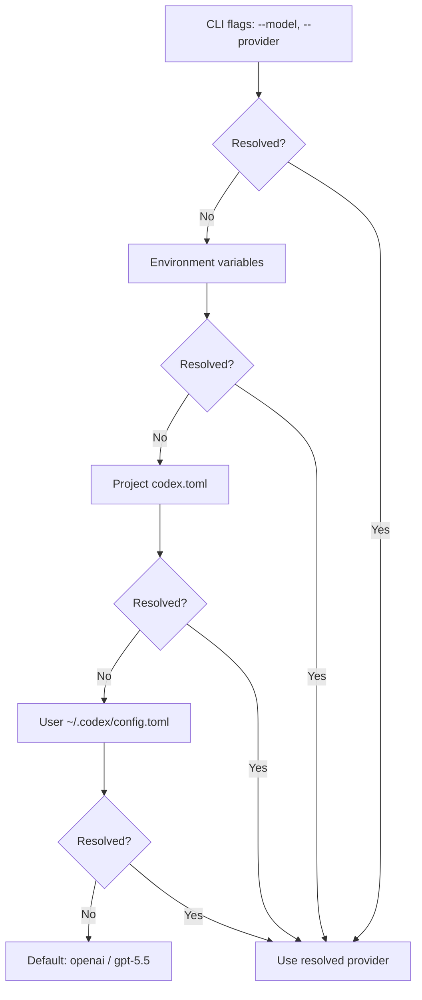
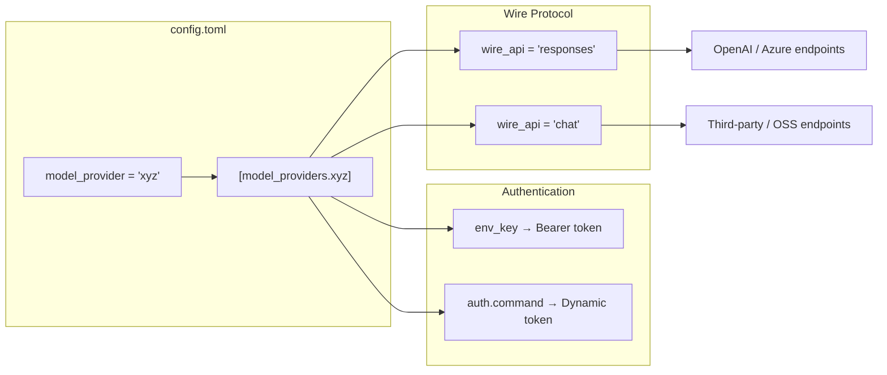

# Codex CLI Custom Model Providers: The Complete Configuration Guide


Codex CLI ships with three built-in providers — `openai`, `ollama`, and `lmstudio` — but the real power lies in its extensible provider framework[^1]. Since v0.122.0 introduced the provider runtime abstraction[^2], you can point Codex at any model service that speaks the Chat Completions or Responses API[^3]. This article covers every configuration key, authentication pattern, and production-ready provider recipe you need.

## How Provider Resolution Works

When Codex starts, it resolves the active model and provider through a strict precedence chain: CLI flags override environment variables, which override project-level `codex.toml`, which overrides the user-level `~/.codex/config.toml`[^4].



Two top-level keys control model selection[^5]:

```toml
model = "gpt-5.4"
model_provider = "proxy"
```

The `model_provider` value must match either a built-in ID or a key under `[model_providers.<id>]`. Custom providers cannot reuse the reserved IDs `openai`, `ollama`, or `lmstudio`[^1].

## Anatomy of a Custom Provider

Every custom provider lives under `[model_providers.<id>]` in your `config.toml`. Here is the complete set of configuration keys[^5][^1]:

| Key | Type | Description |
|-----|------|-------------|
| `name` | string | Human-readable display name |
| `base_url` | string | API endpoint base URL |
| `env_key` | string | Environment variable holding the API key |
| `env_key_instructions` | string | Setup guidance shown when the key is missing |
| `wire_api` | string | Protocol: `responses` or `chat` |
| `http_headers` | table | Static HTTP headers sent with every request |
| `env_http_headers` | table | Headers populated from environment variables |
| `query_params` | table | Extra query parameters appended to requests |
| `request_max_retries` | integer | HTTP retry count (default: 4) |
| `stream_max_retries` | integer | Streaming interruption retries (default: 5) |
| `stream_idle_timeout_ms` | integer | SSE idle timeout in ms (default: 300,000) |
| `supports_websockets` | boolean | Whether the provider supports WebSocket transport |
| `requires_openai_auth` | boolean | Whether to use OpenAI authentication flow |

### Wire API Selection

The `wire_api` key determines which API protocol Codex uses[^1]:

- **`responses`** — OpenAI's Responses API. Used by OpenAI's own endpoints and Azure OpenAI.
- **`chat`** — The Chat Completions API. Most third-party and open-source providers speak this protocol.

Getting this wrong is the single most common configuration mistake. If your provider returns 404 errors, check `wire_api` first.

## Authentication Patterns

### Static API Key via Environment Variable

The simplest pattern. Codex reads the named environment variable at runtime and sends it as a Bearer token[^1]:

```toml
[model_providers.mistral]
name = "Mistral AI"
base_url = "https://api.mistral.ai/v1"
env_key = "MISTRAL_API_KEY"
wire_api = "chat"
```

You never place API keys directly in `config.toml`. An `experimental_bearer_token` field exists but is explicitly discouraged[^5].

### Command-Based Authentication

For providers requiring dynamic tokens — OAuth flows, short-lived service account credentials, or secrets-manager integration — Codex supports command-backed auth[^1]:

```toml
[model_providers.internal.auth]
command = "/usr/local/bin/fetch-codex-token"
args = ["--audience", "codex"]
timeout_ms = 5000
refresh_interval_ms = 300000
```

The contract is straightforward: the command receives no stdin, writes the token to stdout (whitespace is trimmed), and exits. Codex calls it proactively at the `refresh_interval_ms` cadence rather than waiting for a 401[^1].

This mechanism is mutually exclusive with `env_key`, `experimental_bearer_token`, and `requires_openai_auth`[^5].

### Google Cloud ADC for Vertex AI

The command-based auth pattern is exactly how you wire up Google Cloud's Application Default Credentials. Issue #1106 tracks first-class Vertex AI support[^6], but today you can configure it as a custom provider using `gcloud` as the token source:

```toml
model = "gemini-2.5-pro"
model_provider = "vertex"

[model_providers.vertex]
name = "Google Vertex AI"
base_url = "https://us-central1-aiplatform.googleapis.com/v1/projects/YOUR_PROJECT/locations/us-central1/publishers/google/models"
wire_api = "chat"

[model_providers.vertex.auth]
command = "gcloud"
args = ["auth", "print-access-token"]
timeout_ms = 5000
refresh_interval_ms = 300000
```

Ensure you have run `gcloud auth application-default login` and enabled the Vertex AI API in your project[^6]. Set `GOOGLE_CLOUD_PROJECT` and `GOOGLE_CLOUD_LOCATION` in your shell environment for consistency.

⚠️ Note: Vertex AI is not yet a first-class built-in provider. The base URL path structure may vary depending on the model family and API version. Test with a simple completion before committing to a workflow.

## Production-Ready Provider Recipes

### Azure OpenAI

Azure uses the Responses API but requires an API version query parameter[^1]:

```toml
model = "gpt-5.4"
model_provider = "azure"

[model_providers.azure]
name = "Azure OpenAI"
base_url = "https://YOUR_RESOURCE.openai.azure.com/openai"
env_key = "AZURE_OPENAI_API_KEY"
query_params = { api-version = "2025-04-01-preview" }
wire_api = "responses"
request_max_retries = 4
stream_max_retries = 10
stream_idle_timeout_ms = 300000
```

The higher `stream_max_retries` value compensates for Azure's occasional mid-stream disconnections in high-traffic regions.

### Amazon Bedrock

Since v0.123.0, Bedrock has a built-in provider with AWS SigV4 signing[^2]. You do not need to define it manually — just set `model_provider = "amazon-bedrock"` and configure your AWS profile:

```bash
export AWS_PROFILE=codex-dev
export AWS_REGION=us-east-1
codex --model us.anthropic.claude-sonnet-4-20250514 --provider amazon-bedrock
```

### OpenAI Data Residency

For organisations with data residency requirements, override the default OpenAI endpoint with a region-specific URL[^1]:

```toml
model_provider = "openaidr"

[model_providers.openaidr]
name = "OpenAI Data Residency"
base_url = "https://eu.api.openai.com/v1"
wire_api = "responses"
```

Replace the `eu` prefix with your designated region (`us`, `eu`, etc.).

### LiteLLM Proxy for Multi-Provider Routing

LiteLLM acts as a unified gateway, translating Codex requests to any supported backend — Anthropic, Google AI Studio, Mistral, Cohere, or dozens more[^7]. This is the most flexible approach for teams that need to route across multiple providers without maintaining per-provider config.

Start the proxy:

```bash
docker run -v $(pwd)/litellm_config.yaml:/app/config.yaml \
  -p 4000:4000 \
  docker.litellm.ai/berriai/litellm:main-latest \
  --config /app/config.yaml
```

With a routing config like:

```yaml
model_list:
  - model_name: claude-sonnet
    litellm_params:
      model: anthropic/claude-sonnet-4-20250514
      api_key: os.environ/ANTHROPIC_API_KEY
  - model_name: gemini-flash
    litellm_params:
      model: gemini/gemini-2.5-flash
      api_key: os.environ/GEMINI_API_KEY

litellm_settings:
  drop_params: true
```

Then point Codex at it:

```toml
model = "claude-sonnet"
model_provider = "litellm"

[model_providers.litellm]
name = "LiteLLM Gateway"
base_url = "http://localhost:4000"
env_key = "LITELLM_API_KEY"
wire_api = "chat"
```

The `drop_params: true` setting in LiteLLM is critical — it filters out request parameters that the target provider does not recognise, preventing API errors when Codex sends OpenAI-specific fields[^7].

## Provider Configuration Flow



## Debugging Provider Issues

When a custom provider misbehaves, work through this checklist:

1. **Verify `wire_api`** — Third-party providers almost always need `chat`. OpenAI and Azure need `responses`.
2. **Check the base URL** — Some providers require a `/v1` suffix; others do not. Trailing slashes matter.
3. **Inspect auth** — Run your `auth.command` manually and verify the token output. Check that `env_key` points to a set variable.
4. **Enable verbose logging** — Run `codex --log-level debug` to see the full request/response cycle, including headers and endpoint URLs.
5. **Test streaming** — Some providers support completions but fail on SSE streaming. Increase `stream_idle_timeout_ms` or adjust retry counts.
6. **Confirm model name** — The `model` value in `config.toml` is passed directly to the provider. Azure uses deployment names; Vertex uses full model paths.

## Enterprise Considerations

For teams deploying Codex across an organisation:

- **Profile-scoped providers** — Use `[profiles.<name>]` sections to define per-environment provider overrides, letting developers switch between staging and production endpoints[^5].
- **Credentials store** — Set `cli_auth_credentials_store = "keyring"` to store tokens in the system keychain rather than plain files[^5].
- **Forced login method** — Restrict authentication to a specific flow with `forced_login_method = "chatgpt"` or `"api"` to enforce corporate SSO paths[^5].
- **Custom headers for audit** — Use `http_headers` or `env_http_headers` to inject correlation IDs, tenant identifiers, or compliance tags into every request[^1].

## Citations

[^1]: [Advanced Configuration – Codex CLI, OpenAI Developers](https://developers.openai.com/codex/config-advanced)
[^2]: [Changelog – Codex CLI, OpenAI Developers](https://developers.openai.com/codex/changelog) — v0.122.0 provider runtime abstraction, v0.123.0–0.124.0 Bedrock support
[^3]: [Models – Codex CLI, OpenAI Developers](https://developers.openai.com/codex/models)
[^4]: [Config basics – Codex CLI, OpenAI Developers](https://developers.openai.com/codex/config-basic)
[^5]: [Configuration Reference – Codex CLI, OpenAI Developers](https://developers.openai.com/codex/config-reference)
[^6]: [Feature: Implement Extensible Provider Framework & Add Google Vertex AI Support with ADC — Issue #1106, openai/codex](https://github.com/openai/codex/issues/1106)
[^7]: [OpenAI Codex — LiteLLM Documentation](https://docs.litellm.ai/docs/tutorials/openai_codex)
