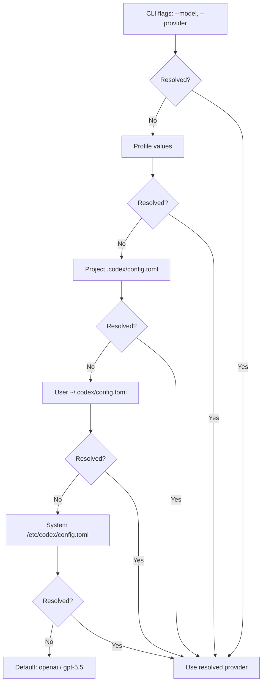
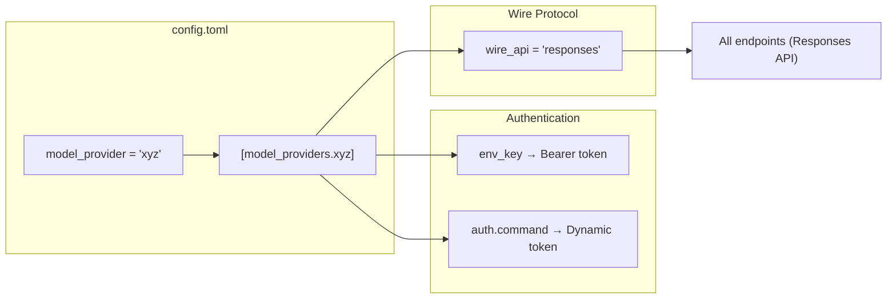

# Codex CLI Custom Model Providers: The Complete Configuration Guide


Codex CLI ships with three built-in providers, `openai`, `ollama` and `lmstudio`, but the real power is in its extensible provider framework[^1]. You can point Codex at any model service that speaks the Responses API[^3] by adding a block to `config.toml`. This guide covers every configuration key, authentication pattern and production-ready provider recipe.

> **Wire protocol change (February 2026):** Codex originally supported both the Chat Completions API (`wire_api = "chat"`) and the Responses API (`wire_api = "responses"`). Chat Completions support has been removed[^8]. All providers, including third-party and open-source endpoints, must now use the Responses API. If you find older guides recommending `wire_api = "chat"`, they are out of date.

## How provider resolution works

When Codex starts it resolves the active model and provider through a strict precedence chain: CLI flags override profile values, which override project-level `.codex/config.toml`, which overrides user-level `~/.codex/config.toml`, which overrides system-level `/etc/codex/config.toml`, which overrides built-in defaults[^4].



Two top-level keys control model selection[^5]:

```toml
model = "gpt-5.5"
model_provider = "proxy"
```

The `model_provider` value must match either a built-in ID or a key under `[model_providers.<id>]`. Custom providers cannot reuse the reserved IDs `openai`, `ollama` or `lmstudio`[^1].

## Anatomy of a custom provider

Every custom provider lives under `[model_providers.<id>]` in your `config.toml`. The complete set of configuration keys[^5][^1]:

| Key | Type | Description |
|-----|------|-------------|
| `name` | string | Human-readable display name |
| `base_url` | string | API endpoint base URL |
| `env_key` | string | Environment variable holding the API key |
| `env_key_instructions` | string | Setup guidance shown when the key is missing |
| `wire_api` | string | Protocol: `responses` (the only supported value since February 2026) |
| `http_headers` | table | Static HTTP headers sent with every request |
| `env_http_headers` | table | Headers populated from environment variables |
| `query_params` | table | Extra query parameters appended to requests |
| `request_max_retries` | integer | HTTP retry count (default: 4) |
| `stream_max_retries` | integer | Streaming interruption retries (default: 5) |
| `stream_idle_timeout_ms` | integer | SSE idle timeout in ms (default: 300,000) |
| `supports_websockets` | boolean | Whether the provider supports WebSocket transport |
| `requires_openai_auth` | boolean | Whether to use OpenAI authentication flow |

### Wire API

The `wire_api` key sets the API protocol Codex uses[^1]. Since February 2026 the only supported value is `responses`, the OpenAI Responses API[^8]. The previous `chat` option (Chat Completions API) has been removed.

Third-party providers must support the Responses API to work with Codex directly. Providers that only speak Chat Completions need a translation proxy such as LiteLLM (see below). If your provider returns 404 errors, confirm that it exposes the Responses API endpoint format.

## Authentication patterns

### Static API key via environment variable

The simplest pattern. Codex reads the named environment variable at runtime and sends it as a Bearer token[^1]:

```toml
[model_providers.mistral]
name = "Mistral AI"
base_url = "https://api.mistral.ai/v1"
env_key = "MISTRAL_API_KEY"
wire_api = "responses"
```

Never place API keys directly in `config.toml`. An `experimental_bearer_token` field exists but is explicitly discouraged[^5].

### Command-based authentication

For providers that need dynamic tokens, whether OAuth flows, short-lived service account credentials or secrets-manager integration, Codex supports command-backed auth[^1]:

```toml
[model_providers.internal.auth]
command = "/usr/local/bin/fetch-codex-token"
args = ["--audience", "codex"]
timeout_ms = 5000
refresh_interval_ms = 300000
```

The contract: the command receives no stdin, writes the token to stdout (whitespace is trimmed) and exits. Codex calls it proactively at the `refresh_interval_ms` cadence rather than waiting for a 401[^1].

This mechanism is mutually exclusive with `env_key`, `experimental_bearer_token` and `requires_openai_auth`[^5].

### Google Cloud ADC for Vertex AI

Command-based auth is how you wire up Google Cloud Application Default Credentials. Issue #1106 tracks first-class Vertex AI support[^6], but you can already configure it as a custom provider using `gcloud` as the token source:

```toml
model = "gemini-2.5-pro"
model_provider = "vertex"

[model_providers.vertex]
name = "Google Vertex AI"
base_url = "https://us-central1-aiplatform.googleapis.com/v1/projects/YOUR_PROJECT/locations/us-central1/publishers/google/models"
wire_api = "responses"

[model_providers.vertex.auth]
command = "gcloud"
args = ["auth", "print-access-token"]
timeout_ms = 5000
refresh_interval_ms = 300000
```

Run `gcloud auth application-default login` and enable the Vertex AI API in your project first[^6]. Set `GOOGLE_CLOUD_PROJECT` and `GOOGLE_CLOUD_LOCATION` in your shell for consistency.

Vertex AI is not yet a first-class built-in provider. The base URL path structure varies by model family and API version. Test with a single completion before committing to a workflow.

## Production-ready provider recipes

### Azure OpenAI

Azure uses the Responses API but needs an API version query parameter[^1]:

```toml
model = "gpt-5.5"
model_provider = "azure"

[model_providers.azure]
name = "Azure OpenAI"
base_url = "https://YOUR_RESOURCE.openai.azure.com/openai"
env_key = "AZURE_OPENAI_API_KEY"
query_params = { api-version = "2025-04-01-preview" }
wire_api = "responses"
request_max_retries = 4
stream_max_retries = 10
stream_idle_timeout_ms = 300000
```

The higher `stream_max_retries` value compensates for Azure's occasional mid-stream disconnections in high-traffic regions.

### Amazon Bedrock

Bedrock is a built-in provider with AWS SigV4 signing[^2]. You do not need to define it manually. Set `model_provider = "amazon-bedrock"` and configure your AWS profile:

```bash
export AWS_PROFILE=codex-dev
export AWS_REGION=us-east-1
codex --model us.anthropic.claude-sonnet-4-20250514 --provider amazon-bedrock
```

### OpenAI data residency

For organisations with data residency requirements, override the default OpenAI endpoint with a region-specific URL[^1]. OpenAI supports residency in the EU, US, UK, Canada, Japan, South Korea, Singapore, India, Australia and the UAE:

```toml
model_provider = "openaidr"

[model_providers.openaidr]
name = "OpenAI Data Residency"
base_url = "https://eu.api.openai.com/v1"
wire_api = "responses"
```

Replace the `eu` prefix with your designated region.

### LiteLLM proxy for multi-provider routing

LiteLLM (third-party, open-source) acts as a unified gateway, translating Codex requests to any supported backend: Anthropic, Google AI Studio, Mistral, Cohere and dozens more[^7]. This matters now that Codex requires the Responses API, because LiteLLM can translate Responses API requests into the native protocol of backends that do not yet support it.

Start the proxy:

```bash
docker run -v $(pwd)/litellm_config.yaml:/app/config.yaml \
  -p 4000:4000 \
  docker.litellm.ai/berriai/litellm:main-latest \
  --config /app/config.yaml
```

With a routing config:

```yaml
model_list:
  - model_name: claude-sonnet
    litellm_params:
      model: anthropic/claude-sonnet-4-20250514
      api_key: os.environ/ANTHROPIC_API_KEY
  - model_name: gemini-flash
    litellm_params:
      model: gemini/gemini-2.5-flash
      api_key: os.environ/GEMINI_API_KEY

litellm_settings:
  drop_params: true
```

Then point Codex at it:

```toml
model = "claude-sonnet"
model_provider = "litellm"

[model_providers.litellm]
name = "LiteLLM Gateway"
base_url = "http://localhost:4000"
env_key = "LITELLM_API_KEY"
wire_api = "responses"
```

The `drop_params: true` setting in LiteLLM is critical. It filters out request parameters the target provider does not recognise, preventing API errors when Codex sends OpenAI-specific fields[^7].

## Provider configuration flow



## Debugging provider issues

When a custom provider misbehaves, work through this checklist:

1. **Verify `wire_api`** — must be `responses`. If your provider only supports Chat Completions, route through a translation proxy such as LiteLLM.
2. **Check the base URL** — some providers need a `/v1` suffix; others do not. Trailing slashes matter.
3. **Inspect auth** — run your `auth.command` manually and verify the token output. Check that `env_key` points to a set variable.
4. **Enable verbose logging** — run `codex --log-level debug` to see the full request/response cycle, including headers and endpoint URLs.
5. **Test streaming** — some providers support completions but fail on SSE streaming. Increase `stream_idle_timeout_ms` or adjust retry counts.
6. **Confirm model name** — the `model` value in `config.toml` is passed directly to the provider. Azure uses deployment names; Vertex uses full model paths.

## Enterprise considerations

For teams deploying Codex across an organisation:

- **Profile-scoped providers** — use `[profiles.<name>]` sections to define per-environment provider overrides, letting developers switch between staging and production endpoints[^5].
- **Credentials store** — set `cli_auth_credentials_store = "keyring"` to store tokens in the system keychain rather than plain files[^5].
- **Forced login method** — restrict authentication to a specific flow with `forced_login_method = "chatgpt"` or `"api"` to enforce corporate SSO paths[^5].
- **Custom headers for audit** — use `http_headers` or `env_http_headers` to inject correlation IDs, tenant identifiers or compliance tags into every request[^1].

## Citations

[^1]: [Advanced Configuration, Codex CLI, OpenAI Developers](https://developers.openai.com/codex/config-advanced)
[^2]: [Changelog, Codex CLI, OpenAI Developers](https://developers.openai.com/codex/changelog)
[^3]: [Models, Codex CLI, OpenAI Developers](https://developers.openai.com/codex/models)
[^4]: [Config basics, Codex CLI, OpenAI Developers](https://developers.openai.com/codex/config-basic)
[^5]: [Configuration Reference, Codex CLI, OpenAI Developers](https://developers.openai.com/codex/config-reference)
[^6]: [Feature: Implement Extensible Provider Framework and Add Google Vertex AI Support with ADC, Issue #1106, openai/codex](https://github.com/openai/codex/issues/1106)
[^7]: [OpenAI Codex, LiteLLM Documentation](https://docs.litellm.ai/docs/tutorials/openai_codex)
[^8]: [Deprecating chat/completions support in Codex, Discussion #7782, openai/codex](https://github.com/openai/codex/discussions/7782)
