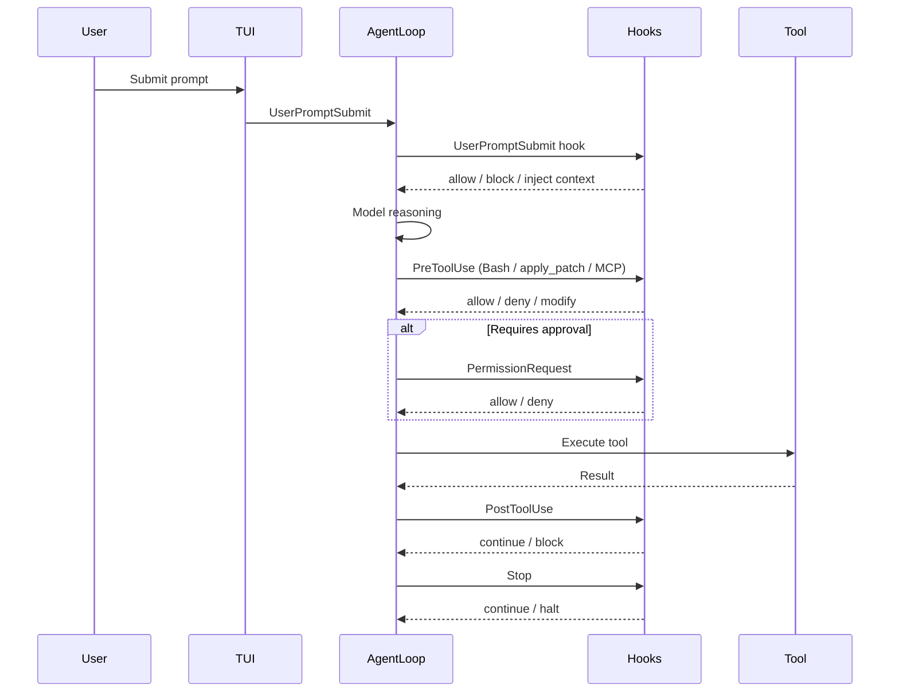
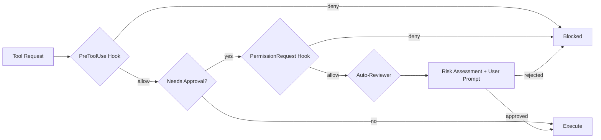

# Codex CLI Hooks Graduate to Stable: MCP Observation, Inline Config, and Auto-Review in v0.124


---

With the release of Codex CLI v0.124.0 on 23 April 2026, hooks have officially graduated from experimental to stable[^1]. This is not merely a label change — the release ships three substantive improvements that transform hooks from a Bash-only curiosity into a production-grade policy enforcement layer: **inline configuration in config.toml**, **observation of MCP tools and apply_patch**, and a new **automatic approval reviewer** that can evaluate approval requests before execution[^2].

If you have been deferring hook adoption because of the `[features] codex_hooks = true` requirement and the "under development" caveat, this is your green light.

## What Changed in v0.124.0

The v0.124.0 release changelog summarises the hooks changes in a single line: "Hooks marked as stable, configurable in config files, and expanded to observe MCP tools alongside apply_patch and Bash sessions"[^1]. Unpacking that line reveals three distinct improvements.

### 1. No More Feature Flag

Prior to v0.124, hooks required an explicit opt-in:

```toml
# No longer needed in v0.124.0+
[features]
codex_hooks = true
```

As of v0.124, hooks are enabled by default when a `hooks.json` file is discovered in an active config layer[^3]. The feature flag still exists for managed environments that need to *disable* hooks via `requirements.toml`, but the default has flipped.

### 2. MCP and apply_patch Observation

The most requested hooks enhancement — issue #16732, filed on 3 April 2026 — was that `ApplyPatchHandler` did not emit `PreToolUse` or `PostToolUse` events[^4]. The fix landed in PR #18391 within two days, parameterising `tool_name` in `hook_runtime.rs` and implementing payload methods on `ApplyPatchHandler`[^4].

v0.124 extends this further: hooks now fire for **MCP tool calls** alongside `apply_patch` and Bash sessions[^1]. This means a `PreToolUse` hook with a matcher like `"mcp__docs__search"` can intercept, audit, or block MCP tool invocations before they execute.

### 3. Inline Configuration in config.toml

Previously, hook definitions lived exclusively in `hooks.json` files discovered next to config layers[^3]. v0.124 adds support for inline hook configuration in `config.toml` and managed `requirements.toml`[^1]. This collapses what was a two-file setup into a single configuration surface.

## The Hook Event Lifecycle — Updated for v0.124



Six hook events remain unchanged from the experimental API[^3]:

| Event | Scope | Matcher | New in v0.124 |
|-------|-------|---------|---------------|
| `SessionStart` | Session | Source (`startup`, `resume`, `clear`) | `clear` source added |
| `PreToolUse` | Turn | Tool name | MCP + apply_patch matchers |
| `PermissionRequest` | Turn | Tool name | MCP + apply_patch matchers |
| `PostToolUse` | Turn | Tool name | MCP + apply_patch matchers |
| `UserPromptSubmit` | Turn | N/A | No change |
| `Stop` | Turn | N/A | No change |

The critical expansion is in the matcher column: where previously only `Bash` was a valid tool name for turn-scoped events, v0.124 accepts any registered tool name — including MCP tools (prefixed `mcp__<server>__<tool>`) and `apply_patch`[^1][^4].

## Practical Configuration Patterns

### Pattern 1: Audit All MCP Tool Calls

```json
{
  "hooks": {
    "PreToolUse": [
      {
        "matcher": "mcp__.*",
        "hooks": [
          {
            "type": "command",
            "command": "/usr/bin/python3 ~/.codex/hooks/audit_mcp.py",
            "statusMessage": "Auditing MCP call"
          }
        ]
      }
    ]
  }
}
```

The `audit_mcp.py` script receives the full tool input on stdin, including `tool_name` and `tool_input`, and can log to an audit trail or reject calls to specific MCP servers.

### Pattern 2: Block Dangerous apply_patch Operations

```json
{
  "hooks": {
    "PreToolUse": [
      {
        "matcher": "apply_patch",
        "hooks": [
          {
            "type": "command",
            "command": "/usr/bin/python3 ~/.codex/hooks/patch_guard.py",
            "statusMessage": "Reviewing patch"
          }
        ]
      }
    ]
  }
}
```

A patch guard script can parse the patch input from the hook payload, check for modifications to protected files (lockfiles, CI configs, `.env` files), and return a deny decision:

```python
#!/usr/bin/env python3
import json, sys

data = json.load(sys.stdin)
patch = data.get("tool_input", {}).get("patch", "")

PROTECTED = ["package-lock.json", ".github/workflows/", ".env"]
for path in PROTECTED:
    if path in patch:
        result = {
            "hookSpecificOutput": {
                "hookEventName": "PreToolUse",
                "permissionDecision": "deny",
                "permissionDecisionReason": f"Patch modifies protected path: {path}"
            }
        }
        json.dump(result, sys.stdout)
        sys.exit(0)

# Allow by default
sys.exit(0)
```

### Pattern 3: MCP Rate Limiting

For cost-sensitive environments, a `PostToolUse` hook can track MCP tool invocations and warn or halt when thresholds are exceeded:

```json
{
  "hooks": {
    "PostToolUse": [
      {
        "matcher": "mcp__.*",
        "hooks": [
          {
            "type": "command",
            "command": "/usr/bin/python3 ~/.codex/hooks/mcp_rate_limiter.py",
            "timeout": 10
          }
        ]
      }
    ]
  }
}
```

## The Auto-Review Capability

v0.124 introduces a new configuration key that complements hooks:

```toml
approvals_reviewer = "auto_review"
```

When set, an automatic reviewer agent evaluates approval requests before they surface to the user[^2]. The reviewer displays its risk assessment alongside the approval prompt in the TUI, enabling faster and more informed decisions.

This pairs naturally with hooks: a `PermissionRequest` hook can implement deterministic policy gates (e.g., "always deny `rm -rf`"), whilst the auto-reviewer handles the grey area of requests that pass hook checks but still warrant human awareness.



The layered architecture creates defence in depth: deterministic hooks first, probabilistic auto-review second, human judgement last[^5].

## Migration Guide: Experimental to Stable

If you have existing `hooks.json` files from the experimental era, the migration is minimal:

1. **Remove the feature flag** — delete `codex_hooks = true` from `[features]` in your `config.toml`. Hooks load automatically when `hooks.json` is present.

2. **Update matchers** — if you had hooks that only matched `Bash`, consider whether they should also match `apply_patch` or MCP tools. A hook that audits all command execution should now use `"Bash|apply_patch"` or even `".*"` to catch everything.

3. **Test with MCP tools** — if your hooks assume `tool_input.command` exists (valid for Bash), they will receive different payloads for MCP tools (`tool_input` varies by tool) and apply_patch (`tool_input.patch`). Add defensive parsing.

4. **Consider auto-review** — if your `PermissionRequest` hooks exist purely to surface information rather than enforce policy, `approvals_reviewer = "auto_review"` may replace them.

### Payload Differences by Tool Type

| Field | Bash | apply_patch | MCP Tool |
|-------|------|-------------|----------|
| `tool_name` | `"Bash"` | `"apply_patch"` | `"mcp__<server>__<tool>"` |
| `tool_input.command` | Shell command | ❌ | ❌ |
| `tool_input.patch` | ❌ | Diff content | ❌ |
| `tool_input.*` | ❌ | ❌ | Tool-specific fields |

## Enterprise Considerations

For managed environments using `requirements.toml`, hooks now participate in the configuration precedence chain[^6]:

1. **Cloud-managed requirements** (ChatGPT Business/Enterprise)
2. **macOS managed preferences** (MDM)
3. **System `requirements.toml`**
4. **User `config.toml`** (including inline hooks)
5. **Project `.codex/config.toml`** (trusted workspaces only)

Enterprise administrators can enforce hooks via managed configuration — for example, requiring an audit hook on all MCP tool calls — whilst still allowing teams to add project-specific hooks at lower precedence layers[^6].

The `requirements.toml` constraint mechanism ensures that security-critical hooks cannot be overridden by user or project configuration:

```toml
# Enterprise requirements.toml — enforced hooks
[features]
codex_hooks = true  # Cannot be disabled by users
```

## Performance Implications

Hook execution adds latency to every tool call. With hooks now firing for MCP tools and apply_patch in addition to Bash, the surface area for latency has expanded. Key mitigations:

- **Set aggressive timeouts** — the default 600-second timeout is far too generous for most hooks. Use `"timeout": 10` for simple policy checks[^3].
- **Multiple matching hooks run concurrently** — hooks from different config layers execute in parallel, so the critical path is the slowest individual hook, not the sum[^3].
- **Suppress output for pass-through hooks** — hooks that only audit (log and allow) should exit with code 0 and no stdout to minimise TUI noise.

## What Hooks Still Cannot Do

Despite the stable graduation, some limitations persist:

- **Write tool** — file writes via the Write tool do not yet emit hook events. Use apply_patch hooks as a partial substitute[^3].
- **WebSearch** — web search invocations are not interceptable[^3].
- **Undo** — `PostToolUse` hooks cannot reverse already-executed operations; they can only block further processing and provide feedback[^3].
- **Windows** — hook support on Windows remains temporarily disabled[^3].

⚠️ The Write tool gap is the most significant remaining limitation. Teams that need comprehensive file-write auditing should note that the model may use Write instead of apply_patch for certain operations, bypassing hook observation entirely.

## What This Means for Existing Hook Articles

The [complete hooks guide](/2026/04/15/codex-cli-hooks-complete-guide-events-policy-patterns/) published on 15 April 2026 remains the authoritative reference for hook architecture, the JSON wire protocol, and the six event types. This article supplements it with the v0.124 changes: stable status, expanded tool observation, and the auto-review integration.

The [compiled policy enforcement article](/2026/04/19/compiled-policy-enforcement-pcas-codex-hooks/) described how hooks could evolve towards deterministic Datalog-compiled policy enforcement. With MCP tool observation now in place, the practical gap between current hooks and the PCAS vision has narrowed — the interception points exist; what remains is the policy language.

## Citations

[^1]: [Codex CLI v0.124.0 Changelog](https://developers.openai.com/codex/changelog) — "Hooks marked as stable, configurable in config files, and expanded to observe MCP tools alongside apply_patch and Bash sessions." April 2026.

[^2]: [Codex CLI v0.124.0 Changelog](https://developers.openai.com/codex/changelog) — "An optional automatic reviewer agent can evaluate approval requests before execution, displaying review status and risk assessments in the app." April 2026.

[^3]: [Codex CLI Hooks Documentation](https://developers.openai.com/codex/hooks) — Official hooks reference covering events, matchers, payloads, and limitations.

[^4]: [GitHub Issue #16732: ApplyPatchHandler doesn't emit PreToolUse/PostToolUse hook event](https://github.com/openai/codex/issues/16732) — Filed by @mklikushin on 3 April 2026, fixed in PR #18391 on 5 April 2026.

[^5]: [Codex CLI Configuration Reference](https://developers.openai.com/codex/config-reference) — `approvals_reviewer` key documentation: `user | auto_review`.

[^6]: [Codex Managed Configuration](https://developers.openai.com/codex/enterprise/managed-configuration) — Enterprise requirements.toml precedence and constraint mechanism.
