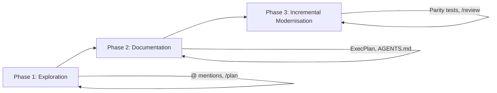
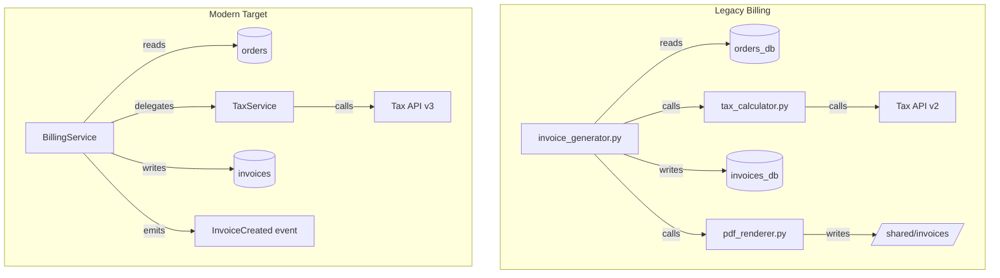
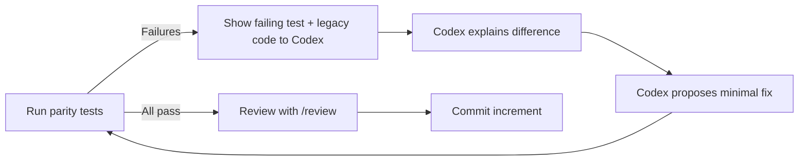

# Legacy Code Archaeology with Codex CLI: Understanding, Documenting, and Safely Modernising Unfamiliar Codebases


---

Every senior developer has faced it: a critical system written by people who left years ago, sparse documentation, no tests, and a business requirement to change it without breaking anything. AI coding agents have transformed this challenge. Gartner predicted that 40% of legacy modernisation projects would incorporate AI-assisted reverse engineering by 2026, up from under 10% in 2023[^1]. Codex CLI is particularly well-suited for this work because it operates directly in your terminal, reads your actual codebase, and can run commands to verify its understanding — all within a sandboxed environment that prevents accidental damage.

This article presents a structured methodology for using Codex CLI to explore, document, and incrementally modernise legacy codebases, drawing on OpenAI's official code modernisation cookbook[^2] and the codebase onboarding workflow[^3].

---

## The Three Phases of Code Archaeology

Legacy code work divides into three distinct phases, each with different Codex CLI techniques. Attempting to skip phases — jumping straight to refactoring without understanding, for example — is the primary cause of modernisation failures[^4].



---

## Phase 1: Exploration — Mapping the Unknown

### Initial Orientation

Start with a broad exploration prompt. Codex reads the project structure, identifies key entry points, and provides a high-level map. The official codebase onboarding workflow recommends this pattern[^3]:

```bash
codex --model gpt-5.5 --sandbox read-only
```

Using `read-only` sandbox mode is critical during exploration — it prevents Codex from modifying anything while it investigates. Once inside the session:

```
Explain how the request flows through this codebase. Include:
which modules own what, where data is validated, and top gotchas
to watch for before making changes. End with the files I should
read next.
```

### Targeted Deep Dives with @ Mentions

Once you have the high-level map, use `@` mentions to drill into specific modules without wasting context tokens on irrelevant files[^5]:

```
@src/billing/invoice_generator.py @src/billing/tax_calculator.py
Trace the invoice generation flow end to end. Identify:
1. Where business rules are encoded (vs configuration)
2. Which external services are called and what happens when they fail
3. Any implicit state dependencies between these modules
```

### Plan Mode for Complex Systems

For particularly tangled codebases, `/plan` mode helps structure the exploration before committing to any approach[^5]:

```
/plan
Map the dependency graph of the payment processing subsystem.
Identify circular dependencies, God classes, and modules that
violate single responsibility. Produce a prioritised list of
modules ranked by coupling and change frequency.
```

Plan mode presents Codex's exploration strategy before execution, letting you redirect it if it is heading down an unproductive path. Since v0.124.0, you can start implementation in a fresh context after planning, preserving your token budget for the actual work[^6].

### Running Existing Tests for Context

Codex can execute existing test suites to understand what the codebase actually does versus what the (possibly outdated) documentation claims:

```
Run the existing test suite and summarise:
- Which modules have test coverage and which do not
- What the tests actually verify (happy path only? edge cases?)
- Any tests that are currently failing or skipped
```

This is safe under `workspace-write` sandbox mode since test execution is read-only in practice. The results tell you which parts of the codebase have a safety net and which are flying blind.

---

## Phase 2: Documentation — Creating the Missing Map

### The AGENTS.md Bootstrap

Before generating documentation, create an `AGENTS.md` that encodes what you have learned so far. This prevents Codex from losing context across sessions and ensures other team members (or agents) benefit from your exploration[^5]:

```bash
codex /init
```

Then refine it with legacy-specific guidance:

```
Read the directory structure and refine AGENTS.md so it covers:
- The legacy stack and its conventions (naming, file layout, build system)
- Known tribal knowledge: which modules are fragile, which are stable
- Build, test, and lint commands
- Files and directories that must not be modified without approval
```

### The ExecPlan Pattern

OpenAI's code modernisation cookbook[^2] introduces the ExecPlan — a lightweight planning document that structures the entire modernisation effort. Create `.agent/PLANS.md` to define the format, then ask Codex to produce the first plan:

```
Create pilot_execplan.md following .agent/PLANS.md. Scope it to
the billing module. The plan should cover four outcomes:
- Inventory and diagrams
- Modernisation Technical Report content
- Target design and spec
- Test plan for parity
Use the ExecPlan skeleton with concrete references to actual
legacy files.
```

### Generating the Inventory

The inventory phase is where AI comprehension delivers its largest return. Thoughtworks' CodeConcise tool demonstrated a 66% reduction in reverse engineering time for COBOL modules — from six weeks to two per module[^7]. Codex CLI achieves similar acceleration for any language it can read:

```
Create billing_overview.md with "Inventory" and "Modernisation
Technical Report" sections.

Inventory includes:
1. All source files grouped by type (models, services, utilities, config)
2. Data sources read and written (databases, files, APIs)
3. External service dependencies with failure modes

Technical Report describes:
1. Business scenario in plain English
2. Detailed behaviour of each core module
3. Data model with field names and types
4. Technical risks: date handling, rounding, error codes, encoding
```

### Mermaid Diagrams for Architecture Visualisation

Ask Codex to produce architecture diagrams in Mermaid format. These render directly in GitHub, GitLab, and most documentation systems:



---

## Phase 3: Incremental Modernisation — The Strangler Fig Approach

### Why Incremental Matters

The strangler fig pattern — coined by Martin Fowler in 2004 — replaces legacy systems incrementally rather than through risky big-bang rewrites[^8]. A façade routes traffic between old and new implementations, allowing each migrated module to be validated independently. This approach maps naturally onto Codex CLI workflows.

### Validation-First Implementation

The cookbook emphasises scaffolding tests *before* implementation[^2]. This is the single most important discipline for safe legacy modernisation:

```
Using billing_validation.md, create tests/billing_parity_test.py.
Include placeholder assertions referencing test scenarios from the
validation plan. Do not assume the modern implementation exists yet.
```

Once tests are in place, ask Codex to generate the initial implementation:

```
Using billing_design.md and legacy programs from billing_overview.md,
generate implementation code under modern/billing/ that:
- Defines domain models for invoice records
- Implements core business logic in service classes
- Preserves legacy behaviour exactly (parity first, improvements later)
- Comments reference original legacy modules and line numbers
```

### The Parity Test Loop

After initial generation, use an iterative loop to converge on correct behaviour:



The prompt for each iteration:

```
Here is a failing parity test and the relevant legacy and modern code.
Explain why outputs differ and propose the smallest change to align
modern code with legacy behaviour. Show updated code and test adjustments.
```

### Using /review for Safety Gates

Before committing any modernised module, run Codex's built-in review[^5]:

```
/review Focus on: behavioural parity with legacy, error handling
completeness, and any assumptions about data formats that may not hold.
```

The v0.124.0 auto-review system can route eligible approval prompts through a reviewer agent automatically, adding a second pair of AI eyes before changes land[^6].

---

## Configuration for Legacy Work

### config.toml for Exploration Sessions

```toml
[codex]
model = "gpt-5.5"
model_reasoning_effort = "high"
approval_mode = "suggest"

# Legacy work benefits from high reasoning for accurate comprehension
[profiles.legacy-explore]
model_reasoning_effort = "high"
sandbox = "read-only"

[profiles.legacy-implement]
model_reasoning_effort = "medium"
sandbox = "workspace-write"
```

Use `codex -p legacy-explore` for Phase 1–2 and `codex -p legacy-implement` for Phase 3[^9].

### AGENTS.md Template for Legacy Projects

```markdown
# AGENTS.md — Legacy Modernisation

## Project Context
This is a legacy [language/framework] codebase dating from [year].
Original documentation is [sparse/missing/outdated].

## Conventions
- [Language-specific conventions observed in the codebase]
- [Naming patterns, file layout, build system details]

## Safety Rules
- NEVER modify files under src/legacy/ without explicit approval
- ALWAYS run parity tests after any change to modern/ code
- NEVER remove legacy code until parity tests pass at 100%

## Build & Test
- Legacy build: [command]
- Modern build: [command]
- Parity tests: [command]
- Full test suite: [command]

## Known Risks
- [Module X uses implicit global state — changes cascade unpredictably]
- [Date handling mixes timezone-aware and naive datetimes]
- [Tax calculations use banker's rounding — do not change to standard rounding]
```

---

## Accuracy Considerations

AI-assisted code comprehension is not infallible. Research indicates 85–95% accuracy for straightforward CRUD operations, dropping to 80–85% for complex business logic[^7]. Financial and regulatory code requires 100% subject-matter expert validation regardless of AI confidence.

Practical guardrails:

1. **Always verify AI-generated documentation against runtime behaviour** — run the code, inspect database queries, check API calls
2. **Use `/compact` strategically** — long exploration sessions accumulate context, but compaction may discard nuances discovered early in the session[^5]
3. **Cross-reference with git history** — `git log --follow` on key files reveals *why* code was written this way, not just *what* it does
4. **Mark uncertain claims** — instruct Codex to flag low-confidence assertions with ⚠️ so reviewers know where to focus validation effort

---

## Scaling the Pattern

Once one module is successfully modernised, the ExecPlan becomes a reusable template[^2]:

```
Using the billing pilot files, create template_modernisation_execplan.md
that teams can copy when modernising other modules. Include:
- Compliance with .agent/PLANS.md
- Placeholders for Overview, Inventory, MTR, Design, Validation
- Assumption of the same pattern: overview → design → validation → tests → implementation
```

This is where the compound value of Codex CLI's memory system becomes apparent. With `memories = true` in `config.toml`, stable patterns — naming conventions, common failure modes, preferred test structures — persist across sessions without re-prompting[^10].

---

## When to Use Codex CLI vs. Codex Cloud

| Scenario | Surface | Rationale |
|----------|---------|-----------|
| Initial exploration of a private codebase | **CLI** | Code stays local, sandbox prevents accidents |
| Parallel inventory of multiple modules | **Cloud** | Use `--attempts` for best-of-N module summaries |
| Implementing parity-tested replacements | **CLI** | Tight feedback loop with local test execution |
| Reviewing modernised code before merge | **CLI or GitHub** | `/review` locally, or `@codex review` on PRs |

---

## Key Takeaways

Legacy code archaeology with Codex CLI follows a disciplined three-phase approach: explore in read-only mode to understand before changing anything, document exhaustively with ExecPlans and inventories, and modernise incrementally with parity tests as the safety net. The temptation to skip straight to rewriting is strong — resist it. The documentation phase is where AI comprehension delivers its greatest value, turning months of reverse engineering into days of structured exploration.

⚠️ AI-generated code comprehension should always be validated against actual runtime behaviour, particularly for business-critical logic involving financial calculations, regulatory compliance, or implicit state dependencies.

---

## Citations

[^1]: Gartner, "Predicts 2024: AI Will Transform Software Engineering", cited in [Aspire Systems, "AI in Reverse Engineering Legacy Code"](https://www.aspiresys.com/blog/digital-software-engineering/agile-software-solutions/reverse-engineering-with-ai-will-generative-models-unravel-30-year-old-codebases/)
[^2]: OpenAI, ["Modernizing your Codebase with Codex"](https://developers.openai.com/cookbook/examples/codex/code_modernization), OpenAI Cookbook, 2026
[^3]: OpenAI, ["Understand large codebases — Codebase Onboarding"](https://developers.openai.com/codex/use-cases/codebase-onboarding), Codex Developer Docs, 2026
[^4]: Coder, ["AI-Assisted Legacy Code Modernization: A Developer's Guide"](https://coder.com/blog/ai-assisted-legacy-code-modernization-a-developer-s-guide), 2026
[^5]: OpenAI, ["Best practices"](https://developers.openai.com/codex/learn/best-practices), Codex Developer Docs, 2026
[^6]: OpenAI, ["Changelog — CLI 0.124.0"](https://developers.openai.com/codex/changelog), April 2026
[^7]: SoftwareSeni, ["Cutting Legacy Reverse Engineering Time by 66% with AI Code Comprehension"](https://www.softwareseni.com/cutting-legacy-reverse-engineering-time-by-66-with-ai-code-comprehension/), 2026
[^8]: Martin Fowler, ["StranglerFigApplication"](https://martinfowler.com/bliki/StranglerFigApplication.html), 2004
[^9]: OpenAI, ["Command line options"](https://developers.openai.com/codex/cli/reference), Codex CLI Reference, 2026
[^10]: OpenAI, ["Memories"](https://developers.openai.com/codex/memories), Codex Developer Docs, 2026
