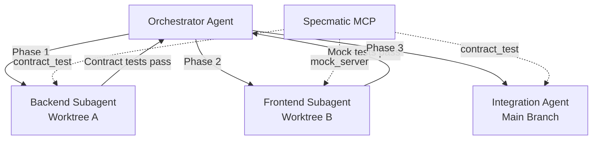

# Contract-Driven API Development with Codex CLI: Using Specmatic MCP for Spec-First Full-Stack Builds


---

Most agentic coding workflows suffer from the same failure mode: the agent generates code that compiles, passes its own tests, and drifts silently from the API contract you actually need. Contract-driven development (CDD) eliminates that drift by turning your OpenAPI specification into an executable, machine-enforceable guardrail — and the Specmatic MCP server makes those guardrails available to Codex CLI as first-class tools.[^1]

This article walks through the complete pipeline: configuring Specmatic MCP in Codex CLI, structuring a three-phase full-stack build, and wiring contract tests into your AGENTS.md so the agent cannot mark work as complete until the specification passes.

---

## Why Contracts Matter More with Agents

When a human developer builds an API endpoint, they typically have the specification open in a browser tab and cross-reference manually. When Codex builds that same endpoint, it relies on whatever context is in the conversation window. Without an enforced contract, three things go wrong predictably:

1. **Schema drift** — the agent invents response fields that look plausible but diverge from the spec[^2]
2. **Missing edge cases** — boundary conditions (empty arrays, null fields, invalid enums) go untested until integration[^3]
3. **Frontend/backend mismatch** — parallel development produces two implementations of different contracts

Contract-driven development resolves all three by making the OpenAPI specification the single source of truth and executing it as a test suite continuously during development.[^4]

---

## The Specmatic MCP Server

Specmatic is an open-source contract testing tool that converts OpenAPI, AsyncAPI, gRPC, and GraphQL specifications into executable tests and mock servers.[^5] The Specmatic MCP server exposes these capabilities as Model Context Protocol tools that Codex CLI can call during its agent loop.[^1]

### Available Tools

| MCP Tool | Purpose |
|----------|---------|
| `run_contract_test` | Validates a running API against the OpenAPI spec |
| `run_resiliency_test` | Sends boundary-condition and malformed payloads |
| `manage_mock_server` | Starts, stops, and lists mock servers from the spec |
| `backward_compatibility_check` | Detects breaking changes via git diff (npm only) |

The critical insight: these tools run *outside* the agent's sandbox. Specmatic validates independently, so the agent cannot game its own tests.[^1]

---

## Setting Up Specmatic MCP in Codex CLI

### Prerequisites

You need Node.js (stable), a Java Runtime Environment, and Git installed on the machine running Codex CLI.[^6]

### Adding the Server

The quickest path uses the Codex MCP CLI:

```bash
codex mcp add specmatic -- npx specmatic-mcp
```

This registers a STDIO-based MCP server in your global `~/.codex/config.toml`.[^7] For project-scoped configuration, create `.codex/config.toml` in your repository root:

```toml
[mcp_servers.specmatic]
command = "npx"
args = ["specmatic-mcp"]
startup_timeout_sec = 30
tool_timeout_sec = 120
required = true
```

Setting `required = true` means Codex CLI will refuse to start a session if Specmatic fails to initialise — a deliberate safety net for contract-first workflows.[^7]

### Docker Alternative

For teams that prefer containerised tooling or lack a local JRE:

```toml
[mcp_servers.specmatic]
command = "docker"
args = [
  "run", "--rm", "--network=host",
  "-v", "./:/app",
  "-w", "/app",
  "specmatic/specmatic-mcp"
]
startup_timeout_sec = 45
required = true
```

The `--network=host` flag is mandatory — without it, the mock server and contract tests cannot reach `localhost` services started by the agent.[^6]

---

## The Three-Phase Build

The Specmatic team's reference architecture splits full-stack development into three phases, each with different guardrails.[^1] This maps cleanly onto Codex CLI's agent loop.

```mermaid
flowchart LR
    subgraph Phase1["Phase 1: Backend"]
        A[OpenAPI Spec] --> B[Implement Endpoints]
        B --> C[Contract Tests]
        C -->|Fail| B
        C -->|Pass| D[Resiliency Tests]
        D -->|Fail| B
        D -->|Pass| E[Backend Complete]
    end

    subgraph Phase2["Phase 2: Frontend"]
        F[Start Mock Server] --> G[Build UI Components]
        G --> H[Playwright Tests vs Mock]
        H -->|Fail| G
        H -->|Pass| I[Frontend Complete]
    end

    subgraph Phase3["Phase 3: Integration"]
        J[Stop Mock Server] --> K[Connect to Real Backend]
        K --> L[E2E Tests]
        L -->|Fail| M[Fix Issues]
        M --> L
        L -->|Pass| N[Ship It]
    end

    E --> F
    I --> J
```



### Phase 1: Backend Implementation

The agent implements API endpoints while continuously running contract and resiliency tests via MCP tools. The acceptance criterion is explicit: *both* `run_contract_test` and `run_resiliency_test` must pass before the agent moves on.[^1]

A well-structured prompt:

```
Implement the backend API in backend/ according to products_api.yaml.
After each endpoint, call the Specmatic MCP run_contract_test tool.
When all contract tests pass, run run_resiliency_test.
Do NOT mark the backend as complete until both test suites pass with zero failures.
```

### Phase 2: Frontend Development

The agent starts a Specmatic mock server from the same OpenAPI spec, then builds the frontend against it. The mock server returns schema-compliant responses using the examples defined in the specification, giving the agent deterministic data to develop and test against.[^1]

```
Start the Specmatic mock server for products_api.yaml using manage_mock_server.
Build the React frontend in frontend/ consuming the mock at http://localhost:9001.
Use Playwright to verify each UI component renders correctly against mock data.
Do NOT stop the mock server until all Playwright tests pass.
```

### Phase 3: Integration

The mock server stops, the frontend reconfigures to target the real backend, and end-to-end tests execute. This phase catches any remaining mismatches that survived the contract-enforced development phases.[^1]

---

## AGENTS.md for Contract-First Workflows

Your AGENTS.md bridges the gap between the OpenAPI specification and the agent's execution policy. Here is a template for a contract-driven project:

```markdown
# Project Instructions

## API Contract

The single source of truth is `products_api.yaml` at the repository root.
All API implementations MUST pass Specmatic contract and resiliency tests.
Do NOT modify the OpenAPI spec without explicit approval.

## Backend Rules

- Framework: Express.js with TypeScript
- Run `run_contract_test` after implementing each endpoint group
- Run `run_resiliency_test` after all endpoints pass contract tests
- Handle all error codes defined in the OpenAPI spec
- Return exactly the response schemas specified — no extra fields

## Frontend Rules

- Framework: React with TypeScript
- Always develop against the Specmatic mock server, not the real backend
- Use `manage_mock_server` to start/stop mocks
- All API calls go through a single `apiClient.ts` module

## Completion Criteria

A feature is complete when:
1. All Specmatic contract tests pass
2. All Specmatic resiliency tests pass
3. All Playwright E2E tests pass against the real backend
4. No TypeScript compilation errors
```

This structure means the agent has unambiguous acceptance criteria at every phase. Combined with Codex CLI's `suggest` approval mode, you review the diffs while the contract tests enforce correctness.[^8]

---

## Practical Patterns

### Pattern 1: Backward Compatibility Guard

When evolving an existing API, use the `backward_compatibility_check` tool before committing spec changes:

```bash
codex exec "Review the changes to products_api.yaml and run \
backward_compatibility_check to verify no breaking changes. \
Report any violations." \
--full-auto -o compatibility-report.txt
```

This catches field removals, type changes, and dropped required properties before they reach CI.[^6]

### Pattern 2: Parallel Subagent Architecture

For larger APIs, split the work across subagents using Codex CLI's worktree support:



Each subagent has its own Specmatic MCP instance scoped to its worktree. The orchestrator merges only when both subagents report passing contracts.[^9]

### Pattern 3: CI Pipeline with Structured Output

Use `codex exec` with `--output-schema` to produce machine-readable compliance reports:

```bash
codex exec "Run all Specmatic contract and resiliency tests against \
the staging deployment. Summarise results." \
--output-schema ./schemas/compliance-report.json \
--full-auto -o report.json
```

Where `compliance-report.json` defines:

```json
{
  "type": "object",
  "properties": {
    "contract_tests_passed": { "type": "boolean" },
    "resiliency_tests_passed": { "type": "boolean" },
    "failures": {
      "type": "array",
      "items": {
        "type": "object",
        "properties": {
          "endpoint": { "type": "string" },
          "method": { "type": "string" },
          "error": { "type": "string" }
        }
      }
    },
    "summary": { "type": "string" }
  },
  "required": ["contract_tests_passed", "resiliency_tests_passed", "failures", "summary"]
}
```

Downstream pipeline steps parse `report.json` to gate deployments.[^10]

### Pattern 4: Spec Evolution with Spec-Kit

For teams where the OpenAPI specification evolves alongside features rather than being fully designed upfront, Specmatic provides a spec-kit approach. Each feature analyses existing contracts for reuse before extending the API, ensuring backward compatibility throughout.[^11]

This maps naturally to a Codex CLI workflow where each feature branch starts with:

```
Analyse the existing OpenAPI spec for endpoints that could serve
this feature's requirements. Only add new endpoints or fields
if no existing contract covers the need. Run backward_compatibility_check
after any spec modifications.
```

---

## What Contract Testing Does Not Catch

Contract tests verify structural compliance: correct status codes, valid response schemas, proper error formats. They do not verify:

- **Business logic correctness** — an endpoint that returns `200` with the wrong calculation still passes the contract[^3]
- **Performance characteristics** — response time, throughput, and resource consumption require separate tooling
- **Security vulnerabilities** — authentication bypass, injection attacks, and authorisation failures need dedicated security testing

⚠️ Contract testing is a necessary but not sufficient layer. Pair it with unit tests for business logic, load tests for performance, and security scanning for vulnerabilities.

---

## Supported Specification Formats

While this article focuses on OpenAPI, Specmatic's MCP server supports multiple specification formats:[^5]

| Format | Contract Testing | Mock Server | Backward Compatibility |
|--------|-----------------|-------------|----------------------|
| OpenAPI (YAML/JSON) | ✅ | ✅ | ✅ |
| AsyncAPI | ✅ | ✅ | ✅ |
| gRPC (proto) | ✅ | ✅ | ✅ |
| GraphQL | ✅ | ✅ | ✅ |
| WSDL | ✅ | ✅ | ✅ |
| Arazzo | ✅ | — | — |

This means the same MCP-based workflow applies to event-driven architectures (AsyncAPI), internal microservices (gRPC), and public APIs (GraphQL) with minimal configuration changes.

---

## Comparison with Traditional Approaches

| Approach | Contract Source | When Validated | Agent Awareness |
|----------|----------------|----------------|-----------------|
| Manual review | Human reads spec | After PR | None |
| Postman/Newman | Collection files | CI only | None |
| Consumer-driven (Pact) | Consumer expectations | CI only | None |
| **Specmatic MCP + Codex** | **OpenAPI spec** | **During development** | **Full — via MCP tools** |

The key differentiator is *when* validation happens. With Specmatic MCP, the agent validates continuously during its development loop, catching drift within seconds rather than after a CI run that may take minutes.[^4]

---

## Getting Started

1. **Add the MCP server**: `codex mcp add specmatic -- npx specmatic-mcp`
2. **Write your OpenAPI spec** with realistic examples in the `examples` field
3. **Create an AGENTS.md** with explicit contract-passing completion criteria
4. **Start a session**: `codex "Build the backend for api-spec.yaml. Run contract tests after each endpoint."`
5. **Review diffs** while Specmatic enforces correctness

The Specmatic MCP sample project at `specmatic/specmatic-mcp-sample` on GitHub provides a working reference implementation with a Products API, React frontend, and Express backend.[^12]

---

## Citations

[^1]: Specmatic, "Specmatic MCP as guardrails for Coding Agents: API Spec to Full Stack implementation in minutes," [specmatic.io](https://specmatic.io/updates/specmatic-mcp-as-guardrails-for-coding-agents-api-spec-to-full-stack-implementation-in-minutes/), April 2026.

[^2]: Chowdhury et al., "From Industry Claims to Empirical Reality: Evaluating Code Review Agents," arXiv:2604.03196, April 2026. Demonstrates 60% noise rate in agent-generated reviews without structural constraints.

[^3]: Ivanov, Rana, Prabhakaran, "Can Coding Agents be General Agents?" arXiv:2604.13107, April 2026. Documents business-logic silent failures in agentic workflows.

[^4]: Specmatic, "Contract Driven Development," [docs.specmatic.io](https://docs.specmatic.io/contract_driven_development), accessed April 2026.

[^5]: Specmatic, "Ship AI-Ready APIs 10x Faster," [specmatic.io](https://specmatic.io/), accessed April 2026. Supports OpenAPI, AsyncAPI, gRPC, GraphQL, WSDL, and Arazzo specifications.

[^6]: specmatic/specmatic-mcp-server, GitHub repository, [github.com/specmatic/specmatic-mcp-server](https://github.com/specmatic/specmatic-mcp-server), accessed April 2026.

[^7]: OpenAI, "Model Context Protocol – Codex," [developers.openai.com/codex/mcp](https://developers.openai.com/codex/mcp), accessed April 2026.

[^8]: OpenAI, "CLI – Codex," [developers.openai.com/codex/cli](https://developers.openai.com/codex/cli), accessed April 2026.

[^9]: OpenAI, "Features – Codex CLI," [developers.openai.com/codex/cli/features](https://developers.openai.com/codex/cli/features), accessed April 2026. Covers worktree and subagent patterns.

[^10]: OpenAI, "Non-interactive mode – Codex," [developers.openai.com/codex/noninteractive](https://developers.openai.com/codex/noninteractive), accessed April 2026. Documents `--output-schema` for structured JSON output.

[^11]: specmatic/specmatic-mcp-sample-with-spec-kit, GitHub repository, [github.com/specmatic/specmatic-mcp-sample-with-spec-kit](https://github.com/specmatic/specmatic-mcp-sample-with-spec-kit), accessed April 2026.

[^12]: specmatic/specmatic-mcp-sample, GitHub repository, [github.com/specmatic/specmatic-mcp-sample](https://github.com/specmatic/specmatic-mcp-sample), accessed April 2026.
