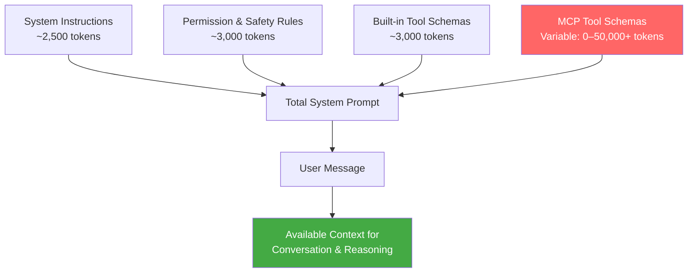
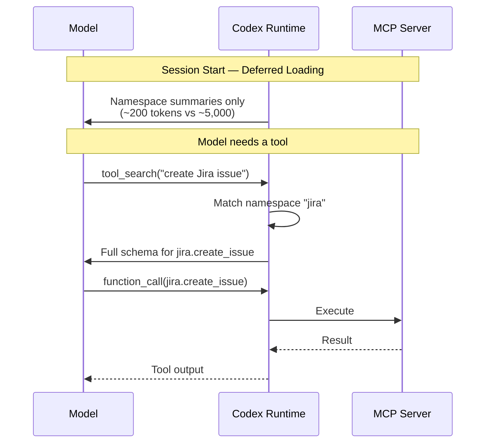

# MCP Schema Bloat and System Prompt Tax: Performance Impact of Tool Definitions


---

## The Hidden Cost of Every Tool You Register

Every MCP server you connect to Codex CLI injects its full tool manifest — JSON schemas with parameter descriptions, type annotations, enum constraints, and nested object definitions — into the model's context window at session start. This injection happens before your first message, before any file context, before any reasoning. It is the **system prompt tax**: the tokens you pay for capability you may never use.

A recent benchmark on an NVIDIA GB10 measured Codex CLI's total prompt overhead at **25,450 tokens** — nearly three times the expected 8,500-token baseline[^1]. The cause was a single globally-configured MCP server (tessl) contributing approximately 17,000 tokens of tool schemas to every session, regardless of whether those tools were invoked. On a 128K context window, that is 20% of available context consumed before the conversation begins.

This article quantifies the problem, explains why it matters differently for cloud and local models, and presents concrete mitigation strategies available in Codex CLI today.

## Anatomy of MCP Tool Schema Overhead

### How Tool Definitions Enter the Context

When Codex CLI starts a session, it constructs a system prompt comprising several layers:



The first three components are relatively fixed — approximately 8,500 tokens for Codex CLI's baseline prompt[^1]. The MCP component is unbounded and user-controlled. Each MCP server contributes its entire `tools/list` response as serialised JSON Schema definitions.

### What a Single Tool Costs

A typical MCP tool definition consumes 150–400 tokens depending on parameter complexity. Consider a Jira MCP server's `create_issue` tool:

```json
{
  "name": "create_issue",
  "description": "Create a new Jira issue with specified fields",
  "inputSchema": {
    "type": "object",
    "properties": {
      "project": { "type": "string", "description": "Project key (e.g. ENG)" },
      "summary": { "type": "string", "description": "Issue title" },
      "description": { "type": "string", "description": "Issue body in ADF" },
      "issueType": { "type": "string", "enum": ["Bug", "Story", "Task", "Epic"] },
      "priority": { "type": "string", "enum": ["Highest", "High", "Medium", "Low", "Lowest"] },
      "assignee": { "type": "string", "description": "Account ID of assignee" },
      "labels": { "type": "array", "items": { "type": "string" } },
      "components": { "type": "array", "items": { "type": "string" } }
    },
    "required": ["project", "summary", "issueType"]
  }
}
```

That single tool consumes approximately 250 tokens. A Jira MCP server typically exposes 15–25 tools. At 250 tokens each, that is 3,750–6,250 tokens per server — and most teams connect multiple servers.

### Real-World Overhead Measurements

Community measurements and benchmark data paint a consistent picture:

| Configuration | MCP Token Overhead | Total Prompt Overhead | % of 128K Context |
|---|---|---|---|
| No MCP servers | 0 | ~8,500 | 6.6% |
| 2 tools (Context7) | ~2,522 characters (~390 tokens)[^2] | ~8,900 | 7.0% |
| 1 server (tessl, globally enabled) | ~17,000[^1] | ~25,450 | 19.9% |
| 5 enterprise servers (58 tools) | ~55,000[^3] | ~63,500 | 49.6% |

The five-server enterprise configuration — not an edge case but a representative production setup — consumes nearly half the context window before any user interaction[^3]. At that point, the model is reasoning in a context already crowded with tool schemas it will never reference in 95% of interactions.

## Why Schema Bloat Hurts: Three Compounding Costs

### 1. Prefill Latency on Dense Models

For cloud API models (o3, o4-mini), prefill cost is absorbed by the provider's infrastructure and reflected primarily in billing. For local models, prefill latency is directly visible.

Dense models process every token in the context through all parameters. On the NVIDIA GB10 benchmark, Codex CLI with 25,450 tokens of overhead took **569 seconds** for a coding task with Gemma 4 31B Dense, versus Pi's **266 seconds** with approximately 600 tokens of overhead — a 2.1× speedup directly attributable to lower prefill cost[^1].

Mixture-of-Experts (MoE) models largely neutralise this effect because they route tokens through a fraction of their parameters (3–4B active out of 26–80B total), making prefill cost per token dramatically lower[^1]. But dense models — including many popular local options — pay the full price.

```mermaid
graph LR
    subgraph Dense Model — 31B active
        A1[25K prompt tokens] -->|31B params each| B1[High prefill cost]
    end
    subgraph MoE Model — 3B active
        A2[25K prompt tokens] -->|3B params each| B2[Low prefill cost]
    end

    style B1 fill:#f66,color:#fff
    style B2 fill:#4a4,color:#fff
```

### 2. Token Spend and Cost

Every token of MCP schema in the prompt is billed as an input token on every API call. With prompt caching, the static portion (including tool schemas) benefits from cache-hit pricing — approximately 50% reduction on cached tokens[^4]. But the tokens still count against context limits, and cache misses (which occur on the first turn, after compaction, and after session forks) pay full price.

For a team running 50 Codex sessions per day with a 5-server MCP configuration:

- **55,000 extra tokens × 50 sessions = 2.75M tokens/day** of MCP overhead
- At o4-mini input pricing (\$1.10/M tokens cached, \$2.50/M uncached), that is \$3–7/day in pure overhead[^5]
- At o3 pricing (\$2.50/M cached, \$10.00/M uncached), that is \$7–27/day

These are not large absolute numbers, but they are tokens that produce zero value — the model reads 55,000 tokens of tool schemas to potentially use 2–3 tools per session.

### 3. Reasoning Quality Degradation

The "lost-in-the-middle" phenomenon is well-documented: models perform worse at retrieving and reasoning about information buried in lengthy contexts[^6]. When 50% of the context window is occupied by tool schemas, the model's ability to attend to the actual conversation, code context, and task instructions is measurably degraded.

Community reports confirm that agents using more than three MCP servers begin confusing similar tool signatures and hallucinating parameter values[^3]. This is not a model capability issue — it is a context pollution issue.

## Mitigation Strategies

### Strategy 1: Audit and Disable Unused MCP Servers

The highest-impact optimisation is the simplest: remove MCP servers you are not actively using from your configuration.

```toml
# Before: global config with unused servers
[mcp_servers.github]
command = "gh-mcp-server"

[mcp_servers.jira]
command = "jira-mcp-server"

[mcp_servers.slack]
command = "slack-mcp-server"

[mcp_servers.confluence]
command = "confluence-mcp-server"

[mcp_servers.database]
url = "http://localhost:3100/mcp"
```

```toml
# After: only what this project actually needs
[mcp_servers.github]
command = "gh-mcp-server"
args = ["--repo", "myorg/myrepo"]

[mcp_servers.database]
url = "http://localhost:3100/mcp"
enabled_tools = ["query", "describe_table", "list_tables"]
```

The Pi benchmark showed that disabling the tessl MCP server would have saved approximately 17,000 tokens — more than the entire difference between Codex's default and minimal system prompts[^1].

### Strategy 2: Use `enabled_tools` to Curate Tool Subsets

Most MCP servers expose their full capability surface. You rarely need all of it. The `enabled_tools` configuration key lets you whitelist only the tools you actually use:

```toml
[mcp_servers.github]
command = "gh-mcp-server"
enabled_tools = ["create_issue", "list_issues", "create_pull_request", "get_file_contents"]
# Excludes: list_repos, search_code, manage_labels, manage_milestones, etc.
```

OpenAI's guidance recommends keeping each namespace to fewer than 10 tools for optimal performance[^7]. If your MCP server exposes dozens, `enabled_tools` is essential.

### Strategy 3: Leverage Deferred Loading (GPT-5.4+ Models)

Codex CLI v0.121.0 introduced tool search with deferred loading for GPT-5.4+ models[^8]. When MCP tool descriptions exceed 10% of the context window, Codex automatically defers them — injecting only high-level namespace descriptions upfront and letting the model discover individual tool schemas on demand via `tool_search`.



This reduces upfront overhead by an estimated 47% for tool-heavy configurations[^2]. The trade-off: deferred loading adds one extra round-trip when a tool is first used in a session. For most workflows, this latency is negligible compared to the savings.

**Important:** Deferred loading requires GPT-5.4+ models. If you are using o3, o4-mini, or local models via Ollama, tools are always loaded directly. For these models, strategies 1 and 2 are your primary levers.

### Strategy 4: Use Skills Instead of MCP for Stable Workflows

Agent Skills implement progressive disclosure — the opposite of MCP's eager loading[^3]. At session start, only skill metadata loads (~80 tokens per skill). The full skill body (~2,000 tokens median) loads only when the model determines it is relevant.

```
100 MCP tools at ~250 tokens each     = ~25,000 tokens upfront
100 Skills at ~80 tokens metadata each = ~8,000 tokens upfront
                                         (full bodies load on demand)
```

For stable, well-defined workflows — deployment pipelines, code review policies, project-specific conventions — Skills are dramatically more context-efficient than equivalent MCP tool sets[^3]. Reserve MCP for genuinely dynamic, remote-first integrations (databases, issue trackers, cloud APIs) where the tool surface changes independently of your agent configuration.

### Strategy 5: Profile-Scoped MCP Configuration

Different tasks need different tools. Use Codex CLI's profile system to scope MCP servers to the workflows that actually need them:

```toml
# Default profile — minimal MCP
[profile.default]
model = "o4-mini"

[profile.default.mcp_servers.github]
command = "gh-mcp-server"

# Data work profile — adds database tools
[profile.data]
model = "o3"

[profile.data.mcp_servers.github]
command = "gh-mcp-server"

[profile.data.mcp_servers.database]
url = "http://localhost:3100/mcp"

# Full enterprise profile — all servers
[profile.enterprise]
model = "o3"

[profile.enterprise.mcp_servers.github]
command = "gh-mcp-server"

[profile.enterprise.mcp_servers.jira]
command = "jira-mcp-server"

[profile.enterprise.mcp_servers.confluence]
command = "confluence-mcp-server"
```

Switch profiles with `codex --profile data` to load only the MCP servers relevant to your current task.

### Strategy 6: Local Model Users — Disable MCP Entirely for Speed

If you are running Codex CLI against local models via Ollama and your primary concern is speed, consider disabling MCP servers entirely for coding-focused sessions. The Pi benchmark demonstrated that MCP schema overhead dominated performance differences more than system prompt size[^1].

```toml
# Local model profile — no MCP overhead
[profile.local]
model = "ollama/qwen3.6:35b-a3b"
# No mcp_servers section — zero overhead from tools
```

For local models, every token of overhead translates directly to prefill latency. The 17,000-token saving from disabling MCP is equivalent to roughly 100ms of additional latency per turn on a GB10-class device with a dense 31B model.

## Measuring Your Own Overhead

To audit your current MCP token overhead, use the `/mcp` TUI command during a session to list all registered tools. Count them and estimate:

```
Estimated MCP overhead ≈ (number of tools) × 250 tokens
```

For precise measurement, inspect the first API request using Codex CLI's `--trace` flag or OTEL export to see the exact prompt token count at session start[^9]. Compare this against the baseline ~8,500 tokens to determine your MCP inflation factor.

## The Broader Picture: Tool Registries Need Progressive Disclosure

The MCP schema bloat problem is not unique to Codex CLI — it affects every agent framework that consumes MCP servers. The fundamental issue is that MCP's `tools/list` response dumps every tool's complete schema upfront, with no built-in mechanism for lazy loading or pagination[^10].

The MCP specification (2025-06-18 revision) includes `listChanged` notifications for dynamic tool surfaces, but no pagination or partial-load capability[^10]. The deferred loading mechanism in Codex CLI (via `tool_search`) is a client-side workaround, not a protocol-level solution.

Several Specification Enhancement Proposals (SEPs) have been filed to address this — including tool grouping, conditional tool exposure based on task context, and server-side relevance filtering[^11]. Until these land in the protocol, the mitigation burden falls on practitioners to curate their tool surfaces manually.

## Key Takeaways

| Lever | Token Savings | Effort | Availability |
|---|---|---|---|
| Disable unused MCP servers | 5,000–17,000+ per server | Low | All versions |
| `enabled_tools` whitelisting | 30–70% per server | Low | v0.119.0+ |
| Deferred loading | ~47% of MCP overhead | None (automatic) | GPT-5.4+ only |
| Skills instead of MCP | Up to 90% for stable workflows | Medium | v0.121.0+ |
| Profile-scoped MCP | Varies by profile | Medium | All versions |
| Disable MCP for local models | 100% of MCP overhead | Low | All versions |

The system prompt tax is real, measurable, and — for most configurations — unnecessarily high. Audit your MCP servers, curate your tool surfaces, and match your tool loading strategy to your model architecture. The tokens you save are tokens available for actual reasoning.

---

## Citations

[^1]: Vaughan, D. "Does Pi Outperform Codex CLI for Local Models? A Harness Comparison on the NVIDIA GB10." *codex-resources*, 19 April 2026. Measured 25,450-token overhead with MCP vs 8,500-token baseline. <https://danielvaughan.github.io/codex-resources/articles/2026-04-19-does-pi-outperform-codex-cli-for-local-models/>

[^2]: GitHub Issue #9266. "Add MCP search tool, lazy MCP load, reduce MCP tool occupying context." Community measurement of Context7 tool overhead at 2,522 characters. <https://github.com/openai/codex/issues/9266>

[^3]: MCPJam Blog. "Progressive Disclosure Might Replace MCP." 2026. Empirical measurement of 55,000-token overhead for five-server enterprise MCP configurations. <https://www.mcpjam.com/blog/claude-agent-skills>

[^4]: OpenAI. "Prompt Caching — API Documentation." Cached input tokens billed at 50% discount. <https://platform.openai.com/docs/guides/prompt-caching>

[^5]: OpenAI. "Codex CLI Pricing." April 2026 pricing for o3 and o4-mini models. <https://platform.openai.com/pricing>

[^6]: Liu, N. F. et al. "Lost in the Middle: How Language Models Use Long Contexts." *Transactions of the Association for Computational Linguistics*, 2024. <https://arxiv.org/abs/2307.03172>

[^7]: OpenAI. "Tool Search — API Documentation." Recommendation of fewer than 10 tools per namespace. <https://developers.openai.com/api/docs/guides/tools-tool-search>

[^8]: Codex CLI Changelog. "v0.121.0 Release Notes." Tool search with deferred loading for MCP servers. <https://developers.openai.com/codex/changelog>

[^9]: Vaughan, D. "Codex CLI Observability: OpenTelemetry Traces, Metrics, and Production Monitoring." *codex-resources*, 20 April 2026. OTEL export for prompt token measurement. <https://danielvaughan.github.io/codex-resources/articles/2026-04-20-codex-cli-observability-opentelemetry-traces-metrics-production-monitoring/>

[^10]: Model Context Protocol Specification. "Tools — Server Features." Revision 2025-06-18. `tools/list` returns complete tool definitions with no pagination. <https://spec.modelcontextprotocol.io/specification/2025-06-18/server/tools/>

[^11]: Vaughan, D. "MCP Tool Annotations: A Risk Vocabulary for Codex CLI." *codex-resources*, 12 April 2026. Coverage of SEP-1075 and related specification enhancement proposals. <https://danielvaughan.github.io/codex-resources/articles/2026-04-12-mcp-tool-annotations-risk-vocabulary-codex-cli/>
