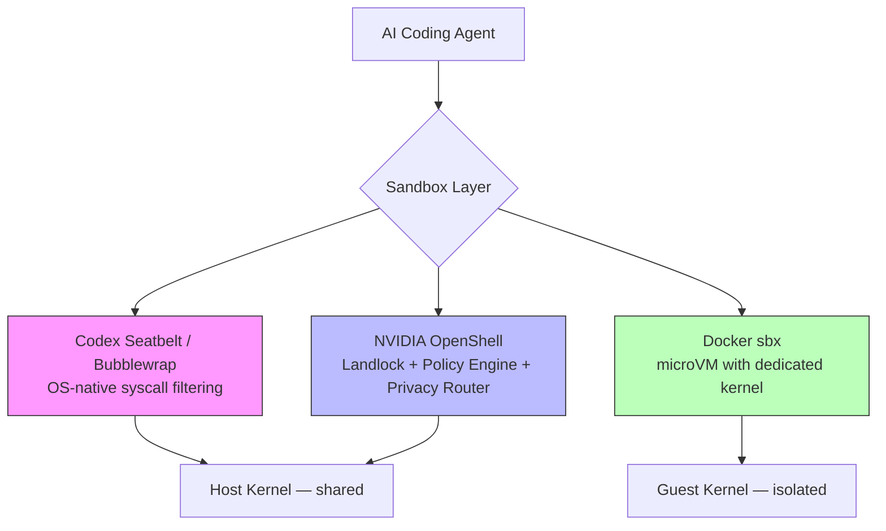
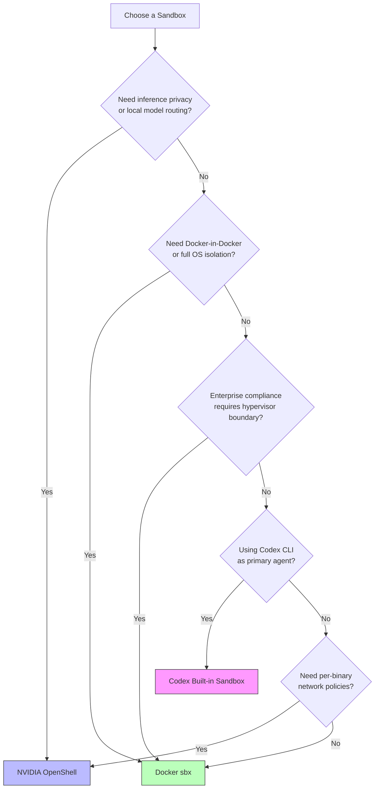
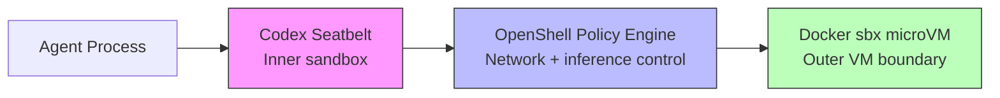

# Agent Sandbox Comparison Matrix: Codex Seatbelt vs NVIDIA OpenShell vs Docker sbx


---

Autonomous coding agents need guardrails. Give a model unrestricted shell access and it will eventually `rm -rf` something you care about, exfiltrate credentials through a network call, or install a compromised package. The three leading sandbox approaches for terminal-based coding agents — Codex CLI's built-in Seatbelt/Bubblewrap sandbox, NVIDIA OpenShell, and Docker Sandboxes (`sbx`) — solve this problem at fundamentally different layers of the stack.

This article provides a technical comparison matrix, examines the architectural trade-offs, and offers guidance on which approach fits your team's threat model.

## Architectural Overview

Each sandbox targets a different isolation boundary:



**Codex CLI** enforces restrictions at the syscall level using platform-native primitives — no virtualisation overhead, but coarser isolation granularity [^1]. **NVIDIA OpenShell** adds a policy engine and privacy router atop kernel-level Landlock/seccomp enforcement [^2]. **Docker sbx** runs each agent in a dedicated microVM with its own Linux kernel, providing the strongest isolation boundary at the cost of higher resource consumption [^3].

## Platform-Specific Mechanisms

### Codex CLI: Seatbelt, Bubblewrap, and Restricted Tokens

Codex CLI implements sandbox enforcement natively on each platform without requiring external runtimes [^1]:

| Platform | Mechanism | Key Primitives |
|----------|-----------|----------------|
| macOS | Seatbelt | `sandbox-exec` with dynamic SBPL profiles |
| Linux/WSL2 | Bubblewrap + Landlock + Seccomp | Namespace isolation, filesystem Landlock rules, syscall filtering |
| Windows | Restricted Tokens | `CodexSandboxOffline`/`CodexSandboxOnline` local accounts with ACL-managed access [^4] |

On macOS, Codex spawns commands through `/usr/bin/sandbox-exec` with a dynamically generated Sandbox Profile Language (SBPL) script [^5]. The base profile is modified at runtime based on the active permission mode. Writable roots are enumerated explicitly, with `.git` directories forced read-only to prevent repository corruption.

On Linux, the defence-in-depth approach layers multiple primitives [^5]:

```bash
# Bubblewrap constructs a restricted filesystem view
bwrap \
  --ro-bind / / \                    # Read-only root
  --bind /home/dev/project /home/dev/project \  # Writable workspace
  --unshare-user \                   # Isolated user namespace
  --unshare-pid \                    # Isolated PID namespace
  --unshare-net \                    # Network namespace isolation
  -- your-command
```

Seccomp filters then block dangerous syscalls including `ptrace`, `io_uring_*`, and network operations (`connect`, `bind`, `listen`) except `AF_UNIX` sockets needed for internal proxy communication [^5].

### Configuration

Codex sandbox behaviour is controlled through `config.toml` [^6]:

```toml
# ~/.codex/config.toml
sandbox_mode = "workspace-write"
approval_policy = "on-request"

[sandbox_workspace_write]
network_access = false
writable_roots = ["/home/dev/project"]

[permissions.restricted.network.domains]
"api.openai.com" = "allow"
"*" = "deny"
```

Three permission modes govern agent autonomy [^1]:

- **read-only** — inspection only; all modifications require approval
- **workspace-write** — read globally, write within declared roots, run safe commands (default)
- **danger-full-access** — no filesystem or network boundaries

### NVIDIA OpenShell: Policy Engine + Privacy Router

OpenShell, open-sourced and announced at GTC 2026 alongside NemoClaw [^7], implements out-of-process policy enforcement through three components:

1. **Sandbox** — isolated execution environment using Landlock filesystem restrictions and seccomp syscall filtering [^2]
2. **Policy Engine** — evaluates actions at binary, destination, method, and path level [^2]
3. **Privacy Router** — routes inference to local open-weight models by default, sending to frontier models (Claude, GPT) only when policy permits [^2]

The declarative YAML policy is the primary control mechanism [^8]:

```yaml
version: "1.0"

filesystem_policy:
  include_workdir: true
  read_only:
    - /usr
    - /lib
    - /proc
    - /etc
  read_write:
    - /sandbox
    - /tmp

network_policies:
  - binary: curl
    host: api.github.com
    port: 443
    methods: [GET, HEAD, OPTIONS]
    action: allow
  - binary: "*"
    host: "*"
    action: deny

process:
  allow_setuid: false
  seccomp_profile: strict
```

A key architectural distinction: filesystem and process policies are **static** — locked at sandbox creation time. Network and inference policies are **dynamic** — hot-reloadable via `openshell policy set` without restarting the sandbox [^8]. This separation lets security teams update network allowlists without disrupting running agents.

OpenShell supports unmodified coding agents including Claude Code, Codex CLI, and OpenCode [^2], and scales from a single NVIDIA RTX workstation to enterprise GPU clusters with identical deny-by-default semantics [^2].

### Docker sbx: microVM Isolation

Docker Sandboxes, launched in March 2026 [^3], take the most aggressive isolation approach: each agent runs in a lightweight **microVM** with its own dedicated Linux kernel rather than sharing the host kernel [^9].

```bash
# Launch Codex CLI in a Docker sandbox
sbx run codex

# Launch with custom memory and branch isolation
sbx run claude --memory 8g --branch feature/refactor

# List running sandboxes
sbx ls
```

Each sandbox receives its own Docker daemon, filesystem, and network stack [^3]. The agent can build containers, install packages, and modify files freely — none of it touches the host.

Network isolation operates at three configurable levels [^9]:

| Level | Behaviour |
|-------|-----------|
| **Open** | All traffic permitted |
| **Balanced** | Allowlist for AI services, package managers, code repositories, cloud infra |
| **Locked Down** | Deny-all with manual allowlisting |

A **credential proxy** injects API keys via authentication headers without exposing them inside the VM — keys never enter the sandbox filesystem [^9]. This is particularly valuable for teams managing multiple API credentials across different providers.

Supported agents include Claude Code, Codex CLI, Copilot, Gemini CLI, Kiro, OpenCode, and Docker Agent [^3].

## Comparison Matrix

| Dimension | Codex Seatbelt/Bubblewrap | NVIDIA OpenShell | Docker sbx |
|-----------|---------------------------|------------------|------------|
| **Isolation boundary** | Syscall/namespace | Syscall/namespace + policy engine | microVM (own kernel) |
| **Kernel sharing** | Shared with host | Shared with host | Dedicated guest kernel |
| **Setup overhead** | Zero (built-in) | `pip install openshell` or container | `sbx` CLI install |
| **Boot time** | Negligible | Seconds | Seconds (microVM spin-up) |
| **Memory overhead** | Minimal | Low–moderate | Moderate–high (full VM) [^9] |
| **Filesystem control** | Glob-based read/write rules | Path-level Landlock rules | Full VM filesystem isolation |
| **Network control** | Binary allow/deny [^10] | Per-binary, per-host, per-method | Three-tier allowlist model |
| **Credential protection** | Env var sanitisation [^5] | Privacy router | Credential proxy injection [^9] |
| **Policy format** | TOML (`config.toml`) | Declarative YAML | CLI flags + config |
| **Hot-reload policies** | Requires restart | Network/inference: yes; FS/process: no [^8] | Requires sandbox restart |
| **Multi-platform** | macOS, Linux, Windows | Linux only | macOS, Linux [^3] |
| **Escape difficulty** | Kernel exploit required | Kernel exploit required | Hypervisor exploit required |
| **Docker-in-Docker** | Not supported | Possible with policy | Native (own daemon) [^9] |
| **Enterprise audit** | Session logs | Full allow/deny audit trail [^2] | Sandbox lifecycle logs |
| **Inference privacy** | None (all calls to cloud) | Privacy router (local-first) [^2] | None (passthrough) |

## Decision Framework



### Use Codex CLI's built-in sandbox when

- Codex CLI is your primary agent and you want zero-configuration security
- Your threat model is "prevent accidental damage" rather than "defend against adversarial model behaviour"
- You need cross-platform support (macOS, Linux, Windows)
- Minimal resource overhead matters — CI runners, developer laptops

### Use NVIDIA OpenShell when

- You need granular, per-binary network policies (e.g., `curl` may reach `api.github.com` but not arbitrary hosts)
- Inference privacy is critical — routing sensitive code context to local models by default
- Your compliance framework requires auditable allow/deny decision logs
- You run multiple different agents and want a unified policy layer

### Use Docker sbx when

- Your threat model includes adversarial model behaviour requiring hypervisor-level isolation
- Agents need Docker-in-Docker capabilities (building containers, running integration tests)
- You want complete filesystem isolation with no possibility of host contamination
- Enterprise compliance mandates VM-level boundaries

## Layering Sandboxes

These approaches are not mutually exclusive. A defence-in-depth strategy might combine them:



Running Codex CLI inside a Docker sandbox (`sbx run codex`) gives you the built-in Seatbelt/Bubblewrap restrictions *plus* microVM isolation [^3]. Adding OpenShell policies on top provides granular network filtering and inference routing. Each layer catches what the others miss.

## Known Limitations

**Codex Seatbelt**: Network control is binary — allow all or deny all. There is no domain-level filtering at the sandbox layer [^10]. The Windows sandbox has reported issues with the unified exec PTY path bypassing enforcement [^4]. macOS Homebrew operations require special handling within Seatbelt profiles.

**NVIDIA OpenShell**: Linux-only as of April 2026. Static filesystem policies require sandbox recreation to modify, which can disrupt long-running agent sessions [^8]. The privacy router adds latency to inference calls when routing decisions are complex.

**Docker sbx**: Performance overhead can be significant — one technical review noted it can be "crippling" for even simple projects [^9]. Commit signing integration with tools like 1Password's SSH agent remains problematic. Memory defaults to 50% of host RAM, which may be excessive for lightweight tasks.

## Conclusion

There is no single "best" sandbox — only the right fit for your threat model, compliance requirements, and operational constraints. Codex CLI's built-in sandbox delivers the lowest friction path for individual developers. OpenShell excels at enterprise policy enforcement with inference privacy. Docker sbx provides the strongest isolation boundary when you need VM-level guarantees.

For most teams, the pragmatic starting point is Codex CLI's built-in sandbox with `workspace-write` mode, graduating to Docker sbx or OpenShell as your agent autonomy — and the corresponding risk surface — increases.

## Citations

[^1]: [Sandbox – Codex | OpenAI Developers](https://developers.openai.com/codex/concepts/sandboxing)
[^2]: [Run Autonomous, Self-Evolving Agents More Safely with NVIDIA OpenShell | NVIDIA Technical Blog](https://developer.nvidia.com/blog/run-autonomous-self-evolving-agents-more-safely-with-nvidia-openshell/)
[^3]: [Docker Sandboxes | Docker Docs](https://docs.docker.com/ai/sandboxes/)
[^4]: [Windows sandbox bypass issue | openai/codex #14367](https://github.com/openai/codex/issues/14367)
[^5]: [Sandboxing Implementation | openai/codex | DeepWiki](https://deepwiki.com/openai/codex/5.6-sandboxing-implementation)
[^6]: [Configuration Reference – Codex | OpenAI Developers](https://developers.openai.com/codex/config-reference)
[^7]: [How Autonomous AI Agents Become Secure by Design With NVIDIA OpenShell | NVIDIA Blog](https://blogs.nvidia.com/blog/secure-autonomous-ai-agents-openshell/)
[^8]: [Customize Sandbox Policies | NVIDIA OpenShell](https://docs.nvidia.com/openshell/latest/sandboxes/policies)
[^9]: [Running AI agents safely in a microVM using docker sandbox | Andrew Lock](https://andrewlock.net/running-ai-agents-safely-in-a-microvm-using-docker-sandbox/)
[^10]: [A deep dive on agent sandboxes | Pierce Freeman](https://pierce.dev/notes/a-deep-dive-on-agent-sandboxes)
