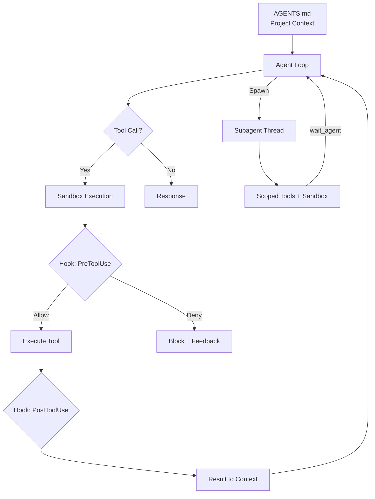
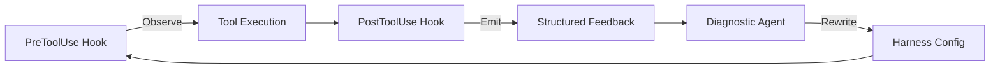

# Automated Harness Synthesis: What AgentFlow's Typed Graph DSL Means for Codex CLI Orchestration


Two independent research papers dropped within 48 hours of each other in late April 2026, and together they crystallise a thesis that practitioners have felt for months: **the harness matters more than the weights**. When you hold the language model constant and change only the surrounding orchestration — roles, prompts, tools, communication topology, retry logic — success rates swing by several-fold[^1]. This article unpacks the research, maps its five architectural dimensions onto Codex CLI's existing primitives, and explores what a formalised harness DSL could mean for the platform's future.

## The Two Papers

### AgentFlow: Synthesizing Multi-Agent Harnesses for Vulnerability Discovery

Liu et al. (UC Santa Barbara, Fuzzland, UC San Diego) introduced **AgentFlow**, a typed graph DSL whose search space jointly covers agent roles, prompts, tools, communication topology, and coordination protocol[^1]. An outer optimisation loop proposes harness programs, executes them, scores the results, and diagnoses failures using four runtime feedback channels: test verdicts, stdout/stderr, line/branch coverage (via LLVM instrumentation), and sanitiser reports[^1].

Results speak for themselves: AgentFlow reached **84.3 %** on TerminalBench-2, 2.9 points above ForgeCode and 7.9 above Meta-Harness[^1]. More dramatically, a synthesised harness pointed at Chromium (35+ million lines of C/C++) discovered ten zero-day vulnerabilities in Google Chrome, including two Critical sandbox-escape CVEs (CVE-2026-5280, CVE-2026-6297)[^1].

### Architectural Design Decisions in AI Agent Harnesses

Hu Wei's empirical study examined 70 publicly available agent-system projects and identified five recurring design dimensions: **subagent architecture**, **context management**, **tool systems**, **safety mechanisms**, and **orchestration**[^2]. The corpus froze on 23 March 2026 and achieved 94 % inter-rater agreement on a 21 % audit sample[^2].

Five architectural patterns emerged: Lightweight Tool (21.4 %), Balanced CLI Framework (25.7 %), Multi-Agent Orchestrator (31.4 %), Scenario-Verticalized (11.4 %), and Enterprise Full-Featured (10.0 %)[^2]. Codex CLI sits squarely in the Balanced CLI Framework cluster today, but its recent feature trajectory — plugins, subagents, hooks — pushes it toward the Multi-Agent Orchestrator pattern.

## Codex CLI Already Has an Informal Harness

Strip away the academic terminology and you realise that Codex CLI already exposes four of AgentFlow's five harness dimensions through its existing configuration surface:

| AgentFlow Dimension | Codex CLI Primitive | Configuration Surface |
|---|---|---|
| Agent set (A) | Subagents, skills, plugins | `agents.max_threads`, `agents.max_depth`, `/skills`, `@plugin` |
| Communication topology (G) | Subagent spawning and thread routing | `spawn_agent` / `wait_agent` / `send_input`[^3] |
| Tool allocation (Phi) | MCP servers, per-profile tool surfaces | `config.toml` `[mcp]`, `.mcp.json`, skill `agents/openai.yaml`[^4] |
| Safety mechanisms (Psi) | Approval policies, hooks, sandbox | `ask-for-approval`, hooks (`PreToolUse`/`PostToolUse`), `linux-sandbox`[^5] |
| Coordination protocol | ⚠️ Implicit only | Sequential by default; parallel via explicit multi-agent spawn |

The missing piece is **coordination protocol as a first-class, declarative primitive**. Today, orchestration logic lives in natural-language prompts and AGENTS.md files rather than in a typed, machine-verifiable specification.

## The Five Dimensions Mapped to Codex CLI

### 1. Subagent Architecture

Codex CLI spawns specialised agents on explicit request[^3]. The `/agent` slash command lets users switch between active threads, and configuration caps (`agents.max_threads`, `agents.max_depth`) prevent resource exhaustion[^3]. Subagents inherit the parent's sandbox policy with live runtime overrides[^3].

In AgentFlow terms, each subagent is a **node** with a role label, prompt template, model identifier, and tool allocation. Codex's current architecture supports this structurally but configures it imperatively — you describe what you want in prose and the agent loop interprets it.

### 2. Context Management

Hu Wei's study found that hybrid context designs (27.1 %) and file-based persistence (22.9 %) dominate, with pure prompt-window systems accounting for just 4.3 %[^2]. Codex CLI uses a hybrid approach: AGENTS.md files provide persistent project context (up to 32 KiB by default)[^6], the append-only conversation history feeds the prompt window, and auto-compaction manages token budgets when context grows large.

The three-tier AGENTS.md hierarchy — global (`~/.codex/`), project root, and subdirectory overrides — maps directly to AgentFlow's concept of **scoped prompt templates** that refine guidance as you descend into subsystems[^6].

### 3. Tool Systems

Registry-based tool registration dominates at 34.3 % of studied projects, with MCP-first approaches at 14.3 %[^2]. Codex CLI sits in the MCP-first camp since v0.122, supporting both `mcpServers` and top-level server maps in `.mcp.json`[^4]. The plugin system bundles skills, apps, and MCP servers into shareable packages[^4].

AgentFlow's **tool allocation** dimension (Phi) assigns specific tools to specific agents. Codex CLI achieves this through per-profile MCP configurations and skill-level `agents/openai.yaml` manifests that scope tool surfaces per subagent type.

### 4. Safety Mechanisms

Process-level separation is the modal safety pattern at 45 % of projects studied[^2], and Codex CLI's `linux-sandbox` (bubblewrap) places it firmly in this category. The hooks system, now stable in v0.124.0[^5], adds observation points at `PreToolUse` and `PostToolUse` — including MCP tool calls and `apply_patch` operations[^5]. The `auto_review` approval reviewer routes eligible prompts through reviewer agents before execution[^5].

This layered defence (sandbox + hooks + approval policies + audit logs) maps to what Hu Wei categorises as the **Enterprise Full-Featured** safety pattern, even though the rest of Codex CLI's architecture remains in the Balanced CLI Framework cluster.

### 5. Orchestration

Here lies the gap. AgentFlow's typed graph DSL represents orchestration as a **directed graph** with:

- **Standard dataflow edges** (agent A's output flows to agent B's input)
- **Guarded edges** that fire conditionally on success or failure
- **Fan-out operators** that clone agents into parallel copies

Codex CLI's orchestration is currently imperative: the agent loop sequentially processes tool calls, and parallelism requires explicit multi-agent spawning[^3]. There is no declarative graph — the "harness" lives in AGENTS.md prose, skill definitions, and hook configurations stitched together by the agent loop's interpretation of natural language.



## What a Codex CLI Harness DSL Could Look Like

If Codex CLI adopted AgentFlow's principles, a harness definition might look something like this:

```toml
# Hypothetical codex-harness.toml — NOT current syntax

[harness]
name = "security-audit"
coordination = "fan-out-then-merge"

[[harness.agents]]
role = "coordinator"
prompt_template = "agents/coordinator.md"
tools = ["read_file", "spawn_agent"]

[[harness.agents]]
role = "static-analyser"
prompt_template = "agents/static-analysis.md"
tools = ["read_file", "bash"]
fan_out = 4  # parallel copies

[[harness.agents]]
role = "reviewer"
prompt_template = "agents/reviewer.md"
tools = ["read_file", "apply_patch"]

[[harness.edges]]
from = "coordinator"
to = "static-analyser"
schema = "file-list"

[[harness.edges]]
from = "static-analyser"
to = "reviewer"
guard = "findings.count > 0"
schema = "finding-report"
```

This hypothetical format makes several things machine-verifiable that are currently ambiguous in prose:

- **Type safety**: template variables must resolve to upstream outputs
- **Connectivity**: every agent must be reachable from the entry point
- **Resource bounds**: fan-out counts and nesting depth are explicit, not inferred

AgentFlow's type-checking validator rejected approximately 20 % of proposed harnesses before expensive execution[^1] — the same class of errors that currently manifest as silent failures or confused agent behaviour in hand-written AGENTS.md orchestration.

## The Feedback Loop Gap

Perhaps AgentFlow's most powerful innovation is its **diagnostic feedback loop**. Rather than optimising on coarse pass/fail signals, it reads structured runtime data — coverage reports, sanitiser output, test verdicts — to diagnose *why* a harness configuration failed and *which component* caused the failure[^1].

Codex CLI's hooks system provides the observation points needed for this pattern:



Today, this loop is manual — a developer reviews hook output, interprets failures, and adjusts AGENTS.md or skill configurations by hand. The AgentFlow research suggests this could be automated: a meta-agent that reads hook telemetry, diagnoses harness-level failures, and proposes configuration changes.

The existing OTEL integration (traces and metrics export) provides the telemetry infrastructure[^7], and the plugin system provides the packaging mechanism[^4]. What's missing is the closed-loop optimiser that connects them.

## Practical Implications for Codex CLI Users Today

While a formal harness DSL remains hypothetical, the research offers immediately actionable insights:

### Structure Your AGENTS.md as a Proto-Harness

Treat AGENTS.md not as a free-form instruction dump but as a structured harness specification:

```markdown
## Agent Roles
- **Implementer**: writes code, runs tests
- **Reviewer**: reads diffs, checks style and correctness
- **Integrator**: runs full test suite, checks for regressions

## Communication Protocol
1. Implementer produces a patch
2. Reviewer examines the patch (blocks on style violations)
3. Integrator runs integration tests
4. On failure: route diagnostic back to Implementer with test output

## Tool Allocation
- Implementer: bash, apply_patch, read_file
- Reviewer: read_file only (no write access)
- Integrator: bash (test commands only)
```

### Use Hooks as Observation Points

Configure `PostToolUse` hooks to emit structured JSON that a downstream agent (or your own CI tooling) can parse:

```toml
# config.toml
[hooks.post_tool_use.audit_log]
command = "python3 scripts/emit-feedback.py"
events = ["apply_patch", "bash", "mcp:*"]
```

### Cap Your Fan-Out

AgentFlow's Chrome harness used 192 parallel explorers[^1] — but with explicit resource budgets. Set `agents.max_threads` and `agents.max_depth` conservatively and increase only when you've measured the cost impact.

### Separate Concerns Across Subagents

The Hu Wei study found that the orchestrator-worker pattern (18.6 %) and multi-level recursive pattern (12.9 %) outperform monolithic single-agent designs for complex tasks[^2]. When tackling large-scope work in Codex CLI, explicitly decompose into subagents with scoped tool surfaces rather than relying on a single agent thread.

## What to Watch

The convergence of these research threads points to a likely evolution in Codex CLI's orchestration model:

1. **Plugin-packaged harness templates** — shareable multi-agent configurations distributed through the plugin marketplace
2. **Declarative coordination primitives** — fan-out, guarded edges, and merge operators as first-class `config.toml` constructs
3. **Automated harness optimisation** — a meta-agent that tunes orchestration parameters based on OTEL telemetry and hook feedback
4. **Typed validation** — compile-time checks on harness configurations before expensive agent execution

The harness-over-weights thesis has moved from practitioner intuition to empirical evidence. For Codex CLI users, the immediate takeaway is clear: invest as much thought in your orchestration configuration — AGENTS.md, hooks, subagent topology, tool allocation — as you do in your prompts. The scaffolding around the model is where the leverage lives.

## Citations

[^1]: Liu, H. et al. "Synthesizing Multi-Agent Harnesses for Vulnerability Discovery." arXiv:2604.20801, 22 April 2026. [https://arxiv.org/abs/2604.20801](https://arxiv.org/abs/2604.20801)

[^2]: Hu Wei. "Architectural Design Decisions in AI Agent Harnesses." arXiv:2604.18071, 20 April 2026. [https://arxiv.org/abs/2604.18071](https://arxiv.org/abs/2604.18071)

[^3]: OpenAI. "Subagents — Codex CLI." OpenAI Developers, 2026. [https://developers.openai.com/codex/subagents](https://developers.openai.com/codex/subagents)

[^4]: OpenAI. "Features — Codex CLI." OpenAI Developers, 2026. [https://developers.openai.com/codex/cli/features](https://developers.openai.com/codex/cli/features)

[^5]: OpenAI. "Changelog — Codex CLI v0.124.0." OpenAI Developers, April 2026. [https://developers.openai.com/codex/changelog](https://developers.openai.com/codex/changelog)

[^6]: OpenAI. "Custom Instructions with AGENTS.md — Codex CLI." OpenAI Developers, 2026. [https://developers.openai.com/codex/guides/agents-md](https://developers.openai.com/codex/guides/agents-md)

[^7]: Fulton, J. "Inside the Agent Harness: How Codex and Claude Code Actually Work." Medium, April 2026. [https://medium.com/jonathans-musings/inside-the-agent-harness-how-codex-and-claude-code-actually-work-63593e26c176](https://medium.com/jonathans-musings/inside-the-agent-harness-how-codex-and-claude-code-actually-work-63593e26c176)
