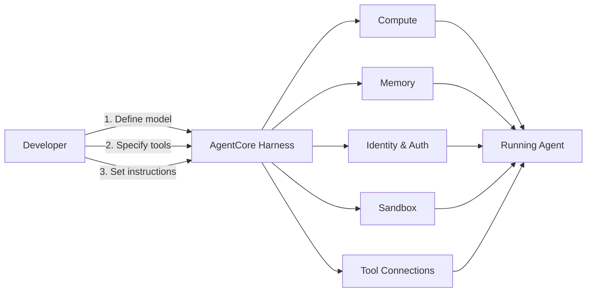
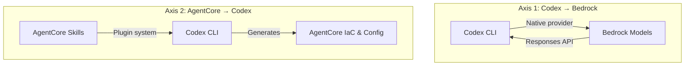
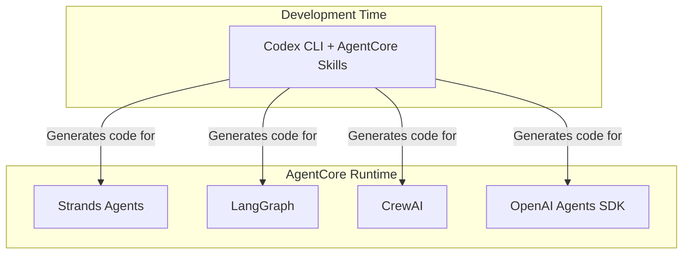

# AWS AgentCore's Managed Harness and Coding Skills: What They Mean for Codex CLI Teams


---

On 22 April 2026, AWS announced three additions to Amazon Bedrock AgentCore: a managed agent harness, a dedicated AgentCore CLI, and pre-built coding skills for popular agent tools — including Codex CLI [^1]. The timing is no coincidence. Just one day earlier, Codex CLI v0.123 had shipped its own first-party Amazon Bedrock provider [^2], completing a two-way bridge between the OpenAI and AWS ecosystems.

This article unpacks what AgentCore's new features actually do, how they relate to Codex CLI's own capabilities, and what practical patterns emerge when you combine both sides of the bridge.

## The Setup Tax Problem

Enterprise teams deploying AI coding agents at scale hit the same wall repeatedly: the agent logic is the easy part; the infrastructure surrounding it is not. A production agent deployment requires compute orchestration, credential management, persistent session storage, sandboxed execution, observability, and identity controls — before a single line of agent code runs [^3].

AWS calls this the "setup tax." Their data suggests developers spend more time wiring infrastructure than iterating on agent behaviour [^1]. AgentCore's April 2026 updates attack this directly.

## What AgentCore Now Provides

### Managed Agent Harness (Preview)

The managed harness replaces manual infrastructure setup with a three-API-call deployment model. Developers define three things [^4]:

1. Which model the agent uses
2. Which tools are available
3. Which instructions apply

AgentCore then provisions compute, tooling, memory, identity, and security automatically. Session state persists on a managed filesystem, allowing agents to pause mid-task and resume later — a capability that maps closely to Codex CLI's own session persistence model [^1].



The harness is available in preview in four regions: US West (Oregon), US East (N. Virginia), Asia Pacific (Sydney), and Europe (Frankfurt) [^4].

### AgentCore CLI

The `agentcore` CLI collapses the agent lifecycle into a single terminal workflow [^5]:

```bash
# Install
npm install -g @aws/agentcore

# Scaffold a new agent project
agentcore create

# Develop and test locally
agentcore dev

# Deploy to AWS
agentcore deploy

# Test the deployed agent
agentcore invoke
```

The project structure follows a convention-over-configuration pattern:

```
my-project/
├── agentcore/
│   ├── .env.local          # API keys
│   ├── agentcore.json      # Resource specs
│   ├── aws-targets.json    # Deployment targets
│   └── cdk/                # Infrastructure as code
├── app/
│   └── MyAgent/
│       ├── main.py
│       └── pyproject.toml
```

The `agentcore.json` file defines agents, memory strategies, credentials, and evaluators. Infrastructure deploys via CDK, with Terraform support forthcoming [^4]. The CLI also ships observability commands — `agentcore logs`, `agentcore traces list`, and `agentcore traces get` — that stream runtime data without leaving the terminal [^5].

### Pre-Built Coding Skills

The third addition is a set of curated coding skills for AI assistants. Rather than exposing raw API access, these skills encode AgentCore best practices — ensuring that when Codex CLI (or Claude Code, Kiro, or Cursor) generates AgentCore-related code, the output follows platform-intended patterns [^1].

Skills are available now through Kiro Power, with Codex CLI, Claude Code, and Cursor support arriving by end of April 2026 [^3].

## How This Relates to Codex CLI

The relationship between AgentCore and Codex CLI operates on two distinct axes, and confusing them is easy.

### Axis 1: Codex CLI as a Bedrock Consumer

Since v0.123 (21 April 2026), Codex CLI ships a native `amazon-bedrock` model provider [^2]. This lets teams run Codex against Bedrock-hosted models using AWS credentials, keeping traffic within their VPC:

```toml
# ~/.codex/config.toml
[model_provider]
type = "amazon-bedrock"
aws_profile = "production"
```

This is Codex consuming AWS infrastructure.

### Axis 2: Codex CLI as an AgentCore Skill Consumer

The new coding skills flow works in the opposite direction. Here, Codex CLI gains knowledge *about* AgentCore — how to scaffold agents, which Strands framework patterns to use, how to structure `agentcore.json` correctly. The skills are delivered as agent plugins via the `awslabs/agent-plugins` repository [^6]:

```bash
# In Codex CLI, plugins are discovered via marketplace
# Clone the agent-plugins repo locally; Codex discovers
# plugins through .agents/plugins/marketplace.json
```

The plugin architecture supports agent skills (structured workflows), MCP servers (external service connections), hooks (validation on developer actions), and reference documentation [^6].



### Why Both Axes Matter

A team building agents on AgentCore can now use Codex CLI at every layer:

1. **Author agent code** with Codex CLI as the development tool
2. **Run Codex against Bedrock** to keep API traffic within AWS
3. **Use AgentCore skills** so Codex generates correct AgentCore configurations
4. **Deploy with `agentcore deploy`** from the same terminal

This creates a closed loop where the agent-building tool and the agent-hosting platform understand each other natively.

## The Framework Landscape

AgentCore's managed harness is framework-agnostic. It supports Strands Agents (AWS's own open-source SDK, released in 2025), LangChain/LangGraph, CrewAI, Google ADK, and OpenAI Agents [^5]. This matters because Codex CLI's own agent loop is *not* one of these frameworks — it is a proprietary orchestration layer.

The practical implication: you do not deploy Codex CLI *inside* AgentCore. Instead, you use Codex CLI to *build* agents that run on AgentCore using one of the supported frameworks. The coding skills bridge the knowledge gap, but the runtime boundary remains clear.



## The AWS Agent Plugins Ecosystem

The `awslabs/agent-plugins` repository [^6] provides a broader set of AWS-specific plugins beyond AgentCore skills:

| Plugin | Purpose |
|--------|---------|
| `aws-serverless` | Lambda, API Gateway, EventBridge, Step Functions |
| `deploy-on-aws` | Architecture recommendations, cost estimation, IaC generation |
| `databases-on-aws` | Database guidance (Aurora DSQL) |
| `aws-amplify` | Full-stack app development with Gen 2 |
| `migration-to-aws` | GCP-to-AWS infrastructure migration |
| `sagemaker-ai` | ML model building and deployment |
| `amazon-location-service` | Maps, geocoding, routing |

Each plugin can contain skills, MCP servers, hooks, and reference documentation. Skills activate through contextual triggers — the `deploy-on-aws` plugin activates on phrases like "deploy to AWS" or "estimate AWS cost" [^6].

For Codex CLI, the installation path involves cloning the repository locally; Codex discovers plugins via `.agents/plugins/marketplace.json` [^6]. This differs from Claude Code's more streamlined `/plugin marketplace add` command, reflecting the fact that Codex's plugin marketplace integration is still maturing ⚠️.

## Practical Patterns for Enterprise Teams

### Pattern 1: AgentCore-Aware AGENTS.md

Add AgentCore context to your project's `AGENTS.md` so Codex CLI generates correct configurations:

```markdown
## Infrastructure

This project deploys agents to AWS AgentCore.

- Framework: Strands Agents (Python)
- Configuration: agentcore/agentcore.json
- Deployment: `agentcore deploy` via CDK
- Memory strategy: semantic (Bedrock Knowledge Bases)

When generating agent code, follow Strands Agents patterns.
Use `@tool` decorators for tool definitions.
Always include error handling for Bedrock throttling.
```

### Pattern 2: Codex CLI for AgentCore Evaluation Loops

AgentCore ships built-in evaluation capabilities — LLM-as-a-judge evaluators and continuous online evaluation [^5]. Use Codex CLI to generate and iterate on evaluation criteria:

```bash
# Add an evaluator to your AgentCore project
agentcore add evaluator

# Use Codex to refine evaluation prompts
codex "Review the evaluator in agentcore/agentcore.json.
       The agent handles customer support tickets.
       Add evaluation criteria for tone, accuracy,
       and policy compliance."
```

### Pattern 3: Multi-Model with Bedrock Provider

Combine the native Bedrock provider with AgentCore deployment for a fully AWS-native stack:

```toml
# ~/.codex/config.toml — development
[model_provider]
type = "amazon-bedrock"
aws_profile = "dev"

[model]
default = "anthropic.claude-sonnet-4-20250514"
```

This keeps both your development-time Codex usage and your production agent runtime within AWS's billing and compliance boundary — a common requirement for regulated industries [^4].

## Pricing Considerations

AgentCore's managed harness, CLI, and coding skills carry no additional charges — teams pay only for underlying compute and model inference [^4]. This is a deliberate strategy to reduce adoption friction, mirroring Codex CLI's own model where the tool is free and costs come from API usage.

For teams already paying for Bedrock model access, the incremental cost of running Codex CLI against Bedrock (via the native provider) plus deploying agents to AgentCore is effectively the infrastructure compute delta — no new per-seat licensing.

## What to Watch

Several aspects of this integration remain in flux:

- **Codex plugin installation** for AgentCore skills is not yet streamlined; the current clone-and-discover approach will likely be replaced by marketplace integration ⚠️
- **Terraform support** for AgentCore deployments is listed as "coming soon" but has no firm date ⚠️
- The managed harness is in **preview** with limited regional availability — production workloads should account for potential API changes [^4]
- AgentCore skills for Codex CLI are expected by end of April 2026 but are not yet generally available ⚠️

## Conclusion

AWS AgentCore's April 2026 updates create a compelling full-stack story for enterprise teams: use Codex CLI to write agents, run it against Bedrock models, leverage AgentCore coding skills for correct configurations, and deploy through the AgentCore CLI — all without leaving the terminal or crossing cloud boundaries.

The key insight is directional. Codex CLI's Bedrock provider (Axis 1) and AgentCore's coding skills (Axis 2) are complementary, not competing. One routes model inference; the other routes domain knowledge. Together, they eliminate the two biggest friction points in enterprise agent deployment: model access governance and infrastructure boilerplate.

For teams already invested in AWS, this is the most integrated path to production agent deployment available today.

## Citations

[^1]: AWS, "Get to your first working agent in minutes: Announcing new features in Amazon Bedrock AgentCore," AWS Machine Learning Blog, 22 April 2026. [https://aws.amazon.com/blogs/machine-learning/get-to-your-first-working-agent-in-minutes-announcing-new-features-in-amazon-bedrock-agentcore/](https://aws.amazon.com/blogs/machine-learning/get-to-your-first-working-agent-in-minutes-announcing-new-features-in-amazon-bedrock-agentcore/)

[^2]: OpenAI, "Codex CLI Releases — v0.123.0," GitHub, 23 April 2026. [https://github.com/openai/codex/releases](https://github.com/openai/codex/releases)

[^3]: SiliconANGLE, "AWS accelerates AI agent development in Amazon Bedrock AgentCore," 22 April 2026. [https://siliconangle.com/2026/04/22/aws-accelerates-ai-agent-development-amazon-bedrock-agentcore/](https://siliconangle.com/2026/04/22/aws-accelerates-ai-agent-development-amazon-bedrock-agentcore/)

[^4]: Techzine Global, "AWS Bedrock AgentCore gets managed harness and CLI for AI agents," 22 April 2026. [https://www.techzine.eu/news/infrastructure/140725/aws-bedrock-agentcore-gets-managed-harness-and-cli-for-ai-agents/](https://www.techzine.eu/news/infrastructure/140725/aws-bedrock-agentcore-gets-managed-harness-and-cli-for-ai-agents/)

[^5]: AWS, "agentcore-cli," GitHub repository. [https://github.com/aws/agentcore-cli](https://github.com/aws/agentcore-cli)

[^6]: AWS Labs, "agent-plugins — Agent Plugins for AWS," GitHub repository. [https://github.com/awslabs/agent-plugins](https://github.com/awslabs/agent-plugins)
