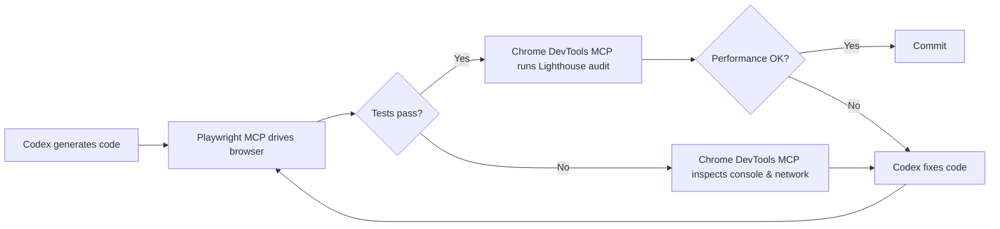
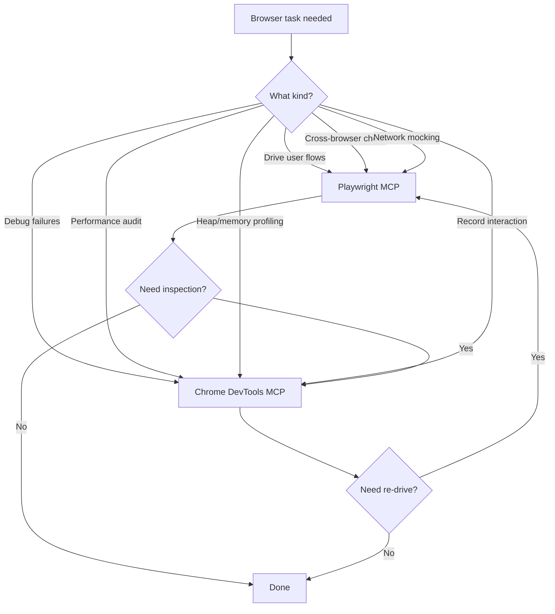

# Browser-in-the-loop testing: Playwright + Chrome DevTools MCP + Codex CLI


Coding agents write code they cannot see running. They generate a component, commit it, and hope the browser agrees. Browser-in-the-loop testing closes that gap by giving Codex CLI real-time access to browser state through two complementary MCP servers: **Playwright MCP** (v0.0.75) for driving user interactions and **Chrome DevTools MCP** (v0.21) for deep inspection and debugging[^1][^2]. Together they form a generate-drive-inspect loop that keeps the agent inside a single session from code generation through visual verification and performance audit.

## Why two MCP servers?

Playwright MCP and Chrome DevTools MCP solve different problems. Playwright *drives* a browser; Chrome DevTools MCP *debugs* one[^3].

| Capability | Playwright MCP | Chrome DevTools MCP |
|---|---|---|
| Browser support | Chromium, Firefox, WebKit, Edge | Chrome stable only (not Chromium or Edge)[^5] |
| Primary strength | Cross-browser automation, accessibility-tree targeting | Performance traces, Lighthouse audits, heap snapshots, extensions |
| Network mocking | First-class via `browser_route` tools | Inspection only, no mocking |
| Tool count | ~25 tools[^4] | 45 tools across 9 categories[^5] |
| Best for | Generating and running E2E tests | Diagnosing performance regressions, memory leaks, Core Web Vitals |

Chrome DevTools MCP's 45 tools break into nine categories[^5]:

1. **Input automation** (10): click, drag, fill, fill_form, handle_dialog, hover, press_key, type_text, upload_file, click_at
2. **Navigation** (6): close_page, list_pages, navigate_page, new_page, select_page, wait_for
3. **Emulation** (2): emulate, resize_page
4. **Performance** (3): performance_analyze_insight, performance_start_trace, performance_stop_trace
5. **Network** (2): get_network_request, list_network_requests
6. **Debugging** (8): evaluate_script, get_console_message, lighthouse_audit, list_console_messages, take_screenshot, take_snapshot, screencast_start, screencast_stop
7. **Memory** (5): take_heapsnapshot, get_heapsnapshot_class_nodes, get_heapsnapshot_details, get_heapsnapshot_retainers, get_heapsnapshot_summary
8. **Extensions** (5): install_extension, list_extensions, reload_extension, trigger_extension_action, uninstall_extension
9. **Third-party/WebMCP** (4): execute_3p_developer_tool, list_3p_developer_tools, execute_webmcp_tool, list_webmcp_tools

Registering both servers costs roughly 32k tokens of context, around 16 per cent of a 200k-token window. Most agents select the appropriate server automatically when the task description is clear[^3].

## Registering both servers in Codex CLI

### Quick setup via CLI

```bash
# Playwright MCP — headless, isolated sessions
codex mcp add playwright -- npx @playwright/mcp@latest --headless --isolated

# Chrome DevTools MCP — headless, isolated
codex mcp add chrome-devtools -- npx chrome-devtools-mcp@latest --headless --isolated
```

### Equivalent config.toml

For repeatable project-level configuration, add both to `.codex/config.toml`:

```toml
[mcp_servers.playwright]
command = "npx"
args = ["@playwright/mcp@latest", "--headless", "--isolated"]
startup_timeout_sec = 15

[mcp_servers.chrome-devtools]
command = "npx"
args = ["chrome-devtools-mcp@latest", "--headless", "--isolated"]
startup_timeout_sec = 20
```

The `--isolated` flag creates ephemeral browser profiles that are automatically cleaned up, essential for reproducible CI runs[^6]. The `--headless` flag is mandatory inside Codex CLI's sandbox, which cannot render a visible browser window[^7].

**Windows note:** Chrome DevTools MCP requires `SystemRoot` and `PROGRAMFILES` environment variables. Pass them via `env = { SystemRoot = "C:\\Windows", PROGRAMFILES = "C:\\Program Files" }` in the TOML block[^5].

**Chrome requirement:** Chrome DevTools MCP requires Google Chrome stable. It will not work with Chromium, Chrome for Testing, or Edge[^5]. Pre-install Chrome if your CI environment uses a minimal base image.

## The browser-in-the-loop workflow

The core pattern chains three phases: **generate, drive, inspect**. Codex writes code, Playwright exercises it in a headless browser, and Chrome DevTools diagnoses any issues the automation surfaces.



### Phase 1: generate and drive

Codex writes a React component (or any front-end artefact), spins up a dev server, and uses Playwright MCP to navigate to the page. Playwright reads the browser's **accessibility tree** rather than taking screenshots, giving the agent a structured, token-efficient view of the rendered page[^6]. A typical prompt:

```
Write a login form component. Start the dev server, navigate to /login with
Playwright, and verify the form renders with email and password fields.
```

Playwright MCP exposes tools like `browser_navigate`, `browser_click`, `browser_fill`, and `browser_snapshot` that the agent chains together to simulate user flows[^6]. The `browser_run_code_unsafe` tool allows executing arbitrary Playwright scripts when the standard tools are insufficient.

### Phase 2: inspect failures

When an assertion fails, say the password field is missing, the agent switches to Chrome DevTools MCP to drill into the cause:

- **Read console errors** via `list_console_messages` and `get_console_message` to catch runtime exceptions with source-mapped stack traces[^5]
- **Inspect network requests** via `list_network_requests` to diagnose failed API calls or CORS issues[^2]
- **Take a screenshot** via `take_screenshot` for visual confirmation (useful when piped to a vision model or saved as a test artefact)[^5]
- **Evaluate JavaScript** via `evaluate_script` to inspect component state directly in the page context[^5]
- **Record a screencast** via `screencast_start` and `screencast_stop` to capture interaction sequences for debugging complex timing issues[^5]

The agent feeds this diagnostic information back into its reasoning loop and generates a fix, then Playwright re-runs the flow.

### Phase 3: performance audit

Once functional tests pass, Chrome DevTools MCP runs a Lighthouse audit:

```
Run a Lighthouse performance audit on http://localhost:3000/login.
Flag any metrics where LCP > 2.5s, INP > 200ms, or CLS > 0.1.
```

The `lighthouse_audit` tool returns structured scores for accessibility, SEO, and best practices (0 to 100)[^2]. The `performance_start_trace` and `performance_stop_trace` tools provide V8-level profiling with LCP, CLS, and FCP breakdowns, render-blocking insights with estimated savings, and network dependency trees[^5].

### Phase 4: memory profiling (new)

For single-page applications and long-running dashboards, memory leaks are a common production issue. Chrome DevTools MCP's heap snapshot tools enable the agent to detect them:

```
Take a heap snapshot, navigate through 10 dashboard tabs, take another
snapshot, and identify any objects that grew unexpectedly.
```

The five memory tools (`take_heapsnapshot`, `get_heapsnapshot_summary`, `get_heapsnapshot_class_nodes`, `get_heapsnapshot_details`, `get_heapsnapshot_retainers`) give the agent the same inspection capability as the Chrome DevTools Memory panel[^5].

## Practical example: testing a dashboard widget

Here is a concrete session showing the loop in action. The developer's prompt:

```
Add a bar chart widget to the analytics dashboard that loads data from
/api/metrics. Write a Playwright test that verifies the chart renders with
the correct number of bars. Then run a Lighthouse audit and fix any
performance issues.
```

The agent:

1. **Generates** `src/components/BarChart.tsx` and `tests/bar-chart.spec.ts`
2. **Drives** the browser with Playwright MCP:
   - `browser_navigate` to `http://localhost:3000/dashboard`
   - `browser_snapshot` reads the accessibility tree, confirms five `<rect>` elements
   - `browser_click` interacts with tooltip hover states
3. **Audits** with Chrome DevTools MCP:
   - `lighthouse_audit` returns LCP at 3.1s (above threshold)
   - `list_network_requests` identifies a 1.2 MB unminified chart library
4. **Fixes** by switching to a tree-shakeable import and adding `React.lazy()`
5. **Re-audits**: LCP at 1.8s, passes

The entire loop runs without the developer touching the browser.

## Token efficiency: MCP vs CLI

Microsoft ships `@playwright/cli` alongside the MCP server. The CLI approach uses approximately 27k tokens per automation task versus 114k tokens for the equivalent MCP workflow, roughly a four-times reduction[^8]. The trade-off: CLI mode is stateless and better suited to deterministic, reproducible CI pipelines, whereas MCP retains persistent browser state across tool calls, enabling the adaptive reasoning loops that make browser-in-the-loop debugging effective[^4].

**Rule of thumb:** use Playwright CLI for high-throughput test execution in CI; use Playwright MCP when the agent needs to reason iteratively about browser state, which is the primary use case in this workflow.

## Codex CLI sandbox constraints

Codex CLI's sandbox disables outbound network access by default[^7]. This has implications for browser-in-the-loop testing:

- **Local dev servers work fine.** `localhost` traffic stays within the sandbox.
- **External URLs are blocked.** Testing against production requires explicit network access, not just `--full-auto`. Set `sandbox_workspace_write.network_access = true` in your config or use `codex -c 'sandbox_workspace_write.network_access=true'`[^7].
- **Browser downloads may fail.** Pre-install browser binaries via `npx playwright install chromium` in your setup script before entering the sandbox.
- **Headed mode is unavailable.** Always pass `--headless` to both MCP servers.

Note: `--full-auto` (shortcut for `--ask-for-approval on-request` and `--sandbox workspace-write`) does **not** enable network access. You must set `network_access = true` separately[^7].

For teams needing external access during testing, configure network access in your sandbox policy or run the browser MCP servers outside the sandbox with a remote HTTP transport.

## Combining with AGENTS.md

Codex reads `AGENTS.md` at the project root for session-level instructions[^9]. Adding browser-testing conventions here ensures consistent behaviour:

```markdown
## Browser testing

- Use Playwright MCP for all E2E interaction (navigation, clicks, assertions)
- Use Chrome DevTools MCP for debugging failures, performance audits, and memory profiling
- Always run in headless + isolated mode
- Use role-based locators (getByRole, getByLabel) over CSS selectors
- Run Lighthouse after every new page or component — flag LCP > 2.5s
- Save screenshots of failures to test-results/screenshots/
- For memory-sensitive SPAs, take heap snapshots before and after navigation sequences
```

This keeps the agent aligned across sessions without repeating instructions in every prompt.

## When to use which tool



The two servers form a feedback loop: Playwright surfaces problems by exercising the application; Chrome DevTools explains *why* those problems exist. Together with Codex CLI's code generation, they close the gap between writing code and verifying it works.

## Citations

[^1]: Microsoft, 'Playwright MCP Server,' GitHub, 2026. [https://github.com/microsoft/playwright-mcp](https://github.com/microsoft/playwright-mcp)

[^2]: Google, 'Chrome DevTools MCP,' Chrome for Developers Blog, 2026. [https://developer.chrome.com/blog/chrome-devtools-mcp](https://developer.chrome.com/blog/chrome-devtools-mcp)

[^3]: S. Kinney, 'Driving vs Debugging the Browser,' 2026. [https://stevekinney.com/writing/driving-vs-debugging-the-browser](https://stevekinney.com/writing/driving-vs-debugging-the-browser)

[^4]: Test-Lab.ai, 'Chrome DevTools MCP vs Playwright MCP vs Playwright CLI,' 2026. [https://www.test-lab.ai/blog/chrome-devtools-mcp-vs-playwright-mcp-cli](https://www.test-lab.ai/blog/chrome-devtools-mcp-vs-playwright-mcp-cli)

[^5]: Google, 'Chrome DevTools MCP,' GitHub, 2026. [https://github.com/ChromeDevTools/chrome-devtools-mcp](https://github.com/ChromeDevTools/chrome-devtools-mcp)

[^6]: Microsoft, 'Playwright MCP, Official Documentation,' 2026. [https://playwright.dev/docs/getting-started-mcp](https://playwright.dev/docs/getting-started-mcp)

[^7]: OpenAI, 'Model Context Protocol, Codex,' OpenAI Developers, 2026. [https://developers.openai.com/codex/mcp](https://developers.openai.com/codex/mcp)

[^8]: MorphLLM, 'Playwright MCP Setup and Cost: Why the CLI Is 4x Cheaper,' 2026. [https://www.morphllm.com/playwright-mcp](https://www.morphllm.com/playwright-mcp)

[^9]: TestDino, 'Write Playwright Tests with Codex: Cloud Agent Guide,' 2026. [https://testdino.com/blog/playwright-tests-with-codex/](https://testdino.com/blog/playwright-tests-with-codex/)
