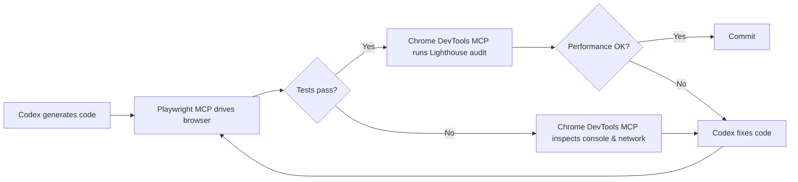
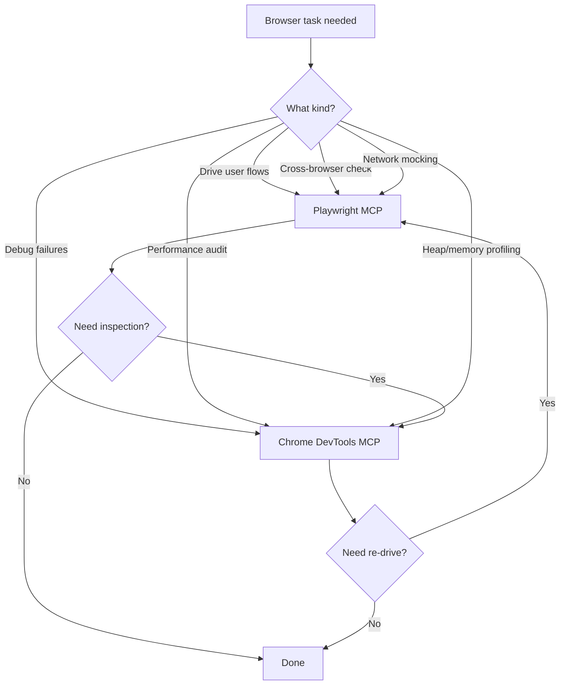

# Browser-in-the-Loop Testing: Playwright + Chrome DevTools MCP + Codex CLI


Coding agents write code they cannot see running. They generate a component, commit it, and hope the browser agrees. Browser-in-the-loop testing closes that gap by giving Codex CLI real-time access to browser state through two complementary MCP servers: **Playwright MCP** for driving user interactions and **Chrome DevTools MCP** for deep inspection and debugging [^1][^2]. This article walks through a unified configuration that registers both servers in Codex CLI, explains when each tool fires, and demonstrates an end-to-end workflow that takes a feature from code generation through visual verification and performance audit — all within a single agent session.

## Why Two MCP Servers?

Playwright MCP and Chrome DevTools MCP solve different problems. Playwright is in the business of *driving* a browser; Chrome DevTools MCP is in the business of *debugging* one [^3].

| Capability | Playwright MCP | Chrome DevTools MCP |
|---|---|---|
| Browser support | Chromium, Firefox, WebKit, Edge | Chrome only |
| Primary strength | Cross-browser automation, accessibility-tree targeting | Performance traces, Lighthouse audits, heap snapshots |
| Network mocking | First-class via `browser_route` tools | Inspection only — no mocking |
| Tool count / context cost | ~21 tools / ~13.7k tokens [^4] | ~33 tools / ~18k tokens [^5] |
| Best for | Generating and running E2E tests | Diagnosing performance regressions, Core Web Vitals |

Registering both costs roughly 32k tokens of context — around 16% of a 200k-token window. Most agents select the appropriate server automatically when the task description is clear [^3].

## Registering Both Servers in Codex CLI

### Quick setup via CLI

```bash
# Playwright MCP — headless, isolated sessions
codex mcp add playwright -- npx @playwright/mcp@latest --headless --isolated

# Chrome DevTools MCP — headless, isolated, 20s startup
codex mcp add chrome-devtools -- npx chrome-devtools-mcp@latest --headless --isolated
```

### Equivalent config.toml

For repeatable project-level configuration, add both to `.codex/config.toml`:

```toml
[mcp.playwright]
command = "npx"
args = ["@playwright/mcp@latest", "--headless", "--isolated"]
startup_timeout_sec = 15

[mcp.chrome-devtools]
command = "npx"
args = ["chrome-devtools-mcp@latest", "--headless", "--isolated"]
startup_timeout_sec = 20
```

The `--isolated` flag creates ephemeral browser profiles that are automatically cleaned up — essential for reproducible CI runs [^6]. The `--headless` flag is mandatory inside Codex CLI's network-disabled sandbox, which cannot render a visible browser window [^7].

> **Note:** On Windows, Chrome DevTools MCP requires `SystemRoot` and `PROGRAMFILES` environment variables. Pass them via `env = { SystemRoot = "C:\\Windows", PROGRAMFILES = "C:\\Program Files" }` in the TOML block [^5].

## The Browser-in-the-Loop Workflow

The core pattern chains three phases: **generate → drive → inspect**. Codex writes code, Playwright exercises it in a headless browser, and Chrome DevTools diagnoses any issues the automation surfaces.



### Phase 1 — Generate and drive

Codex writes a React component (or any front-end artefact), spins up a dev server, and uses Playwright MCP to navigate to the page. Playwright reads the browser's **accessibility tree** rather than taking screenshots, giving the agent a structured, token-efficient view of the rendered page [^6]. A typical prompt:

```
Write a login form component. Start the dev server, navigate to /login with
Playwright, and verify the form renders with email and password fields.
```

Playwright MCP exposes tools like `browser_navigate`, `browser_click`, `browser_fill`, and `browser_snapshot` that the agent chains together to simulate user flows [^6].

### Phase 2 — Inspect failures

When an assertion fails — say the password field is missing — the agent switches to Chrome DevTools MCP to drill into the cause. It can:

- **Read console errors** via `list_console_messages` and `get_console_message` to catch runtime exceptions with source-mapped stack traces [^5]
- **Inspect network requests** via `list_network_requests` to diagnose failed API calls or CORS issues [^2]
- **Take a screenshot** via `take_screenshot` for visual confirmation (useful when piped to a vision model or saved as a test artefact) [^5]
- **Evaluate JavaScript** via `evaluate_script` to inspect component state directly in the page context [^5]

The agent feeds this diagnostic information back into its reasoning loop and generates a fix, then Playwright re-runs the flow.

### Phase 3 — Performance audit

Once functional tests pass, Chrome DevTools MCP runs a Lighthouse audit:

```
Run a Lighthouse performance audit on http://localhost:3000/login.
Flag any metrics where LCP > 2.5s, INP > 200ms, or CLS > 0.1.
```

The `lighthouse_audit` tool returns structured results that the agent can parse and act on — for example, code-splitting a heavy import that inflates LCP [^2]. The `performance_start_trace` and `performance_stop_trace` tools provide V8-level profiling when the Lighthouse summary is not granular enough [^5].

## Practical Example: Testing a Dashboard Widget

Here is a concrete session transcript showing the three-phase loop. The developer's prompt:

```
Add a bar chart widget to the analytics dashboard that loads data from
/api/metrics. Write a Playwright test that verifies the chart renders with
the correct number of bars. Then run a Lighthouse audit and fix any
performance issues.
```

The agent:

1. **Generates** `src/components/BarChart.tsx` and `tests/bar-chart.spec.ts`
2. **Drives** the browser with Playwright MCP:
   - `browser_navigate` → `http://localhost:3000/dashboard`
   - `browser_snapshot` → reads the accessibility tree, confirms 5 `<rect>` elements
   - `browser_click` → interacts with tooltip hover states
3. **Audits** with Chrome DevTools MCP:
   - `lighthouse_audit` → LCP at 3.1s (above threshold)
   - `list_network_requests` → identifies a 1.2 MB unminified chart library
4. **Fixes** by switching to a tree-shakeable import and adding `React.lazy()`
5. **Re-audits** → LCP at 1.8s ✅

The entire loop runs without the developer touching the browser.

## Token Efficiency: MCP vs CLI

Microsoft now ships `@playwright/cli` alongside the MCP server. The CLI approach uses approximately 27k tokens per automation task versus 114k tokens for the equivalent MCP workflow — roughly a 4× reduction [^8]. The trade-off: CLI mode is stateless and better suited to deterministic, reproducible CI pipelines, whereas MCP retains persistent browser state across tool calls, enabling the adaptive reasoning loops that make browser-in-the-loop debugging effective [^4].

**Rule of thumb:** use Playwright CLI for high-throughput test execution in CI; use Playwright MCP when the agent needs to *reason iteratively* about browser state — which is the primary use case in this workflow.

## Codex CLI Sandbox Constraints

Codex CLI's sandbox disables outbound network access by default [^7]. This has implications for browser-in-the-loop testing:

- **Local dev servers work fine** — `localhost` traffic stays within the sandbox
- **External URLs are blocked** — testing against production requires `--full-auto` mode or a network allowlist
- **Browser downloads may fail** — pre-install browser binaries via `npx playwright install chromium` in your setup script before entering the sandbox
- **Headed mode is unavailable** — always pass `--headless` to both MCP servers

For teams needing external access during testing, configure a network allowlist in the sandbox policy or run the browser MCP servers outside the sandbox with a remote transport [^7].

## Combining with AGENTS.md

Codex reads `AGENTS.md` (or `codex.md`) at the project root for session-level instructions [^9]. Adding browser-testing conventions here ensures consistent behaviour:

```markdown
## Browser Testing

- Use Playwright MCP for all E2E interaction (navigation, clicks, assertions)
- Use Chrome DevTools MCP for debugging failures and performance audits
- Always run in headless + isolated mode
- Use role-based locators (getByRole, getByLabel) over CSS selectors
- Run Lighthouse after every new page or component — flag LCP > 2.5s
- Save screenshots of failures to test-results/screenshots/
```

This keeps the agent aligned across sessions without repeating instructions in every prompt.

## When to Use Which Tool



The two servers form a feedback loop: Playwright surfaces problems by exercising the application; Chrome DevTools explains *why* those problems exist. Together with Codex CLI's code generation, they close the gap between writing code and verifying it works.

## Summary

Browser-in-the-loop testing with Codex CLI eliminates the blindfold that coding agents traditionally wear. Registering Playwright MCP and Chrome DevTools MCP side by side gives the agent complementary capabilities — automation and inspection — that combine into a generate-drive-inspect loop. The setup is straightforward: two `codex mcp add` commands, a few lines in `config.toml`, and clear conventions in `AGENTS.md`. The result is an agent that writes code, tests it in a real browser, diagnoses failures, and optimises performance — all without the developer switching windows.

## Citations

[^1]: [Playwright MCP Server — GitHub (microsoft/playwright-mcp)](https://github.com/microsoft/playwright-mcp)
[^2]: [Chrome DevTools MCP — Blog — Chrome for Developers](https://developer.chrome.com/blog/chrome-devtools-mcp)
[^3]: [Driving vs Debugging the Browser — Steve Kinney](https://stevekinney.com/writing/driving-vs-debugging-the-browser)
[^4]: [Chrome DevTools MCP vs Playwright MCP vs Playwright CLI — Test-Lab.ai](https://www.test-lab.ai/blog/chrome-devtools-mcp-vs-playwright-mcp-cli)
[^5]: [Chrome DevTools MCP — GitHub (ChromeDevTools/chrome-devtools-mcp)](https://github.com/ChromeDevTools/chrome-devtools-mcp)
[^6]: [Playwright MCP — Official Documentation](https://playwright.dev/docs/getting-started-mcp)
[^7]: [Model Context Protocol — Codex — OpenAI Developers](https://developers.openai.com/codex/mcp)
[^8]: [Playwright MCP Setup and Cost: Why the CLI Is 4× Cheaper — MorphLLM](https://www.morphllm.com/playwright-mcp)
[^9]: [Write Playwright Tests with Codex: Cloud Agent Guide (2026) — TestDino](https://testdino.com/blog/playwright-tests-with-codex/)
