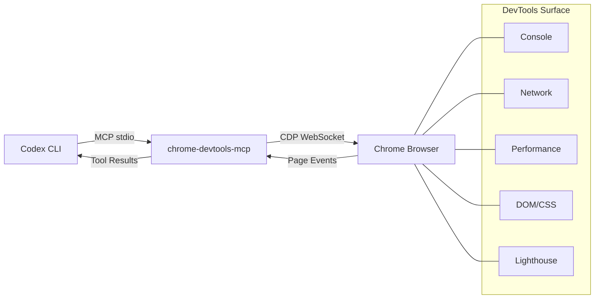

# Chrome DevTools MCP and Codex CLI: Closing the Browser Debugging Gap for AI Coding Agents


---

Every terminal-native coding agent shares one blind spot: the browser. An agent can refactor your React component tree in seconds, but when the rendered page paints a white screen or layout-shifts on mobile, it has no idea — it never saw the output. Chrome DevTools MCP, Google's official MCP server for coding agents[^1], plugs that gap by giving Codex CLI the same debugging surface a frontend engineer opens every morning: the DevTools panel, driven programmatically over the Chrome DevTools Protocol (CDP).

This article walks through the architecture, configuration, and practical workflows for integrating Chrome DevTools MCP into your Codex CLI setup.

## Why Agents Need Browser Eyes

The fundamental limitation of terminal-based coding agents is that they operate on source code, not on the rendered result[^2]. When Codex CLI edits a CSS grid or modifies a Webpack bundle configuration, it cannot verify whether the change actually works without browser feedback. Before Chrome DevTools MCP, practitioners relied on two workarounds:

1. **Playwright MCP** — full browser automation that screenshots pages but lacks deep DevTools introspection (no performance traces, no network waterfall, no console source maps).
2. **Manual verification** — the developer eyeballs the result and pastes errors back into the prompt.

Chrome DevTools MCP replaces both with a single MCP server that exposes 34 tools across seven categories, giving the agent direct access to the same instrumentation a human developer uses[^3].

## Architecture Overview



The MCP server launches (or connects to) a Chrome instance and translates MCP tool calls into CDP commands[^1]. Because Codex CLI communicates with MCP servers over stdio, the browser can run headfully on your desktop or headlessly in CI — the agent doesn't care.

## Tool Inventory

Chrome DevTools MCP ships 34 tools organised into seven categories[^3]:

| Category | Tools | Key capabilities |
|---|---|---|
| **Input** (9) | `click`, `fill`, `fill_form`, `hover`, `press_key`, `type_text`, `drag`, `handle_dialog`, `upload_file` | Full user interaction simulation |
| **Navigation** (6) | `navigate_page`, `new_page`, `select_page`, `close_page`, `list_pages`, `wait_for` | Multi-tab orchestration |
| **Debugging** (6) | `evaluate_script`, `take_screenshot`, `take_snapshot`, `lighthouse_audit`, `get_console_message`, `list_console_messages` | Runtime inspection and auditing |
| **Performance** (3) | `performance_start_trace`, `performance_stop_trace`, `performance_analyze_insight` | Trace recording with CrUX data |
| **Network** (2) | `list_network_requests`, `get_network_request` | Request/response inspection |
| **Emulation** (2) | `emulate`, `resize_page` | Device and viewport simulation |
| **Extensions** (5) | `install_extension`, `list_extensions`, `reload_extension`, `trigger_extension_action`, `uninstall_extension` | Browser extension management |
| **Memory** (1) | `take_memory_snapshot` | Heap snapshot analysis |

A **slim mode** (`--slim`) strips the set down to basic navigation and screenshot tools, reducing schema bloat in the system prompt — important for context-budget-conscious workflows[^3].

## Configuration

### Quick Start

The fastest path uses the Codex CLI's built-in `mcp add` command[^4]:

```bash
codex mcp add chrome-devtools -- npx chrome-devtools-mcp@latest
```

This appends the server definition to `~/.codex/config.toml`. Verify with:

```bash
codex mcp list
```

### Manual config.toml

For more control, edit the configuration directly:

```toml
[mcp_servers.chrome-devtools]
command = "npx"
args = ["-y", "chrome-devtools-mcp@latest"]
startup_timeout_sec = 20
tool_timeout_sec = 120
```

Common flags you can append to `args`:

```toml
# Headless for CI pipelines
args = ["-y", "chrome-devtools-mcp@latest", "--headless"]

# Connect to an existing Chrome instance
args = ["-y", "chrome-devtools-mcp@latest", "-u", "http://localhost:9222"]

# Fixed viewport for consistent screenshots
args = ["-y", "chrome-devtools-mcp@latest", "--viewport", "1280x720"]

# Slim mode to reduce tool schema bloat
args = ["-y", "chrome-devtools-mcp@latest", "--slim"]
```

### WSL2-Specific Configuration

Running Chrome from WSL2 requires explicit display variable injection because Codex spawns MCP servers as independent processes without inheriting your shell's GUI environment[^5]:

```toml
[mcp_servers.chrome-devtools]
command = "npx"
args = [
  "-y", "chrome-devtools-mcp@latest",
  "--chromeArg=--no-sandbox",
  "--chromeArg=--disable-setuid-sandbox",
  "--chromeArg=--disable-dev-shm-usage"
]

[mcp_servers.chrome-devtools.env]
DISPLAY = ":0"
WAYLAND_DISPLAY = "wayland-0"
XDG_RUNTIME_DIR = "/run/user/1000"
```

Query your actual values with `echo $DISPLAY` etc. before copying them in.

### Windows Native

On Windows with PowerShell, the command wrapper differs[^3]:

```toml
[mcp_servers.chrome-devtools]
command = "cmd"
args = ["/c", "npx", "-y", "chrome-devtools-mcp@latest"]
env = { SystemRoot = "C:\\Windows", PROGRAMFILES = "C:\\Program Files" }
startup_timeout_ms = 20_000
```

### Reducing Schema Bloat

Chrome DevTools MCP's 34 tools add several thousand tokens to your system prompt. For sessions where you only need screenshots and navigation, use Codex's `disabled_tools` config to prune:

```toml
[mcp_servers.chrome-devtools]
command = "npx"
args = ["-y", "chrome-devtools-mcp@latest"]
disabled_tools = [
  "install_extension", "uninstall_extension", "reload_extension",
  "trigger_extension_action", "list_extensions",
  "take_memory_snapshot", "drag", "upload_file"
]
```

Alternatively, `--slim` mode achieves a similar effect at the server level[^3].

## Practical Workflows

### 1. Fix-and-Verify Loop

The highest-value pattern: ask Codex to fix a frontend bug and verify the fix in the same turn.

```
Fix the layout shift on /pricing — the hero section jumps after web fonts load.
Navigate to http://localhost:3000/pricing, take a screenshot, identify the CLS source,
apply the fix, then take another screenshot to confirm.
```

Codex will:

1. `navigate_page` to the URL
2. `take_screenshot` to see the current state
3. Read the source, apply `font-display: swap` and dimension reserves
4. `navigate_page` again (hard refresh)
5. `take_screenshot` to confirm the fix

### 2. Performance Audit Pipeline

Combine `codex exec` with Chrome DevTools MCP for headless CI performance gates:

```bash
codex exec \
  "Navigate to https://staging.example.com, run a Lighthouse audit, \
   and report the LCP, FID, and CLS scores as JSON" \
  --output-schema ./perf-schema.json \
  -o ./perf-results.json
```

The agent calls `lighthouse_audit`, extracts Core Web Vitals, and returns structured JSON for your CI pipeline to gate on.

### 3. Network Debugging

When an API call silently fails in the browser:

```
Navigate to http://localhost:3000/dashboard, log in with test credentials,
list all network requests that returned 4xx or 5xx status codes,
and show me the request/response headers for each failure.
```

The agent uses `fill_form` for login, `list_network_requests` for the waterfall, and `get_network_request` for detailed inspection — exactly what you'd do manually in the Network panel.

### 4. Visual Regression with Device Emulation

```
Emulate an iPhone 14 Pro, navigate to /checkout,
take a screenshot, then emulate a Pixel 7 and take another.
Compare the two screenshots and report any layout differences.
```

The `emulate` tool handles device simulation, whilst `take_screenshot` captures each viewport.

## Hooks Integration (v0.124+)

With Codex CLI v0.124's stable hooks[^6], you can audit every Chrome DevTools tool call:

```toml
[hooks.pre_tool_use.chrome-devtools__navigate_page]
command = "echo 'Navigating to: $TOOL_INPUT' >> /tmp/browser-audit.log"

[hooks.post_tool_use.chrome-devtools__evaluate_script]
command = "python3 scripts/check-script-safety.py"
```

This is particularly valuable for teams that need to audit what URLs the agent visits or what JavaScript it evaluates in the browser.

## Known Limitations and Gotchas

**Process leaks.** In long sessions with subagents, Chrome DevTools MCP processes can accumulate if not properly cleaned up. This is a known issue tracked in GitHub Issue #17574[^7]. Mitigate by setting `tool_timeout_sec` and monitoring process trees.

**MCP + output-schema conflict.** When MCP servers are active, `--output-schema` may be silently ignored by the model[^8]. For structured CI output, consider a two-pass approach: first run with MCP for browser interaction, then a second `codex exec` pass to format results.

**Sensitive data exposure.** Chrome DevTools MCP exposes page content to the model. Never point it at pages containing credentials, PII, or session tokens without appropriate safeguards[^3].

**CrUX API calls.** Performance tools may contact Google's Chrome UX Report API. Disable with `--no-performance-crux` if your security policy prohibits external telemetry[^3].

**Usage statistics.** The server collects anonymous usage statistics by default. Opt out with `--no-usage-statistics`[^3].

## AGENTS.md Template for Frontend Projects

Add this to your project's `AGENTS.md` to guide Codex when Chrome DevTools MCP is available:

```markdown
## Browser Debugging

When Chrome DevTools MCP is available:
- ALWAYS take a screenshot after applying visual changes
- Use `lighthouse_audit` before and after performance-related changes
- Check `list_console_messages` for errors after any JS modification
- Use `emulate` to verify responsive layouts on mobile viewports
- NEVER navigate to URLs outside localhost or staging environments
- NEVER evaluate scripts that modify authentication state
```

## When to Use Chrome DevTools MCP vs Playwright MCP

| Concern | Chrome DevTools MCP | Playwright MCP |
|---|---|---|
| Performance profiling | Full traces, CrUX, Lighthouse | Not available |
| Network inspection | Request/response detail | Limited |
| Console with source maps | Yes | Basic |
| Cross-browser testing | Chrome only | Chromium, Firefox, WebKit |
| E2E test generation | Not designed for this | Primary use case |
| Memory profiling | Heap snapshots | Not available |

Use Chrome DevTools MCP for **debugging and profiling**. Use Playwright MCP for **cross-browser E2E testing and test generation**. For frontend-heavy projects, configure both.

## Citations

[^1]: [Chrome DevTools for coding agents — GitHub](https://github.com/ChromeDevTools/chrome-devtools-mcp)
[^2]: [Chrome DevTools MCP — Chrome for Developers Blog](https://developer.chrome.com/blog/chrome-devtools-mcp)
[^3]: [Chrome DevTools for agents — Chrome for Developers Docs](https://developer.chrome.com/docs/devtools/agents)
[^4]: [Model Context Protocol — Codex Developer Docs](https://developers.openai.com/codex/mcp)
[^5]: [Configuring Chrome DevTools MCP for Codex in WSL — Siqi Lu](https://siqilu.github.io/notes/configuring-chrome-devtools-mcp-for-codex-in-wsl/)
[^6]: [Codex CLI Hooks Graduate to Stable — Codex Blog](https://codex.danielvaughan.com/2026/04/23/codex-cli-hooks-graduate-stable-v0124-mcp-observation-inline-config/)
[^7]: [Subagents leak stdio MCP helper trees — GitHub Issue #17574](https://github.com/openai/codex/issues/17574)
[^8]: [--json and --output-schema silently ignored when MCP servers active — GitHub Issue #15451](https://github.com/openai/codex/issues/15451)
