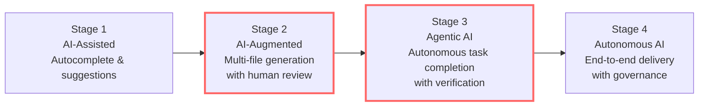
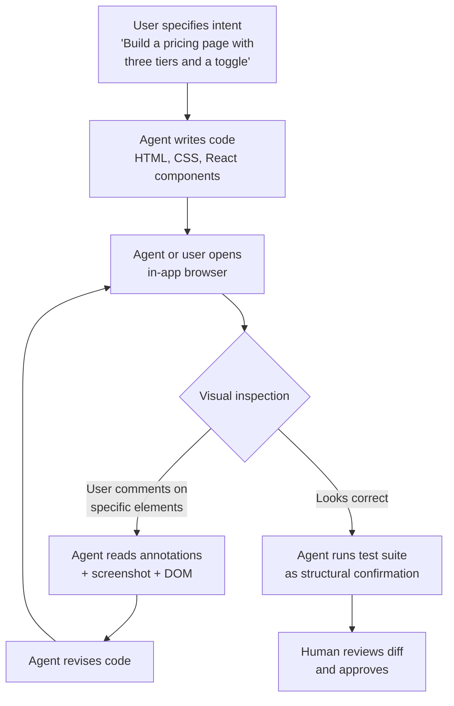
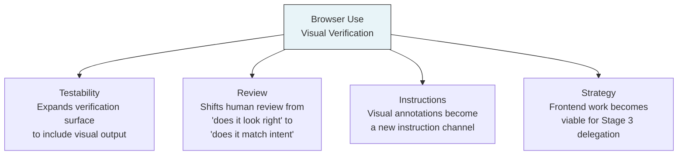

> **From Experiment to Enterprise: The Agentic Engineering Playbook — Supplementary Article**
> *This article examines how Codex's in-app browser and visual verification capabilities change the trust equation for agentic frontend development, and why closing the build-and-verify loop matters for enterprise adoption.*

# Codex Can See What It Builds: How Browser Use Closes the Verification Loop

## The gap between writing code and knowing it works

Every agentic coding tool on the market can write a React component. Most can run the test suite afterwards and report whether the tests pass. But until very recently, none of them could look at the rendered page and tell you whether the button is in the right place, whether the layout breaks on mobile, or whether the form actually submits when a user clicks through it.

That is not a trivial gap. It is the gap between structural correctness and experiential correctness — between code that satisfies a test harness and code that satisfies a user. For frontend development, this gap has been the single largest reason that agentic output still requires heavy human review. The agent writes plausible markup, the tests pass (often because the tests are also agent-generated), and the developer opens the browser to discover that the navigation menu overlaps the hero image on screens narrower than 768 pixels.

On 16 April 2026, OpenAI shipped the "Codex for (almost) everything" update, a major expansion that added background computer use on macOS, memory preview, image generation, more than 90 plugins, and — most relevant to this article — an in-app browser with visual commenting.[^1][^2][^3] James Sun, the Codex PM responsible for the browser feature, demonstrated the capability directly: Codex renders the page it has built, the user comments on specific elements, and the agent consumes those annotations as instructions, seeing everything the user sees through vision and acting on the feedback.[^4] The demo showed a tight loop — build, render, annotate, fix — completing in under 40 seconds.

This article examines what that loop means for agentic engineering maturity. Not as a feature announcement, but as a structural change in how agents verify their own work and how organisations decide to trust that verification.

## What the in-app browser actually does

The OpenAI developer documentation describes the in-app browser as "a shared view of rendered web pages inside a thread".[^5] The practical capabilities are straightforward:

- **Open local or public pages** — the browser can render localhost development servers, file-backed HTML pages, and public URLs that do not require authentication.
- **Comment directly on rendered elements** — the user enters comment mode, selects an element or area, and attaches a text instruction. Instead of writing "move the call-to-action button above the fold and increase the heading font weight," the user annotates the button itself and writes "move this up," then annotates the heading and writes "bolder."
- **Agent consumes visual context** — when the user submits comments, Codex auto-captures a screenshot plus the relevant DOM elements, giving the agent both pixel-level visual context and structural HTML context for precise changes.
- **Iterate within the thread** — the agent makes the change, the browser re-renders, and the user can comment again or approve.

The limitations are important and worth stating explicitly. The in-app browser does not support authentication flows, signed-in pages, cookies, extensions, or the user's existing browser profile.[^5] It is not a general-purpose browser. It is a verification surface for unauthenticated frontend work — which, for local development, covers a substantial share of the iteration cycle.

## Why visual verification changes the trust equation

The verification problem in agentic coding has always been asymmetric. Agents are excellent at structural checks — does the code compile, do the tests pass, does the linter approve? They are poor at experiential checks — does this look right, does this feel right, does this behave the way a user would expect?

That asymmetry creates a specific failure mode. In the [Testability](../codex-maturity/06-TST-proving-codex-right.article.md) dimension of the maturity model, I described how approximately half of AI-generated pull requests that pass automated test harnesses would not be merged by active maintainers.[^6] The cause is not that the code is wrong in ways tests can catch. The cause is that the code is wrong in ways that require human judgement — visual layout, interaction flow, accessibility, and the hundred small decisions that separate functional code from good code.

Browser use attacks this problem directly. It does not replace human judgement. It gives the agent access to the same sensory channel — rendered visual output — that humans use to form that judgement. The agent can now see the gap between the navigation menu and the hero image. It can see that the button text is truncated. It can see that the modal animation stutters.

This matters for the adoption model. In the four-stage framework I use for agentic engineering maturity:

The transition from Stage 2 (AI-Augmented) to Stage 3 (Agentic AI) is where most organisations stall. The reason is trust. At Stage 2, the human reviews every output before it ships. At Stage 3, the agent completes tasks with enough verification built into the loop that the human reviews outcomes rather than every intermediate step. That transition requires the agent's verification capability to be broad enough that the human is not the only quality gate.

For backend work, test suites and type systems provide that breadth. For frontend work, they do not. A green test suite tells you nothing about whether the page looks correct. Browser use closes that gap — not completely, but enough to shift the trust boundary.

## The build-and-verify loop in practice

The phrase "build and verify loop" describes a pattern that has become central to agentic coding: the agent writes code, executes it, inspects the result, and iterates until the result meets the specification. Sun described the browser feature as closing this loop "for local development" — making the rendered page part of what the agent can inspect and act on.[^4]

The loop with browser use looks like this:

The important structural feature is that the visual check happens inside the agent loop, not after it. In the previous workflow, the agent would write code, run tests, and declare the task complete. The human would then open a browser, find visual problems, and either fix them manually or write a new prompt. Each round-trip added latency and cognitive load.

With browser use, the visual feedback is part of the iteration cycle. The agent can self-correct visual problems before the human ever sees the output. The human's review shifts from "check whether this looks right" to "confirm that this matches the intent" — a higher-level, less tedious, and more reliable form of review.

Anthropic's harness engineering documentation describes a similar pattern for long-running application development: a generator agent creates frontend output, and an evaluator uses tools like Playwright to interact with the live page, score each criterion, and write detailed critique.[^7] The structural insight is identical — separate generation from visual grading to create a feedback loop that drives quality. The difference is that Codex integrates this directly into the product surface, while the Anthropic pattern requires custom harness engineering.

## The competitive landscape: who else can see what they build?

Browser use for coding agents is not a Codex-only capability. It is a capability that every serious agentic tool is converging on, through different architectural choices. Understanding those differences matters for enterprise teams evaluating their toolchain.

### Anthropic Claude Computer Use

Anthropic launched Claude Computer Use in research preview on 23 March 2026, giving Claude the ability to see, navigate, and control a user's desktop — clicking buttons, opening applications, filling spreadsheets, and completing multi-step workflows.[^8] Claude Opus 4.7, released on 18 April 2026, tripled vision resolution to approximately 3.75 megapixels and scored 98.5 per cent on visual-acuity benchmarks versus 54.5 per cent for the previous model.[^9]

Claude's approach is broader but less focused. Computer Use gives the agent access to the entire desktop, not just a browser rendering of the agent's own code. That generality is powerful for cross-application workflows — pulling API keys from a web dashboard, checking a staging deployment, verifying a form submission end-to-end — but it lacks the tight annotation-and-fix loop that Codex's in-app browser provides for frontend iteration specifically.

### Devin

Cognition's Devin has included browser access since its initial architecture. Devin runs in a fully sandboxed cloud environment with its own IDE, browser, terminal, and shell.[^10] It can navigate web applications, fill forms, click through user flows, and verify visual rendering in real browsers. It takes screenshots at desktop (1440px) and mobile (375px) widths to confirm layout matches design, and can record itself testing flows end-to-end.[^10]

Devin's advantage is autonomy — it can QA its own changes before they reach human review. Its limitation is the same as its advantage: the feedback loop is asynchronous. You assign a task, Devin works, and you review the result later. There is no equivalent to Codex's comment-on-the-rendered-page interaction, where the human steers the visual output in real time.

### Cursor

Cursor 3, released in April 2026, added cloud agents on isolated VMs and parallel Agent Tabs, but its browser verification story remains weaker than either Codex or Devin.[^11] Cursor's strength is IDE integration — it is a VS Code fork that embeds AI capabilities into the editor workflow. For visual verification, Cursor users typically rely on external browser windows and manual inspection, then feed observations back into the prompt. The gap is being addressed, but as of late April 2026, Cursor does not have an integrated browser verification surface.

### Summary comparison

| Capability | Codex in-app browser | Claude Computer Use | Devin browser | Cursor |
| --- | --- | --- | --- | --- |
| Visual rendering of agent output | Yes — integrated | Yes — via desktop | Yes — sandboxed | No — external |
| Direct annotation on rendered page | Yes | No | No | No |
| Agent self-verification loop | Partial — user-initiated | Yes — autonomous | Yes — autonomous | No |
| Authentication support | No | Yes — full desktop | Yes — sandboxed | N/A |
| Real-time human steering | Yes | Limited | No — asynchronous | Yes — via prompt |

The competitive picture is clear. Codex has the tightest human-in-the-loop visual iteration. Claude has the broadest visual capability. Devin has the most autonomous visual QA. Cursor has the deepest editor integration but the weakest visual verification. No tool has all four advantages simultaneously. Enterprise teams should expect convergence over the next two to three quarters.

## Enterprise implications: beyond "does it look right?"

The in-app browser is a frontend development feature today. But the pattern it establishes — agent-rendered output verified through a visual channel — has implications that extend well beyond whether a button is in the correct position.

### Visual regression testing

The current workflow for visual regression testing involves capturing baseline screenshots, making changes, capturing new screenshots, and running pixel-level or perceptual comparison. Tools like Applitools, Percy, and LambdaTest SmartUI automate the comparison step, but the capture step still depends on CI pipelines and external tooling.[^12]

Browser use enables a different pattern. The agent makes a change, renders the page, and compares the visual output against a baseline or specification — all within the same loop. That is not a replacement for dedicated visual regression tooling in CI. It is a shift-left mechanism that catches regressions before the code ever reaches CI, reducing the feedback latency from minutes to seconds.

For enterprise teams running large frontend applications, the reduction in CI cycle waste is material. If 30 per cent of visual regressions are caught by the agent during development rather than by CI after push, the saving compounds across every developer and every commit.

### Accessibility verification

One of the most promising and underexplored applications is accessibility testing. The Web Content Accessibility Guidelines (WCAG) define requirements that are partly structural (alt text, ARIA labels, heading hierarchy) and partly visual (colour contrast, text size, focus indicators). Automated tools like axe-core handle the structural checks. The visual checks have historically required human review.

An agent with browser access can, in principle, verify both. It can run axe-core against the rendered DOM for structural compliance and use vision to check contrast ratios, focus visibility, and layout at different viewport widths. This is not speculative — it is a direct application of the vision capabilities that already exist in the model. The limiting factor is not the model's ability to see. It is whether organisations build the verification prompts and integrate them into the agent loop.

The enterprise case is significant. Accessibility compliance is a legal requirement in many jurisdictions (the European Accessibility Act takes effect on 28 June 2025, and enforcement intensifies throughout 2026). Automated accessibility verification that runs inside the development loop, not as a separate audit after release, reduces both compliance risk and remediation cost.

### QA automation at the interaction level

The most ambitious enterprise application is full interaction-level QA — not just "does the page render correctly" but "does the user flow work end-to-end." Can the agent fill in the form, click submit, see the success message, navigate to the dashboard, and confirm the new record appears?

Devin already supports this pattern in its sandboxed environment.[^10] Codex's in-app browser does not yet support it at the same level — the current limitation to unauthenticated pages constrains the flows that can be tested. But the trajectory is clear. OpenAI has stated that the browser will be extended to incorporate actions like interacting with the greater Internet and taking screenshots.[^1] When authentication support arrives, the interaction-level QA pattern becomes viable inside Codex.

For QA teams, this represents a structural shift. While 75 per cent of organisations see AI testing as a priority, only 16 per cent have implemented it, making 2026 a tipping point as agentic AI, AI-generated code, and CI/CD pressure converge to make AI-augmented QA a business necessity.[^12]

## Where browser use sits in the maturity model

Browser use does not change the maturity model. It fills a gap that the model already identified. The [Testability](../codex-maturity/06-TST-proving-codex-right.article.md) dimension describes the verification surface — the system of tests, evals, and quality gates that converts agent output into trusted output. For backend work, that surface was already reasonably complete: unit tests, integration tests, type checks, linting, and CI pipelines. For frontend work, the surface had a hole where visual verification should be.

Browser use patches that hole. But it does so in a way that interacts with several other maturity dimensions:

**Testability:** The visual channel adds a verification dimension that was previously human-only. Teams can now include visual checks in their definition of "done" for agent-completed frontend tasks.

**Review:** The human reviewer's cognitive load drops when the agent has already verified visual output. Review shifts from low-level inspection ("is the padding correct?") to high-level alignment ("does this match the design intent?"). This is the same shift described in the [Review](../codex-maturity/07-REV-keeping-review-real.article.md) dimension — keeping review meaningful by reducing the trivial surface the human must inspect.

**Instructions:** Browser comments introduce a new instruction modality. Instead of describing visual changes in text ("move the button 20 pixels up and increase the heading to 24pt bold"), the user points at the element and describes the change in context. This is a lower-friction, higher-precision instruction channel that reduces specification ambiguity — one of the three most common testability failures.

**Strategy:** Frontend development has been one of the riskier domains for agentic delegation precisely because the verification gap made Stage 3 autonomy impractical. Browser use makes the strategy conversation different. A team that was previously unable to delegate frontend tasks beyond Stage 2 can now pilot Stage 3 delegation for specific frontend task classes — landing pages, component libraries, design-system implementations — where the visual verification loop is tight enough to trust.

## The verification loop is the product

There is a broader point here that extends beyond Codex and beyond frontend development. The most important capability of an agentic coding tool is not how well it generates code. It is how well it verifies the code it generates.

Every major tool is converging on this insight. Claude Computer Use gives the agent desktop-level sensory access. Devin runs in a sandboxed environment where it can test its own output. Codex now renders pages and accepts visual annotations. The competitive differentiation is not in generation quality — all frontier models produce competent code. The differentiation is in verification breadth: how many channels can the agent use to confirm that its output is correct?

The closed-loop development pattern — where agents write code, run tests, analyse failures, refine implementations, and iterate without human intervention — requires verification to be comprehensive.[^13] If the verification surface has holes, the loop amplifies errors rather than correcting them. The agent iterates confidently toward a solution that satisfies the checks it can run while remaining blind to the checks it cannot.

Browser use closes one of the largest remaining holes. It is not the last one. Audio, haptic, performance, and real-device testing all remain outside the agent's sensory range. But the principle is established: the agent that can verify across more channels produces more trustworthy output, and the organisation that builds those verification channels into its agent workflows is the one that can safely delegate more.

## Practical recommendations for teams

For teams evaluating browser use today, the practical guidance is straightforward:

**Start with static pages and component previews.** The in-app browser is most useful for work that renders without authentication — component libraries, landing pages, marketing pages, design-system documentation. Use it there first, build confidence, and expand.

**Use browser comments instead of text descriptions for visual changes.** The annotation interface is genuinely more precise than prose. "Move this up" with an arrow pointing at the element is less ambiguous than "move the CTA button above the fold on the pricing page." Reduce specification ambiguity wherever possible.

**Integrate visual checks into your definition of done.** If the task involves frontend output, the acceptance criteria should include "verified in browser" alongside "tests pass." Make this explicit in your `AGENTS.md` or task specification.

**Do not treat the in-app browser as a replacement for real-device testing.** It renders in a single viewport without authentication, cookies, or extensions. It is a development-time verification tool, not a release-quality testing environment. CI-based visual regression, cross-browser testing, and real-device testing remain necessary.

**Watch for the authentication expansion.** When the in-app browser supports authenticated pages, the verification surface expands dramatically. Plan your agent workflows so that adding authentication support later requires configuration changes, not architectural changes.

## What this means for the next twelve months

The convergence pattern is unmistakable. In February 2026, every major tool shipped multi-agent capabilities in the same two-week window.[^14] In April 2026, the convergence is on sensory expansion — giving agents access to visual, desktop, and browser channels that were previously human-only. The next wave, likely landing in the second half of 2026, will be verification orchestration: agents that do not just see the rendered page but systematically test interaction flows, accessibility compliance, and visual regression as part of their standard completion loop.

For enterprise teams, the implication is that frontend work is about to become a viable domain for Stage 3 agentic delegation. The teams that build the verification infrastructure now — visual baselines, accessibility check integration, annotation-based feedback workflows — will be the ones that can delegate confidently when the tools mature. The teams that wait for the tools to be perfect before starting will find themselves building that infrastructure under deadline pressure when their competitors are already shipping.

The verification loop is not a feature. It is the foundation of trust. And trust is what separates teams that use agentic tools from teams that rely on them.

---

## References

[^1]: OpenAI, "Codex for (almost) everything," openai.com, 16 April 2026. [https://openai.com/index/codex-for-almost-everything/](https://openai.com/index/codex-for-almost-everything/)

[^2]: OpenAI, "Changelog – Codex," developers.openai.com, April 2026. [https://developers.openai.com/codex/changelog](https://developers.openai.com/codex/changelog)

[^3]: SmartScope, "OpenAI Codex Desktop App Major Update (April 2026): What Changed with Computer Use, the In-App Browser, and 90+ Plugins," smartscope.blog, April 2026. [https://smartscope.blog/en/generative-ai/chatgpt/codex-desktop-major-update-april-2026/](https://smartscope.blog/en/generative-ai/chatgpt/codex-desktop-major-update-april-2026/)

[^4]: James Sun (@JamesZmSun), announcement of browser use inside Codex for local development build-and-verify loop, via X (formerly Twitter), April 2026.

[^5]: OpenAI, "In-app browser – Codex app," developers.openai.com, April 2026. [https://developers.openai.com/codex/app/browser](https://developers.openai.com/codex/app/browser)

[^6]: METR, blinded study on AI-generated pull requests and maintainer acceptance rates, March 2026. Cited in D. Vaughan, "Proving Codex Right: TDAD, Test Impact Maps, Eval Pipelines, and Benchmark Discipline," codex-resources, April 2026.

[^7]: Anthropic, "Harness design for long-running application development," anthropic.com/engineering, 2026. [https://www.anthropic.com/engineering/harness-design-long-running-apps](https://www.anthropic.com/engineering/harness-design-long-running-apps)

[^8]: Anthropic, Claude Computer Use Agent research preview launch, 23 March 2026. [https://tech-insider.org/anthropic-claude-computer-use-agent-2026/](https://tech-insider.org/anthropic-claude-computer-use-agent-2026/)

[^9]: Anthropic, Claude Opus 4.7 release with 3x vision resolution and visual-acuity improvements, 18 April 2026. [https://www.marktechpost.com/2026/04/18/anthropic-releases-claude-opus-4-7-a-major-upgrade-for-agentic-coding-high-resolution-vision-and-long-horizon-autonomous-tasks/](https://www.marktechpost.com/2026/04/18/anthropic-releases-claude-opus-4-7-a-major-upgrade-for-agentic-coding-high-resolution-vision-and-long-horizon-autonomous-tasks/)

[^10]: Cognition, Devin AI — autonomous software engineering agent with browser, IDE, and sandboxed environment. [https://devin.ai/](https://devin.ai/)

[^11]: MindStudio, "Codex vs Claude Code: Which AI Coding Agent Should You Use in 2026?" mindstudio.ai, 2026. [https://www.mindstudio.ai/blog/codex-vs-claude-code-2026](https://www.mindstudio.ai/blog/codex-vs-claude-code-2026)

[^12]: TestMu AI, "AI in QA: How Teams Are Using It in 2026," testmuai.com, 2026. [https://www.testmuai.com/blog/ai-in-qa/](https://www.testmuai.com/blog/ai-in-qa/)

[^13]: Alexander Zanfir, "Closed-Loop Development: How AI Agents Build Software While You Sleep," Medium, 2026. [https://medium.com/@alexzanfir/closed-loop-development-how-ai-agents-build-software-while-you-sleep-6df42cd05a85](https://medium.com/@alexzanfir/closed-loop-development-how-ai-agents-build-software-while-you-sleep-6df42cd05a85)

[^14]: Codegen, "Best AI Coding Agents in 2026: Ranked and Compared," codegen.com, 2026. [https://codegen.com/blog/best-ai-coding-agents/](https://codegen.com/blog/best-ai-coding-agents/)
