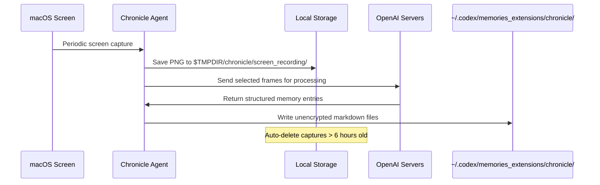
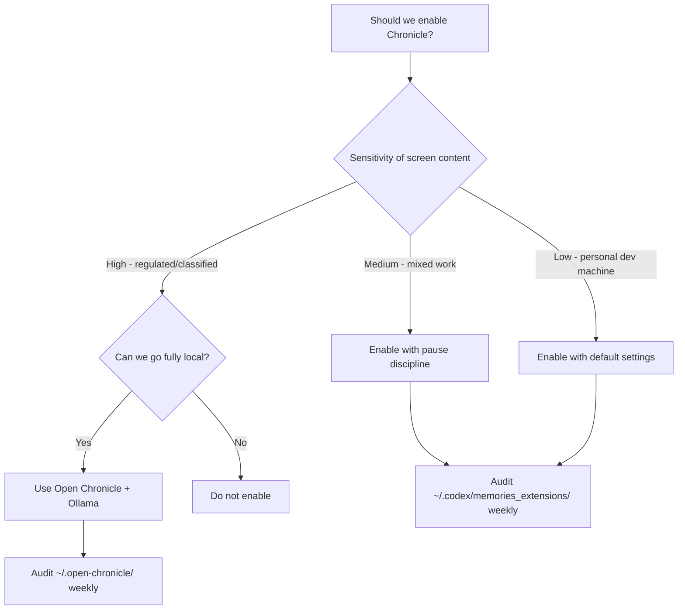

# Codex Chronicle and Screen-Context Memories: Ambient Developer Awareness for AI Coding Agents


---

On 20 April 2026, OpenAI shipped **Chronicle** as a research preview inside the Codex macOS app [^1]. The feature augments Codex's existing memory system with context drawn from what is *currently on your screen* — error messages, open documentation tabs, terminal output, design mocks — without the developer needing to copy-paste or explain anything. Two days later, an open-source alternative called **Open Chronicle** appeared, bringing the same concept to Codex CLI and Claude Code via MCP [^2].

This article examines both approaches: how screen-context memories work, how they integrate with the CLI, and the privacy trade-offs every team should evaluate before enabling them.

## Why Screen Context Matters

Coding agents already read your codebase. What they *cannot* see is everything else that shapes your next prompt: the stack trace in a browser tab, the Figma mock you are referencing, the Slack thread where a colleague explained the expected behaviour, or the Datadog dashboard showing a latency spike. Developers constantly context-switch between these windows, and the cost of re-stating that context to an agent is real — both in tokens and in cognitive load.

Chronicle's thesis is simple: if the agent can observe what you have been looking at, it can resolve ambiguity ("fix *this* error", "match *that* design") without an explicit context dump.

## How Chronicle Works



### Capture Pipeline

Chronicle runs as a background process on macOS, periodically capturing the screen and storing images under `$TMPDIR/chronicle/screen_recording/` [^1]. Captures older than six hours are automatically purged while the feature is active. Selected frames are sent to an ephemeral Codex session on OpenAI's servers, which extracts structured memories — summaries of what was visible, OCR text, file paths, and timing metadata [^3].

### Memory Storage

Generated memories land in `~/.codex/memories_extensions/chronicle/` as **unencrypted markdown files** [^4]. These sit alongside the core memory system under `~/.codex/memories/`, which stores durable entries, summaries, and evidence from prior threads [^5]. When you start a new Codex session — whether in the app or via `codex` / `codex exec` on the CLI — the memory loader picks up Chronicle entries alongside regular memories, injecting relevant context into the system prompt.

### Configuration

Chronicle's consolidation model can be overridden in your Codex configuration:

```toml
[memories]
consolidation_model = "gpt-5.4-mini"  # lighter model for summarisation
generate_memories = true
use_memories = true
```

The `consolidation_model` key controls which model summarises raw screen captures into memory entries [^5]. Using a smaller model here keeps costs down whilst still producing useful context.

## Enabling Chronicle

Chronicle is currently limited to **ChatGPT Pro subscribers on macOS**, excluding the EU, UK, and Switzerland [^1]. Activation requires:

1. **Settings > Personalisation > Memories** — toggle on
2. **Chronicle** — toggle on (appears below the Memories control)
3. **Accept the consent dialogue**
4. **Grant macOS permissions** — Screen Recording and Accessibility

Once active, a menu-bar icon provides pause/resume controls. OpenAI recommends pausing Chronicle before meetings or when viewing sensitive material [^3].

## CLI Integration: The Shared Memory Layer

Chronicle generates memories that live in the Codex home directory. Because Codex CLI reads from the same `~/.codex/memories/` and `~/.codex/memories_extensions/` hierarchy, **Chronicle memories are available in CLI sessions automatically** — no additional configuration required [^5].

This means a developer who has been debugging in the browser with Chronicle active can switch to the terminal and run:

```bash
codex "fix the TypeError I was just looking at"
```

The agent resolves "the TypeError" by consulting Chronicle memories that captured the browser's console output minutes earlier.

### Memory Controls in the TUI

The `/memories` slash command provides per-session control over memory behaviour without changing global settings [^5]. This is useful when you want a clean session that ignores Chronicle context:

```
/memories off     # disable memory injection for this thread
/memories on      # re-enable
/memories list    # inspect loaded memories
```

## Open Chronicle: The Open-Source Alternative

For teams that cannot or will not send screen data to OpenAI's servers, **Open Chronicle** offers a fully local alternative [^2]. It ships as a macOS menu-bar application with an MCP server, supporting both Codex CLI and Claude Code.

### Architecture Comparison

| Dimension | OpenAI Chronicle | Open Chronicle |
|-----------|-----------------|----------------|
| **OCR engine** | OpenAI servers | Apple Vision (on-device) |
| **LLM for summaries** | OpenAI models (cloud) | Ollama, LM Studio, or cloud APIs |
| **Storage** | `~/.codex/memories_extensions/chronicle/` | `~/.open-chronicle/open-chronicle.db` (SQLite) |
| **Retention** | 6 hours (captures) | 30 minutes (captures), indefinite (memories) |
| **Agent integration** | Native memory loader | MCP server with auto-invoke rules |
| **Completely offline** | No | Yes (with Ollama/LM Studio) |
| **Default exclusions** | Manual pause | Password managers, messaging apps, mail clients [^2] |

### Setting Up Open Chronicle with Codex CLI

Open Chronicle auto-configures both `~/.codex/AGENTS.md` and registers its MCP server during onboarding [^2]. The MCP server groups activity into 60-second windows and serves two-sentence summaries on demand. An auto-invoke rule tells Codex CLI to call the Chronicle MCP tool when it encounters ambiguous, context-dependent prompts like "continue where I left off" or "why is this failing?"

```bash
# Install Open Chronicle
git clone https://github.com/Screenata/open-chronicle
cd open-chronicle/app
swift run -c release

# Configure the LLM provider (e.g. local Ollama)
cat > open-chronicle/mcp/.env << 'EOF'
LLM_PROVIDER=ollama
LLM_MODEL=llama3.2
CAPTURE_INTERVAL=10
MEMORY_WINDOW=60
EOF
```

After launching the menu-bar app and granting Screen Recording permissions, Codex CLI sessions automatically gain access to screen context via MCP.

## Security and Privacy Considerations

Screen-context memory is powerful but introduces risks that merit serious evaluation.

### Prompt Injection Surface

OpenAI explicitly warns that Chronicle "increases exposure to prompt injection attacks from on-screen content" [^4]. Malicious text visible on screen — in a phishing email, a crafted web page, or even a colleague's screen share — could be ingested into memories and subsequently influence agent behaviour. This is a *new* attack surface that does not exist in code-only agents.

### Unencrypted Local Storage

Both Chronicle and Open Chronicle store memories as unencrypted files [^4] [^2]. Any process with file-system access can read them. On shared workstations or machines without full-disk encryption, this is a material risk. OpenAI's documentation notes: "Be aware that other apps may access these files" [^1].

### Rate Limit Consumption

Chronicle "consumes rate limits quickly" [^4]. Each screen capture processed by the ephemeral Codex session counts against your API quota. Teams on usage-based billing should monitor `codex usage` output and consider scheduling Chronicle pauses during non-coding activities.

### Enterprise Recommendations



For regulated environments, the safest option is Open Chronicle with a local LLM (Ollama or LM Studio), which keeps all data on the developer's machine and sends nothing to external servers [^2]. Teams that cannot justify even local screen capture should skip both tools and rely on explicit context-sharing via `codex --image` or manual copy-paste.

## Practical Workflow Patterns

### Pattern 1: Debug Loop With Visual Context

A developer sees a rendering bug in the browser, switches to the terminal, and types:

```bash
codex "the button alignment issue I was just looking at — fix the CSS"
```

Chronicle's memory of the browser screenshot provides the visual context. The agent identifies the misaligned element from the OCR text and cross-references it with the project's CSS files.

### Pattern 2: Documentation-Driven Implementation

While reading an API's reference documentation in a browser tab, the developer asks Codex to implement the integration:

```bash
codex "implement the webhook handler from the docs I have open"
```

Chronicle supplies the endpoint paths, payload schemas, and authentication details from the documentation page without the developer copying anything.

### Pattern 3: Post-Incident Context

After a production incident where the developer has been switching between Datadog, PagerDuty, and Slack, Chronicle captures the timeline. A follow-up session can reference this ambient context:

```bash
codex "write the post-mortem for the incident I was investigating"
```

## Limitations and Known Issues

- **macOS only** — Chronicle (both flavours) requires macOS 14+ and Apple's screen-capture APIs. Linux and Windows developers have no equivalent today. **[^1]** **[^2]**
- **No audio capture** — Chronicle processes visual content only; spoken context from meetings or pair-programming calls is not captured. **[^1]**
- **Memory staleness** — Chronicle memories are summaries, not verbatim recordings. Nuance can be lost, and stale memories from hours ago may mislead the agent if the situation has changed.
- **Regional restrictions** — OpenAI Chronicle is unavailable in the EU, UK, and Switzerland due to regulatory constraints. **[^1]**
- **Rate limit pressure** — heavy Chronicle usage on Pro plans can exhaust daily quotas before coding work begins. **[^4]**

## Looking Ahead

Chronicle signals a broader shift towards **ambient developer awareness** — agents that passively observe the developer's working environment rather than waiting for explicit instructions. The open-source ecosystem is already extending this with cross-agent compatibility (Open Chronicle supports both Codex CLI and Claude Code simultaneously [^2]), and it is reasonable to expect Linux support, IDE-native capture, and encrypted memory stores to follow.

For now, Chronicle is best treated as an experimental productivity lever: powerful when the developer understands its privacy boundaries, and best left disabled when those boundaries are unclear.

## Citations

[^1]: OpenAI. "Chronicle — Codex Memories." OpenAI Developers. [https://developers.openai.com/codex/memories/chronicle](https://developers.openai.com/codex/memories/chronicle)

[^2]: Screenata. "Open Chronicle: Local screen memory for Claude Code and Codex CLI." GitHub. [https://github.com/Screenata/open-chronicle](https://github.com/Screenata/open-chronicle)

[^3]: 9to5Mac. "Codex for Mac gains Chronicle for enhancing context using recent screen content." 20 April 2026. [https://9to5mac.com/2026/04/20/codex-for-mac-gains-chronicle-for-enhancing-context-using-recent-screen-content/](https://9to5mac.com/2026/04/20/codex-for-mac-gains-chronicle-for-enhancing-context-using-recent-screen-content/)

[^4]: Help Net Security. "OpenAI's Chronicle feature lets Codex read your screen, raising privacy concerns." 21 April 2026. [https://www.helpnetsecurity.com/2026/04/21/openai-chronicle-codex-screen-context-memories/](https://www.helpnetsecurity.com/2026/04/21/openai-chronicle-codex-screen-context-memories/)

[^5]: OpenAI. "Memories — Codex." OpenAI Developers. [https://developers.openai.com/codex/memories](https://developers.openai.com/codex/memories)
