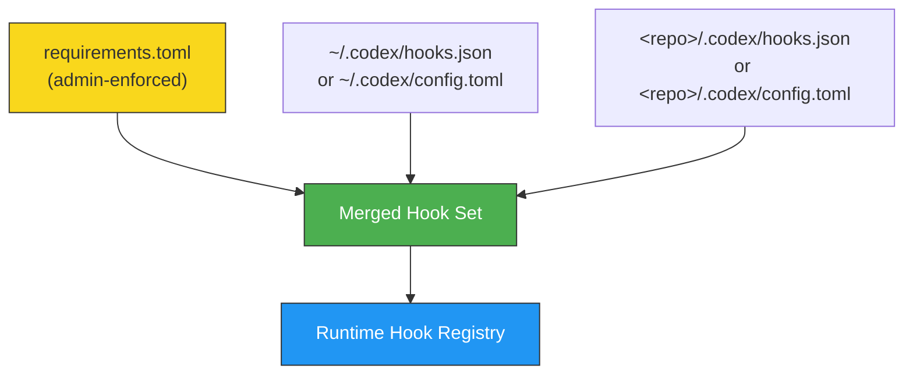
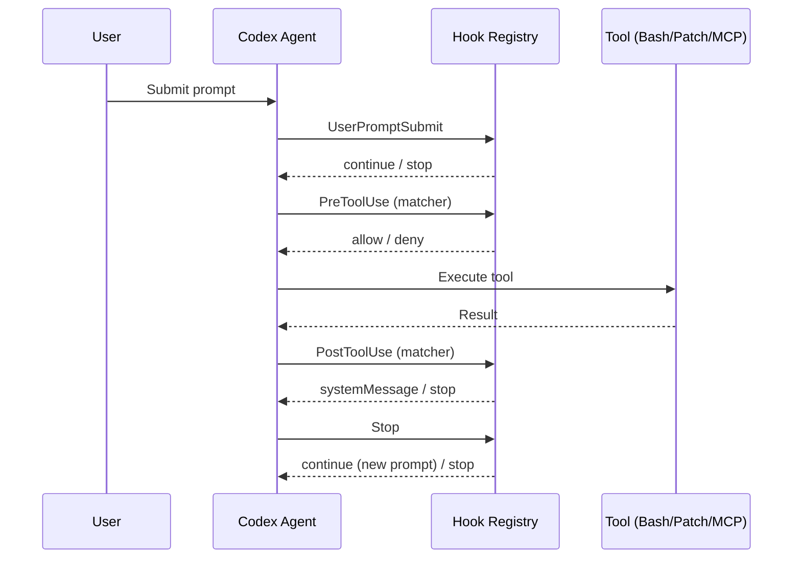

# v0.124 Hooks Migration Guide: From hooks.json to Inline config.toml


---

Codex CLI v0.124.0, released on 23 April 2026, marks hooks as **stable** and introduces inline hook definitions directly inside `config.toml` and `requirements.toml` [^1]. If you have been running hooks via standalone `hooks.json` files since the experimental phase, this guide walks you through migrating to the new inline format, explains the hook discovery order, and covers the enterprise-managed hooks workflow via `requirements.toml`.

## What Changed in v0.124

Three PRs landed together to graduate hooks from experimental to stable [^1][^2]:

| PR | Change |
|----|--------|
| [#18893](https://github.com/openai/codex/pull/18893) | Inline hooks support in `config.toml` and `requirements.toml` |
| [#19012](https://github.com/openai/codex/pull/19012) | Mark `codex_hooks` feature flag as stable |
| [#18385](https://github.com/openai/codex/pull/18385) | MCP tool observation support in hooks |
| [#18888](https://github.com/openai/codex/pull/18888) | `PostToolUse` emission for long-running Bash via `write_stdin` |
| [#18391](https://github.com/openai/codex/pull/18391) | `apply_patch` interception in `PreToolUse`/`PostToolUse` |

The headline change: you no longer need a separate `hooks.json` file. The same schema embeds natively as TOML tables inside `config.toml` [^3]. Existing `hooks.json` files continue to work unchanged — this is a purely additive migration [^2].

## Before: hooks.json

A typical project-level `hooks.json` at `<repo>/.codex/hooks.json`:

```json
{
  "hooks": {
    "PreToolUse": [
      {
        "matcher": "Bash",
        "hooks": [
          {
            "type": "command",
            "command": "/usr/bin/python3 \".codex/hooks/pre_tool_use_policy.py\"",
            "timeout": 30,
            "statusMessage": "Checking Bash command"
          }
        ]
      }
    ],
    "PostToolUse": [
      {
        "matcher": "mcp__filesystem__.*",
        "hooks": [
          {
            "type": "command",
            "command": "/usr/bin/python3 \".codex/hooks/audit_fs_writes.py\"",
            "timeout": 10,
            "statusMessage": "Auditing filesystem writes"
          }
        ]
      }
    ]
  }
}
```

This required the experimental feature flag in `config.toml`:

```toml
[features]
codex_hooks = true
```

## After: Inline config.toml

The identical configuration expressed as inline TOML in `<repo>/.codex/config.toml`:

```toml
# No feature flag needed — hooks are stable in v0.124+

[[hooks.PreToolUse]]
matcher = "^Bash$"

[[hooks.PreToolUse.hooks]]
type = "command"
command = 'python3 "/absolute/path/to/pre_tool_use_policy.py"'
timeout = 30
statusMessage = "Checking Bash command"

[[hooks.PostToolUse]]
matcher = "mcp__filesystem__.*"

[[hooks.PostToolUse.hooks]]
type = "command"
command = 'python3 "/absolute/path/to/audit_fs_writes.py"'
timeout = 10
statusMessage = "Auditing filesystem writes"
```

Key differences:

1. **No feature flag required.** The `codex_hooks` feature defaults to stable and enabled in v0.124+ [^4].
2. **TOML array-of-tables syntax.** Each event group uses `[[hooks.EventName]]` and each command within it uses `[[hooks.EventName.hooks]]` [^3].
3. **Absolute paths recommended.** Commands run with the session `cwd` as working directory, so relative paths could be hijacked by workspace scripts [^2].

## Step-by-Step Migration

### 1. Identify Your Hook Layers

Codex discovers hooks at multiple configuration layers [^5]:



Higher-precedence layers **do not replace** lower-precedence hooks — they merge additively [^5]. Audit each layer to understand what hooks are currently active.

### 2. Convert JSON to TOML

The mapping is mechanical. For each event array in your `hooks.json`:

| JSON | TOML |
|------|------|
| `"hooks": { "PreToolUse": [ { ... } ] }` | `[[hooks.PreToolUse]]` |
| `"matcher": "Bash"` | `matcher = "^Bash$"` |
| `"hooks": [ { "type": "command", ... } ]` | `[[hooks.PreToolUse.hooks]]` with fields below |
| `"command": "..."` | `command = '...'` |
| `"timeout": 30` | `timeout = 30` |
| `"statusMessage": "..."` | `statusMessage = "..."` |

Note that matchers use **regex patterns** — if your JSON matcher was a plain string like `"Bash"`, consider anchoring it to `"^Bash$"` in TOML for precision [^3].

### 3. Remove the Feature Flag

Delete the experimental feature toggle from your `config.toml` if present:

```toml
# Remove this — no longer needed
# [features]
# codex_hooks = true
```

The feature is stable and on by default [^4]. Keeping it won't break anything, but it's dead configuration.

### 4. Delete hooks.json

Once your inline TOML hooks are working, remove the `hooks.json` file. If both coexist at the same layer, Codex loads both but emits a startup warning [^3].

### 5. Test Your Migration

Verify hooks fire correctly:

```bash
# Run Codex with verbose logging to see hook execution
codex --log-level debug "echo hello"
```

Watch for hook registration messages and any warnings about duplicate definitions at the same layer.

## Hook Events Reference

v0.124 supports six lifecycle events [^3]:



| Event | When It Fires | Can Block? | Filters By |
|-------|--------------|------------|------------|
| `SessionStart` | Session begins or resumes | Yes | Start source |
| `UserPromptSubmit` | User submits a prompt | Yes | — |
| `PreToolUse` | Before tool execution | Yes (deny) | Tool name regex |
| `PermissionRequest` | When approval is needed | Yes (deny) | Tool name regex |
| `PostToolUse` | After tool completes | Yes (stop) | Tool name regex |
| `Stop` | Agent turn ends | Can continue | — |

### Newly Observable in v0.124

- **MCP tools**: Hooks can now match MCP tool names using patterns like `mcp__server__tool_name` [^6].
- **apply_patch**: File edits via the `Edit` and `Write` tool aliases are interceptable with `^apply_patch$` [^7].
- **Long-running Bash**: `PostToolUse` fires when `exec_command` completes via `write_stdin`, not just when the initial Bash call returns [^8].

## Enterprise Managed Hooks via requirements.toml

For organisations deploying Codex at scale, v0.124 enables hook policy enforcement through `requirements.toml` [^2][^9]:

```toml
# /etc/codex/requirements.toml (admin-enforced)

[hooks]
managed_dir = "/opt/company/codex-hooks"

[[hooks.PreToolUse]]
matcher = "^Bash$"

[[hooks.PreToolUse.hooks]]
type = "command"
command = "/opt/company/codex-hooks/security_scan.py"
timeout = 60
statusMessage = "Running security policy check"
```

Key points for enterprise deployment:

- **`managed_dir`** specifies where hook scripts live — use absolute paths [^9].
- **Scripts are deployed separately** via MDM or device-management tooling; `requirements.toml` only declares which hooks to run [^2].
- **Requirements-managed hooks load first** in the discovery chain, before any user or project hooks [^2].
- **Users cannot override** managed hooks — they merge additively [^5].

On Windows, use the `windows_managed_dir` key:

```toml
[hooks]
managed_dir = "/opt/company/codex-hooks"
windows_managed_dir = 'C:\Company\codex-hooks'
```

## Hook Input and Output Contract

Every hook receives JSON on stdin with common fields [^3]:

```json
{
  "session_id": "sess_abc123",
  "transcript_path": "/home/user/.codex/sessions/sess_abc123.jsonl",
  "cwd": "/home/user/project",
  "hook_event_name": "PreToolUse",
  "model": "o4-mini",
  "turn_id": "turn_xyz"
}
```

Event-specific input fields are appended (e.g., `tool_name` and `tool_input` for `PreToolUse`).

The response contract supports:

| Field | Type | Effect |
|-------|------|--------|
| `continue` | boolean | `false` stops the session |
| `stopReason` | string | Displayed when stopping |
| `systemMessage` | string | Injected as system context |
| `suppressOutput` | boolean | Hides tool output from the agent |

For `PreToolUse`, return a `permissionDecision` of `"deny"` with a `permissionDecisionReason` to block execution. Exit code `0` with no output means success; exit code `2` writes the blocking reason to stderr [^3].

## Common Migration Pitfalls

1. **Duplicate definitions.** Having both `hooks.json` and `[hooks]` in the same config layer triggers a warning. Choose one per layer [^3].
2. **Relative paths.** Hook commands run with `cwd` set to the workspace. Use absolute paths — especially for managed enterprise hooks [^2].
3. **Unanchored matchers.** A matcher of `Bash` also matches `BashDebug` if such a tool existed. Use `^Bash$` for exact matching [^3].
4. **Timeout defaults.** The default timeout is 600 seconds. For fast policy checks, set an explicit lower timeout to avoid blocking the agent [^3].

## Summary

v0.124 makes hooks a first-class, stable feature of Codex CLI. The migration from `hooks.json` to inline `config.toml` is additive and non-breaking — but consolidating to a single format per layer removes startup warnings and simplifies maintenance. For enterprise teams, `requirements.toml` now provides an enforceable hook policy channel that integrates with existing device management workflows.

## Citations

[^1]: [Codex CLI Changelog — v0.124.0](https://developers.openai.com/codex/changelog), OpenAI Developers, April 2026.
[^2]: [PR #18893 — codex: support hooks in config.toml and requirements.toml](https://github.com/openai/codex/pull/18893), OpenAI/codex, April 2026.
[^3]: [Hooks — Codex CLI Documentation](https://developers.openai.com/codex/hooks), OpenAI Developers.
[^4]: [Configuration Reference — Codex CLI Documentation](https://developers.openai.com/codex/config-reference), OpenAI Developers.
[^5]: [Advanced Configuration — Codex CLI Documentation](https://developers.openai.com/codex/config-advanced), OpenAI Developers.
[^6]: [PR #18385 — Support MCP tools in hooks](https://github.com/openai/codex/pull/18385), OpenAI/codex, April 2026.
[^7]: [PR #18391 — apply_patch interception in hooks](https://github.com/openai/codex/pull/18391), OpenAI/codex, April 2026.
[^8]: [PR #18888 — hooks: emit Bash PostToolUse when exec_command completes via write_stdin](https://github.com/openai/codex/pull/18888), OpenAI/codex, April 2026.
[^9]: [Managed Configuration — Codex CLI Enterprise Documentation](https://developers.openai.com/codex/enterprise/managed-configuration), OpenAI Developers.
