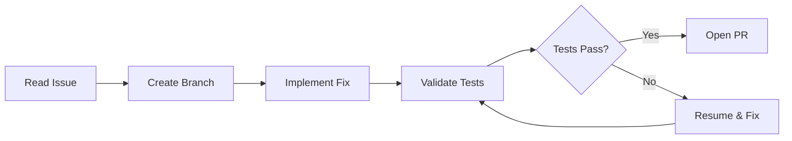

# Scripting the Issue-to-PR Pipeline: Automating the Complete GitHub Workflow with Codex CLI


GPT-5.5 landed yesterday with a 60% hallucination reduction and an 82.7% score on Terminal-Bench 2.0 [^1]. That accuracy improvement changes the economics of a question every team asks: *how much of the issue-to-merged-PR lifecycle can you safely hand to an agent?*

The answer in April 2026 is: most of it — if you script it properly. This article walks through a complete `codex exec`-based pipeline that reads a GitHub issue, creates a branch, implements the fix, validates it against tests, and opens a pull request, all from a single shell script or GitHub Actions workflow.

## The Pipeline Architecture

The pipeline has five discrete stages. Each stage uses `codex exec` non-interactively, with the output of one feeding into the next [^2].



The critical design principle: **Codex handles code edits; shell scripting handles Git and GitHub operations.** The `gh` CLI cannot run inside Codex's sandbox because network access to the GitHub API is blocked by default [^3]. Splitting responsibilities this way keeps the sandbox tight and the pipeline predictable.

## Stage 1: Read the Issue and Extract Context

Start by pulling the issue body and comments into a structured prompt. The `gh` CLI does the heavy lifting outside the sandbox:

```bash
#!/usr/bin/env bash
set -euo pipefail

ISSUE_NUMBER="${1:?Usage: fix-issue.sh <issue-number>}"
REPO="${2:-$(gh repo view --json nameWithOwner -q .nameWithOwner)}"

# Fetch issue context
ISSUE_BODY=$(gh issue view "$ISSUE_NUMBER" --json title,body,comments \
  --jq '{title: .title, body: .body, comments: [.comments[].body]}')

ISSUE_TITLE=$(echo "$ISSUE_BODY" | jq -r .title)
BRANCH_NAME="fix/issue-${ISSUE_NUMBER}-$(echo "$ISSUE_TITLE" | \
  tr '[:upper:]' '[:lower:]' | tr ' ' '-' | head -c 40)"
```

This extracts the issue title, body, and all comments into a JSON structure that Codex can consume as stdin [^2].

## Stage 2: Branch Creation

Create the branch *before* Codex touches anything. This is pure Git — no agent involvement needed:

```bash
git fetch origin main
git checkout -b "$BRANCH_NAME" origin/main
```

## Stage 3: Implementation with codex exec

Here is where the agent does its work. Pipe the issue context into `codex exec` with a tightly scoped prompt:

```bash
echo "$ISSUE_BODY" | codex exec \
  --full-auto \
  --sandbox workspace-write \
  --model gpt-5.5 \
  --ephemeral \
  "You are fixing GitHub issue #${ISSUE_NUMBER}.

The issue details are provided via stdin as JSON with title, body, and comments fields.

Instructions:
1. Read and understand the issue.
2. Identify the minimal code change needed.
3. Implement ONLY that change — no unrelated refactoring.
4. Do not modify test files unless the issue explicitly requires it.
5. Stop when the fix is complete."
```

Key flags explained:

- `--full-auto` enables the low-friction preset: `on-request` approval policy with `workspace-write` sandbox [^4]. The agent can edit files in the working directory but cannot escape it.
- `--sandbox workspace-write` explicitly sets the sandbox boundary — the agent can read and write within the repo but cannot install packages or access the network [^4].
- `--ephemeral` prevents session files from accumulating on disk during CI runs [^2].
- `--model gpt-5.5` targets the new frontier model. For cost-sensitive pipelines, `gpt-5.4-mini` works for simpler fixes at lower credit cost [^5].

## Stage 4: Test Validation

Run your test suite *outside* Codex to get deterministic, trusted results:

```bash
TEST_OUTPUT=$(npm test 2>&1) || true
TEST_EXIT_CODE=$?

if [ "$TEST_EXIT_CODE" -ne 0 ]; then
  echo "Tests failed. Attempting recovery..."

  echo "$TEST_OUTPUT" | codex exec \
    --full-auto \
    --sandbox workspace-write \
    --model gpt-5.5 \
    --ephemeral \
    "The tests failed after implementing a fix for issue #${ISSUE_NUMBER}.
     The test output is provided via stdin.
     Fix the implementation (not the tests) to make all tests pass.
     Make the minimal change necessary."

  # Re-run tests after recovery attempt
  npm test
fi
```

This pattern — run tests externally, pipe failures back in, let Codex iterate — avoids the common anti-pattern of letting the agent run its own tests inside the sandbox, where it might modify tests to make them pass [^6].

### Session Resumption for Complex Fixes

For multi-step fixes that need context continuity, use `codex exec resume` instead of a fresh session:

```bash
# Initial implementation
codex exec --full-auto --sandbox workspace-write \
  "Fix issue #${ISSUE_NUMBER}: ${ISSUE_TITLE}"

# If tests fail, resume with the failure context
echo "$TEST_OUTPUT" | codex exec resume --last \
  "Tests failed. The output is provided via stdin. Fix the implementation."
```

The resumed session retains the original transcript, plan history, and approval state, so Codex understands what it already tried [^7].

## Stage 5: PR Creation with Structured Output

Extract a structured summary from Codex for the PR body, then use `gh` to create the pull request:

```bash
cat > /tmp/pr-schema.json << 'SCHEMA'
{
  "type": "object",
  "properties": {
    "summary": { "type": "string" },
    "changes": {
      "type": "array",
      "items": { "type": "string" }
    },
    "risk_level": {
      "type": "string",
      "enum": ["low", "medium", "high"]
    }
  },
  "required": ["summary", "changes", "risk_level"],
  "additionalProperties": false
}
SCHEMA

codex exec \
  --full-auto \
  --sandbox read-only \
  --output-schema /tmp/pr-schema.json \
  -o /tmp/pr-output.json \
  --ephemeral \
  "Review the git diff (staged and unstaged) in this repository.
   Produce a concise summary of what changed, a list of specific
   file-level changes, and a risk assessment."

PR_SUMMARY=$(jq -r .summary /tmp/pr-output.json)
PR_CHANGES=$(jq -r '.changes | map("- " + .) | join("\n")' /tmp/pr-output.json)
PR_RISK=$(jq -r .risk_level /tmp/pr-output.json)

git add -A
git commit -m "fix: resolve #${ISSUE_NUMBER} — ${ISSUE_TITLE}

Co-Authored-By: Codex CLI <noreply@openai.com>"

git push -u origin "$BRANCH_NAME"

gh pr create \
  --title "fix: ${ISSUE_TITLE}" \
  --body "$(cat <<EOF
Fixes #${ISSUE_NUMBER}

## Summary
${PR_SUMMARY}

## Changes
${PR_CHANGES}

## Risk Level
**${PR_RISK}**

---
*Automated by Codex CLI with GPT-5.5*
EOF
)"
```

The `--output-schema` flag enforces a JSON Schema on the final response [^2]. Downstream tooling receives validated, predictable data — no parsing fragile prose.

## Moving This to GitHub Actions

The same pipeline translates directly into a GitHub Actions workflow triggered by issue labels:

```yaml
name: Codex Autofix
on:
  issues:
    types: [labeled]

jobs:
  fix:
    if: github.event.label.name == 'autofix'
    runs-on: ubuntu-latest
    permissions:
      contents: write
      pull-requests: write
      issues: read
    steps:
      - uses: actions/checkout@v4
      - uses: actions/setup-node@v4
        with:
          node-version: '22'
      - run: npm ci
      - run: npm install -g @openai/codex
        env:
          CODEX_API_KEY: ${{ secrets.OPENAI_API_KEY }}
      - name: Run Codex fix pipeline
        run: ./scripts/fix-issue.sh ${{ github.event.issue.number }}
        env:
          CODEX_API_KEY: ${{ secrets.OPENAI_API_KEY }}
          GH_TOKEN: ${{ secrets.GITHUB_TOKEN }}
```

Alternatively, the `openai/codex-action@v1` GitHub Action handles CLI installation and authentication automatically [^8], reducing the boilerplate.

## Safety Considerations

Three guardrails keep this pipeline trustworthy:

1. **Sandbox boundaries.** `workspace-write` prevents the agent from installing packages, modifying global state, or making network requests [^4]. The `gh` CLI runs outside the sandbox, so credential exposure is impossible.

2. **Test-outside pattern.** Running tests in the outer shell script — not inside Codex — means the agent cannot game the validation step [^6]. If tests fail, the agent gets the output as read-only stdin and must fix the *implementation*, not the tests.

3. **Structured output validation.** The `--output-schema` flag rejects malformed responses at the harness level [^2]. If Codex returns something that does not match the schema, the pipeline fails closed rather than creating a broken PR.

For enterprise environments, `requirements.toml` can enforce these constraints at the organisational level, preventing individual developers from relaxing the sandbox [^9].

## When to Use This Pattern

This pipeline works best for **well-defined, test-covered issues**: bug fixes with reproduction steps, dependency bumps, configuration changes, and small feature additions where acceptance criteria are clear. It is not suitable for architectural decisions, security-sensitive changes, or issues where the acceptance criteria are ambiguous — those still need a human in the loop before the agent starts writing code [^10].

With GPT-5.5's improved accuracy and the stable hooks in v0.124 [^11], the sweet spot has shifted. Tasks that required `suggest` mode six months ago can now run safely in `--full-auto` with a test-outside validation loop. The bottleneck is no longer agent capability — it is test coverage.

## Citations

[^1]: OpenAI. "Introducing GPT-5.5." openai.com/index/introducing-gpt-5-5/, April 23, 2026.
[^2]: OpenAI. "Non-interactive mode — Codex." developers.openai.com/codex/noninteractive.
[^3]: SmartScope. "Why `gh` CLI won't run in Codex and how to handle it." smartscope.blog, 2026.
[^4]: OpenAI. "Command line options — Codex CLI." developers.openai.com/codex/cli/reference.
[^5]: OpenAI. "Models — Codex." developers.openai.com/codex/models.
[^6]: OpenAI. "Best practices — Codex CLI." developers.openai.com/codex/cli/features. "Tests create an external source of truth that stays accurate regardless of session length."
[^7]: OpenAI. "Non-interactive mode — codex exec resume." developers.openai.com/codex/noninteractive. "The session keeps the original transcript, plan history, and approvals."
[^8]: OpenAI. "Codex GitHub Action." github.com/openai/codex-action.
[^9]: OpenAI. "Managed configuration — Codex." developers.openai.com/codex/enterprise/managed-configuration.
[^10]: OpenAI. "Auto-fix CI failures with Codex." developers.openai.com/codex/guides/autofix-ci/.
[^11]: OpenAI. "Codex CLI v0.124.0 Changelog." developers.openai.com/codex/changelog. Hooks graduated from experimental to stable.
