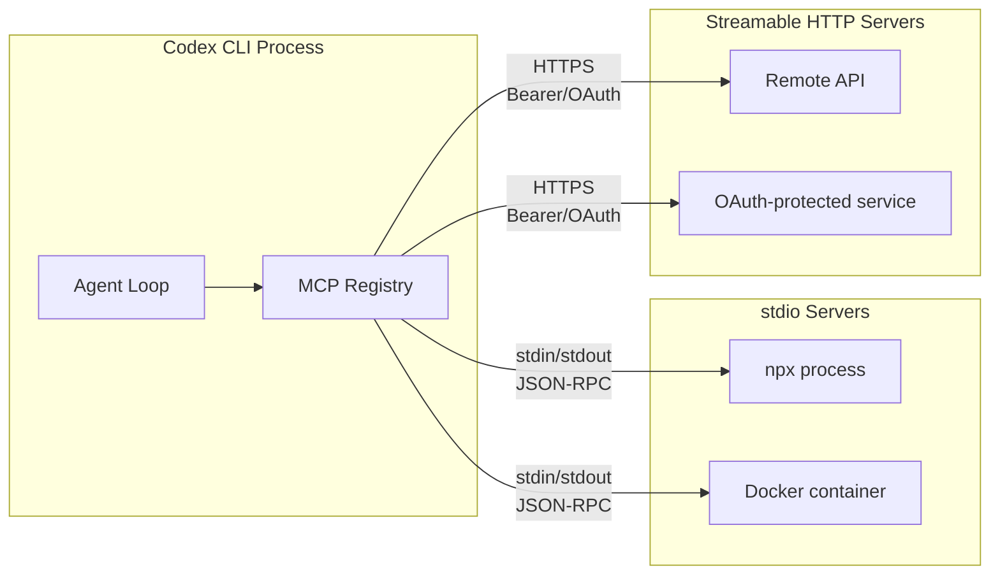
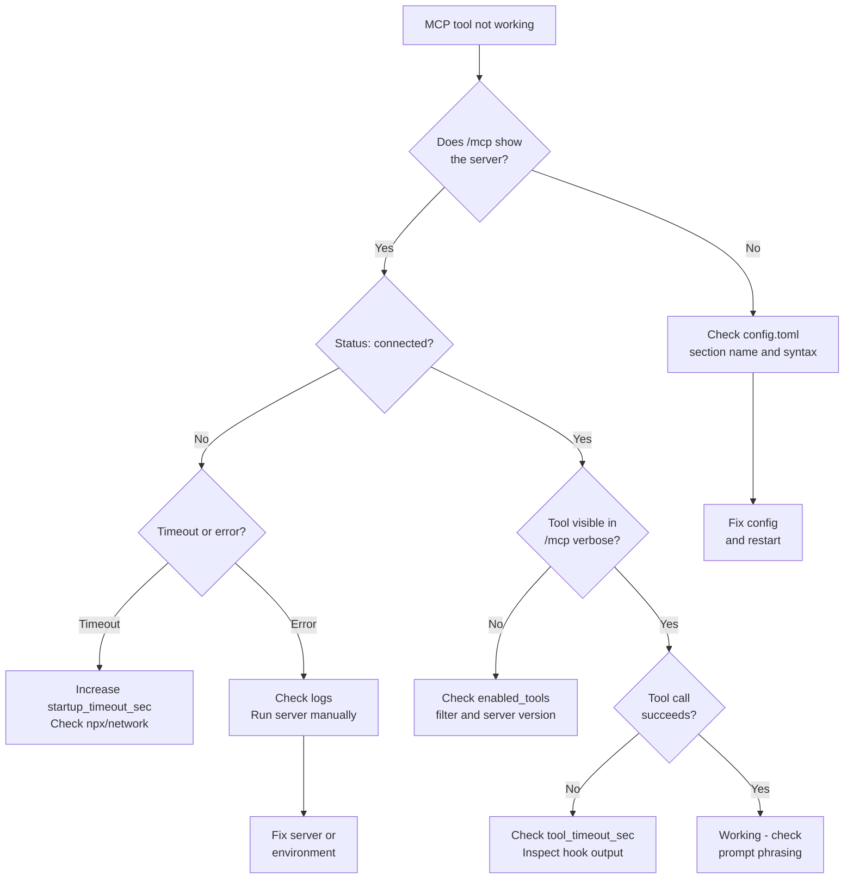

# MCP Debugging and Diagnostics in Codex CLI: The Complete Troubleshooting Guide


---

Model Context Protocol servers are the primary extension mechanism for Codex CLI, connecting agents to external tools, APIs, and data sources.[^1] When they work, the experience is seamless. When they fail, the default behaviour is near-silent: Codex CLI historically silenced error output from MCP server processes, leaving developers guessing why a tool registration vanished or a connection timed out.[^2] With v0.123's `/mcp verbose` command and v0.124's stable hook observation for MCP tools, the diagnostics story has improved substantially.[^3][^4] This guide covers every debugging surface now available.

---

## MCP Architecture in Codex CLI

Codex CLI supports two transport types for MCP servers: **stdio** (local processes) and **streamable HTTP** (remote services).[^1] Understanding which transport your server uses is the first step in any debugging session, because the failure modes differ completely.



Stdio servers are spawned as child processes. Codex writes JSON-RPC initialisation messages to the child's stdin and reads responses from stdout. If the child never receives the `initialize` request — a bug that surfaced on Windows in early 2026 — every server appears to time out identically.[^2] HTTP servers communicate over HTTPS with bearer tokens or OAuth flows, and their failures tend to surface as HTTP status codes rather than silent hangs.

---

## The Diagnostic Toolkit

### `/mcp` — Quick Status Check

Type `/mcp` in the TUI to see a summary of connected MCP servers, their status, and the tools they expose.[^1] This is your first port of call when a tool you expect is missing from the agent's capabilities.

The output shows:

- Server name and transport type
- Connection status (connected, failed, disabled)
- List of registered tools per server

### `/mcp verbose` — Full Diagnostics

Introduced in v0.123.0, `/mcp verbose` expands the output to include resources, resource templates, and detailed server metadata.[^3] This is the command to use when `/mcp` shows a server as connected but tools are not behaving as expected. It reveals:

- Full tool schemas (parameter names, types, descriptions)
- Available resources and resource templates
- Server capability declarations
- Timeout configuration per server

### `/feedback` — Session Diagnostics

The `/feedback` command outputs session-level diagnostic information including the Request ID, Session ID, connection status, and a list of active tools and MCP servers.[^5] This is useful when filing bug reports or correlating issues with server-side logs.

### Log Files

Codex CLI writes MCP-related events to `~/.codex/log/codex-tui.log`.[^5] Grep for MCP server names or `mcp` to find connection events, timeout errors, and initialisation failures:

```bash
grep -i "mcp\|initialize\|timeout" ~/.codex/log/codex-tui.log | tail -50
```

For more targeted debugging, the `codex debug` subcommand provides additional diagnostics and debug helpers.[^5]

---

## Configuration Reference for MCP Servers

All MCP server configuration lives in `config.toml` — either globally at `~/.codex/config.toml` or project-scoped at `.codex/config.toml` (trusted projects only).[^1][^6] The section name **must** use an underscore: `mcp_servers`, not `mcp-servers` or `mcpServers`. Using the wrong name causes Codex to silently ignore the entire block.[^6]

### Stdio Server Configuration

```toml
[mcp_servers.my-server]
command = "npx"
args = ["-y", "@example/mcp-server"]
env = { API_KEY = "sk-..." }
cwd = "/home/dev/project"
startup_timeout_sec = 15    # default: 10
tool_timeout_sec = 120      # default: 60
enabled = true
required = true             # fail startup if this server cannot initialise
```

### Streamable HTTP Server Configuration

```toml
[mcp_servers.remote-api]
url = "https://mcp.example.com/v1"
bearer_token_env_var = "MCP_REMOTE_TOKEN"
http_headers = { "X-Custom-Header" = "value" }
startup_timeout_sec = 20
tool_timeout_sec = 90
```

### Tool Filtering

When a server exposes dozens of tools but you only need a few, use allow/deny lists to reduce schema bloat — a real performance concern documented in the MCP schema tax research.[^7]

```toml
[mcp_servers.github]
command = "npx"
args = ["-y", "@modelcontextprotocol/server-github"]
env = { GITHUB_TOKEN = "ghp_..." }
enabled_tools = ["create_pull_request", "list_issues", "get_file_contents"]
disabled_tools = []  # applied after enabled_tools
```

### Parallel Tool Calls

MCP tools default to serialised execution. To enable parallel calls for a server whose tools are safe to run concurrently:[^6]

```toml
[mcp_servers.read-only-api]
command = "npx"
args = ["-y", "@example/read-only-mcp"]
supports_parallel_tool_calls = true
```

> **Warning:** Only enable this for servers whose tools do not share mutable state. Read-write race conditions on files, databases, or external resources can produce non-deterministic failures that are extremely difficult to debug.[^6]

---

## Common Failure Patterns and Fixes

### 1. Silent Timeout on All Servers

**Symptoms:** Every MCP server reports "request timed out" regardless of type. Servers work when run directly from the terminal.[^2]

**Root cause:** Codex is not delivering the `initialize` JSON-RPC message to the child process's stdin. This was a known stdio wiring defect, particularly on Windows, fixed in a 2026 engineering update.[^2]

**Fix:**

- Update to the latest Codex CLI version
- On Windows, avoid single-quoted argument paths in the `command` field
- Test with a minimal server configuration to isolate the issue

### 2. Server Starts but Tools Are Missing

**Symptoms:** `/mcp` shows the server as connected, but expected tools do not appear.

**Diagnosis:** Run `/mcp verbose` to inspect the full tool list. Common causes:

- **`enabled_tools` filter is too restrictive** — check your allow list
- **Server version mismatch** — the tool was added in a newer version of the MCP server
- **Namespace collision** — if two servers expose tools with the same name, one may shadow the other

### 3. Configuration Silently Ignored

**Symptoms:** MCP servers defined in `config.toml` do not appear at all.

**Common causes:**

- Wrong section name: `[mcp-servers.foo]` instead of `[mcp_servers.foo]`[^6]
- Project-scoped config in an untrusted directory — Codex only loads `.codex/config.toml` from trusted projects[^1]
- TOML syntax error elsewhere in the file that prevents parsing — validate with `taplo check config.toml` or similar

### 4. OAuth Authentication Failures

**Symptoms:** Streamable HTTP server fails to connect with authentication errors.

**Diagnosis:**

```bash
codex mcp login <server-name>
```

Check that `mcp_oauth_callback_port` is not blocked by a firewall. For remote setups, set `mcp_oauth_callback_url` to the externally reachable address.[^1] Servers advertising `scopes_supported` take precedence over `config.toml` scope settings.[^1]

### 5. Startup Timeout on Heavy Servers

**Symptoms:** Server fails with timeout during initialisation but works on retry.

**Fix:** Increase `startup_timeout_sec` beyond the default 10 seconds. Servers that download dependencies at startup (common with `npx -y` patterns) often need 15-30 seconds on first run:[^1]

```toml
[mcp_servers.heavy-server]
command = "npx"
args = ["-y", "@example/heavy-mcp-server"]
startup_timeout_sec = 30
```

---

## Debugging Flow

When an MCP server is not working as expected, follow this systematic approach:



---

## Hook-Based MCP Observation

As of v0.124.0, hooks are stable and can observe MCP tool calls through `PreToolUse` and `PostToolUse` events.[^4] This is a significant upgrade from earlier versions where hooks only fired for Bash tool invocations.[^8]

MCP tools use the naming convention `mcp__<server>__<tool>`, where `<server>` is the MCP server name and `<tool>` is the specific tool it provides.[^8] You can write hooks that target specific MCP tools for auditing, logging, or policy enforcement.

### Audit Logging Hook

Create a hook that logs every MCP tool call to a file for compliance or debugging purposes:

```toml
[[hooks]]
event = "PostToolUse"
match_tool = "mcp__*"
command = "bash -c 'echo \"$(date -u +%Y-%m-%dT%H:%M:%SZ) $CODEX_TOOL_NAME $CODEX_TOOL_EXIT_CODE\" >> ~/.codex/mcp-audit.log'"
```

### MCP Tool Gate Hook

Block specific MCP operations in sensitive environments:

```toml
[[hooks]]
event = "PreToolUse"
match_tool = "mcp__github__create_pull_request"
command = "bash -c 'if [ \"$CODEX_ENV\" = \"production\" ]; then echo \"Blocked: PR creation disabled in production\"; exit 1; fi'"
```

### Inline Hook Configuration

Hooks can now be defined directly in `config.toml` alongside MCP server definitions, making it straightforward to co-locate server configuration with its observability rules.[^4] This also works in managed `requirements.toml` for enterprise deployments.

---

## Enterprise MCP Debugging Patterns

### Centralised MCP Health Monitoring

For teams running multiple MCP servers across projects, combine OpenTelemetry tracing with hook-based MCP observation to build a centralised health dashboard:[^9]

```toml
[[hooks]]
event = "PostToolUse"
match_tool = "mcp__*"
command = "bash -c 'curl -s -X POST http://otel-collector:4318/v1/logs -H \"Content-Type: application/json\" -d \"{\\\"body\\\": \\\"$CODEX_TOOL_NAME completed with exit $CODEX_TOOL_EXIT_CODE\\\"}\"'"
```

### Required Servers for CI Pipelines

In CI environments, mark critical MCP servers as `required = true` so that the pipeline fails fast rather than running with degraded tool availability:[^1]

```toml
[mcp_servers.internal-api]
command = "/usr/local/bin/internal-mcp"
required = true
startup_timeout_sec = 20
```

### Managed Deny Lists

Enterprise administrators can use managed `requirements.toml` to enforce MCP server policies — disabling specific tools across an organisation or requiring particular servers for compliance workflows.[^4][^10]

---

## Quick Reference: MCP Diagnostic Commands

| Command | Purpose |
|---------|---------|
| `/mcp` | List connected servers and their tools |
| `/mcp verbose` | Full diagnostics: schemas, resources, capabilities |
| `/feedback` | Session ID, connection status, active tools |
| `codex mcp add <name> -- <cmd>` | Register a new stdio server |
| `codex mcp login <name>` | Authenticate to an OAuth-protected server |
| `codex debug` | Access debug utilities and helpers |
| `grep mcp ~/.codex/log/codex-tui.log` | Search MCP events in logs |

---

## Conclusion

MCP debugging in Codex CLI has evolved from "silently broken" to genuinely diagnosable. The combination of `/mcp verbose` for real-time inspection, hook-based observation for systematic auditing, and granular timeout and filtering controls gives developers the tools to operate MCP servers reliably in both local development and enterprise CI pipelines. The key lesson remains the same one it has always been with MCP: when a tool disappears, check the configuration first — the section name, the trust boundary, and the timeout.

---

## Citations

[^1]: OpenAI, "Model Context Protocol – Codex," OpenAI Developers Documentation, April 2026. [https://developers.openai.com/codex/mcp](https://developers.openai.com/codex/mcp)

[^2]: OpenAI Developer Community, "MCP servers all time out, narrowed it down to stdio bug," April 2026. [https://community.openai.com/t/mcp-servers-all-time-out-narrowed-it-down-to-stdio-bug/1363658](https://community.openai.com/t/mcp-servers-all-time-out-narrowed-it-down-to-stdio-bug/1363658)

[^3]: OpenAI, "Codex CLI v0.123.0 Release Notes," GitHub Releases, April 22, 2026. [https://github.com/openai/codex/releases](https://github.com/openai/codex/releases)

[^4]: OpenAI, "Codex CLI v0.124.0 Release Notes," GitHub Releases, April 23, 2026. [https://github.com/openai/codex/releases](https://github.com/openai/codex/releases)

[^5]: SmartScope, "Codex CLI Logs: Location, Debug Flags & 401 Error Fix (2026)," April 2026. [https://smartscope.blog/en/generative-ai/chatgpt/codex-cli-diagnostic-logs-deep-dive/](https://smartscope.blog/en/generative-ai/chatgpt/codex-cli-diagnostic-logs-deep-dive/)

[^6]: OpenAI, "Configuration Reference – Codex," OpenAI Developers Documentation, April 2026. [https://developers.openai.com/codex/config-reference](https://developers.openai.com/codex/config-reference)

[^7]: Daniel Vaughan, "MCP Schema Bloat and System Prompt Tax: Performance Impact of Tool Definitions," Codex Blog, April 23, 2026. [https://codex.danielvaughan.com/2026/04/23/mcp-schema-bloat-system-prompt-tax-tool-definition-performance/](https://codex.danielvaughan.com/2026/04/23/mcp-schema-bloat-system-prompt-tax-tool-definition-performance/)

[^8]: GitHub Issue #16732, "ApplyPatchHandler doesn't emit PreToolUse/PostToolUse hook event," openai/codex, 2026. [https://github.com/openai/codex/issues/16732](https://github.com/openai/codex/issues/16732)

[^9]: Daniel Vaughan, "Codex CLI Observability: OpenTelemetry Traces, Metrics and Production Monitoring," Codex Blog, April 20, 2026. [https://codex.danielvaughan.com/2026/04/20/codex-cli-observability-opentelemetry-traces-metrics-production-monitoring/](https://codex.danielvaughan.com/2026/04/20/codex-cli-observability-opentelemetry-traces-metrics-production-monitoring/)

[^10]: Daniel Vaughan, "Codex CLI Hooks Graduate to Stable: MCP Observation, Inline Config, and Auto-Review in v0.124," Codex Blog, April 23, 2026. [https://codex.danielvaughan.com/2026/04/23/codex-cli-hooks-graduate-stable-v0124-mcp-observation-inline-config/](https://codex.danielvaughan.com/2026/04/23/codex-cli-hooks-graduate-stable-v0124-mcp-observation-inline-config/)
