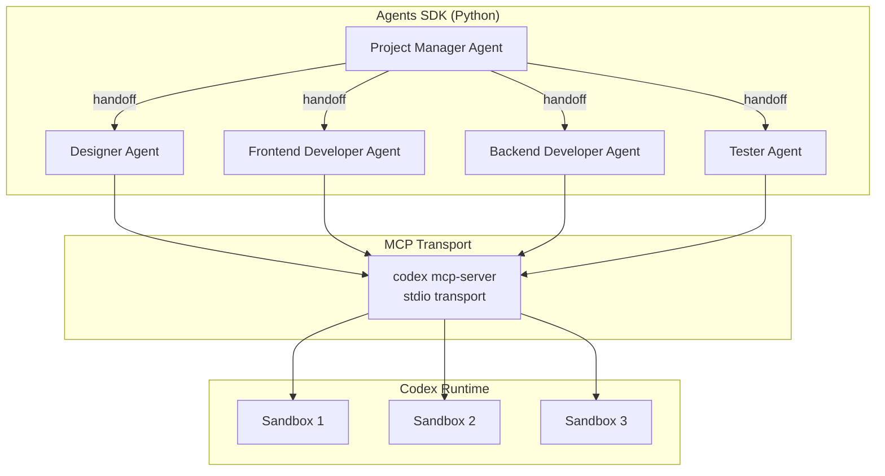
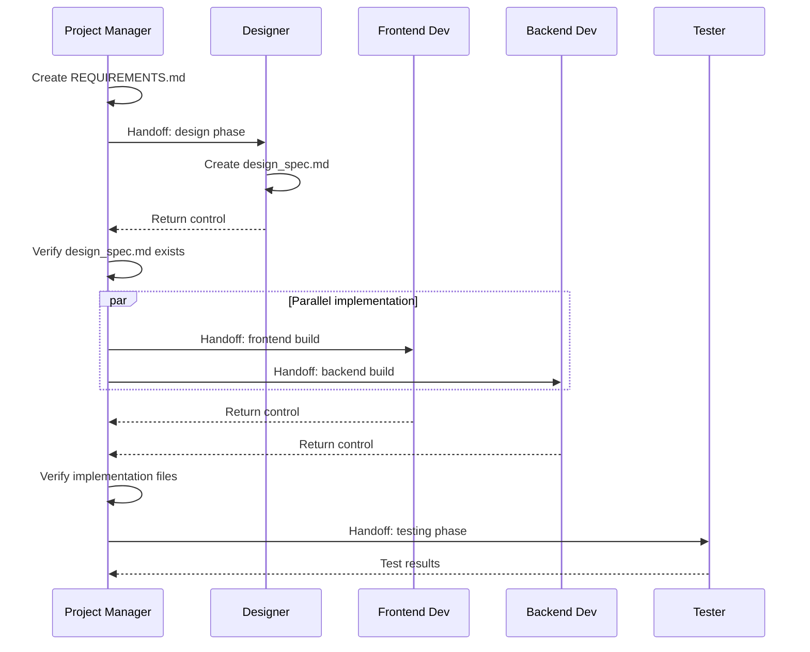
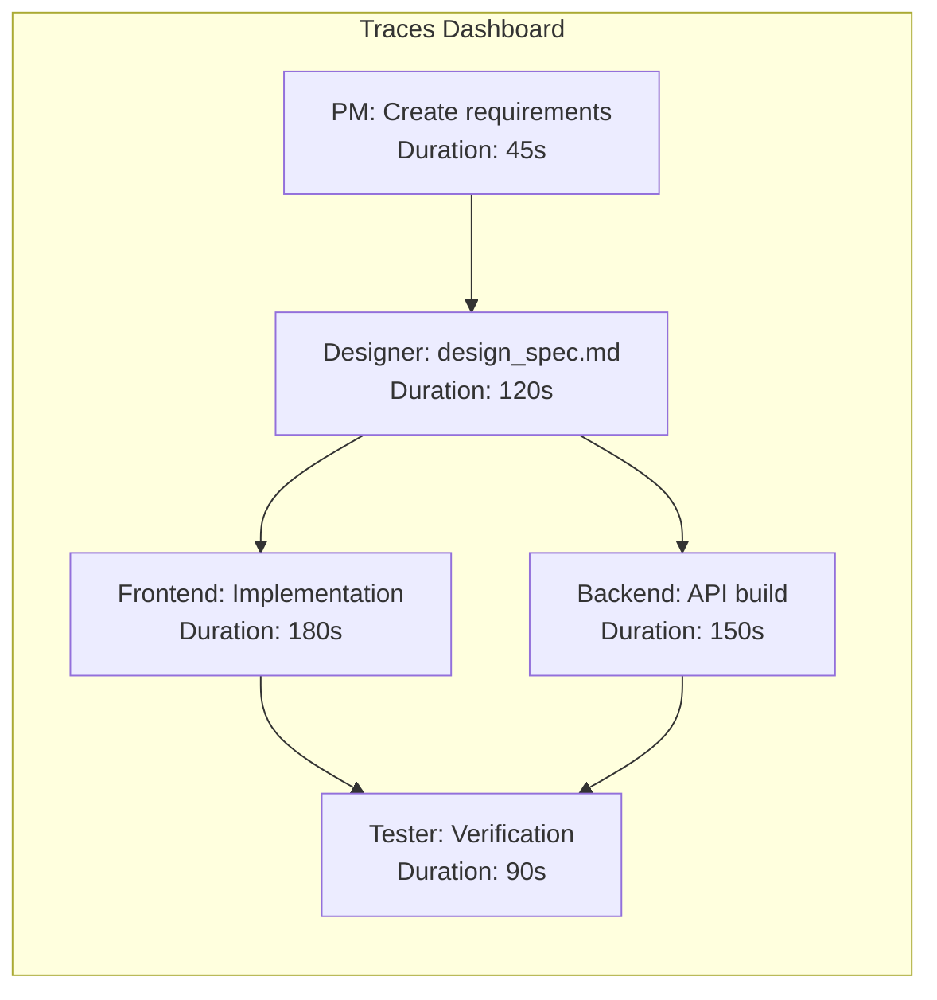

# Codex CLI as an MCP Server: Building Multi-Agent Workflows with the Agents SDK


---

Running Codex CLI as a Model Context Protocol (MCP) server unlocks a fundamentally different operating mode: instead of one developer interacting with one agent, you can orchestrate entire teams of specialised agents through Python code. The OpenAI Agents SDK provides the orchestration layer, while Codex supplies the sandboxed coding capability. This article covers the architecture, configuration, and production patterns for building these workflows.

## Why Run Codex as an MCP Server?

The interactive TUI is excellent for solo work, but it cannot be composed. When you need a Designer agent to produce a specification, a Frontend agent to implement it, a Backend agent to build the API, and a Tester agent to verify the lot — all with deterministic sequencing and full traceability — you need Codex exposed as a tool that other agents can invoke programmatically [^1].

The `codex mcp-server` command transforms Codex from an interactive terminal application into a long-running process that exposes two MCP tools [^2]:

- **`codex`** — creates a new conversation with configurable approval policy, sandbox mode, model, and base instructions
- **`codex-reply`** — continues an existing conversation using a `threadId`

This is the same sandboxed execution engine, the same model access, the same filesystem controls — just with a machine-readable interface instead of a human-readable one.

## Architecture Overview



The Agents SDK manages the conversation graph — which agent runs next, what context it receives, and how results flow between agents. Codex MCP handles the actual code generation and execution inside sandboxed environments [^1].

## Prerequisites

Before building multi-agent workflows, ensure you have:

- **Codex CLI** installed (`npm install -g @openai/codex` or via `npx`) [^3]
- **Python 3.10+** with the Agents SDK (`pip install openai-agents`) [^4]
- **Node.js 18+** (required for `npx` transport)
- An **OpenAI API key** with access to your chosen model

## Initialising the MCP Server

The Agents SDK connects to Codex via `MCPServerStdio`, which manages the server lifecycle:

```python
from agents.mcp import MCPServerStdio

async with MCPServerStdio(
    name="Codex CLI",
    params={
        "command": "npx",
        "args": ["-y", "codex", "mcp-server"],
    },
    client_session_timeout_seconds=360000,
) as codex_mcp_server:
    # All agent definitions go here
    pass
```

The `client_session_timeout_seconds` value of 360,000 seconds (100 hours) prevents premature disconnection during long-running workflows [^1]. The `"-y"` flag auto-confirms the `npx` package prompt.

## Single-Agent Pattern

Start with the simplest case — one agent with Codex as its tool:

```python
from agents import Agent, Runner

developer = Agent(
    name="Developer",
    instructions="""You are a senior developer. Use the codex tool
    to write clean, tested code. Always pass:
    - approval-policy: never
    - sandbox: workspace-write
    """,
    mcp_servers=[codex_mcp_server],
)

result = await Runner.run(
    developer,
    "Create a Python CLI that converts CSV files to JSON"
)
print(result.final_output)
```

The agent calls the `codex` MCP tool, which spawns a sandboxed Codex session. The `approval-policy: never` setting allows autonomous execution without human approval gates [^2]. For production use, consider `on-request` or `untrusted` policies instead.

## Multi-Agent Orchestration

The real power emerges with multiple specialised agents coordinated by a Project Manager. This mirrors enterprise workflows like JIRA task orchestration [^1]:

```python
designer = Agent(
    name="Designer",
    instructions="""You are a UI/UX designer. Use the codex tool to
    create design_spec.md with wireframes, colour palette, and
    component hierarchy. Pass sandbox: workspace-write.""",
    mcp_servers=[codex_mcp_server],
)

frontend_dev = Agent(
    name="Frontend Developer",
    instructions="""You are a frontend developer. Read design_spec.md
    and implement the UI using HTML, CSS, and JavaScript.
    Pass sandbox: workspace-write, approval-policy: never.""",
    mcp_servers=[codex_mcp_server],
)

backend_dev = Agent(
    name="Backend Developer",
    instructions="""You are a backend developer. Build the API layer
    using Node.js/Express. Pass sandbox: workspace-write,
    approval-policy: never.""",
    mcp_servers=[codex_mcp_server],
)

tester = Agent(
    name="Tester",
    instructions="""You are a QA engineer. Write and run tests against
    the implementation. Verify all acceptance criteria from
    REQUIREMENTS.md. Pass sandbox: workspace-write.""",
    mcp_servers=[codex_mcp_server],
)

project_manager = Agent(
    name="Project Manager",
    model="gpt-5",
    instructions="""You coordinate a software team. Follow this sequence:
    1. Create REQUIREMENTS.md and AGENT_TASKS.md
    2. Hand off to Designer — verify design_spec.md exists before proceeding
    3. Hand off to Frontend and Backend developers (can run in parallel)
    4. Hand off to Tester for final verification
    Always verify output files exist before advancing.""",
    mcp_servers=[codex_mcp_server],
    handoffs=[designer, frontend_dev, backend_dev, tester],
)

result = await Runner.run(
    project_manager,
    "Build a browser-based bug tracking dashboard",
    max_turns=30,
)
```

### The Gated Handoff Pattern

The critical design pattern here is **gated handoffs**: the Project Manager verifies that required artefacts exist before advancing to the next phase [^1]. This prevents downstream agents from operating on incomplete inputs:



## Codex SDK: The Programmatic Alternative

For scenarios where the MCP protocol adds unnecessary complexity, the Codex SDK provides direct programmatic control [^5]:

```typescript
import { Codex } from "@openai/codex-sdk";

const codex = new Codex();
const thread = codex.startThread();
const result = await thread.run(
    "Diagnose and fix the CI failures in this repository"
);
```

```python
from codex_app_server import Codex

with Codex() as codex:
    thread = codex.thread_start(model="gpt-5.4")
    result = thread.run("Refactor the auth module to use JWT tokens")
```

The SDK is better suited when you need thread-level control within your own CI/CD pipelines or internal tooling, rather than agent-to-agent orchestration [^5].

## Subagent Configuration

For workflows that stay within Codex itself (rather than using the external Agents SDK), the built-in subagent system provides lighter-weight orchestration. Configure it in `config.toml` [^6]:

```toml
[agents]
max_threads = 6
max_depth = 1
job_max_runtime_seconds = 1800
```

Custom agent definitions live in `~/.codex/agents/` (personal) or `.codex/agents/` (project-scoped) [^6]:

```toml
name = "security_auditor"
description = "Read-only security review agent"
developer_instructions = """
Audit all source files for security vulnerabilities.
Focus on injection, auth bypass, and data exposure.
Return structured JSON with findings.
"""
model = "gpt-5.4"
sandbox_mode = "read-only"
```

### When to Use Which

| Capability | Subagents | Agents SDK + MCP |
|---|---|---|
| **Setup complexity** | Minimal (TOML config) | Moderate (Python orchestrator) |
| **Sequencing control** | Implicit (Codex decides) | Explicit (gated handoffs) |
| **Parallel execution** | Automatic fan-out | Programmatic control |
| **Cross-tool integration** | Codex tools only | Any MCP-compatible tool |
| **Observability** | CLI `/agent` command | OpenAI Traces dashboard |
| **Best for** | Quick parallel tasks | Deterministic pipelines |

## Observability and Tracing

Every multi-agent run generates traces in the OpenAI Traces dashboard, capturing [^1]:

- **Prompts and responses** for each agent turn
- **MCP tool calls** with parameters and return values
- **Handoff events** between agents
- **Execution duration** per step
- **File writes** and sandbox operations

This is invaluable for debugging workflows where Agent B produces unexpected output because Agent A's handoff context was incomplete.



## Production Hardening

### Approval Policies

Never use `approval-policy: never` in production multi-agent workflows. Instead, use `on-request` to require human approval for destructive operations, or define hook-based guardrails in `config.toml` [^2]:

```toml
[hooks.pre_tool_use.codex]
command = "python3 /opt/hooks/validate_tool_call.py"
description = "Validate MCP tool calls before execution"
```

### Timeout Management

Set realistic timeouts at multiple layers:

```python
# MCP server session timeout
client_session_timeout_seconds = 3600  # 1 hour

# Agent runner turn limit
result = await Runner.run(agent, prompt, max_turns=20)
```

```toml
# Subagent job timeout
[agents]
job_max_runtime_seconds = 900  # 15 minutes per job
```

### Error Handling

Wrap the runner in proper error handling to catch MCP disconnections and agent failures:

```python
from agents import Runner, AgentError

try:
    result = await Runner.run(project_manager, task, max_turns=30)
except AgentError as e:
    logger.error(f"Agent {e.agent_name} failed: {e}")
    # Implement retry or fallback logic
```

## Practical Applications

The Agents SDK + Codex MCP pattern scales to real-world engineering challenges:

- **Large-scale refactoring** — decompose a 500-file framework migration into per-module agents running in parallel [^1]
- **Documentation generation** — one agent explores the codebase, another writes API docs, a third generates architecture diagrams
- **Continuous QA pipelines** — integrate with CI to spawn review agents on every pull request
- **Multi-service deployments** — coordinate agents across frontend, backend, and infrastructure repositories

The OpenAI Cookbook provides a complete worked example building a browser game ("Bug Busters") through five coordinated agents, with an end-to-end execution time of approximately 11 minutes [^1].

## Summary

Running Codex CLI as an MCP server bridges the gap between interactive coding assistance and programmatic workflow automation. The two-tool interface (`codex` and `codex-reply`) is deliberately simple, pushing orchestration complexity into the Agents SDK where it belongs. Start with single-agent patterns, add gated handoffs for sequencing, and use the Traces dashboard to debug the inevitable surprises.

---

## Citations

[^1]: OpenAI Cookbook, "Building Consistent Workflows with Codex CLI & Agents SDK," April 2026. [https://developers.openai.com/cookbook/examples/codex/codex_mcp_agents_sdk/building_consistent_workflows_codex_cli_agents_sdk](https://developers.openai.com/cookbook/examples/codex/codex_mcp_agents_sdk/building_consistent_workflows_codex_cli_agents_sdk)

[^2]: OpenAI Developers, "Use Codex with the Agents SDK," April 2026. [https://developers.openai.com/codex/guides/agents-sdk](https://developers.openai.com/codex/guides/agents-sdk)

[^3]: OpenAI Developers, "CLI — Codex," April 2026. [https://developers.openai.com/codex/cli](https://developers.openai.com/codex/cli)

[^4]: OpenAI Developers, "Agents SDK," 2026. [https://openai.github.io/openai-agents-python/](https://openai.github.io/openai-agents-python/)

[^5]: OpenAI Developers, "SDK — Codex," April 2026. [https://developers.openai.com/codex/sdk](https://developers.openai.com/codex/sdk)

[^6]: OpenAI Developers, "Subagents — Codex," April 2026. [https://developers.openai.com/codex/subagents](https://developers.openai.com/codex/subagents)
