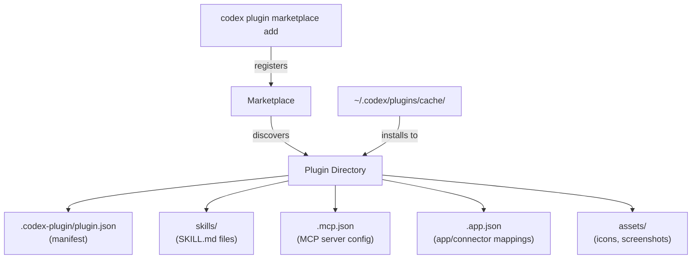
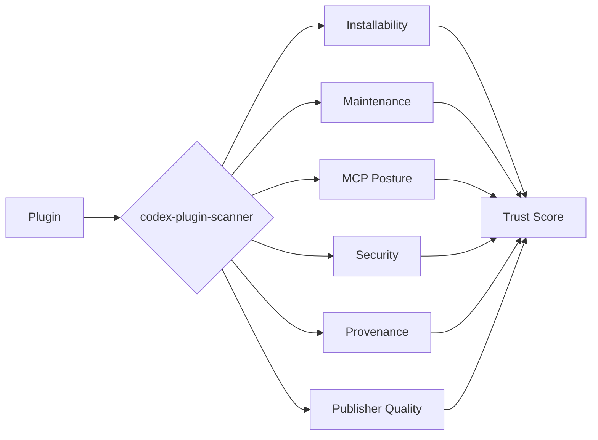

# Codex CLI Plugin Marketplace: Building, Distributing, and Managing Extensions at Scale


OpenAI launched the Codex plugin marketplace on 26 March 2026, packaging skills, MCP servers, and app integrations into shareable, installable bundles that work across the Codex App, CLI, and IDE extensions [^1]. Within a month the ecosystem has grown to over 12 official plugins and 40+ community contributions [^2], spanning everything from Slack and Figma integrations to multi-agent orchestration frameworks. This article covers the full plugin lifecycle — from scaffold to distribution — with a focus on CLI workflows and enterprise governance.

## Architecture Overview

A Codex plugin is a directory containing a manifest and one or more of three component types:



The three component types serve distinct roles [^3]:

- **Skills** — Reusable prompt-based instructions stored as `SKILL.md` files. Codex loads them contextually and follows predetermined steps, optionally referencing helper scripts or documentation.
- **Apps** — Integrations with external services (GitHub, Slack, Google Drive, Gmail) that let Codex read information and execute actions within those platforms.
- **MCP Servers** — Services providing access to additional tools or shared information from systems outside your local environment.

## Plugin Directory Structure

Every plugin requires a `.codex-plugin/plugin.json` manifest at minimum [^3]:

```
my-plugin/
├── .codex-plugin/
│   └── plugin.json          # required manifest
├── skills/
│   └── code-review/
│       └── SKILL.md         # skill instructions
├── .app.json                # optional: app/connector mappings
├── .mcp.json                # optional: MCP server config
└── assets/                  # optional: icons, logos, screenshots
```

## Writing the Manifest

The `plugin.json` manifest uses kebab-case naming as the stable identifier and namespace [^3]:

```json
{
  "name": "pr-review-suite",
  "version": "1.0.0",
  "description": "Automated PR review with style enforcement and security scanning",
  "author": {
    "name": "Platform Team",
    "email": "platform@example.com"
  },
  "license": "MIT",
  "keywords": ["code-review", "security", "style"],
  "skills": "./skills/",
  "mcpServers": "./.mcp.json",
  "apps": "./.app.json",
  "interface": {
    "displayName": "PR Review Suite",
    "shortDescription": "Automated PR review with security scanning",
    "category": "Development",
    "capabilities": ["Read", "Write"],
    "brandColor": "#10A37F",
    "composerIcon": "./assets/icon.png"
  }
}
```

Key fields:

| Field | Purpose |
|-------|---------|
| `name` | Stable identifier (kebab-case, unique within marketplace) |
| `version` | SemVer string — marketplace uses this for upgrade detection |
| `skills` | Relative path to skills directory |
| `mcpServers` | Relative path to `.mcp.json` for bundled MCP servers |
| `apps` | Relative path to `.app.json` for external service connectors |
| `interface` | Presentation metadata for marketplace UI |

## Building Skills

Skills are the most portable plugin component — they work across Codex CLI, the Codex App, and even cross-tool with Claude Code and Copilot CLI via the shared `.agents/skills/` discovery path [^4]. Each skill lives in its own subdirectory with a `SKILL.md` file:

```markdown
---
name: security-review
description: Review code changes for common security vulnerabilities.
---

## Instructions

1. Read the diff of staged changes
2. Check for:
   - Hardcoded secrets or API keys
   - SQL injection vectors
   - Unsanitised user input in templates
   - Missing authentication checks on new endpoints
3. Report findings with severity ratings
4. Suggest specific fixes with code examples
```

The YAML front matter provides discovery metadata; the markdown body contains the instructions Codex follows when the skill is invoked.

## Scaffolding with the Plugin Creator

For the fastest setup, use the built-in `$plugin-creator` skill [^3]:

```bash
codex "Use $plugin-creator to scaffold a new plugin called infra-monitor"
```

This generates the `.codex-plugin/plugin.json` manifest, a starter skill, and a local marketplace entry for testing — saving you from writing boilerplate by hand.

## Marketplace Architecture

Marketplaces are JSON catalogues that Codex discovers at three scopes [^3]:

| Scope | Location | Use case |
|-------|----------|----------|
| **Repository** | `$REPO_ROOT/.agents/plugins/marketplace.json` | Team-shared plugins for a project |
| **Personal** | `~/.agents/plugins/marketplace.json` | Individual toolkit across all repos |
| **Curated** | Remote Git repos registered via CLI | Community or organisation-wide distribution |

### Marketplace JSON Format

```json
{
  "name": "platform-team-plugins",
  "interface": {
    "displayName": "Platform Team Plugins"
  },
  "plugins": [
    {
      "name": "pr-review-suite",
      "source": {
        "source": "local",
        "path": "./plugins/pr-review-suite"
      },
      "policy": {
        "installation": "INSTALLED_BY_DEFAULT",
        "authentication": "ON_FIRST_USE"
      },
      "category": "Development"
    },
    {
      "name": "infra-scanner",
      "source": {
        "source": "git-subdir",
        "url": "https://github.com/org/codex-plugins.git",
        "path": "plugins/infra-scanner"
      },
      "policy": {
        "installation": "AVAILABLE",
        "authentication": "ON_INSTALL"
      },
      "category": "Infrastructure"
    }
  ]
}
```

The `policy.installation` field controls default behaviour [^3]:

- **`INSTALLED_BY_DEFAULT`** — Active immediately; useful for team-mandated plugins
- **`AVAILABLE`** — Visible in the marketplace picker but requires explicit installation
- **`NOT_AVAILABLE`** — Hidden; useful for deprecating plugins without removing them

## CLI Marketplace Management

The `codex plugin marketplace` command family handles remote marketplace registration [^5]:

```bash
# Add from GitHub shorthand
codex plugin marketplace add acme-org/codex-plugins

# Pin to a specific branch or tag
codex plugin marketplace add acme-org/codex-plugins --ref v2.1.0

# Sparse checkout for large monorepos
codex plugin marketplace add https://github.com/acme/mono.git \
  --sparse .agents/plugins

# Add a local directory (useful during development)
codex plugin marketplace add ./my-local-marketplace

# Upgrade all registered Git marketplaces
codex plugin marketplace upgrade

# Upgrade a specific marketplace
codex plugin marketplace upgrade acme-org-codex-plugins

# Remove a marketplace
codex plugin marketplace remove acme-org-codex-plugins
```

Within the TUI, run `/plugins` to browse an interactive, searchable directory organised by marketplace, with toggles for enabling and disabling individual plugins [^3].

## Discovery and Invocation

Once installed, plugins can be invoked two ways [^3]:

1. **Implicit** — Describe what you want and let Codex select appropriate tools:

   ```
   codex "Summarise the open PRs that need my review"
   ```

2. **Explicit** — Use `@` notation to target a specific plugin or skill:

   ```
   codex "@pr-review-suite Review the changes in this branch"
   ```

Codex caches installed plugins at `~/.codex/plugins/cache/$MARKETPLACE_NAME/$PLUGIN_NAME/$VERSION/`, with local plugins using `local` as the version identifier [^3].

## Enterprise Governance

For organisations running Codex at scale, `requirements.toml` provides policy controls that constrain plugin behaviour [^6]:

```toml
# requirements.toml — enforced by admin across the organisation

[plugins]
# Only allow plugins from approved marketplaces
allowed_marketplaces = ["platform-team-plugins", "openai-official"]

[mcp_servers]
# Allowlist MCP servers by name and identity
allowlist = [
  { name = "github-mcp", identity = "openai/github-mcp-server" },
  { name = "sentry-mcp", identity = "getsentry/sentry-mcp" }
]
```

When you configure an `mcp_servers` allowlist, Codex enables an MCP server only when both its name and identity match an approved entry; otherwise it is disabled [^6]. On managed machines using Business or Enterprise plans, admin-enforced requirements are fetched from the Codex service and applied across all surfaces — CLI, App, and IDE Extension [^7].

## Plugin Quality and Trust

The community `codex-plugin-scanner` tool provides trust scoring across six factors [^2]:



Running the scanner before adding third-party plugins to your marketplace is strongly recommended, particularly for enterprise deployments where supply-chain risk matters.

## Practical Patterns

### Pattern 1: Team Standards Plugin

Bundle your organisation's coding standards, review checklists, and approved MCP servers into a single plugin distributed via a private Git marketplace:

```bash
# Platform team publishes
git push origin main  # marketplace.json + plugins/ in repo

# Developers consume
codex plugin marketplace add acme-org/platform-standards --ref main
```

### Pattern 2: Project-Local Skills Without a Full Plugin

For lightweight, repo-specific skills that do not need marketplace distribution, skip the plugin manifest entirely and place `SKILL.md` files directly in `.agents/skills/` [^4]:

```
my-repo/
└── .agents/
    └── skills/
        └── deploy-staging/
            └── SKILL.md
```

Codex CLI discovers these automatically — no marketplace registration required.

### Pattern 3: MCP Server Adapter

Wrap an existing internal tool as an MCP server and distribute it as a plugin so teammates get the tool with a single install:

```json
// .mcp.json
{
  "servers": {
    "internal-api": {
      "command": "npx",
      "args": ["@acme/internal-api-mcp", "--port", "3100"],
      "env": {
        "API_TOKEN": "${ACME_API_TOKEN}"
      }
    }
  }
}
```

## What Is Coming Next

Self-serve publishing to the official Plugin Directory is not yet available — OpenAI's documentation notes it is "coming soon" [^3]. In the meantime, distribution relies on Git-backed marketplaces and local directories. The `codex-marketplace.com` community registry [^8] has emerged as an unofficial aggregator, and the `awesome-codex-plugins` list on GitHub [^2] provides a curated starting point.

## Citations

[^1]: [OpenAI Launches Plugin Marketplace for Codex with Enterprise Controls — WinBuzzer, 31 March 2026](https://winbuzzer.com/2026/03/31/openai-launches-plugin-marketplace-codex-enterprise-controls-xcxwbn/)
[^2]: [awesome-codex-plugins — hashgraph-online/awesome-codex-plugins on GitHub](https://github.com/hashgraph-online/awesome-codex-plugins)
[^3]: [Build plugins — Codex | OpenAI Developers](https://developers.openai.com/codex/plugins/build)
[^4]: [Agent Skills, Plugins and Marketplace: The Complete Guide — Chris Ayers](https://chris-ayers.com/posts/agent-skills-plugins-marketplace/)
[^5]: [Command line options — Codex CLI | OpenAI Developers](https://developers.openai.com/codex/cli/reference)
[^6]: [Managed configuration — Codex | OpenAI Developers](https://developers.openai.com/codex/enterprise/managed-configuration)
[^7]: [Admin Setup — Codex | OpenAI Developers](https://developers.openai.com/codex/enterprise/admin-setup)
[^8]: [Codex Plugin Marketplace — codex-marketplace.com](https://www.codex-marketplace.com)
