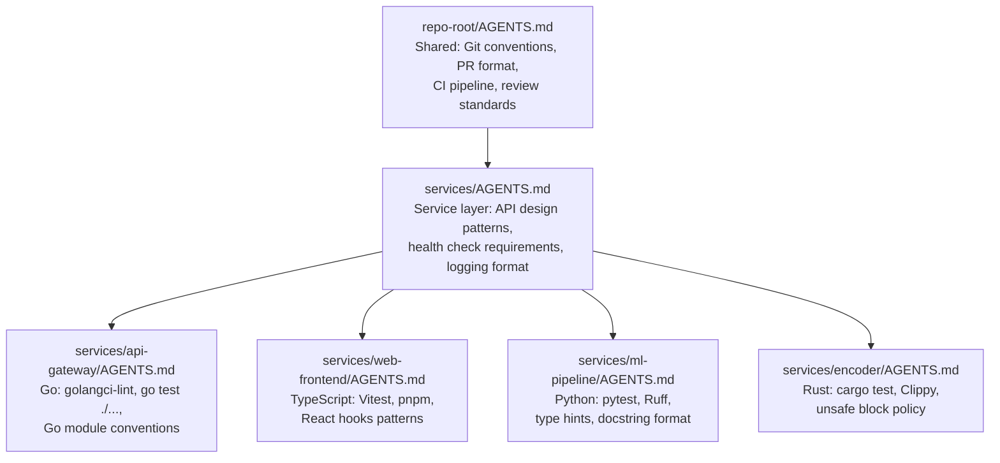
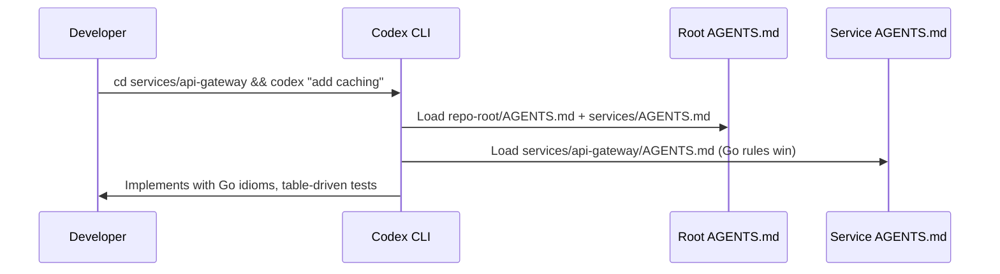

# Codex CLI for Polyglot Codebases: Hierarchical AGENTS.md, Per-Directory Config, and Multi-Language Workflow Patterns


---

Most Codex CLI guides assume a single-language repository. Reality is messier — a TypeScript frontend, Go API gateway, Python ML services, and Rust performance modules all living in one repo, each with its own toolchain, test framework, and linting rules. Without per-language context, Codex guesses the framework and guesses wrong.

This article covers how to configure Codex CLI for polyglot codebases using hierarchical AGENTS.md files and per-directory `.codex/config.toml` layers.

## Why Polyglot Codebases Break Default Agent Behaviour

In a monolingual repo, one AGENTS.md covers everything[^1]. In a polyglot codebase, a single root file cannot capture contradictory conventions — `pytest` vs `go test` vs `pnpm vitest`, ESLint vs `golangci-lint` vs Ruff — without bloating past the 32 KiB byte limit[^2] or confusing the model with conflicting instructions.

## The Hierarchical AGENTS.md Solution

Codex CLI builds an instruction chain by concatenating AGENTS.md files from the project root down to the current working directory[^1]. At each directory level, it checks for `AGENTS.override.md` first, then `AGENTS.md`, then any filenames in `project_doc_fallback_filenames`[^2]. Files closer to the working directory take precedence over those further up.

This hierarchy maps naturally to polyglot repository structures:

```
repo-root/
├── AGENTS.md                          # Shared conventions
├── .codex/config.toml                 # Root project config
├── services/
│   ├── AGENTS.md                      # Service-layer conventions
│   ├── api-gateway/                   # Go service
│   │   ├── AGENTS.md                  # Go-specific rules
│   │   └── .codex/config.toml
│   ├── web-frontend/                  # TypeScript/React
│   │   ├── AGENTS.md                  # TypeScript-specific rules
│   │   └── .codex/config.toml
│   ├── ml-pipeline/                   # Python
│   │   ├── AGENTS.md                  # Python-specific rules
│   │   └── .codex/config.toml
│   └── encoder/                       # Rust
│       ├── AGENTS.md                  # Rust-specific rules
│       └── .codex/config.toml
└── infrastructure/
    ├── AGENTS.md                      # IaC conventions
    └── terraform/
        └── AGENTS.md                  # Terraform-specific rules
```

When Codex operates inside `services/api-gateway/`, it concatenates:

1. `repo-root/AGENTS.md` (shared)
2. `services/AGENTS.md` (service layer)
3. `services/api-gateway/AGENTS.md` (Go-specific)

The Go-specific file's instructions override any conflicting guidance from higher levels.



## Writing Effective Root AGENTS.md for Polyglot Projects

The root AGENTS.md should contain only what is genuinely universal. Resist the temptation to dump language-specific rules here.

```markdown
# AGENTS.md — Repository Root

## Project Structure
Polyglot monorepo. Each service under `services/` has its own language,
toolchain, and AGENTS.md. Check the nearest AGENTS.md before acting.

## Shared Standards
- Conventional Commits scoped to service: `feat(api-gateway): add rate limiting`
- Each service has a Makefile with `make lint`, `make test`, `make build`
- Services communicate via gRPC — proto definitions in `proto/`
- Never modify `.proto` files without updating all affected services
```

This root file weighs under 500 bytes, leaving ample budget for directory-level files[^2].

## Language-Specific AGENTS.md Patterns

### Go Service

```markdown
# AGENTS.md — services/api-gateway (Go 1.24)

## Build & Test
- Build: `make build` (wraps `go build ./...`)
- Test: `make test` (wraps `go test -race -count=1 ./...`)
- Lint: `make lint` (wraps `golangci-lint run`)

## Conventions
- Follow Effective Go and the Google Go Style Guide
- Errors wrap with `fmt.Errorf("operation: %w", err)` — never discard errors
- Use `context.Context` as the first parameter on all exported functions
- Table-driven tests with `t.Run` subtests
- No `init()` functions; use explicit initialisation

## Dependencies
- Run `go mod tidy` after adding any dependency
- Avoid CGO unless absolutely necessary
- Prefer stdlib over third-party where reasonable
```

### TypeScript/React Frontend

```markdown
# AGENTS.md — services/web-frontend (TypeScript 5.7, React 19)

## Build & Test
- Install: `pnpm install` | Dev: `pnpm dev` | Test: `pnpm test` (Vitest)
- Lint: `pnpm lint` (ESLint + Prettier) | Types: `pnpm typecheck`

## Conventions
- Functional components only — no class components
- All props must have TypeScript interfaces, not `any`
- Colocate tests: `Component.test.tsx` next to `Component.tsx`
- Mock API calls with MSW (Mock Service Worker)
```

### Python ML Pipeline

```markdown
# AGENTS.md — services/ml-pipeline (Python 3.13)

## Build & Test
- Install: `pip install -e ".[dev]"` | Test: `pytest -x --tb=short`
- Lint: `ruff check .` | Format: `ruff format .` | Types: `mypy .`

## Conventions
- Type hints on all function signatures — no untyped public APIs
- Google-style docstrings, `pathlib.Path` over `os.path`
- Prefer `polars` over `pandas` for new dataframes
- Never commit model weights; use DVC for data version control
```

### Rust Encoder

```markdown
# AGENTS.md — services/encoder (Rust 1.82, edition 2024)

## Build & Test
- Build: `cargo build` | Test: `cargo test`
- Lint: `cargo clippy -- -D warnings` | Format: `cargo fmt -- --check`

## Conventions
- Zero `unsafe` without `// SAFETY:` comment explaining the invariant
- `thiserror` for library errors, `anyhow` for application errors
- All public APIs must have `/// doc comments` with examples
```

## Per-Directory `.codex/config.toml` for Language-Specific Settings

Beyond AGENTS.md, Codex CLI supports per-directory `.codex/config.toml` files that override user-level configuration[^3]. In a polyglot codebase, this enables language-appropriate model selection, sandbox policies, and MCP server configurations per service.

Codex walks from the project root to the current working directory and loads every `.codex/config.toml` it finds — closest file wins[^3].

### Example: Root Config

```toml
# repo-root/.codex/config.toml
model = "gpt-5.4"
approval_policy = "on-request"

[sandbox_workspace_write]
network_access = false
```

### Example: Python Service Config

```toml
# services/ml-pipeline/.codex/config.toml
# Python ML work benefits from higher reasoning for data pipelines
model_reasoning_effort = "high"

[sandbox_workspace_write]
# ML pipeline needs network access for model registry
network_access = true
network_allowed_domains = ["pypi.org", "huggingface.co", "registry.internal.corp"]
```

### Example: Frontend Config with MCP Servers

```toml
# services/web-frontend/.codex/config.toml
model_reasoning_effort = "medium"

# Storybook MCP for component documentation
[mcp_servers.storybook]
command = "npx"
args = ["-y", "@anthropic/storybook-mcp"]
enabled = true
```

## Cross-Boundary Workflows

The trickiest polyglot scenarios are cross-service changes. Three patterns handle them:

**Pattern 1 — Run Codex from the right directory.** The simplest approach: `cd` into each service before invoking Codex, ensuring the correct AGENTS.md chain loads:

```bash
cd services/api-gateway && codex "add rate limiting middleware"
cd services/web-frontend && codex "add rate limit error handling to API client"
```

**Pattern 2 — Proto-first changes.** Document cross-service protocols in the services-level AGENTS.md so Codex knows the dependency order when modifying `.proto` files.

**Pattern 3 — Profile-based switching.** Use named profiles for different language contexts[^4]:

```toml
# ~/.codex/config.toml
[profiles.ml-work]
model = "gpt-5.4"
model_reasoning_effort = "high"
```

```bash
codex --profile ml-work "refactor the feature extraction pipeline"
```

## Managing the Byte Budget

Multiple AGENTS.md files concatenate towards a 32 KiB default limit (`project_doc_max_bytes`)[^2]. Keep root files under 1 KiB and service files under 2 KiB each. If you hit the limit, increase it with `project_doc_max_bytes = 65536` in your user config, or use `@file` mentions to reference documentation Codex reads on demand.

## Verification and Debugging

Confirm which files loaded by checking `~/.codex/log/codex-tui.log` for AGENTS entries, or ask Codex directly: `codex "Which AGENTS.md files did you load?"`.

### Common Pitfalls

| Problem | Cause | Fix |
|---------|-------|-----|
| Wrong test command used | Working directory not inside the service | `cd` into the service before running Codex |
| Language conventions ignored | AGENTS.md exceeds byte budget | Check file sizes; increase `project_doc_max_bytes` |
| Project config not loading | Project not marked as trusted | Run `codex` in the project and approve the trust prompt |
| Override file blocking team rules | Stale `AGENTS.override.md` left in directory | Remove override files when no longer needed |

## Enterprise Governance with requirements.toml

For organisations deploying Codex across polyglot teams, `requirements.toml` enforces security constraints that no per-directory config can override[^5]. Combined with v0.124.0 stable hooks[^6], enterprises can enforce language-aware quality gates through a single hook that delegates to each service's `Makefile`:

```toml
# repo-root/.codex/config.toml
[[hooks]]
event = "on-agent-turn-complete"
command = "make lint"
description = "Run linter for the current service"
```

Because each service's `Makefile` dispatches to the correct linter, one hook definition works across all languages.

## Putting It Together

The key insight is that **you do not need a single omniscient configuration**. By leveraging the directory hierarchy that already exists in your codebase, each language gets exactly the context it needs, and Codex behaves as though it has read the team's style guide for that specific service.



## Citations

[^1]: OpenAI, "Custom instructions with AGENTS.md," developers.openai.com/codex/guides/agents-md, accessed April 2026. [https://developers.openai.com/codex/guides/agents-md](https://developers.openai.com/codex/guides/agents-md)

[^2]: OpenAI, "Advanced Configuration — Codex," developers.openai.com/codex/config-advanced, accessed April 2026. [https://developers.openai.com/codex/config-advanced](https://developers.openai.com/codex/config-advanced)

[^3]: OpenAI, "Config basics — Codex," developers.openai.com/codex/config-basic, accessed April 2026. [https://developers.openai.com/codex/config-basic](https://developers.openai.com/codex/config-basic)

[^4]: OpenAI, "Configuration Reference — Codex," developers.openai.com/codex/config-reference, accessed April 2026. [https://developers.openai.com/codex/config-reference](https://developers.openai.com/codex/config-reference)

[^5]: OpenAI, "Managed configuration — Codex," developers.openai.com/codex/enterprise/managed-configuration, accessed April 2026. [https://developers.openai.com/codex/enterprise/managed-configuration](https://developers.openai.com/codex/enterprise/managed-configuration)

[^6]: OpenAI, "Codex CLI v0.124.0 release notes," github.com/openai/codex/releases, 23 April 2026. [https://github.com/openai/codex/releases](https://github.com/openai/codex/releases)
