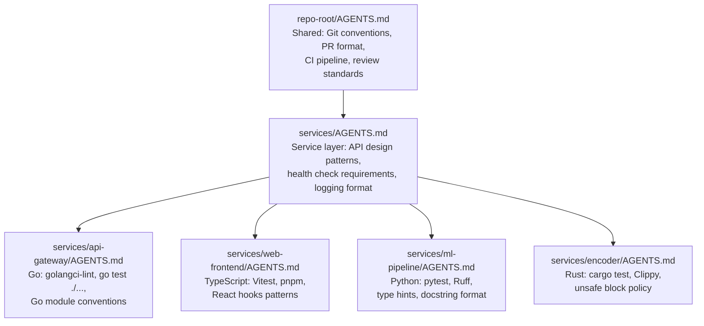
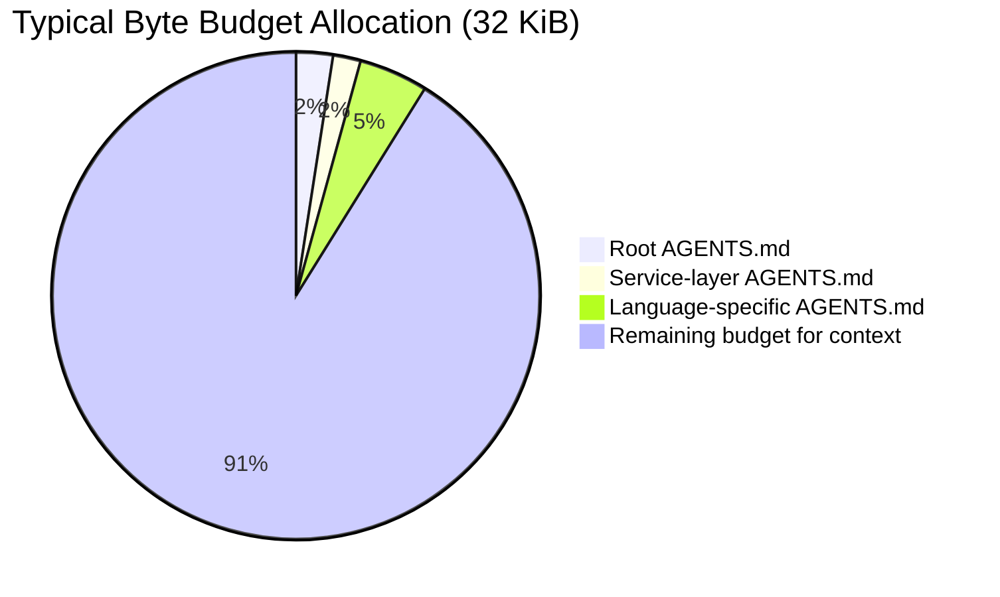
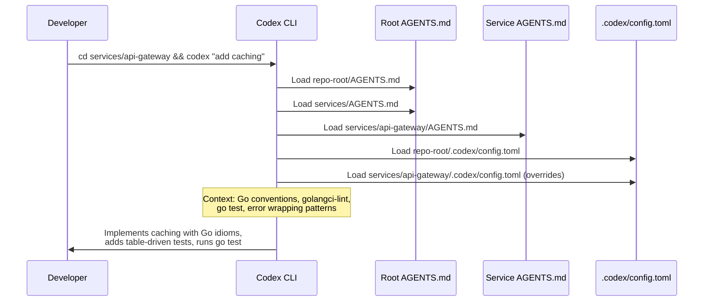

# Codex CLI for Polyglot Codebases: Hierarchical AGENTS.md, Per-Directory Config, and Multi-Language Workflow Patterns


---

Most Codex CLI guides assume a single-language repository. Reality is messier. A typical enterprise codebase might contain a TypeScript frontend, a Go API gateway, Python ML services, and Rust performance-critical modules — each with its own build toolchain, test framework, linting rules, and deployment conventions. Feed Codex a prompt like "add request validation" without context and it will guess the language, guess the framework, and guess wrong half the time.

This article covers how to configure Codex CLI for polyglot codebases using hierarchical AGENTS.md files, per-directory `.codex/config.toml` layers, and workflow patterns that keep each language's conventions intact whilst enabling cross-boundary work.

## Why Polyglot Codebases Break Default Agent Behaviour

Codex CLI loads a single global `~/.codex/config.toml` and discovers AGENTS.md files by walking from the project root to the current working directory[^1]. In a monolingual repo, this works well — one AGENTS.md covers everything. In a polyglot codebase, the root AGENTS.md cannot capture the contradictory conventions of five different ecosystems without bloating past the 32 KiB default byte limit[^2] or, worse, confusing the model with conflicting instructions.

The core problems:

- **Conflicting test commands**: `pytest` vs `go test` vs `pnpm vitest` vs `cargo test` — the agent must know which to run based on context.
- **Incompatible linting rules**: ESLint with Prettier for TypeScript, `golangci-lint` for Go, Ruff for Python, Clippy for Rust.
- **Different dependency management**: `pnpm install`, `go mod tidy`, `pip install -e ".[dev]"`, `cargo build`.
- **Divergent coding conventions**: Functional React patterns alongside imperative Go, Python type hints alongside Rust's strict type system.

## The Hierarchical AGENTS.md Solution

Codex CLI builds an instruction chain by concatenating AGENTS.md files from the project root down to the current working directory[^1]. At each directory level, it checks for `AGENTS.override.md` first, then `AGENTS.md`, then any filenames in `project_doc_fallback_filenames`[^2]. Files closer to the working directory take precedence over those further up.

This hierarchy maps naturally to polyglot repository structures:

```
repo-root/
├── AGENTS.md                          # Shared conventions
├── .codex/config.toml                 # Root project config
├── services/
│   ├── AGENTS.md                      # Service-layer conventions
│   ├── api-gateway/                   # Go service
│   │   ├── AGENTS.md                  # Go-specific rules
│   │   └── .codex/config.toml
│   ├── web-frontend/                  # TypeScript/React
│   │   ├── AGENTS.md                  # TypeScript-specific rules
│   │   └── .codex/config.toml
│   ├── ml-pipeline/                   # Python
│   │   ├── AGENTS.md                  # Python-specific rules
│   │   └── .codex/config.toml
│   └── encoder/                       # Rust
│       ├── AGENTS.md                  # Rust-specific rules
│       └── .codex/config.toml
└── infrastructure/
    ├── AGENTS.md                      # IaC conventions
    └── terraform/
        └── AGENTS.md                  # Terraform-specific rules
```

When Codex operates inside `services/api-gateway/`, it concatenates:

1. `repo-root/AGENTS.md` (shared)
2. `services/AGENTS.md` (service layer)
3. `services/api-gateway/AGENTS.md` (Go-specific)

The Go-specific file's instructions override any conflicting guidance from higher levels.



## Writing Effective Root AGENTS.md for Polyglot Projects

The root AGENTS.md should contain only what is genuinely universal. Resist the temptation to dump language-specific rules here.

```markdown
# AGENTS.md — Repository Root

## Project Structure
This is a polyglot monorepo. Each service under `services/` has its own
language, build toolchain, and AGENTS.md. Always check the nearest
AGENTS.md for language-specific instructions before acting.

## Git Conventions
- Branch naming: `feature/<service>/<description>` or `fix/<service>/<description>`
- Conventional Commits: `feat(api-gateway): add rate limiting`
- PRs must target a single service unless explicitly cross-cutting
- Run the affected service's test suite before committing

## CI Pipeline
All services share a GitHub Actions matrix build. Each service directory
contains a `Makefile` with standard targets: `make lint`, `make test`,
`make build`. Always use these rather than calling tools directly.

## Code Review Standards
- Every PR needs at least one human review
- Security-sensitive changes (auth, crypto, network) require two reviewers
- Do not introduce new dependencies without checking the licence

## Cross-Service Communication
- Services communicate via gRPC (proto definitions in `proto/`)
- API contracts are defined in Protocol Buffers — never modify `.proto`
  files without updating all affected services
```

This root file weighs under 1 KiB, leaving ample budget for directory-level files within the 32 KiB limit[^2].

## Language-Specific AGENTS.md Patterns

### Go Service

```markdown
# AGENTS.md — services/api-gateway (Go 1.24)

## Build & Test
- Build: `make build` (wraps `go build ./...`)
- Test: `make test` (wraps `go test -race -count=1 ./...`)
- Lint: `make lint` (wraps `golangci-lint run`)

## Conventions
- Follow Effective Go and the Google Go Style Guide
- Errors wrap with `fmt.Errorf("operation: %w", err)` — never discard errors
- Use `context.Context` as the first parameter on all exported functions
- Table-driven tests with `t.Run` subtests
- No `init()` functions; use explicit initialisation

## Dependencies
- Run `go mod tidy` after adding any dependency
- Avoid CGO unless absolutely necessary
- Prefer stdlib over third-party where reasonable
```

### TypeScript/React Frontend

```markdown
# AGENTS.md — services/web-frontend (TypeScript 5.7, React 19)

## Build & Test
- Install: `pnpm install`
- Dev server: `pnpm dev`
- Test: `pnpm test` (Vitest)
- Lint: `pnpm lint` (ESLint + Prettier)
- Type check: `pnpm typecheck` (tsc --noEmit)

## Conventions
- Functional components only — no class components
- Use React Server Components where applicable
- CSS Modules for styling, no inline styles
- All props must have TypeScript interfaces, not `any`
- Prefer `zod` for runtime validation schemas

## Testing
- Colocate test files: `Component.test.tsx` next to `Component.tsx`
- Use Testing Library, not Enzyme
- Mock API calls with MSW (Mock Service Worker)
```

### Python ML Pipeline

```markdown
# AGENTS.md — services/ml-pipeline (Python 3.13)

## Build & Test
- Install: `pip install -e ".[dev]"` (uses pyproject.toml)
- Test: `pytest -x --tb=short`
- Lint: `ruff check .`
- Format: `ruff format .`
- Type check: `mypy .`

## Conventions
- Type hints on all function signatures — no untyped public APIs
- Google-style docstrings on all public functions and classes
- Use `pathlib.Path` instead of `os.path`
- Prefer `polars` over `pandas` for new dataframes
- Pin all ML model versions in `models/versions.toml`

## Data & Models
- Never commit model weights or large data files
- Use DVC for data version control
- Training configs live in `configs/` as YAML
```

### Rust Encoder

```markdown
# AGENTS.md — services/encoder (Rust 1.82, edition 2024)

## Build & Test
- Build: `cargo build`
- Test: `cargo test`
- Lint: `cargo clippy -- -D warnings`
- Format check: `cargo fmt -- --check`

## Conventions
- Zero `unsafe` blocks without a `// SAFETY:` comment explaining the invariant
- Use `thiserror` for library errors, `anyhow` for application errors
- Prefer `&str` over `String` in function parameters
- All public APIs must have `/// doc comments` with examples
- Benchmark performance-critical paths with `criterion`
```

## Per-Directory `.codex/config.toml` for Language-Specific Settings

Beyond AGENTS.md, Codex CLI supports per-directory `.codex/config.toml` files that override user-level configuration[^3]. In a polyglot codebase, this enables language-appropriate model selection, sandbox policies, and MCP server configurations per service.

Codex walks from the project root to the current working directory and loads every `.codex/config.toml` it finds — closest file wins[^3].

### Example: Root Config

```toml
# repo-root/.codex/config.toml
model = "gpt-5.4"
approval_policy = "on-request"

[sandbox_workspace_write]
network_access = false
```

### Example: Python Service Config

```toml
# services/ml-pipeline/.codex/config.toml
# Python ML work benefits from higher reasoning for data pipelines
model_reasoning_effort = "high"

[sandbox_workspace_write]
# ML pipeline needs network access for model registry
network_access = true
network_allowed_domains = ["pypi.org", "huggingface.co", "registry.internal.corp"]
```

### Example: Frontend Config with MCP Servers

```toml
# services/web-frontend/.codex/config.toml
model_reasoning_effort = "medium"

# Storybook MCP for component documentation
[mcp_servers.storybook]
command = "npx"
args = ["-y", "@anthropic/storybook-mcp"]
enabled = true
```

## Cross-Boundary Workflows

The trickiest polyglot scenarios are cross-service changes — modifying a gRPC contract that affects three services simultaneously. Codex needs to understand the dependency graph.

### Pattern 1: Proto-First Changes with Subagent Delegation

For changes originating from Protocol Buffer modifications, structure the work as a multi-step plan:

```markdown
<!-- In services/AGENTS.md -->
## Cross-Service Protocol Changes
When modifying `.proto` files in `proto/`:
1. Update the `.proto` file first
2. Run `make proto-gen` from the repo root to regenerate all language bindings
3. Update each affected service to handle the new/changed fields
4. Run `make test` in each affected service directory
5. Create a single PR covering all changes
```

### Pattern 2: Run Codex from the Right Directory

The simplest and most effective pattern is to `cd` into the correct service directory before invoking Codex. This ensures the right AGENTS.md chain loads automatically:

```bash
# Work on the Go service
cd services/api-gateway && codex "add rate limiting middleware"

# Work on the frontend
cd services/web-frontend && codex "add rate limit error handling to API client"
```

### Pattern 3: Profile-Based Switching

Use configuration profiles for different language contexts when working from the repo root[^4]:

```toml
# ~/.codex/config.toml
[profiles.go-work]
model_reasoning_effort = "medium"

[profiles.ml-work]
model = "gpt-5.4"
model_reasoning_effort = "high"

[profiles.frontend-work]
model_reasoning_effort = "medium"
```

```bash
codex --profile ml-work "refactor the feature extraction pipeline"
```

## Managing the Byte Budget

With multiple AGENTS.md files concatenating, the 32 KiB default limit (`project_doc_max_bytes`) can become a constraint in deeply nested polyglot repos[^2]. Codex stops adding files once the combined size hits this limit, and files furthest from the working directory get dropped first.

Strategies for staying within budget:

1. **Keep each file focused**: Root AGENTS.md under 1 KiB, service-level files under 2 KiB each.
2. **Use `@file` mentions instead of inlining**: Reference documentation files rather than pasting their content into AGENTS.md.
3. **Increase the limit if needed**: Set `project_doc_max_bytes = 65536` in your user config for a 64 KiB budget[^2].
4. **Split by concern**: Move detailed API documentation into separate files that Codex can read on demand.



## Verification and Debugging

### Confirming Which Files Load

Run Codex with a diagnostic prompt to verify the instruction chain:

```bash
cd services/api-gateway
codex "List all the instructions and conventions you are currently following. \
       Which AGENTS.md files did you load?"
```

Check the logs for loaded files:

```bash
cat ~/.codex/log/codex-tui.log | grep "AGENTS"
```

### Common Pitfalls

| Problem | Cause | Fix |
|---------|-------|-----|
| Wrong test command used | Working directory not inside the service | `cd` into the service before running Codex |
| Language conventions ignored | AGENTS.md exceeds byte budget | Check file sizes; increase `project_doc_max_bytes` |
| Project config not loading | Project not marked as trusted | Run `codex` in the project and approve the trust prompt |
| Override file blocking team rules | Stale `AGENTS.override.md` left in directory | Remove override files when no longer needed |

## Enterprise Patterns: requirements.toml for Polyglot Governance

For organisations deploying Codex across multiple teams working in different languages, `requirements.toml` enforces security constraints that no per-directory config can override[^5]. This is particularly important in polyglot environments where different language ecosystems have different risk profiles.

```toml
# /etc/codex/requirements.toml (or MDM-distributed)
# Enforce minimum safety across all languages
approval_policy = "on-request"

[sandbox_workspace_write]
network_access = false

# Allow specific registries per language ecosystem
# Teams can enable in their .codex/config.toml but cannot bypass sandbox
```

Combined with the v0.124.0 stable hooks feature[^6], enterprises can enforce language-aware quality gates:

```toml
# repo-root/.codex/config.toml
[[hooks]]
event = "on-agent-turn-complete"
command = "make lint"
description = "Run linter for the current service"
```

Because each service's `Makefile` dispatches to the correct linter, a single hook definition works across all languages.

## Putting It Together: A Complete Polyglot Workflow



The key insight is that **you do not need a single omniscient configuration**. By leveraging the directory hierarchy that already exists in your codebase, each language gets exactly the context it needs, and Codex behaves as though it has read the team's style guide for that specific service.

## Citations

[^1]: OpenAI, "Custom instructions with AGENTS.md," developers.openai.com/codex/guides/agents-md, accessed April 2026. [https://developers.openai.com/codex/guides/agents-md](https://developers.openai.com/codex/guides/agents-md)

[^2]: OpenAI, "Advanced Configuration — Codex," developers.openai.com/codex/config-advanced, accessed April 2026. [https://developers.openai.com/codex/config-advanced](https://developers.openai.com/codex/config-advanced)

[^3]: OpenAI, "Config basics — Codex," developers.openai.com/codex/config-basic, accessed April 2026. [https://developers.openai.com/codex/config-basic](https://developers.openai.com/codex/config-basic)

[^4]: OpenAI, "Configuration Reference — Codex," developers.openai.com/codex/config-reference, accessed April 2026. [https://developers.openai.com/codex/config-reference](https://developers.openai.com/codex/config-reference)

[^5]: OpenAI, "Managed configuration — Codex," developers.openai.com/codex/enterprise/managed-configuration, accessed April 2026. [https://developers.openai.com/codex/enterprise/managed-configuration](https://developers.openai.com/codex/enterprise/managed-configuration)

[^6]: OpenAI, "Codex CLI v0.124.0 release notes," github.com/openai/codex/releases, 23 April 2026. [https://github.com/openai/codex/releases](https://github.com/openai/codex/releases)
