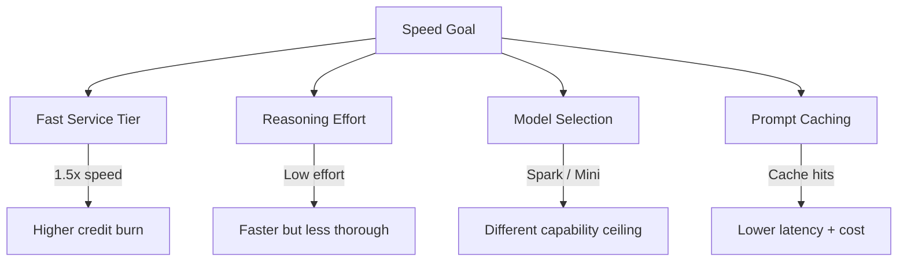
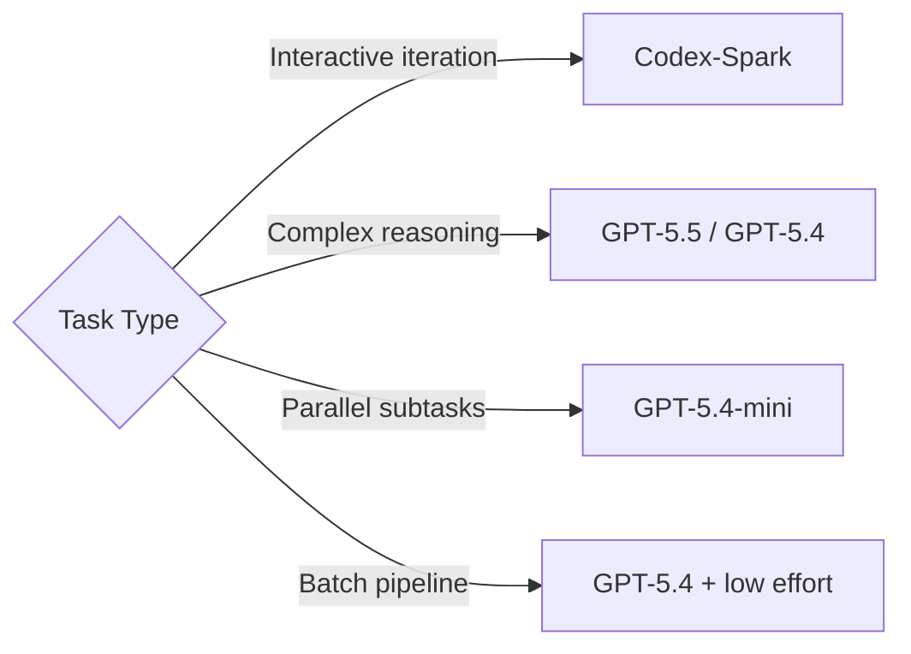

# The Codex CLI Speed Stack: Fast Mode, Reasoning Effort, Spark, and Performance Tuning


---

Codex CLI now ships four independent speed levers, each with its own trade-off envelope. This article maps every lever — Fast service tier, reasoning effort, model selection (including Codex-Spark), and prompt caching — into a single decision framework so you can dial in the speed-cost-quality balance that fits your workflow.

---

## The Four Speed Levers

Most developers treat "make it faster" as a single knob. In practice, Codex CLI exposes four orthogonal controls, and understanding how they interact prevents the common mistake of paying twice for the same throughput gain.



---

## Lever 1: Fast Service Tier

Fast mode is the simplest speed lever. It tells OpenAI's serving infrastructure to prioritise your requests, delivering approximately 1.5× faster inference at the cost of higher credit consumption.[^1]

### Credit Multipliers

| Model | Fast-Mode Credit Rate | Standard Rate |
|-------|----------------------|---------------|
| GPT-5.5 | 2.5× | 1× |
| GPT-5.4 | 2× | 1× |

### Configuration

Toggle interactively mid-session:

```bash
/fast on       # enable
/fast off      # disable
/fast status   # check current state
```

Or set as your default in `~/.codex/config.toml`:

```toml
service_tier = "fast"

[features]
fast_mode = true
```

### Availability Constraints

Fast mode is available across the CLI, IDE extension, and Codex app — but only when authenticated via ChatGPT.[^1] API-key users receive standard API pricing and cannot access Fast-mode credits. This makes Fast mode a ChatGPT-plan perk, not a universal feature.

### When to Use It

Fast mode shines during interactive pairing sessions where latency directly impacts your flow state. For batch `codex exec` pipelines running overnight, the credit premium rarely justifies the wall-clock savings.

---

## Lever 2: Reasoning Effort

Reasoning effort controls how much compute the model spends deliberating before producing output.[^2] Five levels are available:

| Level | Use Case | Relative Speed |
|-------|----------|----------------|
| `low` | Boilerplate, simple renames, formatting | Fastest |
| `medium` | Standard coding, bug fixes, tests | Balanced |
| `high` | Multi-file refactors, complex logic | Slower |
| `xhigh` | Security analysis, large migrations, architectural changes | Slowest |

### TUI Shortcuts (v0.124.0+)

The April 2026 release added inline keyboard shortcuts for reasoning effort adjustment:[^3]

- **`Alt+,`** — lower reasoning effort one step
- **`Alt+.`** — raise reasoning effort one step

When you accept a model upgrade (e.g. switching from GPT-5.4 to GPT-5.5), v0.124 now resets reasoning effort to the new model's default rather than carrying over a potentially stale setting.[^3]

### Configuration

Set a persistent default:

```toml
model_reasoning_effort = "medium"
```

Or use profiles for different workflows:

```toml
[profiles.thorough]
model_reasoning_effort = "xhigh"

[profiles.quick]
model_reasoning_effort = "low"
```

Launch with a profile: `codex --profile quick "rename userId to user_id across the codebase"`.

### The Reasoning Effort Sweet Spot

`medium` is the recommended starting point for interactive work — it balances intelligence and speed for most coding tasks.[^4] Reserve `xhigh` for tasks where correctness matters more than turnaround: security audits, complex migrations, and architectural decision-making. Drop to `low` for mechanical tasks like formatting, renaming, or boilerplate generation where the model's full reasoning capacity is wasted.

---

## Lever 3: Model Selection for Speed

Not every task needs the frontier model. Codex CLI's model roster includes purpose-built options for speed-critical workflows.

### GPT-5.3-Codex-Spark

Codex-Spark is the speed-first model, running on Cerebras' Wafer-Scale Engine 3 and delivering over 1,000 tokens per second — roughly 15× faster than standard Codex models.[^5] Sub-100ms first-token latency eliminates the perceptible "thinking…" pause entirely.[^6]

```bash
codex --model gpt-5.3-codex-spark "add input validation to the signup form"
```

**Caveats:**

- Text-only — no image input or generation
- Research preview restricted to ChatGPT Pro subscribers[^1]
- Lower ceiling on complex multi-file reasoning (77.3% on Terminal-Bench 2.0 vs higher scores from GPT-5.4/5.5)[^5]

Codex-Spark excels at interactive iteration: quick fixes, small feature additions, and rapid prototyping where you want near-instant feedback.

### GPT-5.4-mini for Subagents

When orchestrating parallel subagents, GPT-5.4-mini consumes only 30% of the credits that GPT-5.4 uses for comparable tasks.[^7] This means a subagent fleet running GPT-5.4-mini lasts approximately 3.3× longer before hitting usage limits.

```toml
[subagents]
model = "gpt-5.4-mini"
```

The orchestrator/worker pattern — GPT-5.4 or GPT-5.5 for planning and coordination, GPT-5.4-mini for bounded subtasks like file search, test execution, and code review — delivers the best throughput-per-credit ratio for parallel workloads.[^7]

### Decision Matrix



---

## Lever 4: Prompt Caching

Prompt caching is the only lever that simultaneously reduces both latency and cost. Codex CLI's append-only prompt architecture is specifically designed to maximise exact-prefix cache hits.[^8]

### How It Works

The agent loop keeps system instructions, tool definitions, sandbox configuration, and environment context in an identical, consistently ordered prefix across every request.[^8] New messages are appended — never inserted into or modifying the existing prefix. This ensures that the Responses API can match the cached prefix and skip re-processing those tokens.

Without prompt caching, each iteration of the agent loop would be quadratic in cost (every turn resends all prior context). With cache hits, compute stays closer to linear.[^8]

### What Destroys Cache Hits

Several patterns break the prefix match and cause cache misses:

1. **Reordering tool definitions** — adding or removing MCP servers mid-session shuffles the prefix
2. **Changing sandbox configuration** — switching `approval_policy` mid-conversation can alter early prompt tokens
3. **Large AGENTS.md files** — bloated instruction files increase the prefix size, making misses more expensive when they occur[^9]
4. **Parallel sessions without `prompt_cache_key`** — running multiple sessions against the same codebase without a shared cache key forces separate cache entries[^8]

### Configuration

For parallel sessions sharing the same codebase:

```toml
prompt_cache_key = "my-project-main"
```

Keep MCP server configuration stable throughout a session. If you need different tool sets, use profiles rather than toggling servers mid-conversation.

---

## Combining the Levers: Practical Profiles

The four levers compose naturally into workflow profiles. Here are three battle-tested combinations:

### The Flow State Profile

Optimised for interactive pairing where latency is the primary constraint:

```toml
[profiles.flow]
model = "gpt-5.3-codex-spark"
model_reasoning_effort = "medium"
service_tier = "fast"
```

⚠️ Note: Fast mode's interaction with Codex-Spark pricing may vary — verify credit consumption on your specific plan tier.

### The Deep Work Profile

For complex refactors and migrations where correctness trumps speed:

```toml
[profiles.deep]
model = "gpt-5.5"
model_reasoning_effort = "xhigh"
```

### The CI Pipeline Profile

For `codex exec` batch runs where cost efficiency matters most:

```toml
[profiles.ci]
model = "gpt-5.4"
model_reasoning_effort = "low"

[profiles.ci.subagents]
model = "gpt-5.4-mini"
```

---

## Measuring Speed: What to Track

Without measurement, tuning is guesswork. Track these metrics to validate your speed configuration:

1. **Time to first token (TTFT)** — measures serving latency. Target sub-500ms for interactive work, sub-100ms with Codex-Spark.[^6]
2. **Tokens per second** — measures generation throughput. Standard models deliver ~70 tok/s; Codex-Spark exceeds 1,000 tok/s.[^5]
3. **Cache hit rate** — visible in the `--json` JSONL stream under `usage.prompt_tokens_details.cached_tokens`. Aim for >80% after the first turn.[^8]
4. **Credits consumed per task** — compare across profiles to find the efficiency frontier for your workload.

```bash
# Extract cache hit rate from a codex exec run
codex exec --json "refactor auth module" 2>/dev/null \
  | jq -s '[.[] | select(.usage) | .usage.prompt_tokens_details.cached_tokens // 0] | add'
```

---

## The Speed-Cost-Quality Trade-Off

Every lever shifts the balance:

| Lever | Speed Impact | Cost Impact | Quality Impact |
|-------|-------------|-------------|----------------|
| Fast mode ON | +50% | +100–150% credits | None |
| Reasoning low → xhigh | −3–5× | +2–4× tokens | Significant improvement |
| GPT-5.5 → Spark | +15× | Separate limits | Lower ceiling |
| Cache hit → miss | −30–50% TTFT | +2× input cost | None |

The key insight: **Fast mode and prompt caching are pure speed levers** — they do not affect output quality. **Reasoning effort and model selection directly trade quality for speed.** Start by maximising cache hits (free speed), then enable Fast mode if latency still matters, and only then consider dropping reasoning effort or switching models.

---

## Citations

[^1]: OpenAI, "Speed – Codex," [developers.openai.com/codex/speed](https://developers.openai.com/codex/speed), accessed April 2026.
[^2]: OpenAI, "Config basics – Codex," [developers.openai.com/codex/config-basic](https://developers.openai.com/codex/config-basic), accessed April 2026.
[^3]: OpenAI, "Codex CLI v0.124.0 release notes," [github.com/openai/codex/releases](https://github.com/openai/codex/releases), April 23, 2026.
[^4]: OpenAI, "Best practices – Codex," [developers.openai.com/codex/learn/best-practices](https://developers.openai.com/codex/learn/best-practices), accessed April 2026.
[^5]: OpenAI, "Introducing GPT-5.3-Codex-Spark," [openai.com/index/introducing-gpt-5-3-codex-spark/](https://openai.com/index/introducing-gpt-5-3-codex-spark/), March 2026.
[^6]: Cerebras, "OpenAI Codex-Spark," [cerebras.ai/blog/openai-codexspark](https://www.cerebras.ai/blog/openai-codexspark), March 2026.
[^7]: OpenAI, "Models – Codex," [developers.openai.com/codex/models](https://developers.openai.com/codex/models), accessed April 2026.
[^8]: OpenAI, "Unrolling the Codex agent loop," [openai.com/index/unrolling-the-codex-agent-loop/](https://openai.com/index/unrolling-the-codex-agent-loop/), 2026.
[^9]: OpenAI, "MCP Schema Bloat and System Prompt Tax," referenced in Codex CLI best practices documentation, April 2026.
