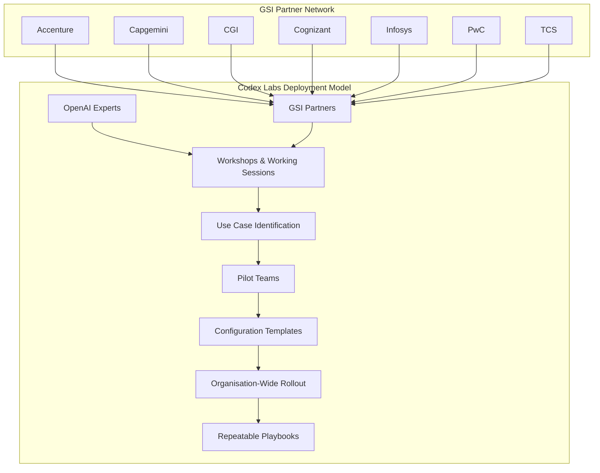
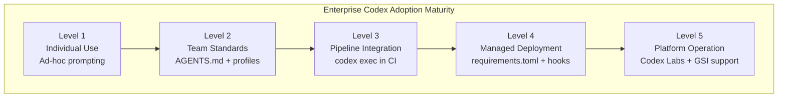

# Codex Labs and the GSI Network: What Enterprise-Scale Codex Deployment Means for CLI Power Users


On 21 April 2026, OpenAI announced **Codex Labs** alongside partnerships with seven Global Systems Integrators (GSIs) — Accenture, Capgemini, CGI, Cognizant, Infosys, PwC, and Tata Consultancy Services [^1]. The initiative arrives as Codex's weekly active developer base surged from three million to over four million in just two weeks [^2]. For CLI power users already running `codex exec` in CI pipelines and orchestrating multi-agent workflows locally, the enterprise push raises practical questions: what changes when your individual tool becomes an organisational platform?

This article unpacks the Codex Labs programme, maps the enterprise deployment model onto CLI-centric workflows, and identifies the configuration patterns teams will need as adoption scales from individual engineers to hundreds of seats.

## What Codex Labs Actually Is

Codex Labs is not a product — it is a **guided deployment programme** [^2]. OpenAI embeds its own engineers and certified partner consultants directly inside customer organisations to run hands-on workshops, identify high-value use cases, and build repeatable deployment playbooks [^3]. The programme targets enterprises that have moved past experimentation but struggle with the gap between "one developer using Codex" and "two hundred developers using Codex consistently."

The GSI partners — Accenture, Capgemini, CGI, Cognizant, Infosys, PwC, and TCS — bring enterprise integration expertise: procurement, compliance, change management, and the organisational muscle to roll out tooling across thousands of engineers [^1]. Cognizant, for instance, is already applying Codex across its Software Engineering Group for AI/ML model development, code refactoring, legacy modernisation, vulnerability detection, and agentic solution development [^4].



## The Three-Layer Codex Platform

Enterprise adoption now spans three distinct surfaces, each with different governance requirements:

| Layer | Interface | Governance Model | Typical User |
|-------|-----------|-----------------|--------------|
| **CLI** | `codex` / `codex exec` | Local config.toml + AGENTS.md | Individual engineers, CI pipelines |
| **App/Desktop** | Codex desktop app | Workspace-level admin controls | Product teams, design-to-code |
| **Cloud/Slack** | @Codex in Slack, cloud tasks | Organisation-wide RBAC, audit logs | Cross-functional teams, managers |

For CLI users, the critical implication is that **your local configuration now participates in a managed hierarchy**. Enterprise admins can push managed `requirements.toml` files that enforce minimum sandbox policies, deny-read glob patterns, and approved model lists [^5]. Your personal `~/.codex/config.toml` still works, but managed requirements take precedence and cannot be overridden locally [^6].

## Configuration Patterns for Scaled Deployment

### Managed Requirements

Enterprise deployments use `requirements.toml` to enforce organisation-wide policies. This file lives alongside or above project-level configuration and sets floors that individual developers cannot weaken [^6]:

```toml
# requirements.toml — pushed by enterprise admin
[sandbox]
sandbox_mode = "workspace-write"

[permissions.enterprise.filesystem]
deny_read = [
    "**/.env",
    "**/.env.*",
    "**/secrets/**",
    "**/credentials/**",
]

[permissions.enterprise.network]
# Only allow API and registry access
allow = ["api.openai.com", "registry.npmjs.org", "ghcr.io"]
```

### Profile-Based Environment Switching

At scale, teams need multiple configuration profiles — development, staging, security review, and production deployment each require different sandbox modes, model selections, and approval policies [^6]:

```toml
# config.toml — team-level configuration
default_profile = "dev"

[profiles.dev]
model = "o4-mini"
approval_policy = "on-failure"
sandbox_mode = "workspace-write"

[profiles.security-review]
model = "gpt-5.5"
approval_policy = "unless-allow-listed"
sandbox_mode = "workspace-write"

[profiles.security-review.hooks.pre_tool_use]
command = "security-gate.sh"

[profiles.ci]
model = "o4-mini"
approval_policy = "full-auto"
sandbox_mode = "workspace-write"
```

Switch profiles at invocation time:

```bash
# Local development
codex --profile dev "refactor the auth module"

# Security-focused review
codex --profile security-review "audit this PR for vulnerabilities"

# CI pipeline
codex exec --profile ci "run the test suite and fix any failures"
```

### Hierarchical AGENTS.md

In enterprise monorepos, nested `AGENTS.md` files let teams maintain local context without bloating the global instruction set. The agent picks the nearest file in the directory hierarchy [^7]:

```
mycompany-monorepo/
  AGENTS.md                    # Organisation-wide conventions
  services/
    payments/
      AGENTS.md                # Payment team patterns, PCI-DSS rules
    auth/
      AGENTS.md                # Auth team patterns, session handling
  shared/
    AGENTS.md                  # Shared library conventions
```

## Enterprise Pricing and CLI Access

The pricing model directly affects how CLI users operate at enterprise scale [^8]:

- **Plus** (\$20/month): Full CLI access, latest models including GPT-5.5, 15-80 local messages per 5-hour window
- **Pro** (from \$100/month): 5x-20x higher rate limits, GPT-5.3-Codex-Spark access; currently doubled usage through 31 May 2026
- **Business** (pay-as-you-go): Credit-based, with standard or usage-based seats, larger cloud VMs, admin controls, SAML SSO
- **Enterprise**: Priority processing, SCIM, EKM, RBAC, audit logs, data retention and residency controls

Credit rates for Business and Enterprise customers [^8]:

| Model | Input (credits/1M tokens) | Output (credits/1M tokens) |
|-------|--------------------------|---------------------------|
| GPT-5.5 | 125 | 750 |
| GPT-5.4 | 62.50 | 375 |
| GPT-5.4-mini | 18.75 | 112.50 |
| GPT-5.3-Codex | 43.75 | 262.50 |

For CLI-heavy teams, the **API key** path charges at standard API rates with usage-based billing — often more cost-effective for CI/CD pipelines running dozens of `codex exec` calls per hour [^8].

## What the Early Adopters Are Doing

The enterprises already using Codex at scale reveal the patterns that Codex Labs will formalise [^2][^3]:

- **Virgin Atlantic**: Code review acceleration and codebase comprehension for distributed teams
- **Cisco**: Incident response automation and technical debt reduction
- **Ramp**: Feature velocity acceleration with integrated test generation
- **Notion**: Repository reasoning and cross-service understanding
- **Rakuten**: Multi-language codebase modernisation

These use cases align with what Cognizant describes as the core enterprise value proposition: "The best engineering organisations of the next decade will not be defined by how many engineers they have, but by how effectively human judgement and AI capability work as one" [^4].



## What This Means for CLI Power Users

### Your Workflows Will Not Break

Codex Labs does not change the CLI itself. The `codex` and `codex exec` commands, the TUI, hooks, plugins, and MCP integrations all work identically. What changes is the **governance layer above your configuration** [^6].

### Expect Managed Policies

If your organisation adopts Codex through a Codex Labs engagement, expect to see:

1. **Managed `requirements.toml`** enforcing sandbox floors and deny-read patterns
2. **Approved model catalogues** restricting which models are available (particularly relevant for data residency requirements)
3. **Hook policies** — enterprise-mandated hooks for MCP tool observation, apply_patch auditing, and auto-review workflows [^9]
4. **Plugin allowlists** restricting which marketplace plugins can be installed

### Prepare Your Team's AGENTS.md

The single most impactful preparation for an enterprise Codex rollout is investing in high-quality `AGENTS.md` files. These documents become the institutional knowledge that makes Codex effective across an organisation, not just for the one developer who wrote the original prompt [^7].

### Audit Your CLI Configuration

Run `codex config show` to see your effective configuration after all layers merge. When managed requirements arrive, this command becomes essential for understanding which settings you control and which are enforced [^6]:

```bash
# Show effective config including managed requirements
codex config show

# Show which profile is active
codex config show --profile ci

# Override specific settings for one run
codex --config sandbox_workspace_write.network_access=true \
      --config 'shell_environment_policy.include_only=["PATH","HOME"]' \
      "deploy the staging build"
```

## The Competitive Context

The Codex Labs launch does not happen in a vacuum. Anthropic's Claude Code is gaining traction in regulated sectors, Microsoft Copilot is deeply embedded in enterprise toolchains, and Google's Gemini and Amazon Bedrock are aggressively positioning for enterprise AI workloads [^3]. OpenAI's GSI strategy mirrors the playbook that Salesforce and ServiceNow used to build enterprise lock-in — deep organisational integration through consulting partners creates switching costs that pure product features cannot [^3].

For CLI users, this means Codex's enterprise features will likely accelerate. The recent v0.124.0 release already added stable hooks with inline config, Amazon Bedrock provider support, and multi-environment app-server sessions [^10] — all features driven by enterprise demand.

## Practical Recommendations

1. **Standardise your configuration now.** Create team-level `config.toml` with profiles before managed requirements force a structure on you
2. **Invest in AGENTS.md.** This is the highest-leverage preparation for any enterprise rollout — it encodes institutional knowledge the agent needs
3. **Move CI pipelines to `codex exec`.** Enterprise deployments will expect automation; get ahead of it
4. **Test with `--profile` switching.** Build muscle memory for profile-based workflow changes before they become mandatory
5. **Understand the pricing model.** API key billing versus credit-based plans can differ by 3-5x depending on usage patterns — model the costs before your team scales

## Citations

[^1]: OpenAI, "Scaling Codex to enterprises worldwide," openai.com, 21 April 2026. [https://openai.com/index/scaling-codex-to-enterprises-worldwide/](https://openai.com/index/scaling-codex-to-enterprises-worldwide/)

[^2]: StartupHub.ai, "OpenAI Launches Codex Labs for Enterprise," startuphub.ai, April 2026. [https://www.startuphub.ai/ai-news/artificial-intelligence/2026/openai-launches-codex-labs-for-enterprise](https://www.startuphub.ai/ai-news/artificial-intelligence/2026/openai-launches-codex-labs-for-enterprise)

[^3]: Influencer Magazine, "OpenAI Expands Codex Into the Enterprise Through Global Consulting Partnerships and the Launch of Codex Labs," influencermagazine.uk, April 2026. [https://influencermagazine.uk/2026/04/openai-expands-codex-into-the-enterprise-through-global-consulting-partnerships-and-the-launch-of-codex-labs/](https://influencermagazine.uk/2026/04/openai-expands-codex-into-the-enterprise-through-global-consulting-partnerships-and-the-launch-of-codex-labs/)

[^4]: Cognizant, "Cognizant and OpenAI Partner to Reshape Enterprise Software Engineering with Codex," prnewswire.com, 21 April 2026. [https://www.prnewswire.com/news-releases/cognizant-and-openai-partner-to-reshape-enterprise-software-engineering-with-codex-302748608.html](https://www.prnewswire.com/news-releases/cognizant-and-openai-partner-to-reshape-enterprise-software-engineering-with-codex-302748608.html)

[^5]: OpenAI, "Advanced Configuration," developers.openai.com. [https://developers.openai.com/codex/config-advanced](https://developers.openai.com/codex/config-advanced)

[^6]: OpenAI, "Configuration Reference," developers.openai.com. [https://developers.openai.com/codex/config-reference](https://developers.openai.com/codex/config-reference)

[^7]: OpenAI, "Features — Codex CLI," developers.openai.com. [https://developers.openai.com/codex/cli/features](https://developers.openai.com/codex/cli/features)

[^8]: OpenAI, "Pricing — Codex," developers.openai.com. [https://developers.openai.com/codex/pricing](https://developers.openai.com/codex/pricing)

[^9]: OpenAI, "Codex CLI v0.124.0 Release Notes," github.com/openai/codex, 23 April 2026. [https://github.com/openai/codex/releases/tag/rust-v0.124.0](https://github.com/openai/codex/releases/tag/rust-v0.124.0)

[^10]: Releasebot, "Codex by OpenAI — Release Notes — April 2026 Latest Updates," releasebot.io. [https://releasebot.io/updates/openai/codex](https://releasebot.io/updates/openai/codex)
