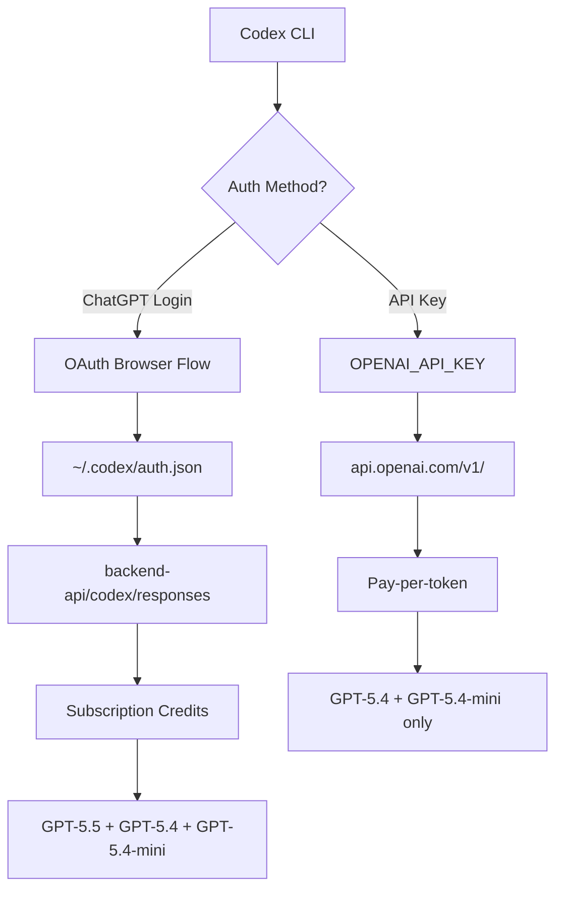
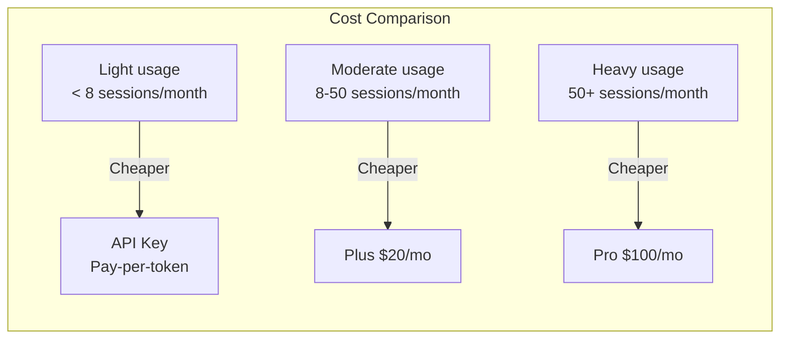

# The Codex Subscription API: Programmatic Access to GPT-5.5 Through Your ChatGPT Plan


---

When OpenAI launched GPT-5.5 on 23 April 2026, a curious limitation accompanied the announcement: the model is available only through ChatGPT subscription authentication, not via API keys[^1]. Within hours, Simon Willison had reverse-engineered the Codex CLI's authentication flow and published `llm-openai-via-codex`, a plugin that routes arbitrary prompts through your existing subscription[^2]. OpenAI's response? "We want people to be able to use Codex, and their ChatGPT subscription, wherever they like"[^2]. This semi-official endorsement has sparked an ecosystem of tools — from lightweight plugins to full account-pool proxies — that treat the Codex backend as a programmable API surface. This article dissects how the subscription API works, how to use it safely, and where the boundaries lie.

## Two Authentication Paths, Two Pricing Models

Codex CLI supports two fundamentally different authentication methods, each with distinct pricing and model access implications[^3]:

| Aspect | ChatGPT Sign-In | API Key |
|--------|-----------------|---------|
| **Authentication** | Browser-based OAuth flow | `OPENAI_API_KEY` environment variable |
| **Pricing** | Subscription credits (rolling 5-hour window) | Pay-per-token at API rates |
| **GPT-5.5 access** | Yes (all paid tiers) | Not yet available |
| **Token storage** | `~/.codex/auth.json` or OS keyring | Environment variable |
| **Enterprise controls** | Workspace RBAC, retention policies | Organisation-level settings |
| **Fast mode** | Available | Not available |

The critical difference: ChatGPT sign-in routes requests through `chatgpt.com/backend-api/codex/responses`[^4], whilst API key authentication uses the standard `api.openai.com/v1/` endpoints. The subscription path carries your plan's credit allocation — Plus subscribers get 15–80 GPT-5.5 messages per five-hour window, Pro 20x subscribers get up to 1,600[^5].



## How auth.json Works

When you authenticate via `codex --login`, the CLI opens a browser, completes an OAuth handshake, and caches the resulting tokens locally. The `cli_auth_credentials_store` configuration key controls where credentials land[^3]:

```toml
# ~/.codex/config.toml
cli_auth_credentials_store = "auto"  # "file" | "keyring" | "auto"
```

- **`file`** — writes to `$CODEX_HOME/auth.json` (defaults to `~/.codex/auth.json`)
- **`keyring`** — uses the OS credential store (macOS Keychain, GNOME Keyring, Windows Credential Manager)
- **`auto`** — attempts the OS store first, falls back to `auth.json`

The `auth.json` file is not host-bound. You can copy it to a headless machine and Codex will authenticate without a browser[^3]. Tokens refresh automatically during active sessions, so long-running CI jobs or automation scripts rarely hit expiry[^3].

> **Security note:** treat `auth.json` like a private key. Never commit it to version control, paste it into issue trackers, or share it in Slack. If compromised, log out immediately with `codex --logout` — this invalidates both CLI and IDE extension sessions[^3].

## The Third-Party Ecosystem

### llm-openai-via-codex

Simon Willison's plugin is the canonical example of subscription API reuse[^2]. It extracts credentials from your local Codex installation and routes `llm` prompts through the backend endpoint:

```bash
# Install
llm install llm-openai-via-codex

# List available models
llm models -q openai-codex

# Query GPT-5.5 with high reasoning effort
llm -m openai-codex/gpt-5.5 -o reasoning_effort xhigh \
  "Explain the CAP theorem in the context of CRDTs"
```

The plugin requires a valid Codex CLI installation with cached credentials — it reads `~/.codex/auth.json` directly[^6]. Model availability mirrors your subscription tier, so a Plus subscriber sees the same models they would in the CLI itself.

### Codex2API

At the other end of the spectrum, Codex2API is an open-source proxy that manages a pool of Codex accounts behind an OpenAI-compatible API surface[^7]. Built with Go and Gin, it exposes `/v1/chat/completions` whilst internally handling:

- **Token pool scheduling** — selects healthy accounts via SQL filters (`WHERE status = 'active'`)
- **Automatic credential refresh** — rotates expired tokens on configurable intervals
- **Rate limit recovery** — parses 429 responses, pauses over-limit accounts, resumes after reset windows
- **Usage tracking** — per-account metrics with a React admin dashboard

```bash
# Quick deployment
git clone https://github.com/james-6-23/codex2api.git
docker compose pull && docker compose up -d
# Admin dashboard at http://localhost:8080/admin/
```

Codex2API supports both PostgreSQL/Redis for distributed deployments and SQLite for single-node setups[^7]. It claims to handle 100+ accounts with automated refresh, reducing manual operations by approximately 90%[^7].

> **Terms of service warning:** pooling multiple accounts through a proxy may violate OpenAI's usage policies. The semi-official endorsement from Romain Huet applies to individual, personal use of your own subscription[^2]. Account pooling and credential sharing sit in a greyer area. Proceed with caution and consult OpenAI's terms before deploying this in production.

## Enterprise Considerations

### Managed Authentication Policies

Enterprise administrators can lock down authentication methods using `requirements.toml`, preventing users from switching between ChatGPT and API key authentication[^8]:

```toml
# /etc/codex/requirements.toml
forced_login_method = "chatgpt"
forced_chatgpt_workspace_id = "ws_abc123"
```

This ensures all usage routes through the organisation's workspace, preserving RBAC controls and data retention policies[^3]. Mismatched credentials trigger automatic logout[^3].

### Cost Arithmetic

Understanding when subscription credits beat API pricing matters for team budgeting. Using April 2026 token-based rates for Business plans[^5]:

| Model | Input (per 1M tokens) | Cached (per 1M) | Output (per 1M) |
|-------|----------------------|------------------|------------------|
| GPT-5.5 | \$125.00 | \$12.50 | \$750.00 |
| GPT-5.4 | \$62.50 | \$6.25 | \$375.00 |
| GPT-5.4-mini | \$18.75 | \$1.875 | \$113.00 |

A typical Codex CLI session consuming 50K input tokens and 10K output tokens on GPT-5.5 costs roughly \$13.75 at API rates. A Pro subscriber at \$100/month gets 80–400 such sessions included. The break-even sits at approximately 8–10 substantial sessions per month — most active developers exceed this comfortably.



## Building Your Own Integration

If you want to build tooling that consumes your Codex subscription programmatically, the pattern is straightforward:

1. **Authenticate the CLI** — run `codex --login` once on the target machine
2. **Read credentials** — parse `~/.codex/auth.json` for the access token
3. **Hit the endpoint** — POST to `chatgpt.com/backend-api/codex/responses` with the Responses API schema
4. **Handle refresh** — tokens expire; re-read `auth.json` after a 401

However, there are significant caveats:

- **No SLA.** The backend endpoint is not a documented public API. It can change without notice[^2].
- **Rate limits are subscription-bound.** Your five-hour rolling window applies regardless of how you access the endpoint.
- **No streaming guarantees.** The endpoint's streaming behaviour may differ from the public API's SSE contract.
- **Credential scope.** The auth token carries your full workspace permissions. Any tool with access to `auth.json` can read your repositories, execute commands in your sandbox, and access your conversation history.

For production workflows, OpenAI recommends API key authentication[^3]. The subscription path is best suited for personal tooling, local experimentation, and scenarios where GPT-5.5 access is essential and API availability has not yet arrived.

## Security Hardening for auth.json

Given that `auth.json` is now a high-value target — it provides GPT-5.5 access worth hundreds of dollars per month — consider these hardening steps:

```bash
# Restrict file permissions (Unix)
chmod 600 ~/.codex/auth.json

# Use OS keyring instead of file storage
codex config set cli_auth_credentials_store keyring

# Verify no accidental git tracking
echo ".codex/" >> ~/.gitignore_global
git config --global core.excludesfile ~/.gitignore_global
```

For headless CI environments where you must use file-based storage, mount `auth.json` as a Kubernetes secret or inject it from your secrets manager at runtime. Never bake it into container images.

## The Road Ahead

OpenAI's stance — "use your subscription wherever you like" — suggests the backend endpoint will gain more official support over time[^2]. The gap between ChatGPT and API key model availability (GPT-5.5 is currently subscription-only) creates natural pressure for tools like `llm-openai-via-codex` to exist. Two likely outcomes:

1. **GPT-5.5 reaches the API.** This eliminates the primary motivation for subscription API usage. Historical precedent (GPT-5.4 followed this path) suggests a 4–8 week lag[^1].
2. **The endpoint gets formalised.** A documented, stable subscription API with proper OAuth scopes and rate limit headers would replace the current reverse-engineered approach.

Until then, the ecosystem will continue to grow around the semi-official endpoint. Whether you use Willison's lightweight plugin or a full proxy, the key principles remain: secure your credentials, respect your rate limits, and build with the understanding that undocumented endpoints can change without warning.

## Citations

[^1]: OpenAI, "Introducing GPT-5.5," [https://openai.com/index/introducing-gpt-5-5/](https://openai.com/index/introducing-gpt-5-5/), April 2026.
[^2]: Simon Willison, "A pelican for GPT-5.5 via the semi-official Codex backdoor API," [https://simonwillison.net/2026/Apr/23/gpt-5-5/](https://simonwillison.net/2026/Apr/23/gpt-5-5/), April 2026.
[^3]: OpenAI, "Authentication — Codex," [https://developers.openai.com/codex/auth](https://developers.openai.com/codex/auth), April 2026.
[^4]: OpenAI, "Codex CLI Agent Loop Internals," documented in Codex CLI source and community analysis of the `backend-api/codex/responses` endpoint.
[^5]: OpenAI, "Pricing — Codex," [https://developers.openai.com/codex/pricing](https://developers.openai.com/codex/pricing), April 2026.
[^6]: Simon Willison, "llm-openai-via-codex," [https://github.com/simonw/llm-openai-via-codex](https://github.com/simonw/llm-openai-via-codex), April 2026.
[^7]: Codex2API, [https://github.com/james-6-23/codex2api](https://github.com/james-6-23/codex2api), 2026.
[^8]: OpenAI, "Managed configuration — Codex," [https://developers.openai.com/codex/enterprise/managed-configuration](https://developers.openai.com/codex/enterprise/managed-configuration), April 2026.
