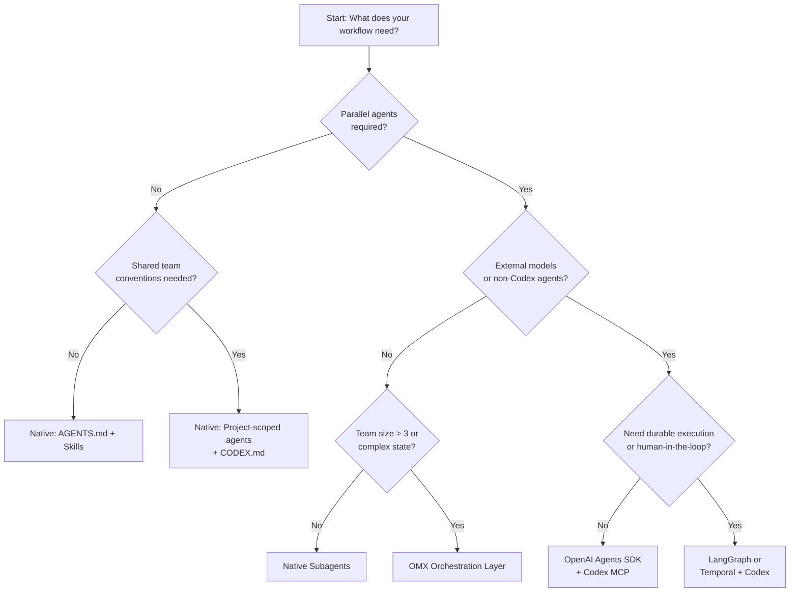
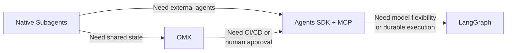

# Community Framework Decision Guide: Which Workflow Framework Fits Your Team


---

If you have used Codex CLI for anything beyond single-shot prompts, you have almost certainly hit the "now what?" moment: your tasks need parallelism, your team needs shared workflows, or your CI pipeline needs deterministic agent orchestration. The ecosystem has responded with at least six credible framework options — from Codex's own native subagents to full-blown external orchestration platforms. Choosing the wrong one wastes weeks. This guide gives you a decision framework grounded in team size, project complexity, model budget, and operational maturity.

## The Landscape in April 2026

The Codex CLI workflow ecosystem has stratified into three tiers:

1. **Native** — Codex subagents, skills, and `AGENTS.md` conventions built into the CLI itself
2. **Codex-native wrappers** — community projects like Oh-My-Codex (OMX) that extend the CLI without replacing it
3. **External orchestration** — general-purpose agent frameworks (OpenAI Agents SDK, LangGraph, CrewAI, Claude Agent SDK, Strands Agents) that treat Codex as one tool among many

Each tier adds capability at the cost of complexity. The decision tree below helps you find the right level.

## Decision Flowchart



## Tier 1: Native Codex Workflows

### When to use

- Solo developers or pairs
- Tasks that decompose into 2–6 parallel subtasks
- You want zero external dependencies

### What you get

Since March 2026, Codex CLI ships subagent support natively [^1]. The `[agents]` configuration block controls concurrency:

```toml
# ~/.codex/config.toml
[agents]
max_threads = 6        # concurrent agent cap
max_depth = 1          # nesting depth (child agents cannot spawn grandchildren)
job_max_runtime_seconds = 300
```

Custom agents live in `~/.codex/agents/` (personal) or `.codex/agents/` (project-scoped) as TOML files [^2]:

```toml
# .codex/agents/reviewer.toml
name = "reviewer"
description = "Security-focused code reviewer"
developer_instructions = """
Review for OWASP Top 10 vulnerabilities.
Flag any unvalidated input or missing auth checks.
"""
model = "o3"
sandbox_mode = "read-only"
```

For batch processing, the experimental `spawn_agents_on_csv` tool spawns one worker per CSV row, waits for completion, and exports combined results [^2]. This is ideal for repetitive tasks like migrating 200 API endpoints or reviewing 50 PRs.

### Limitations

- `max_depth` defaults to 1 — no recursive agent trees [^2]
- No built-in state persistence across sessions
- No human-approval gates beyond the existing `approval-policy` flag

## Tier 2: Oh-My-Codex (OMX)

### When to use

- Teams of 3+ developers sharing Codex workflows
- Projects needing persistent state that survives context pruning
- You want structured workflows (autopilot, TDD cycles, planning) without writing orchestration code

### What you get

OMX has grown rapidly since early 2026 and now ships 36 workflow skills and 5 MCP servers [^3]. It wraps Codex CLI with a standardised four-step workflow:

```
$deep-interview → $ralplan → $ralph / $team
```

The key architectural decisions that differentiate OMX from raw subagents:

- **tmux-based parallel workers**, each in an isolated git worktree — preventing write conflicts during simultaneous edits [^4]
- **Persistent `.omx/` directory** that stores state and memory across context windows [^3]
- **Native Codex hooks** (`PreToolUse` / `PostToolUse`) wired through `.codex/hooks.json` [^3]
- **33 prompts and 36 skills** accessible via `$name` syntax [^3]

```bash
# Install OMX (requires Codex CLI already installed)
npx oh-my-codex init

# Run the structured planning workflow
omx $deep-interview "Migrate auth service from Express to Fastify"
omx $ralplan
omx $team --workers 4
```

### Limitations

- Adds a tmux dependency — not ideal for CI environments without a terminal
- OMX's opinionated workflow may conflict with teams that have existing SDLC conventions
- ⚠️ Star count claims vary across sources (2,867 to 20,500+); the project may have multiple forks with divergent metrics

## Tier 3: External Orchestration Frameworks

When your workflow involves non-Codex agents, multiple model providers, or durable execution requirements, you need a framework that treats Codex as a tool rather than the runtime.

### OpenAI Agents SDK + Codex MCP

**Best for:** Teams already in the OpenAI ecosystem wanting multi-agent handoffs with Codex as the coding specialist.

Since April 2026, the Agents SDK includes a **harness system** — the same scaffolding that powers Codex internally — enabling long-running agents with interruption persistence and sandbox execution [^5]. Integration is via MCP:

```python
from agents import Agent, Runner
from agents.mcp import MCPServerStdio

async with MCPServerStdio(
    name="Codex CLI",
    params={
        "command": "npx",
        "args": ["-y", "codex", "mcp-server"]
    },
    client_session_timeout_seconds=360000,
) as codex_mcp:
    planner = Agent(
        name="planner",
        instructions="Break tasks into subtasks. Delegate coding to Codex.",
        mcp_servers=[codex_mcp],
    )
    await Runner.run(planner, "Refactor the auth module to use JWT")
```

All workflow traces appear automatically in the OpenAI Traces dashboard [^6].

**Trade-off:** Restricted to OpenAI API-compatible model providers [^5].

### LangGraph

**Best for:** Complex conditional routing, human-in-the-loop approvals, and teams needing model flexibility.

LangGraph leads production adoption with approximately 47 million monthly PyPI downloads [^5]. Its reducer-based state management handles concurrent updates to the same state key — critical when multiple Codex agents edit overlapping files [^7].

```python
from langgraph.graph import StateGraph

class WorkflowState(TypedDict):
    files_changed: list[str]
    review_status: str

graph = StateGraph(WorkflowState)
graph.add_node("codex_implement", codex_implement_fn)
graph.add_node("codex_review", codex_review_fn)
graph.add_node("human_approval", human_approval_fn)
graph.add_edge("codex_implement", "codex_review")
graph.add_conditional_edges(
    "codex_review",
    route_by_severity,
    {"critical": "human_approval", "clean": END}
)
```

The `interrupt()` primitive pauses execution at any node for human approval, then resumes from exactly that checkpoint [^7].

**Trade-off:** Requires 60+ lines of boilerplate versus CrewAI's ~20 lines for equivalent multi-agent setup [^8].

### CrewAI

**Best for:** Rapid prototyping of multi-agent workflows with strong interoperability requirements.

CrewAI ships native support for both MCP and A2A (Agent-to-Agent Protocol) as of 2026, powering over 12 million daily agent executions in production [^8]. With 45,900+ GitHub stars, it has the largest dedicated community [^8].

**Trade-off:** Less granular state control than LangGraph. Sequential task output passing can become a bottleneck in complex graphs.

### Decision Matrix

| Criterion | Native Subagents | OMX | Agents SDK + MCP | LangGraph | CrewAI |
|---|---|---|---|---|---|
| Setup time | Minutes | ~30 min | ~1 hour | ~2 hours | ~30 min |
| Max parallel agents | 6 (configurable) | tmux-limited | SDK-limited | Graph-defined | Role-defined |
| State persistence | None | `.omx/` directory | Harness resume | Checkpointing | Task memory |
| Model flexibility | OpenAI only | OpenAI only | OpenAI-compatible | Any via LangChain | Any supported |
| Human-in-the-loop | `--approval-policy` | Hook-based | Handoff-based | `interrupt()` | Human tool |
| CI/CD friendly | Excellent | Poor (tmux) | Good | Excellent | Good |
| Learning curve | Low | Medium | Medium | High | Low |

## Recommendation by Team Profile

### Solo developer, single repo

Start with **native subagents**. Define 2–3 custom agents in `.codex/agents/`, use `spawn_agents_on_csv` for batch work. You will not outgrow this for months.

### Small team (2–5), shared conventions

Adopt **OMX** if your team works from a shared monorepo and wants opinionated workflows out of the box. The `.omx/` state directory and skill library eliminate the "how do we all use Codex consistently?" problem.

### Platform team, multi-service architecture

Use the **OpenAI Agents SDK with Codex as MCP server**. The harness system gives you durable execution, the Traces dashboard gives you observability, and the handoff model maps cleanly to service boundaries.

### Enterprise, regulated workflows

Choose **LangGraph** (or Temporal for truly long-running processes). The checkpoint-based state management, human-approval gates, and model-agnostic architecture satisfy compliance requirements that lighter frameworks cannot.

### Rapid prototyping, multi-provider

Start with **CrewAI** for speed, then migrate performance-critical paths to LangGraph as your agents stabilise [^8]. CrewAI's LangChain compatibility makes this a gradual transition, not a rewrite.

## The Pragmatic Path

Most teams should start native and graduate upward:



The worst outcome is over-engineering your workflow layer before you understand your actual orchestration needs. Codex's native subagents handle more than most developers expect — start there, measure where you hit walls, and only then reach for external frameworks.

## Citations

[^1]: [Subagents – Codex | OpenAI Developers](https://developers.openai.com/codex/subagents) — Codex subagent feature documentation including March 2026 availability.

[^2]: [Subagents – Codex | OpenAI Developers](https://developers.openai.com/codex/subagents) — Configuration details for `[agents]` TOML block, custom agent definitions, CSV batch processing, and `max_depth` defaults.

[^3]: [Oh-My-Codex (OMX): The Community Orchestration Layer That Turns Codex CLI into a Team Runtime | Codex Blog](https://codex.danielvaughan.com/2026/04/10/oh-my-codex-omx-orchestration-layer/) — OMX feature overview including 36 skills, 5 MCP servers, and `.omx/` state persistence.

[^4]: [What Is oh-my-codex (OMX)? Orchestration Layer for Codex CLI – Verdent Guides](https://www.verdent.ai/guides/what-is-oh-my-codex-omx) — OMX tmux-based parallel workers in isolated git worktrees.

[^5]: [2026 AI Agent Framework Showdown: Claude Agent SDK vs Strands vs LangGraph vs OpenAI Agents SDK | QubitTool](https://qubittool.com/blog/ai-agent-framework-comparison-2026) — Framework comparison including harness system, model support, and production readiness rankings.

[^6]: [Use Codex with the Agents SDK | OpenAI Developers](https://developers.openai.com/codex/guides/agents-sdk) — MCP server integration, Python setup code, and automatic trace generation.

[^7]: [LangGraph vs. CrewAI in 2026: Which One Survives the Production | Redwerk](https://redwerk.com/blog/langgraph-vs-crewai/) — LangGraph reducer-based state management and `interrupt()` primitive for human-in-the-loop.

[^8]: [Best Multi-Agent Frameworks in 2026: LangGraph, CrewAI | GuruSup](https://gurusup.com/blog/best-multi-agent-frameworks-2026) — CrewAI MCP/A2A support, 12M daily executions, GitHub stars, and migration strategy recommendation.
