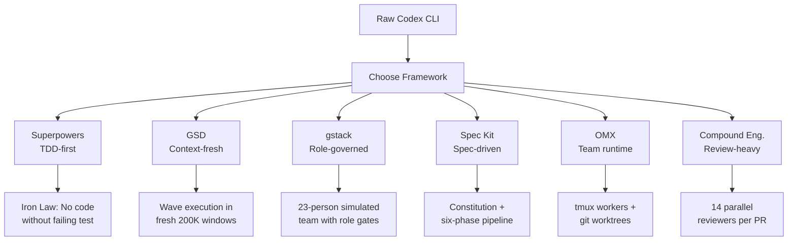
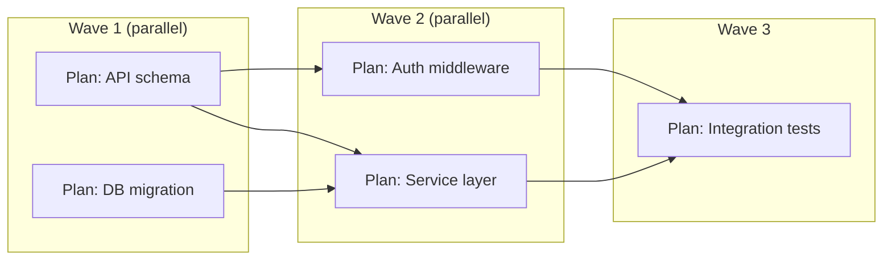
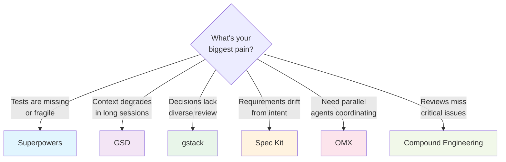

# Community Workflow Frameworks for Codex CLI: Superpowers, GSD, gstack, Spec Kit, OMX, and Compound Engineering Compared


Codex CLI ships with a deliberately minimal orchestration layer: an agent loop, a sandbox, hooks, and skills. That minimalism has spawned an ecosystem of community-built workflow frameworks — each imposing a different set of constraints on *how* you use the tool. By April 2026, six frameworks have emerged with significant adoption, collectively representing over 400,000 GitHub stars[^1]. Choosing the wrong one wastes days; choosing the right one compounds every session.

This article compares all six through a single lens: **what does each framework constrain, and why?**

## The Landscape at a Glance

| Framework | Stars (Apr 2026) | Primary Constraint | Best For |
|-----------|------------------|--------------------|----------|
| Superpowers | ~150K[^2] | Development process (TDD) | Solo devs needing test discipline |
| GSD | ~51K[^3] | Execution environment (context) | Multi-day complex projects |
| gstack | ~71K[^4] | Decision authority (roles) | Founder-engineers shipping product |
| Spec Kit | ~91K[^5] | Specification fidelity | Teams with formal requirements |
| OMX | ~23K[^6] | Parallelism (agent coordination) | Multi-agent team orchestration |
| Compound Engineering | ~13K[^7] | Review breadth (26 reviewers) | Quality-obsessed shipping workflows |



## Superpowers: The TDD Enforcer

Superpowers, created by Jesse Vincent (obra), is the most adopted framework in the ecosystem[^2]. Its philosophy is simple and uncompromising: **no production code without a failing test first**. The framework calls this the "Iron Law" — violate it, and Superpowers deletes the offending code and forces a restart from the test phase[^8].

### How It Works with Codex CLI

Superpowers installs as a skills package under `.agents/skills/`. On Codex CLI, it provides seven phases[^8]:

1. **Brainstorm** — refine rough ideas through structured questions
2. **Spec** — produce a formal specification document
3. **Plan** — create a task breakdown enforcing DRY, YAGNI, and TDD
4. **TDD** — write failing tests for every planned task
5. **Subagent Dev** — implement code against failing tests using fresh subagents
6. **Review** — cross-check implementation against spec
7. **Finalise** — merge, clean up, and document

The subagent phase is key for Codex CLI users. Superpowers spawns a fresh subagent per task to prevent context drift during multi-hour sessions[^8]. Each subagent inherits the test harness but starts with a clean context window.

### When to Use It

Superpowers excels when you need **verification discipline**. The chardet maintainer used Superpowers to rewrite chardet v7.0.0 from scratch, achieving a 41x performance improvement — the kind of aggressive optimisation that is only safe with comprehensive test coverage[^2].

```toml
# .codex/config.toml — Superpowers-compatible profile
[profile.superpowers]
model = "gpt-5.5"
approval_policy = "on-request"
sandbox_permissions = "workspace-write"
```

## GSD (Get Shit Done): The Context Rot Killer

GSD, originally by TACHES, solves a different problem: **context rot** — the quality degradation that occurs as the context window fills[^3]. Rather than fighting the limit, GSD embraces it by externalising all state into files and executing each task in a fresh context window.

### Wave Execution Model

GSD groups plans into dependency-ordered "waves"[^9]. Plans within a wave run in parallel; waves run sequentially. Each plan executes in a fresh 200K context window, receiving only the externalised state files (Markdown and XML) it needs[^3].



### Codex CLI Integration

GSD has a dedicated Codex CLI fork (`get-shit-done-codex`) that adapts the harness for Codex's `codex exec` non-interactive mode and hooks system[^10]. The meta-prompting layer generates fresh prompts for each plan execution, injecting only the relevant context files.

### When to Use It

GSD targets **complex projects spanning days or weeks** — the kind where a single Codex CLI session would exhaust its context window multiple times[^1]. If your project involves parallel workstreams and you find yourself running `/clear` frequently, GSD formalises that pattern.

## gstack: The Role-Governed Organisation

Created by Garry Tan, gstack models a **23-person simulated team** with explicit role governance[^4]. A CEO agent makes strategic decisions, a product manager prioritises features, a QA lead enforces quality gates, engineers implement, designers review UX, and security reviewers audit. The framework enforces "boil the lake" principles: do fewer things excellently rather than mediocre work across everything[^1].

### Role-Based Constraints

Unlike Superpowers (which constrains the *process*) or GSD (which constrains the *environment*), gstack constrains **decision authority**[^1]. Each role has explicit boundaries:

- The **CEO** agent approves or rejects feature scope
- The **QA Lead** must sign off before any merge
- **Engineers** cannot bypass security review
- The **Designer** validates UI changes against design tokens

### Codex CLI Configuration

gstack supports Codex CLI as one of seven compatible agents[^4]. Configuration maps gstack roles to Codex subagents:

```toml
# .codex/agents/qa-lead.toml
[agent]
name = "qa-lead"
model = "gpt-5.5"
instructions = """
You are the QA Lead. Review all code changes for test coverage,
edge cases, and regression risk. Block merges that lack adequate
test verification. Run the full test suite before approving.
"""
```

### When to Use It

gstack suits **founder-engineers shipping a product** where multi-perspective review and real browser testing matter more than infrastructure automation[^1]. The role governance prevents the common failure mode where an AI agent optimises for one dimension (e.g., code quality) while neglecting others (e.g., UX, security).

## Spec Kit: GitHub's Constitutional Approach

Spec Kit, backed by GitHub with over 90,000 stars, takes a **specification-first** approach with constitutional guardrails[^5]. A `constitution.md` file establishes non-negotiable project principles that the AI agent references during every phase[^11].

### The Six-Phase Pipeline

Spec Kit defines six sequential phases, each triggered by a slash command[^5][^11]:

1. `/speckit.constitution` — establish project principles
2. `/speckit.specify` — create requirements specification
3. `/speckit.plan` — produce technical architecture
4. `/speckit.tasks` — break down into actionable tasks
5. `/speckit.implement` — execute tasks against spec
6. `/speckit.review` — validate output against constitution

### Codex CLI Setup

Spec Kit initialises for Codex CLI via the `specify` CLI[^5]:

```bash
npm install -g @github/specify
specify init --here --ai codex
```

This creates the `.specify/` directory structure with `memory/constitution.md`, templates, and agent configuration. The `kiro-for-codex` VS Code extension adds a visual sidebar for managing specs and tracking phase status without leaving the editor[^12].

### When to Use It

Spec Kit excels when **specifications need to be formal and auditable** — regulated environments, contract work, or teams where requirements drift is a recurring problem. The constitutional layer provides a stronger governance mechanism than AGENTS.md alone.

## OMX (Oh-My-Codex): The Team Runtime

OMX, created by Yeachan Heo, is the only framework in this comparison built specifically as a **Codex CLI orchestration layer**[^6]. While the other five frameworks are agent-agnostic, OMX treats Codex as a first-class citizen with native hook ownership and a CLI-first team runtime.

### tmux Worker Architecture

OMX spawns real tmux worker panes where each worker gets an isolated git worktree for conflict-free parallel work[^6]. Workers spawn on demand and terminate when their task completes — no idle resource consumption.

```bash
# Launch OMX team runtime
omc team start --workers 3 --strategy fan-out

# Workers automatically get:
# - Isolated git worktrees
# - Independent Codex CLI sessions
# - Shared state via MCP servers
```

### Persistent State

Unlike GSD (which externalises state to files) or Superpowers (which relies on fresh subagents), OMX uses persistent state and memory MCP servers[^6]. Cross-session context survives worker termination, enabling long-running projects without the cold-start penalty.

### When to Use It

OMX is purpose-built for **multi-agent team orchestration on Codex CLI**. If you need parallel Codex sessions coordinating on a shared codebase with automatic conflict resolution via worktrees, OMX is the only framework that handles this natively.

## Compound Engineering: The Review Maximiser

The Compound Engineering plugin, from Every Inc (Ry Walker), focuses on **review breadth**[^7]. Its standout feature is 14 specialised reviewers running simultaneously on every code change — architecture, security, performance, accessibility, testing, documentation, and more.

### Key Workflows

Compound Engineering provides three primary commands[^7]:

- `/workflows:plan` — spawns three parallel research agents (repo analysis, framework docs, best practices) then merges results into a structured plan
- `/workflows:work` — executes the plan with continuous verification
- `/workflows:review` — launches 14 parallel reviewers for comprehensive feedback

### Codex CLI Installation

The plugin installs through Codex's TUI[^7]:

```bash
codex
# In TUI:
/plugins
# Find Compound Engineering marketplace
# Select compound-engineering plugin → Install
# Restart Codex
```

### When to Use It

Compound Engineering suits teams that value **thoroughness over speed**. The 14-reviewer pipeline catches issues that single-pass review misses, making it ideal for production systems where defect cost is high.

## Decision Framework

Choosing a framework depends on your primary constraint:



### Combining Frameworks

These frameworks are not mutually exclusive. Common combinations include:

- **Superpowers + OMX**: TDD discipline across parallel workers
- **Spec Kit + GSD**: Constitutional specs with wave execution
- **gstack + Compound Engineering**: Role governance with deep review

The key constraint is context budget. Each framework adds system prompt overhead. Superpowers alone consumes roughly 15-20K tokens of instruction context; stacking two frameworks can push overhead past 40K tokens, which matters when GPT-5.5's 400K window must also hold your codebase[^13].

## The Meta-Pattern

Beneath the surface differences, all six frameworks converge on the same architectural pattern[^1]:

**Research → Plan → Execute → Review → Ship**

What varies is where each framework places its guardrails. Superpowers guards *execution* (no code without tests). GSD guards *context* (fresh windows per plan). gstack guards *authority* (role-based approvals). Spec Kit guards *intent* (constitutional principles). OMX guards *coordination* (worker isolation). Compound Engineering guards *quality* (parallel review).

The framework you choose reveals what you fear most about your AI-assisted workflow — and that self-knowledge may be more valuable than the framework itself.

## Citations

[^1]: S. Raisshan, "codex-cli-best-practice: From vibe coding to agentic engineering," GitHub, April 2026. [https://github.com/shanraisshan/codex-cli-best-practice](https://github.com/shanraisshan/codex-cli-best-practice)

[^2]: J. Vincent (obra), "Superpowers: An agentic skills framework & software development methodology that works," GitHub, 2026. [https://github.com/obra/superpowers](https://github.com/obra/superpowers)

[^3]: TACHES, "Get Shit Done: A light-weight and powerful meta-prompting, context engineering and spec-driven development system," GitHub, 2026. [https://github.com/gsd-build/get-shit-done](https://github.com/gsd-build/get-shit-done)

[^4]: G. Tan, "gstack: Role-governed agentic development framework," GitHub, 2026. [https://github.com/anthropics/gstack](https://github.com/anthropics/gstack)

[^5]: GitHub, "Spec Kit: Toolkit to help you get started with Spec-Driven Development," GitHub, 2026. [https://github.com/github/spec-kit](https://github.com/github/spec-kit)

[^6]: Y. Heo, "Oh-My-Codex (OMX): Orchestration layer for OpenAI Codex CLI," GitHub, 2026. [https://github.com/Yeachan-Heo/oh-my-codex](https://github.com/Yeachan-Heo/oh-my-codex)

[^7]: R. Walker / Every Inc, "Compound Engineering Plugin: Official plugin for Claude Code, Codex, Cursor, and more," GitHub, 2026. [https://github.com/EveryInc/compound-engineering-plugin](https://github.com/EveryInc/compound-engineering-plugin)

[^8]: Pulumi Blog, "Superpowers, GSD, and GSTACK: Picking the Right Framework for Your Coding Agent," April 2026. [https://www.pulumi.com/blog/claude-code-orchestration-frameworks/](https://www.pulumi.com/blog/claude-code-orchestration-frameworks/)

[^9]: Agent Native, "GET SH*T DONE: Meta-prompting and Spec-driven Development for Claude Code and Codex," Medium, February 2026. [https://agentnativedev.medium.com/get-sh-t-done-meta-prompting-and-spec-driven-development-for-claude-code-and-codex-d1cde082e103](https://agentnativedev.medium.com/get-sh-t-done-meta-prompting-and-spec-driven-development-for-claude-code-and-codex-d1cde082e103)

[^10]: undeemed, "get-shit-done-codex: A light-weight and powerful meta-prompting system for Codex, originally by TACHES," GitHub, 2026. [https://github.com/undeemed/get-shit-done-codex](https://github.com/undeemed/get-shit-done-codex)

[^11]: Microsoft Developer Blog, "Diving Into Spec-Driven Development With GitHub Spec Kit," April 2026. [https://developer.microsoft.com/blog/spec-driven-development-spec-kit](https://developer.microsoft.com/blog/spec-driven-development-spec-kit)

[^12]: atman-33, "kiro-for-codex: VS Code extension for spec-driven development with Codex CLI," GitHub, 2026. [https://github.com/atman-33/kiro-for-codex](https://github.com/atman-33/kiro-for-codex)

[^13]: OpenAI, "Introducing GPT-5.5," April 2026. [https://openai.com/index/introducing-gpt-5-5/](https://openai.com/index/introducing-gpt-5-5/)
