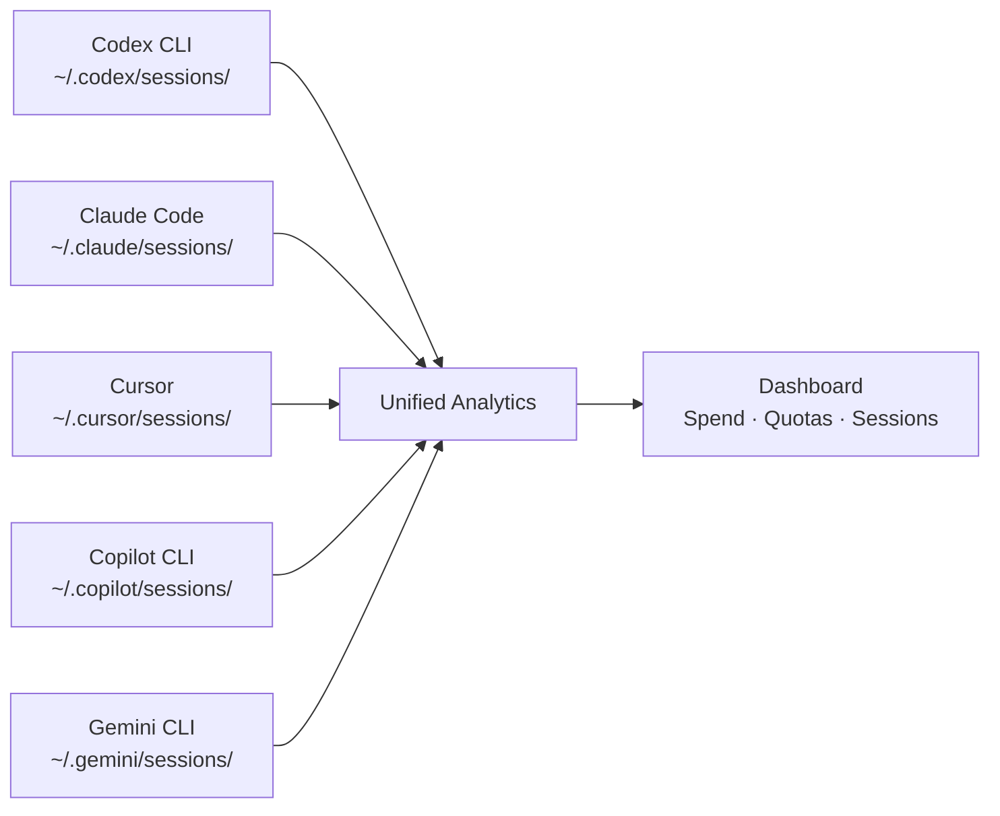
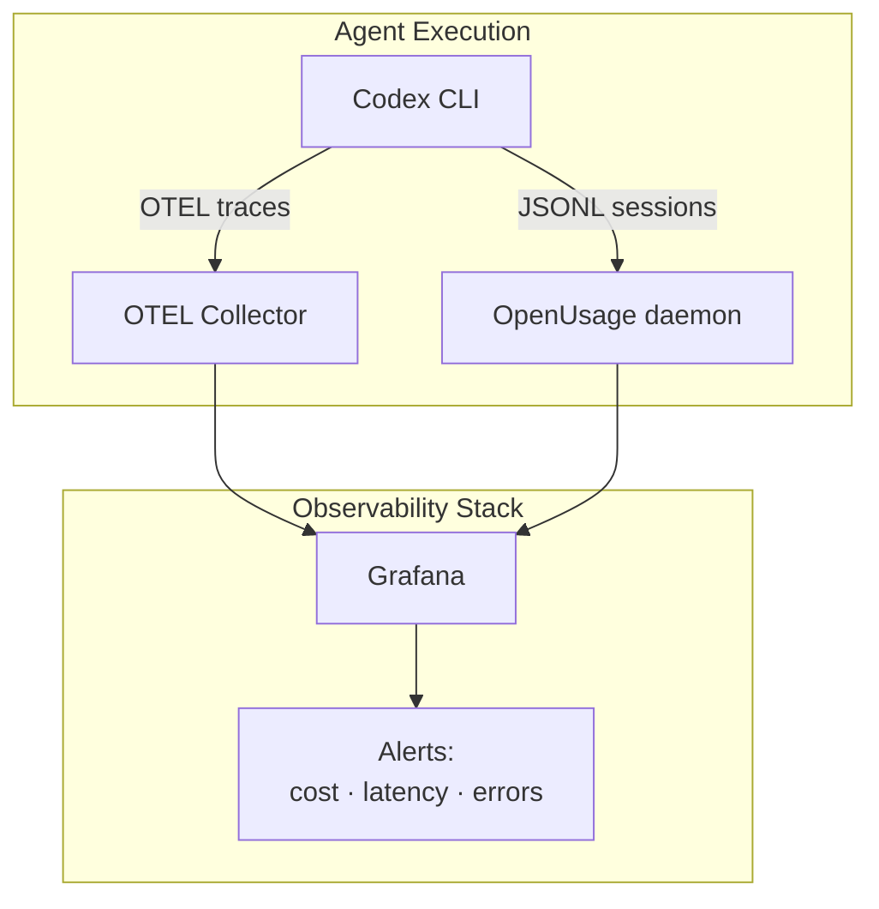

# Cross-Agent Usage Analytics: Unified Monitoring for Your Mixed Coding Agent Stack


---

The average senior developer in 2026 runs two to five coding agents daily — Codex CLI for deep implementation, Claude Code for exploration, Cursor for in-editor flow, Copilot for autocomplete, and perhaps Gemini CLI for quick lookups [^1]. Each tool has its own billing model, rate limits, 5-hour usage windows, and session logs scattered across different directories. Keeping track of spend, quotas, and session history by opening five browser dashboards is untenable.

A new generation of **cross-agent usage analytics tools** has emerged to solve exactly this problem. This article surveys the five leading options, shows how each integrates with Codex CLI's session data, and provides a practical decision framework for choosing the right tool for your workflow.

## The Problem: Fragmented Visibility

Codex CLI stores session event logs as JSONL files under `~/.codex/sessions/` [^2]. Claude Code writes to `~/.claude/sessions/`. Cursor, Copilot, and Gemini CLI each have their own storage conventions. Without a unified view, you face three concrete risks:

1. **Budget overruns** — Codex CLI's 5-hour billing windows reset independently from Claude Code's rate limits [^3]. A busy afternoon can exhaust both without warning.
2. **Session archaeology** — Finding which agent handled a specific task three days ago requires manually scanning JSONL files across multiple directories.
3. **Cost attribution** — Teams sharing a Codex Business workspace cannot easily attribute token spend to individuals, models, or projects without aggregation tooling.



## The Ecosystem: Five Tools Compared

### 1. ccusage — The Lightweight Accountant

**ccusage** is a Node.js CLI that reads local JSONL session files and produces daily, monthly, and session-level cost reports [^4]. The `@ccusage/codex` package specifically parses Codex CLI's `token_count` events, computing per-turn deltas from cumulative totals and mapping model aliases (e.g. `gpt-5-codex`) to canonical pricing via LiteLLM's dataset [^5].

```bash
# Install and run in one command
npx @ccusage/codex@latest daily

# Monthly breakdown with per-model detail
npx @ccusage/codex@latest monthly --breakdown

# JSON export for CI pipelines
npx @ccusage/codex@latest monthly --json > usage-report.json
```

**Strengths:** Zero configuration, colourful terminal tables, JSON export for scripting, v18.0.11 with 109 releases indicating active maintenance [^4].

**Limitations:** Codex data only available from September 2025 onward (when `token_count` events were introduced). Early sessions without `turn_context` metadata fall back to default GPT-5 pricing [^5]. No real-time quota tracking — it is a retrospective cost analyser only.

### 2. agentsview — The Session Intelligence Platform

**agentsview** takes a fundamentally different approach: it indexes all session data into a local SQLite database with FTS5 full-text search, then serves a Svelte-based web dashboard at `http://127.0.0.1:8080` [^6]. The claim of **100× faster queries** than file-parsing tools holds up because repeated queries hit indexed SQLite rather than re-scanning JSONL on every invocation.

```bash
# Install
curl -fsSL https://agentsview.io/install.sh | bash

# Index all agents and launch dashboard
agentsview serve

# CLI cost report (ccusage replacement)
agentsview usage --agent codex --period monthly
```

The tool auto-discovers sessions from 16 agents including Codex CLI, Claude Code, Cursor, Copilot CLI, Gemini CLI, OpenCode, Amp, and Kiro [^6]. Session analytics include archetype classification (automation, quick, standard, deep, marathon) and tool/model mix analysis.

**Strengths:** Web UI with activity heatmaps and token charts, full-text search across all agent transcripts, Tauri desktop app, prompt-caching-aware cost calculations [^6].

**Limitations:** Go binary (not available via npm), heavier footprint than ccusage for teams that only need cost reports.

### 3. OpenUsage — The Terminal Dashboard

**OpenUsage** occupies the middle ground: a Go-based terminal TUI that displays live quota percentages, spend, rate limits, and per-model usage across 17 providers [^7]. It auto-detects installed CLI tools and API keys, supports daemon mode for continuous background tracking, and stores historical data in SQLite.

```bash
# Install via Homebrew (macOS)
brew install janekbaraniewski/tap/openusage

# Or cross-platform
curl -fsSL https://github.com/janekbaraniewski/openusage/releases/latest/download/install.sh | bash

# Launch dashboard
openusage
```

**Strengths:** Real-time quota tracking (not just retrospective), 15+ built-in themes, daemon mode for continuous collection, covers both coding agents and raw API platforms (OpenAI, Anthropic, OpenRouter, Groq, Mistral, DeepSeek) [^7].

**Limitations:** Terminal-only UI (no web dashboard), requires Go 1.25+ for source builds.

### 4. caut — The Universal Quota Monitor

**caut** (Coding Agent Usage Tracker) is a Rust CLI that fetches live usage data from 16+ providers by interrogating CLI tools, browser cookies, OAuth tokens, and APIs [^8]. Its provider-abstraction architecture means adding new agents requires implementing a single trait.

```bash
# Install from source
cargo install --git https://github.com/Dicklesworthstone/coding_agent_usage_tracker

# Check all providers
caut usage

# JSON output for agent consumption
caut usage --format json
```

**Strengths:** Widest provider support, dual-mode output (human-readable with colour bars or structured JSON/Markdown), zero configuration via auto-detection [^8].

**Limitations:** Requires Rust 1.88+ toolchain, v0.1.0 maturity level — less battle-tested than ccusage.

### 5. Agent Sessions — The macOS Power Tool

**Agent Sessions** is a native Swift macOS app (requires macOS 14+) that reads session directories in read-only mode and provides a unified session browser with search, filtering, and resume capabilities [^9]. The **Agent Cockpit** feature shows live usage tracking for active iTerm2 sessions.

**Strengths:** Native macOS experience, session resume via right-click, cross-session transcript search, local-only with zero telemetry [^9].

**Limitations:** macOS only, no cost analytics (session browsing focus), no CLI interface.

## Decision Matrix

| Criterion | ccusage | agentsview | OpenUsage | caut | Agent Sessions |
|---|---|---|---|---|---|
| **Primary focus** | Cost reports | Session intelligence | Live quotas | Provider monitoring | Session browsing |
| **Codex CLI support** | ✅ Native | ✅ Native | ✅ Auto-detect | ✅ Auto-detect | ✅ Native |
| **Real-time quotas** | ❌ | ❌ | ✅ | ✅ | ⚠️ Active only |
| **Web dashboard** | ❌ | ✅ | ❌ | ❌ | ❌ |
| **Full-text search** | ❌ | ✅ | ❌ | ❌ | ✅ |
| **JSON export** | ✅ | ✅ | ✅ | ✅ | ❌ |
| **Cross-platform** | ✅ | ✅ | ✅ | ✅ | macOS only |
| **Install** | npx | curl | brew/curl | cargo | DMG |

## Integrating with Codex CLI Workflows

### Cost Gates in CI Pipelines

Combine `ccusage` JSON export with `codex exec` to enforce spend limits before merging:

```bash
#!/bin/bash
# pre-merge-cost-check.sh
MONTHLY_SPEND=$(npx @ccusage/codex@latest monthly --json | jq '.total_cost')
BUDGET=500.00

if (( $(echo "$MONTHLY_SPEND > $BUDGET" | bc -l) )); then
  echo "Monthly Codex spend (\$$MONTHLY_SPEND) exceeds budget (\$$BUDGET)"
  exit 1
fi
```

### Session Search for Context Recovery

When resuming work on a feature branch, use agentsview to find the original session:

```bash
# Search all agent transcripts for a feature name
agentsview search "payment-gateway refactor" --agent codex --limit 5
```

### Unified Reporting with OpenTelemetry

For teams already using Codex CLI's OpenTelemetry integration [^10], OpenUsage's daemon mode can complement OTEL traces with quota and billing data that OTEL does not capture. The combination gives you both **what the agent did** (OTEL traces) and **what it cost** (OpenUsage metrics).



## Codex CLI Session Data Internals

Understanding how Codex CLI stores session data helps when troubleshooting analytics tools. Sessions live at `~/.codex/sessions/<session-id>/events.jsonl` [^2]. Each line is a JSON event with a `type` field. The key event types for usage analytics are:

- **`token_count`** — Cumulative token totals (input, cached_input, output, reasoning) updated per turn [^5]
- **`turn_context`** — Identifies the active model, enabling per-model cost attribution [^5]
- **`tool_use`** — Records tool invocations (shell commands, file operations, MCP calls)

Analytics tools compute **deltas** between consecutive `token_count` events to determine per-turn consumption. This is why early September 2025 sessions (before `token_count` was introduced) show no cost data.

### Customising the Session Directory

If you run multiple Codex CLI instances or keep sessions on a different volume, set `CODEX_HOME`:

```bash
export CODEX_HOME=/data/codex-sessions
```

All five analytics tools respect this environment variable [^2][^5].

## Current Pricing Context

For context on what these tools are tracking, Codex CLI's current credit rates per million tokens (as of April 2026) are [^3]:

| Model | Input | Cached Input | Output |
|---|---|---|---|
| GPT-5.5 | 125 credits | 12.50 credits | 750 credits |
| GPT-5.4 | 62.50 credits | 6.250 credits | 375 credits |
| GPT-5.4-mini | 18.75 credits | 1.875 credits | 113 credits |
| GPT-5.3-Codex | 43.75 credits | 4.375 credits | 350 credits |

The 10× discount on cached input tokens makes prompt caching awareness (as in agentsview) particularly valuable for accurate cost reporting [^6].

## Recommendations

**Solo developer, cost-focused:** Start with `ccusage`. One `npx` command, no install, immediate monthly reports.

**Team lead, multi-agent stack:** Deploy `agentsview` for its web dashboard and session intelligence. The SQLite indexing pays dividends as session history grows.

**Enterprise, real-time governance:** Run `OpenUsage` in daemon mode alongside your existing OTEL pipeline. The quota alerting prevents mid-sprint rate limit surprises.

**Polyglot agent user, live monitoring:** Use `caut` for its unmatched breadth of 16+ provider integrations from a single binary.

**macOS power user:** Add `Agent Sessions` alongside any of the above for native session browsing and resume workflows.

None of these tools are mutually exclusive. A practical combination for most Codex CLI power users is **ccusage for quick cost checks** plus **agentsview for deep session analytics** — covering both the "how much did I spend?" and "what did the agent actually do?" questions.

## Citations

[^1]: [HuggingFace — 2026 Agentic Coding Trends Implementation Guide](https://huggingface.co/blog/Svngoku/agentic-coding-trends-2026)
[^2]: [OpenAI — Codex CLI Features Documentation](https://developers.openai.com/codex/cli/features)
[^3]: [OpenAI — Codex Pricing](https://developers.openai.com/codex/pricing)
[^4]: [ryoppippi/ccusage — GitHub Repository](https://github.com/ryoppippi/ccusage)
[^5]: [ccusage — Codex CLI Guide](https://ccusage.com/guide/codex/)
[^6]: [wesm/agentsview — GitHub Repository](https://github.com/wesm/agentsview)
[^7]: [janekbaraniewski/openusage — GitHub Repository](https://github.com/janekbaraniewski/openusage)
[^8]: [Dicklesworthstone/coding_agent_usage_tracker — GitHub Repository](https://github.com/Dicklesworthstone/coding_agent_usage_tracker)
[^9]: [jazzyalex/agent-sessions — GitHub Repository](https://github.com/jazzyalex/agent-sessions)
[^10]: [OpenAI — Codex CLI Observability Documentation](https://developers.openai.com/codex/cli/features)
