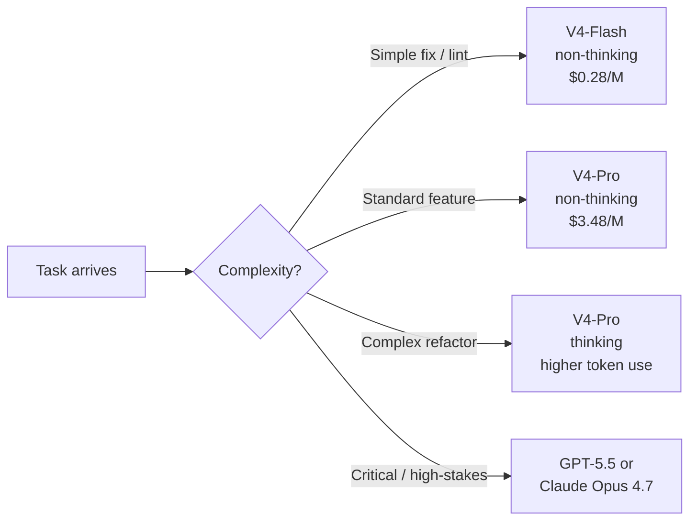
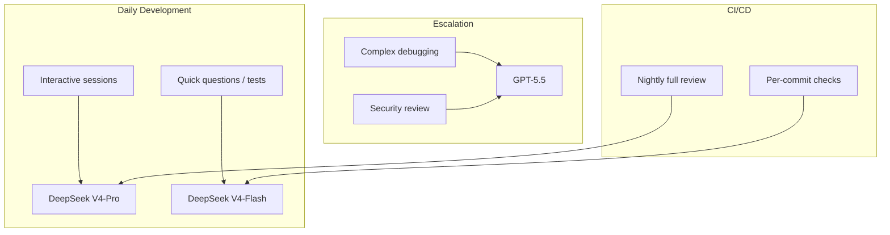

# DeepSeek V4 as a Codex CLI Provider: Frontier-Class Coding at a Fraction of the Cost


DeepSeek V4 landed today — 24 April 2026 — and the numbers deserve attention. V4-Pro scores 80.6% on SWE-bench Verified while charging \$3.48 per million output tokens[^1]. For comparison, Claude Opus 4.6 scores 80.8% on the same benchmark at \$25 per million output tokens[^2]. That is a 7× price gap at near-identical coding performance. This article walks through configuring DeepSeek V4 as a Codex CLI provider, examines where the benchmarks genuinely hold up, and identifies the workflows where GPT-5.5 or Claude remain the better choice.

## What Shipped

DeepSeek released two models under the MIT licence[^1]:

| | V4-Pro | V4-Flash |
|---|---|---|
| **Total parameters** | 1.6 trillion | 284 billion |
| **Active parameters** | 49 billion | 13 billion |
| **Context window** | 1 million tokens | 1 million tokens |
| **Max output** | 384K tokens | 384K tokens |
| **Training tokens** | 33 trillion | 32 trillion |
| **Weights size** | 865 GB | 160 GB |

Both use a Mixture-of-Experts (MoE) architecture with three key innovations: Hybrid Attention (CSA + HCA) that cuts KV cache to 10% of V3.2's at 1M context, Manifold-Constrained Hyper-Connections that tame residual amplification from 3,000× to 1.6×, and the Muon optimiser for stable training at scale[^1][^3].

## Benchmark Reality Check

Headlines focus on SWE-bench, but the full picture is more nuanced:

| Benchmark | V4-Pro | V4-Flash | GPT-5.5 | Claude Opus 4.7 |
|---|---|---|---|---|
| **SWE-bench Verified** | 80.6% | 79.0% | ⚠️ not reported | 80.8% |
| **SWE-bench Pro** | 55.4% | — | 58.6% | 64.3% |
| **Terminal-Bench 2.0** | 67.9% | 56.9% | 82.7% | 65.4% |
| **LiveCodeBench** | 93.5% | 91.6% | — | 88.8% |
| **Codeforces** | 3206 | — | — | — |

Sources: [^1][^2][^4][^5]

Three observations for practitioners:

1. **SWE-bench Verified is V4-Pro's strong suit** — it matches the frontier models on repository-level bug fixing[^1].
2. **Terminal-Bench 2.0 reveals the gap** — GPT-5.5 leads V4-Pro by nearly 15 percentage points on complex multi-step terminal workflows[^4]. If your work involves heavy iterative debugging and tool orchestration, GPT-5.5 remains substantially ahead.
3. **LiveCodeBench and Codeforces favour V4-Pro** — pure algorithmic coding is a genuine strength, with V4-Pro's 3206 Codeforces rating exceeding GPT-5.4's 3168[^1].

## Pricing Comparison

The cost differential is the headline:

| Model | Input (cache miss) | Input (cache hit) | Output |
|---|---|---|---|
| **DeepSeek V4-Flash** | \$0.14/M | \$0.028/M | \$0.28/M |
| **DeepSeek V4-Pro** | \$1.74/M | \$0.145/M | \$3.48/M |
| GPT-5.4 | — | — | — |
| GPT-5.5 | ⚠️ credit-based | ⚠️ credit-based | ⚠️ credit-based |
| Claude Opus 4.6 | \$5/M | — | \$25/M |

Sources: [^1][^2]

A production agentic pipeline processing 50 million output tokens per month costs approximately \$174 on V4-Pro versus \$1,250 on Claude Opus 4.6[^3]. V4-Flash is even more dramatic — at \$0.28/M output, it undercuts GPT-5.4 Nano[^1].

## Configuring Codex CLI for DeepSeek V4

DeepSeek's API is OpenAI-compatible[^6], which means a straightforward custom provider definition in `config.toml`:

```toml
# ~/.codex/config.toml

[model_providers.deepseek]
name = "DeepSeek V4"
base_url = "https://api.deepseek.com"
env_key = "DS_KEY"
wire_api = "chat"
```

Set the environment variable referenced by `env_key` to your DeepSeek API key:

```bash
export DS_KEY="sk-your-key-here"
```

### Model Profiles

Define profiles for different workflows:

```toml
[profiles.ds-pro]
model = "deepseek-v4-pro"
model_provider = "deepseek"

[profiles.ds-flash]
model = "deepseek-v4-flash"
model_provider = "deepseek"
```

Launch with a profile:

```bash
codex --profile ds-pro "Refactor the payment module to use the strategy pattern"
codex --profile ds-flash "Add unit tests for the UserService class"
```

### Reasoning Modes

V4-Pro and V4-Flash support three reasoning modes: `non-thinking`, `thinking`, and `thinking_max`[^6]. The default is `non-thinking`. To enable extended reasoning, you currently need to pass the appropriate parameters through the API — Codex CLI's `reasoning_effort` config maps to OpenAI's reasoning effort parameter, so you may need to experiment with how DeepSeek interprets these values through the compatibility layer.



### Non-Interactive Pipelines

DeepSeek V4 works with `codex exec` for CI/CD automation:

```bash
codex exec \
  --profile ds-flash \
  --approval-mode full-auto \
  "Run the test suite and fix any failing tests" \
  -o results.json \
  --output-schema ./ci-schema.json
```

For cost-sensitive CI pipelines, V4-Flash at \$0.28/M output makes per-commit agent runs economically viable in a way that frontier models do not.

## Two-Tier Routing: The Practical Architecture

The most effective pattern is not choosing one model — it is routing between them. Use DeepSeek for the bulk of your work and escalate to GPT-5.5 for the tasks where Terminal-Bench performance matters:

```toml
# Default: DeepSeek V4-Pro for everyday coding
model = "deepseek-v4-pro"
model_provider = "deepseek"

# Escalation profile for complex multi-step debugging
[profiles.frontier]
model = "gpt-5.5"

# CI profile: V4-Flash for cost-sensitive automation
[profiles.ci]
model = "deepseek-v4-flash"
model_provider = "deepseek"
```



## Known Limitations and Caveats

Before committing to DeepSeek V4 as your primary provider, understand the trade-offs:

1. **`wire_api` compatibility** — DeepSeek supports the `chat` wire API (OpenAI Chat Completions compatible), not the `responses` wire API[^6]. This means some Codex CLI features that rely on Responses API primitives (such as native `apply_patch` tool routing) may behave differently. Test your critical workflows thoroughly.

2. **Terminal-Bench gap** — V4-Pro's 67.9% versus GPT-5.5's 82.7% on Terminal-Bench 2.0[^4] translates to meaningfully worse performance on multi-step agentic workflows involving iterative tool use, error recovery, and plan revision. For complex debugging sessions, this gap is felt.

3. **Reasoning mode support** — Codex CLI's `Alt+,` / `Alt+.` reasoning effort shortcuts target OpenAI's reasoning effort parameter. Mapping these to DeepSeek's `thinking` / `non-thinking` / `thinking_max` modes requires care — the semantics are not identical[^6].

4. **Rate limits and availability** — DeepSeek's API has historically experienced availability issues during peak demand[^7]. For production-critical workflows, configure failover:

```toml
# Primary: DeepSeek
model = "deepseek-v4-pro"
model_provider = "deepseek"

# Failover: switch profiles manually or via gateway
[profiles.fallback]
model = "gpt-5.4"
```

1. **Data residency** — DeepSeek's API routes through infrastructure in China[^7]. Organisations with data sovereignty requirements should evaluate whether this meets their compliance posture, or consider self-hosting the open weights behind a private endpoint.

## When to Use What

| Workflow | Recommended Model | Rationale |
|---|---|---|
| Feature implementation | V4-Pro | Strong SWE-bench, 7× cheaper than Claude |
| Unit test generation | V4-Flash | Adequate quality at \$0.28/M |
| Complex multi-step debugging | GPT-5.5 | 82.7% Terminal-Bench dominance |
| CI/CD per-commit checks | V4-Flash | Economic at scale |
| Security-sensitive code review | GPT-5.5 / Claude Opus 4.7 | Higher precision on nuanced analysis |
| Competitive programming | V4-Pro | 3206 Codeforces, best-in-class |
| Regulated industries (data residency) | GPT-5.5 or self-hosted V4 weights | API routing considerations |

## Migration from DeepSeek V3

If you are already using DeepSeek models, update your model identifiers. The `deepseek-chat` and `deepseek-reasoner` model IDs deprecate on 24 July 2026[^6]. The migration is a single-line change:

```toml
# Before
model = "deepseek-chat"

# After
model = "deepseek-v4-pro"   # or "deepseek-v4-flash"
```

## Conclusion

DeepSeek V4 does not replace GPT-5.5 — it occupies a different point on the cost-performance curve. At \$3.48/M output with 80.6% SWE-bench Verified, V4-Pro is the most cost-effective frontier-adjacent coding model available today. The practical architecture is two-tier: DeepSeek for the 80% of tasks where it matches the frontier, GPT-5.5 for the 20% where Terminal-Bench performance and deep agentic reasoning justify the premium. Configure both providers, define profiles, and let the task complexity guide your routing.

## Citations

[^1]: DeepSeek, "DeepSeek-V4-Pro Technical Report", Hugging Face, 24 April 2026. [https://huggingface.co/deepseek-ai/DeepSeek-V4-Pro](https://huggingface.co/deepseek-ai/DeepSeek-V4-Pro)
[^2]: VentureBeat, "OpenAI's GPT-5.5 is here: narrowly beats Claude Mythos Preview on Terminal-Bench 2.0", 23 April 2026. [https://venturebeat.com/ai/openais-gpt-5-5-is-here-and-its-no-potato-narrowly-beats-anthropics-claude-mythos-preview-on-terminal-bench-2-0](https://venturebeat.com/ai/openais-gpt-5-5-is-here-and-its-no-potato-narrowly-beats-anthropics-claude-mythos-preview-on-terminal-bench-2-0)
[^3]: BuildFastWithAI, "DeepSeek V4-Pro Review: Benchmarks, Pricing & Architecture", April 2026. [https://www.buildfastwithai.com/blogs/deepseek-v4-pro-review-2026](https://www.buildfastwithai.com/blogs/deepseek-v4-pro-review-2026)
[^4]: MarkTechPost, "OpenAI Releases GPT-5.5: Terminal-Bench 2.0 and GDPval Scores", 23 April 2026. [https://www.marktechpost.com/2026/04/23/openai-releases-gpt-5-5-a-fully-retrained-agentic-model-that-scores-82-7-on-terminal-bench-2-0-and-84-9-on-gdpval/](https://www.marktechpost.com/2026/04/23/openai-releases-gpt-5-5-a-fully-retrained-agentic-model-that-scores-82-7-on-terminal-bench-2-0-and-84-9-on-gdpval/)
[^5]: Lushbinary, "DeepSeek V4 vs Claude Opus 4.7 vs GPT-5.5: Benchmarks & Pricing", April 2026. [https://lushbinary.com/blog/deepseek-v4-vs-claude-opus-4-7-vs-gpt-5-5-comparison/](https://lushbinary.com/blog/deepseek-v4-vs-claude-opus-4-7-vs-gpt-5-5-comparison/)
[^6]: DeepSeek, "API Documentation — Integrate with Coding Agents", April 2026. [https://api-docs.deepseek.com/guides/coding_agents](https://api-docs.deepseek.com/guides/coding_agents)
[^7]: Simon Willison, "DeepSeek V4 — almost on the frontier, a fraction of the price", 24 April 2026. [https://simonwillison.net/2026/Apr/24/deepseek-v4/](https://simonwillison.net/2026/Apr/24/deepseek-v4/)
