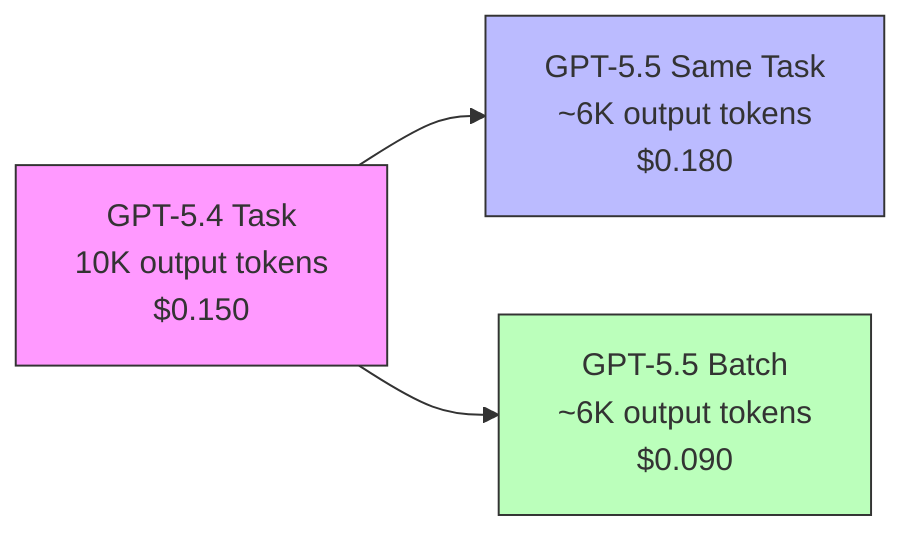
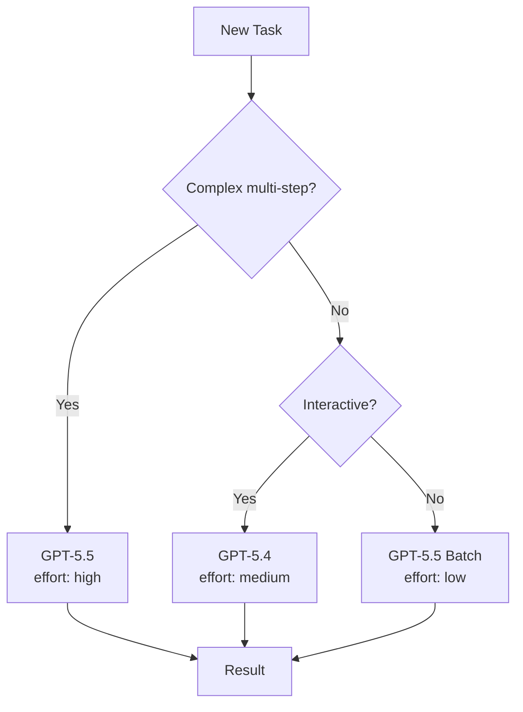

# GPT-5.5 Migration Cookbook: Effort Tuning, Cost Comparison, Prompt Adjustments


GPT-5.5 — codenamed "Spud" — landed on 23 April 2026, less than two months after GPT-5.4[^1]. It is already the recommended model for most Codex tasks[^2]. The headline numbers are compelling: 88.7% on SWE-bench Verified (up from 82.1%), 82.7% on Terminal-Bench 2.0, and 40% fewer output tokens per Codex task[^3][^4]. The catch? Standard API pricing doubles to \$5/\$30 per million input/output tokens[^5]. This cookbook walks through migrating your Codex CLI workflows from GPT-5.4 to GPT-5.5 with concrete configuration, effort-tuning strategies, and cost guardrails.

## What Changed

### Performance Gains

| Benchmark | GPT-5.4 | GPT-5.5 | Delta |
|---|---|---|---|
| **SWE-bench Verified** | 82.1% | 88.7% | +6.6 pp |
| **SWE-bench Pro** | 57.7% | 58.6% | +0.9 pp |
| **Terminal-Bench 2.0** | ~74% | 82.7% | +8.7 pp |
| **Expert-SWE** | 68.5% | 73.1% | +4.6 pp |
| **MMLU** | 89.8% | 92.4% | +2.6 pp |

The Terminal-Bench 2.0 result is the standout for Codex CLI users — it measures complex command-line workflows requiring planning, iteration, and tool coordination[^4]. A 60% reduction in hallucination rate (OpenAI self-reported — ⚠️ pending independent verification) is also noteworthy for agentic coding where incorrect tool calls compound[^6].

### Token Efficiency

GPT-5.5 uses approximately 40% fewer output tokens to complete the same Codex task as GPT-5.4[^3]. This partially offsets the doubled per-token pricing. In practice, a task that cost \$0.10 on GPT-5.4 might cost roughly \$0.12 on GPT-5.5 at standard rates — not the 2× you might expect from the rate card alone.

### Current Availability

As of 24 April 2026, GPT-5.5 is available in Codex when authenticated via ChatGPT (Plus, Pro, Business, Enterprise plans)[^2]. It is **not yet available** with API-key authentication[^7]. OpenAI has stated API access is "coming very soon"[^1]. Plan accordingly — if your CI/CD pipelines use `OPENAI_API_KEY`, you will need to wait or use the Codex app's ChatGPT-authenticated sessions.

## Step-by-Step Migration

### 1. Switch the Model

The simplest migration: change your model flag.

**CLI launch:**

```bash
codex -m gpt-5.5
```

**Mid-session:**

```
/model gpt-5.5
```

**Permanent config** in `~/.codex/config.toml`:

```toml
model = "gpt-5.5"
```

If GPT-5.5 is not yet available in your authentication context, Codex falls back gracefully — you will see a model-not-available warning and can continue with `gpt-5.4`[^2].

### 2. Tune Reasoning Effort

Reasoning effort is the primary cost and quality lever. GPT-5.5 Thinking uses the same model ID — the `reasoning_effort` parameter controls how many reasoning tokens each request consumes[^5].

```toml
# ~/.codex/config.toml

model = "gpt-5.5"
model_reasoning_effort = "medium"       # default for interactive work
plan_mode_reasoning_effort = "high"     # deeper thinking for plan generation
```

The available effort levels and their approximate token multipliers[^5]:

| Effort Level | Token Multiplier | Recommended For |
|---|---|---|
| `minimal` | ~0.5× | Simple completions, boilerplate |
| `low` | 1× | Routine coding, single-file edits |
| `medium` | 1.3–2× | Multi-step coding, refactoring |
| `high` | 2–4× | Deep research, architectural planning |
| `xhigh` | 3–8× | Complex agent loops with tool chains |

⚠️ `xhigh` support on GPT-5.5 has not been explicitly confirmed in documentation at launch — GPT-5.3-codex is the only model with confirmed `xhigh` support[^8]. Test before relying on it in production.

**Quick reasoning controls** were added in Codex CLI v0.124.0: use `Alt+,` and `Alt+.` to decrease/increase reasoning effort mid-conversation without restarting[^9].

### 3. Create Migration Profiles

Use Codex CLI profiles to run GPT-5.4 and GPT-5.5 side by side during your transition:

```toml
# ~/.codex/config.toml

# Default: stay on 5.4 for now
model = "gpt-5.4"
model_reasoning_effort = "medium"

[profiles.spud]
model = "gpt-5.5"
model_reasoning_effort = "medium"
model_reasoning_summary = "concise"

[profiles.spud-deep]
model = "gpt-5.5"
model_reasoning_effort = "high"
plan_mode_reasoning_effort = "xhigh"
model_reasoning_summary = "detailed"

[profiles.budget]
model = "gpt-5.4-mini"
model_reasoning_effort = "low"
```

Launch with a profile:

```bash
codex --profile spud
codex --profile budget    # for cost-sensitive tasks
```

This lets you A/B test GPT-5.5 on real tasks before committing as your default.

### 4. Adjust Prompts (Usually You Don't Need To)

GPT-5.5 has a stronger out-of-the-box coding personality than GPT-5.4[^7]. In most cases, your existing `AGENTS.md` and system instructions will work without changes. Key differences to watch for:

- **Less verbose output** — GPT-5.5's token efficiency means it produces more concise code by default. If you relied on `high` verbosity settings, you may find GPT-5.5 at `medium` already matches GPT-5.4's `high`.
- **Stronger planning** — multi-step tasks that previously required `high` reasoning effort may work at `medium` on GPT-5.5.
- **Fewer hallucinated tool calls** — if you added defensive instructions like "verify the file exists before editing", you can likely remove them.

If migrating from an older model (GPT-5.2 or earlier), the migration path documented for GPT-5.4 applies: treat it as a drop-in replacement[^7].

## Cost Comparison

### Per-Token Rates

| | GPT-5.4 | GPT-5.5 | GPT-5.4-mini |
|---|---|---|---|
| **Standard input** | \$2.50/M | \$5.00/M | Lower |
| **Standard output** | \$15.00/M | \$30.00/M | Lower |
| **Batch input** | \$1.25/M | \$2.50/M | — |
| **Batch output** | \$7.50/M | \$15.00/M | — |

Batch pricing for GPT-5.5 is identical to GPT-5.4 standard pricing[^5]. For offline workloads — linting passes, bulk refactoring, test generation — batch mode completely neutralises the price increase.

### Effective Cost Per Task

The 40% token efficiency gain means the effective cost increase is closer to 20% than 100%:



### Cost Reduction Strategies

1. **Use Batch API for non-interactive work** — at \$2.50/\$15.00, you get GPT-5.5 quality at GPT-5.4 standard prices[^5].
2. **Drop reasoning effort** — most routine coding tasks work at `low` or `minimal`. Reserve `high`/`xhigh` for planning phases.
3. **Route with profiles** — use `gpt-5.4-mini` for simple completions and subagent calls, GPT-5.5 for complex tasks.
4. **Cache aggressively** — cached input tokens on GPT-5.5 are billed at a fraction of standard rate[^5]. Structure your `AGENTS.md` to front-load reusable context.



## When to Stay on GPT-5.4

GPT-5.5 is not universally better. Consider staying on GPT-5.4 when:

- **API-key authentication is required** — GPT-5.5 is ChatGPT-auth only at launch[^2].
- **Cost is the primary constraint** — for budget-sensitive CI pipelines, GPT-5.4-mini at `low` effort remains the most cost-effective option.
- **You need deterministic output** — GPT-5.5 is a new model with new behaviours. If you have well-tuned prompts producing consistent outputs on GPT-5.4, migrate gradually.
- **SWE-bench Pro matters most** — Claude Opus 4.7 still leads on SWE-bench Pro by 5.7 points (64.3% vs 58.6%)[^3]. For long-horizon issue resolution, consider a multi-model strategy.

## Migration Checklist

```markdown
- [ ] Verify GPT-5.5 is available in your auth context
- [ ] Create a `[profiles.spud]` entry in config.toml
- [ ] Run 5-10 representative tasks with the profile
- [ ] Compare token usage and output quality vs GPT-5.4
- [ ] Tune reasoning effort: start at `medium`, adjust per workflow
- [ ] Update CI pipelines to use batch API where possible
- [ ] Switch default model once satisfied
- [ ] Remove defensive prompt instructions made redundant by reduced hallucinations
```

## Summary

GPT-5.5 is a genuine step up for Codex CLI users — particularly on agentic coding workflows where Terminal-Bench 2.0 gains of +8.7 pp translate to meaningfully fewer failed tool calls and retries. The 40% token efficiency partially offsets the doubled pricing, and batch mode eliminates the cost delta entirely for offline work. Use profiles to run both models in parallel, tune reasoning effort aggressively, and migrate incrementally rather than switching wholesale.

## Citations

[^1]: [Introducing GPT-5.5 — OpenAI](https://openai.com/index/introducing-gpt-5-5/)
[^2]: [Models — Codex CLI Documentation](https://developers.openai.com/codex/models)
[^3]: [GPT-5.5 Review: 88.7% SWE-Bench, 92.4% MMLU, 2× Price Tag — TokenMix](https://tokenmix.ai/blog/gpt-5-5-spud-review-88-swe-bench-2026)
[^4]: [OpenAI's GPT-5.5 masters agentic coding with 82.7% benchmark score — Interesting Engineering](https://interestingengineering.com/ai-robotics/opanai-gpt-5-5-agentic-coding-gains)
[^5]: [GPT-5.5 Pricing: Full Breakdown of API, Codex, and ChatGPT Costs — Apidog](https://apidog.com/blog/gpt-5-5-pricing/)
[^6]: [OpenAI's GPT-5.5 benchmarks show a 60% hallucination drop — Startup Fortune](https://startupfortune.com/openais-gpt-55-benchmarks-show-a-60-hallucination-drop-and-coding-skills-that-rival-senior-engineers/)
[^7]: [Using GPT-5.4 — OpenAI Developers](https://developers.openai.com/api/docs/guides/latest-model)
[^8]: [Codex CLI Configuration Reference — Codex Blog](https://codex.danielvaughan.com/2026/04/08/codex-cli-configuration-reference/)
[^9]: [Changelog — Codex Developers](https://developers.openai.com/codex/changelog)
