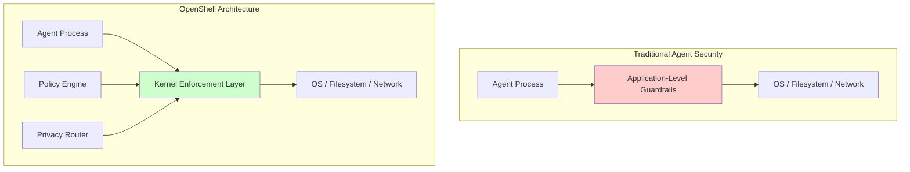
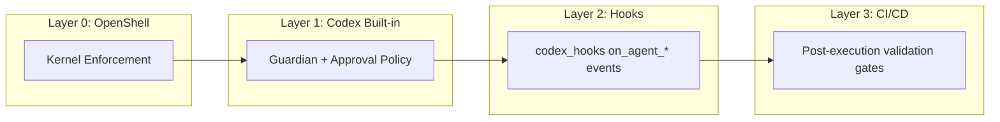

# NVIDIA OpenShell and Codex CLI: Kernel-Level Sandboxing for Autonomous Coding Agents


Codex CLI ships with its own sandbox — a two-axis model combining approval policies and execution constraints [^1]. For many individual developers, that is sufficient. But when you run agents autonomously in `--full-auto` mode, orchestrate multi-agent pipelines, or deploy across an enterprise fleet, the question shifts from "does the agent ask permission?" to "what happens if the agent itself is compromised?" NVIDIA's answer is **OpenShell** — an open-source, kernel-enforced runtime that wraps any coding agent, Codex included, in an isolation layer governed entirely by declarative YAML policies [^2].

This article examines OpenShell's architecture, walks through a practical Codex CLI integration, and maps its security model against Codex's built-in controls to show where each layer fits.

## Why Agent Sandboxing Needs a Separate Layer

Codex CLI's built-in sandbox operates at the application level. The Guardian process intercepts tool calls and applies approval policies before execution [^1]. This works well when the harness itself is trustworthy. The problem arises with long-running autonomous agents that accumulate context, hold persistent credentials, and potentially install new tooling mid-session. If the agent process is compromised — through prompt injection, a malicious MCP server, or a supply-chain attack on a dependency — application-level guardrails may be bypassed because they live inside the same process boundary they are supposed to protect [^3].

OpenShell addresses this by enforcing policy **out-of-process**, at the operating system kernel level [^2]. The agent literally cannot override the constraints, even if its own code is manipulated.



## OpenShell Architecture in Detail

OpenShell comprises four components that together form an agent control plane [^2][^4].

### The Sandbox

Each agent runs inside an isolated container orchestrated by a K3s Kubernetes cluster within a single Docker container [^2]. The sandbox comes pre-loaded with common agent tooling — Python 3.13, Node.js 22, `git`, `gh`, `vim` — and pre-installs recognised agents including Codex, Claude Code, OpenCode, and GitHub Copilot [^5].

### The Policy Engine

Four enforcement domains govern what the agent can do [^3][^4]:

| Domain | Enforcement Mechanism | Mutability |
|--------|----------------------|-----------|
| **Filesystem** | Landlock LSM (kernel) | Static — locked at sandbox creation |
| **Network** | OPA-evaluated HTTP CONNECT proxy | Hot-reloadable |
| **Process** | seccomp BPF syscall filtering | Static — locked at sandbox creation |
| **Inference** | API credential interception and routing | Hot-reloadable |

The filesystem and process policies are immutable once the sandbox starts — an agent cannot suddenly escalate privileges or read sensitive paths it was not granted at creation [^3]. Network and inference policies can be updated live, allowing administrators to expand access as trust is established without restarting the session [^2].

### The Privacy Router

This component intercepts LLM API calls, strips the caller's credentials, and injects backend credentials according to organisational policy [^4]. The practical effect: you can route sensitive context to a local model running on an NVIDIA DGX Spark whilst directing non-sensitive requests to GPT-5.5 via the OpenAI API — all transparent to the agent [^2].

### The Gateway

The gateway coordinates sandbox lifecycle, provides the authentication boundary, and serves the terminal dashboard UI accessible via `openshell term` [^5].

## Setting Up Codex CLI Inside OpenShell

### Installation

```bash
# Binary install (recommended)
curl -LsSf https://raw.githubusercontent.com/NVIDIA/OpenShell/main/install.sh | sh

# Or via PyPI (requires uv)
uv tool install -U openshell
```

### Launching Codex in a Sandbox

OpenShell auto-discovers `OPENAI_API_KEY` from your shell environment and injects it as a runtime environment variable — the key never touches the sandbox filesystem [^5].

```bash
# Basic launch
openshell sandbox create -- codex

# With a specific working directory mounted
openshell sandbox create --mount /path/to/project:/workspace -- codex

# Remote deployment on a cloud VM
openshell sandbox create --remote user@dev-server -- codex
```

Once the sandbox is running, connect to it:

```bash
openshell sandbox connect my-sandbox
```

You are now inside an isolated environment where Codex CLI runs with full functionality but cannot escape the policy boundaries.

### Writing a Policy for Codex Workflows

A typical Codex CLI workflow needs read/write access to the project directory, network access to the OpenAI API and package registries, and permission to run common development binaries. Here is a minimal policy [^3][^4]:

```yaml
# codex-policy.yaml
filesystem:
  read:
    - /workspace
    - /tmp
    - /usr/local/bin
  write:
    - /workspace/src
    - /workspace/tests
    - /tmp

network:
  outbound:
    - host: "api.openai.com"
      ports: [443]
      methods: [GET, POST]
    - host: "registry.npmjs.org"
      ports: [443]
      methods: [GET]
    - host: "pypi.org"
      ports: [443]
      methods: [GET]
    - host: "api.github.com"
      ports: [443]
      methods: [GET, POST, PATCH]

process:
  allowed_binaries:
    - node
    - npm
    - npx
    - python3
    - pip
    - git
    - codex
```

Apply it:

```bash
openshell policy set my-sandbox --policy codex-policy.yaml --wait
```

With this policy active, Codex can install npm packages, run tests, and push to GitHub — but it cannot `curl` arbitrary endpoints, read files outside `/workspace`, or execute binaries not on the allowlist. Any denied action returns an HTTP 403 from the proxy or a kernel-level `EACCES` [^3].

## The Four-Layer Security Model

OpenShell positions itself as "Layer 0" in a defence-in-depth stack [^4]. Here is how it maps against Codex CLI's own controls:



| Layer | Mechanism | Trust Model | When It Acts |
|-------|-----------|-------------|-------------|
| 0 — OpenShell | Landlock, seccomp, OPA proxy | Policy-as-physics | During execution |
| 1 — Codex Guardian | Approval policy (`suggest`/`auto-edit`/`full-auto`) | Policy-as-logic | At moment of tool call |
| 2 — Codex Hooks | `on_agent_tool_call`, `on_agent_patch` callbacks [^6] | Policy-as-observation | At moment of action |
| 3 — CI/CD | Linters, tests, security scanners | Policy-as-verification | After execution |

The critical insight: layers 1–3 all operate inside the agent process or downstream of it. Layer 0 operates **outside** the agent process entirely. A prompt injection that convinces Codex to bypass its own Guardian cannot bypass the kernel-level Landlock restrictions [^3].

## Credential Security

One of OpenShell's most practically useful features is its credential isolation model [^5]:

1. **Auto-discovery**: The CLI detects `OPENAI_API_KEY` from your host environment
2. **Runtime injection**: Keys are passed as environment variables at sandbox creation — never written to the filesystem
3. **Agent transparency**: Codex sees the key in `$OPENAI_API_KEY` as normal and operates without modification
4. **Exfiltration prevention**: Network policies block any outbound connection not on the allowlist, so even if an agent reads the environment variable, it cannot transmit it to an unauthorised endpoint

This pattern is particularly valuable when running Codex in `--full-auto` mode with MCP servers that may themselves be untrusted [^7].

## Privacy-Aware Model Routing

For enterprises handling sensitive code, the Privacy Router enables a split-inference strategy [^2][^4]:

```bash
# Route sensitive inference to a local model
openshell inference set --provider local --model qwen3-coder:30b

# Route general inference to OpenAI
openshell inference set --provider openai --model gpt-5.5
```

The router intercepts API calls from the agent and redirects them based on policy rules. Codex CLI does not need any configuration changes — it calls the OpenAI API as normal, and the Privacy Router handles the redirection transparently [^4]. This enables hybrid deployments where proprietary code analysis stays on-premises whilst general coding assistance uses frontier models.

## Real-World Deployment: NVIDIA's Own Practice

NVIDIA uses its own infrastructure patterns to deploy Codex internally. Over 10,000 employees across engineering, product, legal, marketing, finance, and operations use GPT-5.5-powered Codex through remote SSH connections to approved cloud VMs, each running in a dedicated sandbox with read-only access to production systems and a zero-data-retention policy [^8]. Debugging cycles that previously stretched across days now close in hours, and multi-week experimentation compresses into overnight progress [^8].

While NVIDIA has not publicly confirmed that its internal deployment uses OpenShell specifically, the architectural patterns — cloud VM isolation, credential injection, read-only policies, and full auditability — mirror OpenShell's design precisely [^2][^8].

## Limitations and Caveats

OpenShell is currently **alpha software** in single-player mode [^5]. The project README is explicit: "one developer, one environment, one gateway." Multi-tenant enterprise deployment is a stated future goal, not a current capability.

⚠️ GPU passthrough support is experimental and requires NVIDIA Container Toolkit on the host [^5].

⚠️ Filesystem policies are immutable after sandbox creation — if you need to expand access, you must destroy and recreate the sandbox [^3].

⚠️ The privacy router's model-routing decisions depend on correct classification of sensitive vs. non-sensitive context, which is not yet automated — administrators must define routing rules manually [^4].

## When to Use OpenShell with Codex CLI

| Scenario | Codex Built-in Sandbox | OpenShell + Codex |
|----------|----------------------|-------------------|
| Interactive development (`suggest` mode) | Sufficient | Overkill |
| `auto-edit` on trusted codebases | Sufficient | Optional |
| `--full-auto` with untrusted MCP servers | Risky | Recommended |
| Multi-agent orchestration pipelines | Insufficient | Recommended |
| Enterprise fleet deployment | Insufficient | Recommended |
| Handling regulated or sensitive code | Insufficient | Essential |

## Getting Started Checklist

1. Install OpenShell: `curl -LsSf https://raw.githubusercontent.com/NVIDIA/OpenShell/main/install.sh | sh`
2. Ensure `OPENAI_API_KEY` is set in your shell environment
3. Create a sandbox: `openshell sandbox create -- codex`
4. Write a YAML policy scoped to your project's needs
5. Apply the policy: `openshell policy set <name> --policy policy.yaml --wait`
6. Connect and work: `openshell sandbox connect <name>`
7. Monitor with the terminal dashboard: `openshell term`

## Citations

[^1]: OpenAI, "Agent approvals & security — Codex," [https://developers.openai.com/codex/agent-approvals-security](https://developers.openai.com/codex/agent-approvals-security)
[^2]: NVIDIA Developer Blog, "Run Autonomous, Self-Evolving Agents More Safely with NVIDIA OpenShell," [https://developer.nvidia.com/blog/run-autonomous-self-evolving-agents-more-safely-with-nvidia-openshell/](https://developer.nvidia.com/blog/run-autonomous-self-evolving-agents-more-safely-with-nvidia-openshell/)
[^3]: htek.dev, "NVIDIA OpenShell — The Sandbox Your AI Agents Should Be Running In," [https://dev.to/htekdev/nvidia-openshell-the-sandbox-your-ai-agents-should-be-running-in-3dpk](https://dev.to/htekdev/nvidia-openshell-the-sandbox-your-ai-agents-should-be-running-in-3dpk)
[^4]: Ken Huang, "How NVIDIA OpenShell Puts a Control Plane Around Your AI Agents," [https://kenhuangus.substack.com/p/how-nvidia-openshell-puts-a-control](https://kenhuangus.substack.com/p/how-nvidia-openshell-puts-a-control)
[^5]: NVIDIA, "OpenShell GitHub Repository," [https://github.com/NVIDIA/OpenShell](https://github.com/NVIDIA/OpenShell)
[^6]: OpenAI, "Changelog — Codex v0.124.0," [https://developers.openai.com/codex/changelog](https://developers.openai.com/codex/changelog)
[^7]: OpenAI, "Security — Codex," [https://developers.openai.com/codex/security](https://developers.openai.com/codex/security)
[^8]: NVIDIA Blog, "OpenAI's New GPT-5.5 Powers Codex on NVIDIA Infrastructure," [https://blogs.nvidia.com/blog/openai-codex-gpt-5-5-ai-agents/](https://blogs.nvidia.com/blog/openai-codex-gpt-5-5-ai-agents/)
