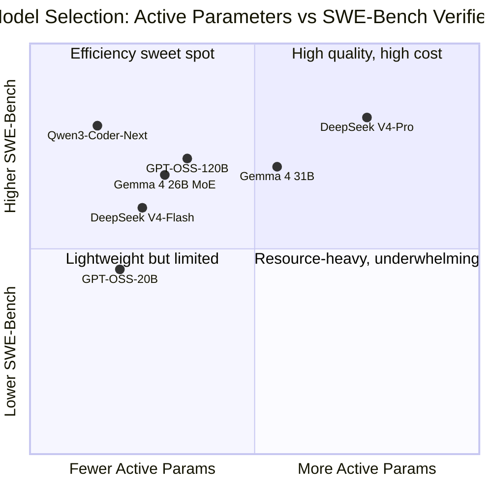
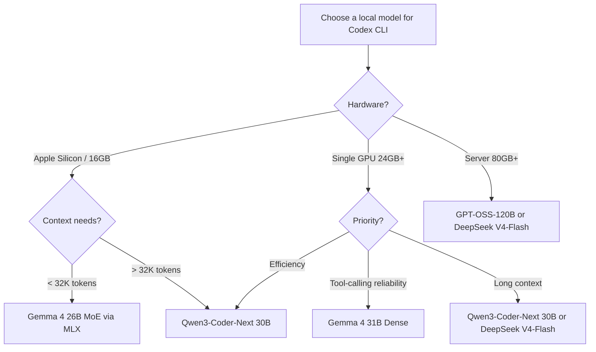
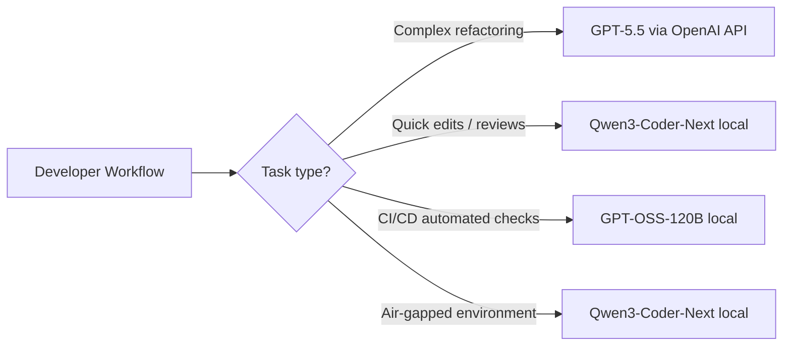

# Open-Weight Models for Codex CLI: Choosing the Right Local Coding Agent in 2026


The open-weight model landscape for agentic coding has shifted dramatically in the past six months. OpenAI's GPT-OSS family, Qwen's Coder-Next, Google's Gemma 4, and DeepSeek V4 all claim to be viable local alternatives for Codex CLI — but their real-world suitability varies enormously depending on your hardware, context needs, and workflow patterns. This article provides a practical selection guide for senior developers who want to run Codex CLI against local models without the hand-waving.

## Why Run Codex CLI Locally?

Three forces are driving local model adoption:

1. **Privacy and compliance** — regulated industries (finance, defence, healthcare) cannot send proprietary code to external APIs[^1]
2. **Cost at scale** — GPT-5.5 charges a 2× credit multiplier versus GPT-5.4[^2]; teams running dozens of daily sessions can accumulate significant spend
3. **Latency and availability** — local inference eliminates network round-trips and API rate limits, critical for CI/CD pipelines and air-gapped environments[^3]

Codex CLI has supported local providers since early 2025, but the `--oss` flag and built-in `ollama`/`lmstudio` providers (stabilised in v0.121.0[^4]) make the experience first-class rather than a workaround.

## The `--oss` Flag and Provider Architecture

When you launch `codex --oss`, Codex CLI switches from the OpenAI API to a local provider[^5]. The default behaviour depends on your `config.toml`:

```toml
# ~/.codex/config.toml
oss_provider = "ollama"   # or "lmstudio"
```

If `oss_provider` is unset, Codex prompts you to choose between Ollama and LM Studio interactively[^5]. For automated workflows, always set this explicitly.

You can also define custom providers for other inference engines:

```toml
[model_providers.vllm]
name = "vLLM Local"
base_url = "http://localhost:8000/v1"
env_key = "VLLM_API_KEY"
wire_api = "responses"

[profiles.local-deepseek]
model_provider = "vllm"
model = "deepseek-v4-flash"
```

Launch with `codex --profile local-deepseek` to use the profile[^6].

## The Contenders: Open-Weight Models for Agentic Coding



### GPT-OSS (OpenAI)

OpenAI's first open-weight models, released under Apache 2.0 in August 2025[^7]:

| Variant | Total Params | Active Params | Min RAM | SWE-Bench Verified |
|---------|-------------|---------------|---------|-------------------|
| GPT-OSS-20B | 21B | 3.6B | 16 GB | ⚠️ ~45% (estimated) |
| GPT-OSS-120B | 117B | 5.1B | 80 GB | 62.4%[^8] |

Both use Mixture-of-Experts (MoE) architecture with MXFP4 quantisation[^7]. The 120B variant fits on a single H100 or MI300X. The key limitation is the default context window of 8,192 tokens[^7] — significantly below what complex agentic workflows demand. You must explicitly extend this via your inference engine.

**Codex CLI setup (Ollama):**

```bash
ollama pull gpt-oss:120b
codex --oss -m gpt-oss:120b
```

Or via config profile:

```toml
[profiles.gpt-oss]
model_provider = "ollama"
model = "gpt-oss:120b"
model_reasoning_effort = "high"
```

**Best for:** Teams already invested in the OpenAI ecosystem wanting a local fallback with familiar model behaviour.

### Qwen3-Coder-Next (Alibaba)

The standout efficiency leader, released February 2026[^9]:

| Variant | Total Params | Active Params | Context | SWE-Bench Verified |
|---------|-------------|---------------|---------|-------------------|
| 30B (A3B) | 30B | 3B | 256K | ~73.4%[^10] |
| 480B (A35B) | 480B | 35B | 256K | ⚠️ Higher (exact score unconfirmed) |

Qwen3-Coder-Next achieves 74.2% on SWE-Bench Verified with only 3B active parameters[^9] — a remarkable efficiency ratio. Its 256K native context window (extendable to 1M with YaRN[^9]) makes it the only local model that comfortably handles repository-scale context without aggressive compaction.

**Codex CLI setup (Ollama):**

```bash
ollama pull qwen3-coder:30b
codex --oss -m qwen3-coder:30b
```

**Codex CLI setup (LM Studio):**

```bash
lms load qwen/qwen3-coder-30b --context-length 65536
lms server start
```

```toml
[model_providers.lm_studio]
name = "LM Studio"
base_url = "http://localhost:1234/v1"

[profiles.qwen3-local]
model_provider = "lm_studio"
model = "qwen/qwen3-coder-30b"
```

**Best for:** Developers with consumer hardware (8–16 GB VRAM) who need strong agentic coding with long context.

### Gemma 4 (Google)

Google's open-weight family with a breakthrough in tool-calling reliability[^11]:

| Variant | Params | Architecture | SWE-Bench Verified |
|---------|--------|-------------|-------------------|
| 26B MoE | 26B | MoE | ⚠️ ~97% of 31B quality |
| 31B Dense | 31B | Dense | ~70% (estimated from agent benchmarks)[^11] |

Gemma 4's key differentiator is **first-class tool-calling tokens** (`fc_call`, `fc_call_name`, `fc_call_reason`, `fc_response`) baked into the vocabulary[^11]. Previous open-weight models relied on prompt hacks for tool use; Gemma 4 natively understands tool-call structure, jumping from 6.6% to 86.4% on agent benchmarks versus Gemma 3[^11].

**Codex CLI setup (MLX on Apple Silicon):**

```bash
pip install mlx-lm
mlx_lm.server --model google/gemma-4-26b-it-mlx --port 8888
```

```toml
[model_providers.mlx]
name = "MLX LM"
base_url = "http://localhost:8888/v1"

[profiles.gemma4-local]
model_provider = "mlx"
model = "google/gemma-4-26b-it-mlx"
```

**Best for:** Apple Silicon users wanting reliable tool-calling without quantisation trade-offs.

### DeepSeek V4 (DeepSeek AI)

The heavyweight contender, released in early 2026[^12]:

| Variant | Total Params | Active Params | Context | SWE-Bench Pro |
|---------|-------------|---------------|---------|--------------|
| V4-Flash | 284B | 13B | 1M | ⚠️ Strong but unconfirmed exact score |
| V4-Pro | 1.6T | 49B | 1M | 55.4%[^12] |

DeepSeek V4 boasts a 1M-token context window and MLA compression that enables inference on a single RTX 4090[^12]. However, the Pro variant's 1.6T total parameters mean full-precision serving requires serious infrastructure.

**Best for:** Teams with dedicated GPU infrastructure needing maximum context window and raw coding ability.

## Decision Framework



### Quick Recommendations

| Scenario | Recommended Model | Rationale |
|----------|------------------|-----------|
| Consumer laptop, general coding | Qwen3-Coder-Next 30B | 3B active params, 256K context, 74.2% SWE-Bench |
| Apple Silicon, tool-heavy workflows | Gemma 4 26B MoE | Native tool tokens, excellent MLX support |
| Enterprise air-gapped server | GPT-OSS-120B | OpenAI ecosystem familiarity, Apache 2.0 |
| Maximum context, dedicated GPU | DeepSeek V4-Flash | 1M context, 13B active, strong coding |
| CI/CD pipeline, minimal resources | GPT-OSS-20B | 3.6B active, 16 GB RAM, fast inference |

## Context Window: The Hidden Bottleneck

Context window is the single most important differentiator for agentic coding. Codex CLI's agent loop accumulates context rapidly — file reads, shell outputs, tool results, and reasoning all consume tokens. The official recommendation is at least 32K tokens[^3], but complex sessions routinely exceed 64K.

| Model | Default Context | Configurable Maximum |
|-------|----------------|---------------------|
| GPT-OSS-120B | 8,192 | ⚠️ Engine-dependent |
| Qwen3-Coder-Next 30B | 256,000 | 1,000,000 (YaRN) |
| Gemma 4 31B | 32,768 | ⚠️ Limited scaling |
| DeepSeek V4-Flash | 1,000,000 | 1,000,000 |

GPT-OSS's 8K default is a significant limitation for Codex workflows. Ollama users must explicitly raise it:

```bash
ollama run gpt-oss:120b
/set parameter num_ctx 65536
```

For LM Studio, set context length at model load time:

```bash
lms load gpt-oss:120b --context-length 65536
```

## Performance Tuning for Codex CLI

### Reasoning Effort

Local models benefit from matching reasoning effort to task complexity. Since v0.124.0, Codex CLI supports `Alt+,` and `Alt+.` shortcuts to adjust reasoning effort in the TUI[^4]:

```toml
# Per-profile reasoning tuning
[profiles.local-fast]
model_provider = "ollama"
model = "qwen3-coder:30b"
model_reasoning_effort = "low"

[profiles.local-deep]
model_provider = "ollama"
model = "qwen3-coder:30b"
model_reasoning_effort = "high"
```

### Prompt Caching

Local inference engines do not benefit from OpenAI's server-side prompt caching. However, vLLM's prefix caching and Ollama's KV cache persistence provide similar benefits for repeated prefixes[^13]. Keep your AGENTS.md and system prompt stable across sessions to maximise cache hits.

### Batch Mode

For CI/CD, `codex exec` with a local provider eliminates API costs entirely:

```bash
codex exec --profile local-fast \
  --output-schema ./review-schema.json \
  "Review the changes in this PR for security issues" \
  -o ./review-output.json
```

## Hybrid Strategies: Cloud + Local

The most practical approach for many teams combines cloud and local models:



Configure multiple profiles in `config.toml` and switch with `--profile`:

```toml
# Cloud profile (default)
model = "gpt-5.5"
model_provider = "openai"

# Local profiles
[profiles.local]
model_provider = "ollama"
model = "qwen3-coder:30b"

[profiles.ci]
model_provider = "ollama"
model = "gpt-oss:120b"
model_reasoning_effort = "low"
```

```bash
# Interactive work — cloud
codex "refactor the auth module to use OAuth 2.1"

# Quick local review
codex --profile local "review this diff for bugs"

# CI pipeline — free
codex exec --profile ci "check for security vulnerabilities"
```

## Known Limitations and Gotchas

1. **Harmony response format** — GPT-OSS models require the harmony response format to function correctly; standard chat templates produce degraded output[^7]
2. **Tool-calling variance** — not all local models handle Codex's tool-call protocol equally. Gemma 4's native tokens give it an edge; GPT-OSS and Qwen rely on prompt-based tool formatting[^11]
3. **MCP server compatibility** — local models with small context windows may struggle with MCP-heavy workflows where tool schemas consume significant prompt space[^14]
4. **Memory system limitations** — Codex's built-in memory system uses specific models for extraction and consolidation; these default to OpenAI-hosted models and may not work offline without explicit overrides[^15]
5. **Plugin marketplace** — plugin installation and marketplace browsing require internet connectivity regardless of model provider[^3]

## What to Watch

The local model landscape is moving fast. Key developments to track:

- **Qwen3.6-35B-A3B** (April 2026) further improves on Qwen3-Coder-Next's efficiency, scoring 73.4% on SWE-Bench Verified with the same 3B active parameter budget[^10]
- **GPT-OSS-Safeguard** variants add safety reasoning capabilities for enterprise compliance scenarios[^16]
- **Codex CLI `/model` command** now supports switching between local providers mid-session (Issue #17261)[^17], reducing the friction of hybrid workflows

For teams evaluating local models today, Qwen3-Coder-Next 30B offers the best balance of quality, efficiency, and context capacity. Gemma 4 wins on tool-calling reliability. GPT-OSS provides the safest choice for teams already deep in the OpenAI ecosystem. The right answer depends on your constraints — but the era of "local models are too weak for agents" is definitively over.

## Citations

[^1]: OpenAI, "Agent approvals & security – Codex," [https://developers.openai.com/codex/agent-approvals-security](https://developers.openai.com/codex/agent-approvals-security)
[^2]: OpenAI, "Introducing GPT-5.5," April 23, 2026, [https://openai.com/index/introducing-gpt-5-5/](https://openai.com/index/introducing-gpt-5-5/)
[^3]: D. Vaughan, "Codex CLI Offline Mode: Local Models, Air-Gapped Setups, and What Works Without Internet," April 18, 2026, [https://codex.danielvaughan.com/2026/04/18/codex-cli-offline-local-models-air-gapped-guide/](https://codex.danielvaughan.com/2026/04/18/codex-cli-offline-local-models-air-gapped-guide/)
[^4]: OpenAI, "Changelog – Codex," [https://developers.openai.com/codex/changelog](https://developers.openai.com/codex/changelog)
[^5]: OpenAI, "Configuration Reference – Codex," [https://developers.openai.com/codex/config-reference](https://developers.openai.com/codex/config-reference)
[^6]: OpenAI, "Advanced Configuration – Codex," [https://developers.openai.com/codex/config-advanced](https://developers.openai.com/codex/config-advanced)
[^7]: OpenAI, "Introducing gpt-oss," August 2025, [https://openai.com/index/introducing-gpt-oss/](https://openai.com/index/introducing-gpt-oss/)
[^8]: Clarifai, "OpenAI GPT-OSS Benchmarks: How It Compares to GLM-4.5, Qwen3, DeepSeek, and Kimi K2," [https://www.clarifai.com/blog/openai-gpt-oss-benchmarks-how-it-compares-to-glm-4.5-qwen3-deepseek-and-kimi-k2](https://www.clarifai.com/blog/openai-gpt-oss-benchmarks-how-it-compares-to-glm-4.5-qwen3-deepseek-and-kimi-k2)
[^9]: Qwen Team, "Qwen3-Coder: Agentic Coding in the World," [https://qwen.ai/blog?id=qwen3-coder](https://qwen.ai/blog?id=qwen3-coder)
[^10]: Qwen Team, "Qwen3.6-35B-A3B: Agentic Coding Power, Now Open to All," [https://qwen.ai/blog?id=qwen3.6-35b-a3b](https://qwen.ai/blog?id=qwen3.6-35b-a3b)
[^11]: D. Vaughan, "Gemma 4 Local Model + Codex CLI: Complete Setup Guide," April 10, 2026, [https://codex.danielvaughan.com/2026/04/10/gemma-4-local-model-codex-cli-complete-setup-guide/](https://codex.danielvaughan.com/2026/04/10/gemma-4-local-model-codex-cli-complete-setup-guide/)
[^12]: NxCode, "DeepSeek V4 (2026): 1T Parameters, 81% SWE-bench, \$0.30/MTok — Full Specs," [https://www.nxcode.io/resources/news/deepseek-v4-release-specs-benchmarks-2026](https://www.nxcode.io/resources/news/deepseek-v4-release-specs-benchmarks-2026)
[^13]: S. Jagtap, "Codex CLI: Running GPT-OSS and Local Coding Models with Ollama, LM Studio, and MLX," [https://dev.to/shashikant86/codex-cli-running-gpt-oss-and-local-coding-models-with-ollama-lm-studio-and-mlx-403g](https://dev.to/shashikant86/codex-cli-running-gpt-oss-and-local-coding-models-with-ollama-lm-studio-and-mlx-403g)
[^14]: D. Vaughan, "MCP Schema Bloat and System Prompt Tax: Performance Impact of Tool Definitions," April 23, 2026, [https://codex.danielvaughan.com/2026/04/23/mcp-schema-bloat-system-prompt-tax-tool-definition-performance/](https://codex.danielvaughan.com/2026/04/23/mcp-schema-bloat-system-prompt-tax-tool-definition-performance/)
[^15]: OpenAI, "Memories – Codex," [https://developers.openai.com/codex/memories](https://developers.openai.com/codex/memories)
[^16]: OpenAI, "Introducing gpt-oss-safeguard," [https://openai.com/index/introducing-gpt-oss-safeguard/](https://openai.com/index/introducing-gpt-oss-safeguard/)
[^17]: GitHub Issue #17261, "feat: /model support for LM Studio and Ollama local model switching," [https://github.com/openai/codex/issues/17261](https://github.com/openai/codex/issues/17261)
