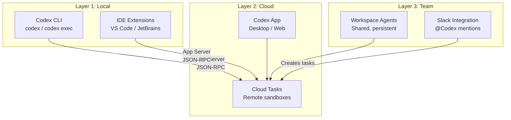
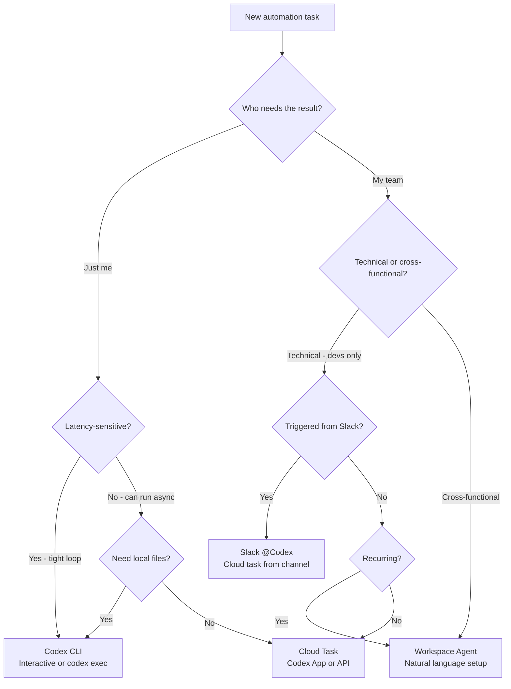

# Workspace Agents and Codex Slack Integration: From CLI Automations to Team-Shared Agentic Workflows


---

On 22 April 2026, OpenAI launched **workspace agents** — shared, persistent agents powered by Codex that run in the cloud and integrate directly into Slack, Salesforce, and the ChatGPT sidebar[^1]. Two days later, Codex crossed four million weekly active developers[^2]. For teams already running `codex exec` pipelines and CLI-based automations, these announcements raise an immediate question: *how do workspace agents relate to the CLI workflows you already have, and when should you use which?*

This article maps the architectural relationship between Codex CLI, Codex Cloud, and workspace agents, then provides a practical decision framework and migration guide.

## What Workspace Agents Actually Are

Workspace agents are an evolution of Custom GPTs, rebuilt on the Codex harness rather than the Assistants API[^1]. Each agent gets its own persistent workspace with access to files, code, connected apps, and cross-session memory[^3]. Unlike a Custom GPT, a workspace agent can:

- Write and execute code in a sandboxed cloud environment
- Use connected third-party apps (Slack, Jira, GitHub, Salesforce, Google Drive) via the plugin ecosystem[^4]
- Schedule future work and wake up autonomously to continue multi-day tasks[^4]
- Retain information across sessions, building organisational knowledge over time[^1]

Workspace agents are available in research preview on ChatGPT Business, Enterprise, Edu, and Teachers plans[^1]. They are **free until 6 May 2026**, after which credit-based pricing applies[^1].

## The Architecture: Three Layers of Codex

To understand where workspace agents fit, consider the Codex platform as three concentric layers sharing a single App Server protocol[^5]:



All three layers ultimately execute against the same cloud sandbox infrastructure and share the same model roster (gpt-5.5, gpt-5.4, gpt-5.4-mini, gpt-5.3-codex)[^6]. The differentiation is in *who triggers the work* and *how results are shared*.

| Dimension | Codex CLI | Cloud Tasks | Workspace Agents |
|-----------|-----------|-------------|------------------|
| **Trigger** | Developer in terminal | Developer in app/web | Anyone via ChatGPT or Slack |
| **Execution** | Local sandbox (bubblewrap/seatbelt) or cloud | Cloud sandbox | Cloud sandbox |
| **Visibility** | Single developer | Single developer | Entire team/workspace |
| **Persistence** | Session transcripts, local memory | Cloud task history | Cross-session memory + scheduled wake-ups |
| **Configuration** | `config.toml`, `AGENTS.md`, hooks | App settings | Natural-language agent builder |
| **Best for** | Tight dev loops, CI/CD, scripting | Long-running tasks, PR creation | Shared team automations, cross-functional workflows |

## The Slack Integration: @Codex in Your Channels

The Slack integration is the primary surface through which non-CLI teams interact with Codex's cloud infrastructure[^7]. Setup requires:

1. A ChatGPT Plus, Pro, Business, Enterprise, or Edu subscription[^7]
2. A connected GitHub account with at least one configured environment[^7]
3. Installation of the Codex Slack app from workspace settings (may require admin approval)[^7]

Once installed, any team member can mention `@Codex` in a channel or thread with a prompt[^7]. Codex:

1. Reacts with 👀 to acknowledge receipt
2. Reviews accessible environments and selects the best match[^7]
3. Creates a cloud task, running against the default branch of the matched repository[^7]
4. Posts results (and optionally an inline answer) back to the thread[^7]

Users can specify a repository explicitly — `@Codex fix the flaky test in openai/codex` — or let Codex infer from context[^7]. Enterprise administrators can disable inline answer posting, limiting responses to task links only[^7].

### Environment Selection Mechanics

The automatic environment selection follows a simple heuristic: Codex scans the user's accessible environments, matches based on repository names mentioned in the prompt or thread, and falls back to the most recently used environment if ambiguous[^7]. For teams managing multiple repositories, maintaining an accurate repository map in each environment is essential.

## When CLI Developers Should Care

If you have been building automations with `codex exec`, you have effectively been creating single-developer workspace agents. The patterns translate:

### Pattern 1: CI/CD Gate → Shared Review Agent

**CLI approach:**

```bash
codex exec "Review this diff for security issues" \
  --output-schema ./review-schema.json \
  -o ./findings.json
```

**Workspace agent equivalent:** Create a workspace agent named "Security Reviewer" with instructions to review PRs against your security checklist. Team members invoke it from Slack: `@Codex review the latest PR on backend-api`.

### Pattern 2: Scheduled codex exec → Automations

**CLI approach (cron):**

```bash
# crontab entry
0 8 * * 1 codex exec "Summarise last week's commits and open PRs" \
  --model gpt-5.4-mini -o /tmp/weekly-digest.md
```

**Workspace agent equivalent:** Build an agent with automation scheduling built in. Codex can now schedule future work for itself and wake up automatically[^4], eliminating the need for external cron infrastructure.

### Pattern 3: AGENTS.md + Hooks → Agent Instructions

Your `AGENTS.md` files and `hooks.json` configurations encode organisational knowledge. When building a workspace agent, translate these into the agent's natural-language instructions:

```
# AGENTS.md (CLI)
## Build
Run `pnpm install && pnpm build`

## Test
Run `pnpm test -- --coverage`
Never commit with coverage below 80%.

## Review guidelines
- Flag any use of eval() or Function()
- Require error handling on all async operations
```

Becomes the workspace agent's instructions:

> When working on this repository, always run `pnpm install && pnpm build` first. Run tests with `pnpm test -- --coverage` and never commit if coverage drops below 80%. During reviews, flag eval() usage and missing error handling on async operations.

### Pattern 4: MCP Servers → Connected Apps

If you run MCP servers locally to give Codex CLI access to Jira, Slack, or databases, workspace agents replace that plumbing with first-party plugin integrations[^4]. The 90+ plugins launched in April 2026 include Atlassian Rovo (Jira), CircleCI, GitLab Issues, Microsoft Suite, and Neon by Databricks[^4].

## The Decision Framework



**Use Codex CLI when:**

- You need local sandbox execution with bubblewrap/seatbelt isolation
- The workflow requires local filesystem access beyond Git repositories
- You are iterating rapidly and need sub-second feedback
- You need fine-grained control via `config.toml` profiles, hooks, and approval modes
- You are running in CI/CD pipelines where `codex exec` is already wired up

**Use Workspace Agents when:**

- The automation serves a team, not just one developer
- Non-technical stakeholders need to trigger or consume results
- The workflow benefits from persistent cross-session memory
- You want natural-language configuration rather than TOML and JSON
- The task integrates with Slack, Jira, or other connected apps natively

**Use Slack @Codex when:**

- A team member describes a bug or question in a channel and needs a quick code-backed answer
- You want Codex to create a PR directly from a conversation thread
- Ad-hoc, context-rich requests where the Slack thread *is* the specification

## Pricing Implications for Teams

The credit-based pricing that takes effect on 6 May 2026 adds a new dimension to the CLI-versus-cloud decision[^8]:

| Model | Input (credits/1M tokens) | Output (credits/1M tokens) |
|-------|---------------------------|----------------------------|
| gpt-5.5 | 125 | 750 |
| gpt-5.4 | 62.50 | 375 |
| gpt-5.4-mini | 18.75 | 113 |

For **Plus/Pro** individual users, messages cost approximately 14 credits (gpt-5.5) or 7 credits (gpt-5.4) each[^8]. Cloud tasks are available only on Business and Enterprise plans[^8].

CLI users with API keys pay standard per-token API rates instead[^8], which can be significantly cheaper for high-volume `codex exec` pipelines but without cloud sandbox infrastructure. The trade-off:

- **CLI + API key**: Lowest per-token cost, full local control, no cloud tasks
- **Business plan**: Cloud tasks, workspace agents, Slack integration, credit-based pricing
- **Enterprise**: Priority processing, admin controls, enterprise security[^8]

For teams evaluating the switch, monitor your current `codex exec` token consumption (visible via OpenTelemetry traces if configured) and compare against the credit pricing table above.

## Migration Checklist: CLI Automations → Workspace Agents

For teams ready to promote CLI automations to shared workspace agents:

1. **Audit existing automations** — List all `codex exec` scripts, cron jobs, and CI/CD steps that use Codex CLI
2. **Classify by audience** — Single-developer automations stay on CLI; team-facing ones are migration candidates
3. **Extract instructions** — Convert `AGENTS.md`, `hooks.json`, and prompt templates into natural-language agent instructions
4. **Replace MCP servers with plugins** — Swap local MCP configurations for first-party plugin integrations where available
5. **Configure environments** — Ensure GitHub repositories are mapped to cloud environments with correct default branches
6. **Test in research preview** — Workspace agents are still in preview; validate behaviour before decommissioning CLI automations
7. **Set admin controls** — Enterprise admins should configure role-based access, answer-posting policies, and credit budgets before the 6 May pricing transition[^7]

## Limitations and Caveats

⚠️ Workspace agents are in **research preview** — behaviour may change before general availability[^1].

⚠️ **No direct CLI-to-workspace-agent migration path exists yet.** You cannot export a `config.toml` + `AGENTS.md` bundle and import it as a workspace agent. The conversion is currently manual.

⚠️ Slack integration requires **GitHub-connected environments**[^7]. Non-GitHub workflows (GitLab, Bitbucket) are not yet supported for Slack-triggered tasks, though GitLab Issues is available as a plugin for workspace agents[^4].

⚠️ The automatic environment selection in Slack can misfire for teams with many similarly named repositories. Specify the repository explicitly in your `@Codex` prompt to avoid surprises[^7].

⚠️ Credit pricing details beyond token rates have not been fully disclosed. Per-task overhead costs and scheduled-wake-up pricing remain unconfirmed as of 24 April 2026.

## What Comes Next

The trajectory is clear: OpenAI is building towards a unified Codex runtime where the same agent logic runs across CLI, cloud, IDE, Slack, and enterprise platforms via the shared App Server protocol[^5]. For CLI developers, this means your investment in `AGENTS.md`, hooks, skills, and MCP configurations is not stranded — it is groundwork for the team-scale automations that workspace agents enable.

The practical advice: keep using `codex exec` for developer-facing, latency-sensitive, and CI/CD workflows. Promote proven automations to workspace agents when they need team-wide access. And install the Slack integration today — the free preview window closes on 6 May[^1].

---

## Citations

[^1]: OpenAI, "Introducing workspace agents in ChatGPT," 22 April 2026. [https://openai.com/index/introducing-workspace-agents-in-chatgpt/](https://openai.com/index/introducing-workspace-agents-in-chatgpt/)

[^2]: OpenAI, "Scaling Codex to enterprises worldwide," 21 April 2026. [https://openai.com/index/scaling-codex-to-enterprises-worldwide/](https://openai.com/index/scaling-codex-to-enterprises-worldwide/)

[^3]: 9to5Mac, "OpenAI updates ChatGPT with Codex-powered 'workspace agents' for teams," 22 April 2026. [https://9to5mac.com/2026/04/22/openai-updates-chatgpt-with-codex-powered-workspace-agents-for-teams/](https://9to5mac.com/2026/04/22/openai-updates-chatgpt-with-codex-powered-workspace-agents-for-teams/)

[^4]: OpenAI, "Codex for (almost) everything," 16 April 2026. [https://openai.com/index/codex-for-almost-everything/](https://openai.com/index/codex-for-almost-everything/)

[^5]: OpenAI, "Codex App Server README," codex-rs/app-server, GitHub. [https://github.com/openai/codex/blob/main/codex-rs/app-server/README.md](https://github.com/openai/codex/blob/main/codex-rs/app-server/README.md)

[^6]: OpenAI, "Models — Codex," OpenAI Developers. [https://developers.openai.com/codex/models](https://developers.openai.com/codex/models)

[^7]: OpenAI, "Use Codex in Slack," OpenAI Developers. [https://developers.openai.com/codex/integrations/slack](https://developers.openai.com/codex/integrations/slack)

[^8]: OpenAI, "Pricing — Codex," OpenAI Developers. [https://developers.openai.com/codex/pricing](https://developers.openai.com/codex/pricing)
