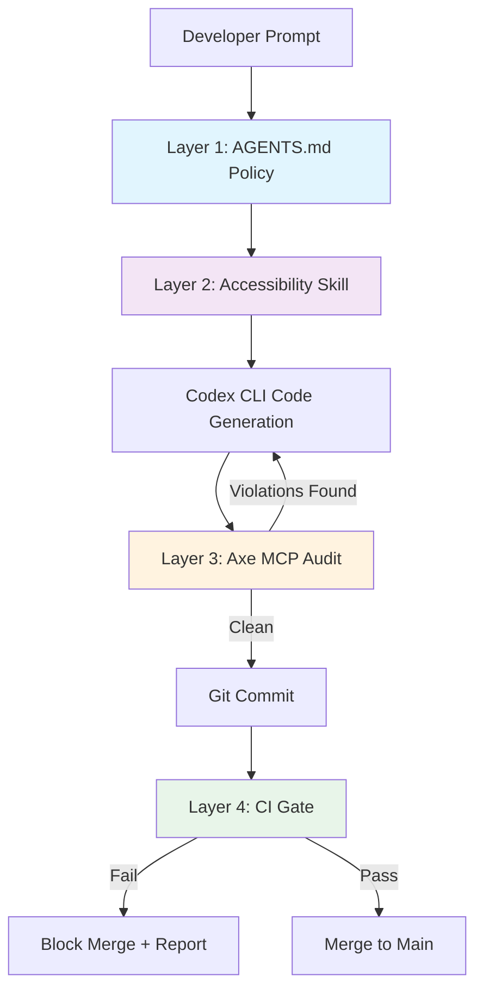

# Automated Accessibility Testing with Codex CLI: WCAG Compliance from Code Generation to CI Gate


---

As of 24 April 2026 the US Title II ADA deadline requires public entities serving populations of 50,000 or more to meet WCAG 2.1 Level AA conformance[^1]. Accessibility is no longer an afterthought — it is a compliance obligation with legal teeth. Yet AI coding agents, including Codex CLI, generate inaccessible code by default. Studies show that in 2025 nearly 95 per cent of popular websites had detectable accessibility failures[^2], and AI-generated components routinely miss contrast ratios, ARIA semantics, keyboard navigation, and focus management[^3].

This article presents a four-layer strategy for embedding accessibility into every Codex CLI workflow: AGENTS.md policies, accessibility-focused skills, axe-core MCP servers for real-time auditing, and CI gates that block inaccessible merges.

## The Problem: AI Agents Ship Inaccessible Code

Intopia's research with GPT-5.3 Codex demonstrated the gap starkly[^3]. When asked to build a multi-step checkout form without an accessibility skill, the agent produced 13+ violations across all form steps:

- Progress indicators lacked semantic structure
- Text contrast failed the 4.5:1 ratio requirement
- Input borders missed the 3:1 non-text contrast threshold
- Error messages were not programmatically linked to their fields
- `autocomplete` attributes were missing entirely
- Focus was never managed on validation failure

With an accessibility skill installed, the same agent referenced WCAG criteria before generating code, even running contrast-checking scripts autonomously. Only one issue remained — focus was sent to the step heading rather than the first invalid field[^3]. The takeaway: explicit accessibility instructions dramatically raise baseline quality but cannot guarantee perfection. You need layered defences.

## Layer 1: AGENTS.md Accessibility Policies

The cheapest intervention is policy. An AGENTS.md file at the repository root injects accessibility requirements into every Codex CLI session without any additional tooling[^4].

```markdown
# AGENTS.md

## Accessibility Requirements

All front-end code MUST conform to WCAG 2.2 Level AA (W3C Recommendation, December 2024).

### Mandatory Checks Before Completing Any UI Task

1. **Semantic HTML first** — use native elements (`<button>`, `<nav>`, `<dialog>`) before reaching for ARIA. Follow the [five rules of ARIA use](https://www.w3.org/WAI/standards-guidelines/aria/).
2. **Colour contrast** — normal text ≥ 4.5:1, large text ≥ 3:1, non-text UI components ≥ 3:1 against adjacent colours.
3. **Keyboard navigation** — every interactive element must be reachable and operable via keyboard alone. Tab order must follow visual reading order.
4. **Focus management** — modals trap focus; closing returns focus to the trigger. Form validation moves focus to the first invalid field.
5. **Touch targets** — minimum 24×24 CSS pixels (WCAG 2.2 Level AA), prefer 44×44 pixels[^6].
6. **Alternative text** — every `` requires `alt`. Decorative images use `alt=""`.
7. **Form associations** — every `<input>` has a visible `<label>` with matching `for`/`id`. Error messages use `aria-describedby`. Include `autocomplete` attributes for personal data fields.
8. **Reduced motion** — honour `prefers-reduced-motion: reduce`. No auto-playing animations.
9. **Live regions** — dynamic status messages use `aria-live="polite"` or `role="status"`.

### Verification

After completing any UI component, run `npx @axe-core/cli <url>` or the a11y-mcp audit tool
to verify zero critical or serious violations before marking the task complete.
```

Place more specific rules in subdirectory `AGENTS.md` files — for example, `frontend/AGENTS.md` can enforce framework-specific patterns whilst `docs/AGENTS.md` handles document accessibility. Codex CLI concatenates files from root to current directory, with closer files taking precedence[^4].

## Layer 2: Accessibility Skills

Skills extend Codex CLI with domain-specific expertise that activates only when relevant, keeping context budgets lean for non-UI tasks.

### The Intopia Web Accessibility Skill

Intopia's open-source skill pairs a `SKILL.md` with supporting reference files containing acceptance criteria for common components — forms, modals, tabs, and structural elements[^3]. Install it to your skills directory:

```bash
# Install from the Intopia accessibility skill repository
cp -r intopia-a11y-skill/ ~/.codex/skills/web-accessibility/
```

The skill uses progressive disclosure — agents read the `INDEX.md` to find relevant guidance and only load the criteria they need for the current task[^3].

### The accessibility-compliance Skill

Available via the skills.sh registry, this skill provides five core implementation patterns with ready-to-use React examples[^7]:

```bash
npx skills add https://github.com/wshobson/agents --skill accessibility-compliance
```

It covers accessible buttons with focus indicators, modal dialogs with focus trapping, forms with error announcements, skip navigation links, and live regions for dynamic content[^7].

### Building Your Own Accessibility Skill

For teams with specific design systems, a custom skill is straightforward:

```markdown
---
name: a11y-design-system
description: Enforces our design system's accessibility patterns for all UI components
---

# Accessibility — Design System Patterns

When building any UI component, follow these rules:

1. Import components from `@our-design-system/react` — they include built-in ARIA support
2. Never override `tabIndex` unless explicitly required by the design specification
3. All custom components must pass the component accessibility checklist at `docs/a11y-checklist.md`
4. Run `pnpm test:a11y` after any component change — it must exit 0
```

## Layer 3: Axe-Core MCP Servers for Real-Time Auditing

Skills tell the agent what to do; MCP servers let it verify what it did. Two axe-core MCP servers stand out for Codex CLI integration.

### a11y-mcp (Open Source)

The `a11y-mcp` server exposes two tools — `audit_webpage` for detailed axe-core audits and `get_summary` for condensed violation overviews[^8]. Configure it in `~/.codex/config.toml`:

```toml
[mcp_servers.a11y]
command = "npx"
args = ["a11y-mcp"]
```

Once configured, the agent can invoke it during any UI task:

```
Agent: I'll audit the checkout form for accessibility violations.
→ Tool call: mcp__a11y__audit_webpage({ url: "http://localhost:3000/checkout", tags: ["wcag2aa"] })
→ Result: 3 violations found — missing form labels, insufficient contrast on .btn-secondary, missing landmark regions
Agent: I'll fix these three issues now.
```

The `tags` parameter supports filtering by standard — `wcag2a`, `wcag2aa`, `wcag21a`, `wcag22aa`, and `best-practice`[^8] — so you can target the exact compliance level your project requires.

### Deque Axe MCP Server (Enterprise)

Deque's official axe MCP server integrates enterprise-grade testing with remediation guidance[^9]. It works with any MCP-compatible client including Codex CLI. For teams already using Axe DevTools, this provides consistency between manual and automated testing pipelines.

### Hook-Based MCP Observation (v0.124+)

With hooks now stable in Codex CLI v0.124[^10], you can observe MCP tool calls to create an accessibility audit trail:

```toml
[[hooks]]
event = "PostToolUse"
tool_name = "mcp__a11y__audit_webpage"
command = "jq '.violations | length' /tmp/last-a11y-audit.json >> /tmp/a11y-audit-log.jsonl"
```

This logs every accessibility audit result, providing traceability for compliance reviews.

## Layer 4: CI Gates with codex exec

The final layer prevents inaccessible code from reaching production. Use `codex exec` in your CI pipeline to run accessibility audits as a merge gate.

```yaml
# .github/workflows/a11y-gate.yml
name: Accessibility Gate
on: [pull_request]

jobs:
  a11y-audit:
    runs-on: ubuntu-latest
    steps:
      - uses: actions/checkout@v4

      - name: Start dev server
        run: |
          npm ci
          npm run build
          npx serve -s build -l 3000 &
          sleep 5

      - name: Run axe-core audit
        run: |
          npx @axe-core/cli http://localhost:3000 \
            --tags wcag2aa,wcag22aa \
            --exit \
            --reporter json > a11y-results.json

      - name: Fail on violations
        run: |
          VIOLATIONS=$(jq '.violations | length' a11y-results.json)
          if [ "$VIOLATIONS" -gt 0 ]; then
            echo "::error::$VIOLATIONS accessibility violations found"
            jq '.violations[] | {id, impact, description, nodes: (.nodes | length)}' a11y-results.json
            exit 1
          fi
```

For more sophisticated analysis, use `codex exec` with an output schema to generate structured accessibility reports:

```bash
codex exec \
  --model gpt-5.5 \
  --approval-mode full-auto \
  --sandbox read-only \
  --output-schema a11y-report-schema.json \
  "Review the axe-core results in a11y-results.json. For each violation, \
   assess severity, suggest a specific fix with code, and estimate effort."
```

## The Four-Layer Architecture



Each layer catches what the previous one misses. AGENTS.md sets policy (free, always active). Skills provide domain expertise (lightweight, per-task). MCP servers verify rendered output (runtime cost, high accuracy). CI gates enforce compliance at the boundary (blocking, authoritative).

## The Community-Access Ecosystem

The Community-Access project provides a comprehensive suite of accessibility agents across five platforms, including explicit Codex CLI support via a skills pack with optional TOML-based roles[^2]. The project includes 79 specialised agents across eight teams:

- **Web Accessibility Team** — 11 agents covering ARIA patterns, colour contrast, keyboard navigation, form handling, and live regions
- **Document Accessibility Team** — auditing Office documents, PDFs, and Markdown
- **Developer Tools Team** — Python, wxPython, and desktop accessibility

Install the Codex CLI skills pack:

```bash
curl -fsSL https://raw.githubusercontent.com/Community-Access/accessibility-agents/main/install.sh | bash
```

This provides focused accessibility review passes that complement your existing AGENTS.md policies[^2].

## Coverage Expectations

Axe-core catches approximately 57 per cent of WCAG issues automatically[^11]. The accessibility-agents project estimates that agents catch roughly 70 per cent of issues during code generation[^2]. Combined, these layers significantly reduce the manual testing burden — but they do not eliminate it.

⚠️ Automated tools cannot fully test:

- Screen reader announcement quality and reading order
- Cognitive load and plain language assessment
- Complex keyboard interaction patterns beyond basic tab order
- Meaningful alternative text (only presence, not quality)

Manual testing with assistive technologies remains essential. Use these layers to raise the floor, not to replace expert review.

## Practical Configuration Checklist

| Layer | Tool | Config Location | Cost |
|-------|------|----------------|------|
| Policy | AGENTS.md | Repo root + subdirectories | Free |
| Skills | Intopia / accessibility-compliance | `~/.codex/skills/` | Free |
| Audit | a11y-mcp or Axe MCP Server | `config.toml` `[mcp_servers]` | Runtime tokens |
| CI Gate | @axe-core/cli + codex exec | `.github/workflows/` | CI minutes |

## Conclusion

The ADA Title II deadline has passed[^1]. WCAG 2.2 is the current W3C Recommendation[^6]. AI coding agents will write your front-end code regardless — the question is whether that code excludes a significant portion of your users.

Four layers — policy, skills, runtime audits, and CI gates — transform Codex CLI from an accessibility liability into an accessibility asset. None is sufficient alone; together they catch the vast majority of automated-detectable violations before they reach production. For the rest, keep your accessibility team close and your screen readers closer.

## Citations

[^1]: Duane Morris LLP, "Preparing for April 2026 – New Digital Accessibility Standards for Public Institutions of Higher Education," [https://www.duanemorris.com/alerts/preparing_for_april_2026_new_digital_accessibility_standards_public_institutions_higher_0326.html](https://www.duanemorris.com/alerts/preparing_for_april_2026_new_digital_accessibility_standards_public_institutions_higher_0326.html)

[^2]: Community-Access, "Accessibility Agents — WCAG 2.2 AA compliance for AI coding tools," GitHub, [https://github.com/Community-Access/accessibility-agents](https://github.com/Community-Access/accessibility-agents)

[^3]: Intopia, "Can AI Agent Skills Help Developers Ship Accessible Code?," [https://intopia.digital/articles/can-ai-agent-skills-help-developers-ship-accessible-code/](https://intopia.digital/articles/can-ai-agent-skills-help-developers-ship-accessible-code/)

[^4]: OpenAI, "Custom instructions with AGENTS.md — Codex," [https://developers.openai.com/codex/guides/agents-md](https://developers.openai.com/codex/guides/agents-md)

[^6]: W3C, "Web Content Accessibility Guidelines (WCAG) 2.2," [https://www.w3.org/TR/WCAG22/](https://www.w3.org/TR/WCAG22/)

[^7]: wshobson, "accessibility-compliance — Agent Skills," [https://skills.sh/wshobson/agents/accessibility-compliance](https://skills.sh/wshobson/agents/accessibility-compliance)

[^8]: priyankark, "a11y-mcp — MCP server for accessibility audits using axe-core," GitHub, [https://github.com/priyankark/a11y-mcp](https://github.com/priyankark/a11y-mcp)

[^9]: Deque, "Axe MCP Server — AI-guided remediation and one-click fixes," [https://www.deque.com/axe/mcp-server/](https://www.deque.com/axe/mcp-server/)

[^10]: OpenAI, "Codex CLI Changelog — v0.124.0," [https://developers.openai.com/codex/changelog](https://developers.openai.com/codex/changelog)

[^11]: Deque, "axe-core — Accessibility engine for automated Web UI testing," GitHub, [https://github.com/dequelabs/axe-core](https://github.com/dequelabs/axe-core)
