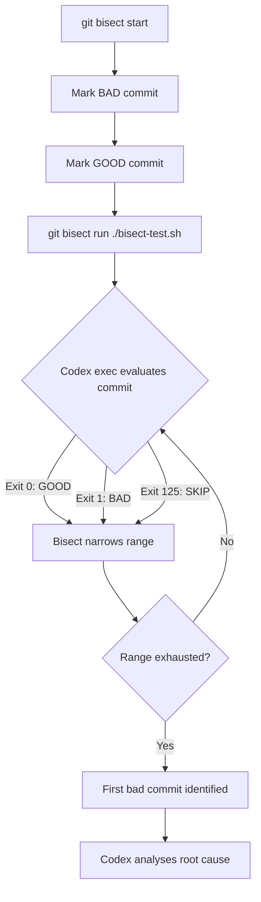

# Automated Regression Hunting with Codex CLI: AI-Powered Git Bisect and Root Cause Analysis


---

Git bisect is one of the most powerful debugging tools in any developer's arsenal, yet it remains chronically underused[^1]. The barrier has always been the same: expressing a reliable test condition, managing the binary search manually, and interpreting the results across potentially hundreds of commits. Codex CLI changes this equation entirely. By combining `codex exec` with `git bisect run`, you can turn regression hunting from a tedious manual exercise into a one-command automated pipeline that not only finds the offending commit but explains *why* it broke.

## The Problem: Regressions Hide in Plain Sight

Every team has experienced it. A test that was green last week is red today. A feature that worked in production is now returning 500s. The commit history shows 47 merges since the last known-good state. Manually checking each one is impractical; even with `git bisect`, you still need to write a test script, handle edge cases like uncompilable intermediate commits, and interpret the results.

The traditional `git bisect run` workflow requires a shell script that returns exit code 0 for good commits and non-zero for bad ones[^2]. The special exit code 125 tells bisect to skip commits that cannot be tested (e.g. broken builds)[^3]. This is well-established but rarely used because crafting that test script is often harder than the debugging itself.

## How Codex CLI Fits In

Codex CLI's `exec` subcommand runs a prompt non-interactively — it takes instructions, executes against your codebase, and exits with a meaningful exit code[^4]. When tests fail, `codex exec` returns non-zero[^5]. This makes it a natural fit as a `git bisect run` test oracle: instead of writing a bespoke test script, you describe the regression in natural language and let Codex determine whether each commit exhibits the bug.



## Setting Up the Bisect Pipeline

### Step 1: Identify the Regression Window

Before invoking bisect, you need a known-good and known-bad commit. If you maintain a linear merge history with squash merges — a pattern the Codex CLI best practices documentation recommends[^6] — this is straightforward:

```bash
# Find the last known-good tag or commit
GOOD_COMMIT=$(git log --oneline --before="2026-04-20" -1 --format="%H")
BAD_COMMIT=$(git rev-parse HEAD)

git bisect start "$BAD_COMMIT" "$GOOD_COMMIT"
```

### Step 2: Write the Bisect Test Script

Create a `bisect-test.sh` that wraps `codex exec`:

```bash
#!/usr/bin/env bash
set -euo pipefail

# Skip commits that don't compile
if ! npm run build 2>/dev/null; then
  exit 125
fi

# Use Codex to evaluate whether the regression is present
codex exec \
  --approval-mode full-auto \
  -q \
  "Run the test suite for the payments module with 'npm test -- --testPathPattern=payments'.
   If the tests pass, exit 0. If they fail, exit 1.
   Do not attempt to fix anything." 2>/dev/null

# codex exec propagates the exit code from the test run
```

```bash
chmod +x bisect-test.sh
git bisect run ./bisect-test.sh
```

The `--approval-mode full-auto` flag (or the equivalent `--yolo` shorthand) allows Codex to run shell commands without interactive approval, which is essential for automated bisect runs[^7]. The `-q` flag suppresses TUI output, keeping the bisect log clean.

### Step 3: Interpret the Results

When bisect completes, Git reports the first bad commit:

```text
abc123def is the first bad commit
commit abc123def
Author: developer@example.com
Date:   Mon Apr 21 14:32:00 2026 +0100

    refactor: extract payment validation into separate module
```

## Beyond Simple Test Execution: AI-Powered Root Cause Analysis

Finding the commit is only half the battle. Understanding *why* it introduced the regression is where Codex CLI truly differentiates itself. Once bisect identifies the culprit, pipe the diff into Codex for analysis:

```bash
FIRST_BAD=$(git bisect view --format="%H" | head -1)

codex exec \
  "Analyse the diff of commit $FIRST_BAD against its parent.
   Explain exactly why this change introduced a regression in the
   payments test suite. Focus on behavioural changes, not style.
   Suggest a minimal fix."
```

This gives you a structured explanation that would normally take 30 minutes of manual code archaeology. Codex reads the full diff, cross-references the test assertions, and identifies the semantic mismatch — for example, a refactored function that changed the default return value from `null` to `undefined`, breaking a strict equality check downstream.

## Advanced Pattern: Behavioural Bisect Without Existing Tests

The most powerful application is when you *don't* have a failing test — you have a behavioural regression reported by a user. Traditional bisect requires a test script; Codex can serve as the test itself:

```bash
#!/usr/bin/env bash
set -euo pipefail

if ! npm run build 2>/dev/null; then
  exit 125
fi

# Codex evaluates the behaviour directly
result=$(codex exec --json \
  "Start the application server in the background on port 3999.
   Send a POST to /api/payments with this payload: {\"amount\": 100, \"currency\": \"GBP\"}.
   Check whether the response includes a 'transaction_id' field.
   If it does, this commit is GOOD. If not, this commit is BAD.
   Report your finding as the last line: GOOD or BAD." 2>/dev/null)

if echo "$result" | grep -q "GOOD"; then
  exit 0
else
  exit 1
fi
```

This pattern uses Codex as an intelligent test oracle that can reason about application behaviour without a pre-written test[^8]. The `--json` flag, which now reports reasoning-token usage[^9], enables structured output parsing for programmatic consumers.

## Integrating with CI/CD

For teams that want regression bisect as part of their CI pipeline, the Codex GitHub Action (`openai/codex-action@v1`) provides a clean integration point[^10]:


```yaml
name: Regression Bisect
on:
  workflow_dispatch:
    inputs:
      good_commit:
        description: 'Last known good commit SHA'
        required: true
      bad_commit:
        description: 'First known bad commit SHA'
        required: true
      regression_description:
        description: 'Description of the regression'
        required: true

jobs:
  bisect:
    runs-on: ubuntu-latest
    steps:
      - uses: actions/checkout@v4
        with:
          fetch-depth: 0

      - uses: openai/codex-action@v1
        with:
          api-key: ${{ secrets.OPENAI_API_KEY }}
          prompt: |
            Run git bisect between ${{ inputs.good_commit }} and
            ${{ inputs.bad_commit }} to find the commit that introduced
            this regression: "${{ inputs.regression_description }}".
            Write a test script, run git bisect run, then analyse the
            result and post a summary.
          sandbox: read-write
```


## Performance and Cost Considerations

Each bisect step invokes `codex exec`, which means each step incurs API token costs. For a binary search across 128 commits, that is approximately 7 steps — manageable, but worth optimising:

| Strategy | Effect |
|---|---|
| Use `--model gpt-5.3-codex-spark` for bisect steps | Reduces per-step cost by ~80%[^11] |
| Reserve GPT-5.5 for final root cause analysis | Full reasoning power where it matters |
| Pre-compile and cache `node_modules` | Reduces wall-clock time per step |
| Use `exit 125` liberally for broken intermediates | Avoids wasting tokens on uncompilable states |

The `codex exec --json` output now includes reasoning-token usage[^9], so you can track exactly how many tokens each bisect step consumed and optimise accordingly.

## Configuration for Bisect Workflows

Create a dedicated profile in `~/.codex/config.toml` for bisect operations:

```toml
[profiles.bisect]
model = "gpt-5.3-codex-spark"
approval_mode = "full-auto"
sandbox_permissions.disk = "full"
sandbox_permissions.network = "none"

[profiles.bisect-analysis]
model = "gpt-5.5"
approval_mode = "full-auto"
sandbox_permissions.disk = "read-only"
```

Then invoke with profiles[^12]:

```bash
# Fast model for the bisect loop
codex --profile bisect exec "run tests..."

# Heavy model for the final analysis
codex --profile bisect-analysis exec "analyse commit..."
```

## Limitations and Caveats

**Non-determinism**: Codex's responses can vary between runs. For critical bisect operations, consider running each step twice and requiring consensus before marking a commit as good or bad.

**Stateful regressions**: If the regression depends on database state or external services, the bisect script must provision that state at each step. Codex cannot conjure external dependencies.

**Token budget**: Very large codebases with slow test suites can consume significant tokens across many bisect steps. The two-model strategy (Spark for bisect, GPT-5.5 for analysis) mitigates this effectively.

**Sandbox constraints**: Running `codex exec` with `--approval-mode full-auto` in an unsupervised bisect loop requires careful sandbox configuration. The Codex CLI sandbox (Seatbelt on macOS, Landlock on Linux) constrains filesystem and network access[^13], but you should still run bisect in an isolated environment — a disposable container or CI runner — rather than on your development machine.

## Practical Recommendations

1. **Keep bisect scripts idempotent** — each step must be able to build and test from a clean state without leaking state from previous steps.
2. **Use squash merges** — linear history makes bisect dramatically more effective by reducing the search space and eliminating merge commits that may not compile independently[^6].
3. **Log everything** — redirect `codex exec` output to a file per step so you can review the AI's reasoning if the bisect result seems wrong.
4. **Combine with `git blame`** — once bisect finds the commit, use `git blame` on the specific changed lines to understand the full history of that code path[^14].
5. **Automate with hooks** — use Codex CLI hooks to trigger a bisect automatically when a previously-passing test starts failing in CI[^15].

## Conclusion

The combination of `git bisect run` and `codex exec` transforms regression hunting from an art practised by senior developers into a repeatable, automatable process. The AI handles the parts that make bisect difficult — writing test scripts, handling edge cases, and explaining root causes — while Git's binary search provides the mathematical efficiency. For teams maintaining large codebases with frequent merges, this pattern can reduce regression diagnosis time from hours to minutes.

---

## Citations

[^1]: Simon Willison, "Using Git with Coding Agents", *Agentic Engineering Patterns*, 2026. [https://simonwillison.net/guides/agentic-engineering-patterns/using-git-with-coding-agents/](https://simonwillison.net/guides/agentic-engineering-patterns/using-git-with-coding-agents/)

[^2]: Git Documentation, "git-bisect - Use binary search to find the commit that introduced a bug". [https://git-scm.com/docs/git-bisect](https://git-scm.com/docs/git-bisect)

[^3]: Git Documentation, "git bisect run — exit code 125 for untestable commits". [https://git-scm.com/docs/git-bisect#_bisect_run](https://git-scm.com/docs/git-bisect#_bisect_run)

[^4]: OpenAI Developers, "Non-interactive mode — Codex CLI". [https://developers.openai.com/codex/noninteractive](https://developers.openai.com/codex/noninteractive)

[^5]: OpenAI Developers, "Features — Codex CLI: exec exits non-zero if submission fails". [https://developers.openai.com/codex/cli/features](https://developers.openai.com/codex/cli/features)

[^6]: OpenAI Developers, "Best practices — Codex: squash merge PRs for clean linear history". [https://developers.openai.com/codex/learn/best-practices](https://developers.openai.com/codex/learn/best-practices)

[^7]: OpenAI Developers, "Command line options — Codex CLI: --approval-mode full-auto". [https://developers.openai.com/codex/cli/reference](https://developers.openai.com/codex/cli/reference)

[^8]: OpenAI, "Unrolling the Codex agent loop — iterative tool execution". [https://openai.com/index/unrolling-the-codex-agent-loop/](https://openai.com/index/unrolling-the-codex-agent-loop/)

[^9]: OpenAI Developers, "Changelog — April 24, 2026: codex exec --json reports reasoning-token usage". [https://developers.openai.com/codex/changelog](https://developers.openai.com/codex/changelog)

[^10]: OpenAI Developers, "GitHub Action — Codex CLI". [https://developers.openai.com/codex/github-action](https://developers.openai.com/codex/github-action)

[^11]: OpenAI Developers, "Models — Codex: GPT-5.3-Codex-Spark pricing and performance". [https://developers.openai.com/codex/models](https://developers.openai.com/codex/models)

[^12]: OpenAI Developers, "Advanced Configuration — Profiles". [https://developers.openai.com/codex/config-advanced](https://developers.openai.com/codex/config-advanced)

[^13]: OpenAI Developers, "CLI — Codex: sandbox and permissions". [https://developers.openai.com/codex/cli](https://developers.openai.com/codex/cli)

[^14]: Graphite, "Debugging with git bisect: Identifying the commit that introduced a bug". [https://graphite.com/guides/git-bisect-debugging-guide](https://graphite.com/guides/git-bisect-debugging-guide)

[^15]: OpenAI Developers, "Codex CLI Hooks". [https://developers.openai.com/codex/cli/features](https://developers.openai.com/codex/cli/features)
