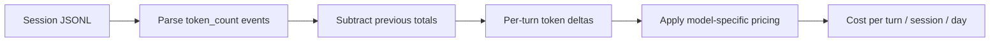
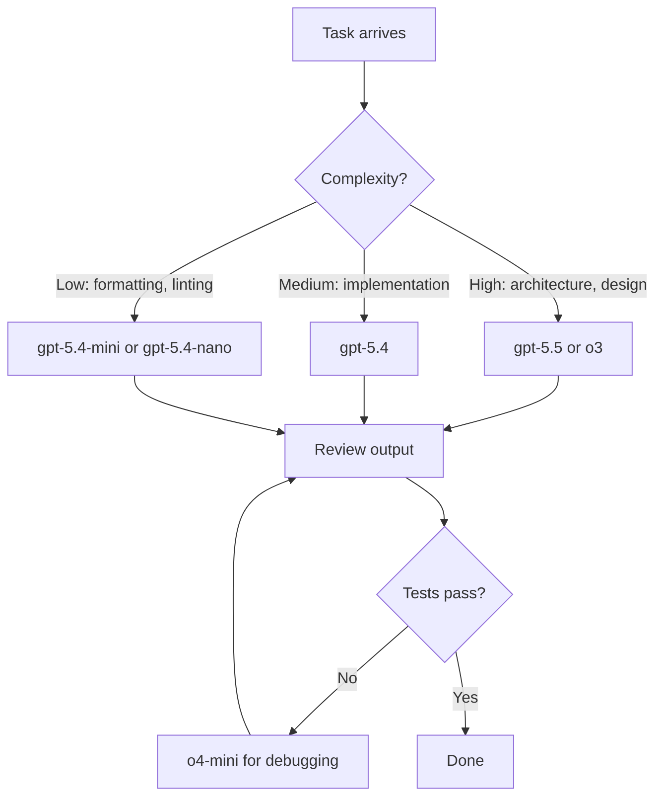

# Codex CLI Cost Calculator: Building a Token Budget Estimator for Mixed-Model Workflows


---

With OpenAI's April 2026 shift to token-based billing for Codex[^1], understanding exactly where your credits go across models like `o4-mini`, `gpt-5.4`, and the new `gpt-5.5` is no longer optional — it's operational hygiene. This article walks through building a practical token budget estimator that parses Codex CLI session logs, applies current per-model pricing, and projects costs for mixed-model workflows.

## The Pricing Landscape in April 2026

Codex now bills on three token categories: **input**, **cached input**, and **output**, each priced per million tokens[^1]. The spread across models is significant:

| Model | Input ($/1M) | Cached Input ($/1M) | Output ($/1M) | Sweet Spot |
|-------|-------------|---------------------|---------------|------------|
| `gpt-5.5` | \$5.00 | \$0.50 | \$30.00 | Complex multi-step reasoning[^2] |
| `gpt-5.4` | \$2.50 | \$0.25 | \$15.00 | General coding tasks[^2] |
| `gpt-5.4-mini` | \$0.75 | \$0.075 | \$4.50 | Parallel subagent work[^2] |
| `gpt-5.4-nano` | \$0.20 | \$0.02 | \$1.25 | Boilerplate, formatting[^2] |
| `gpt-5.3-codex` | \$3.50 | \$0.35 | \$28.00 | Priority Codex tasks[^2] |
| `o3` | \$2.00 | \$0.50 | \$8.00 | Hard reasoning problems[^3] |
| `o4-mini` | \$1.10 | \$0.275 | \$4.40 | Cost-effective reasoning[^3] |

The key insight: output tokens cost 6–10× more than input tokens across every model[^2]. A workflow that generates verbose output on `gpt-5.5` will burn budget dramatically faster than one using `o4-mini` for the same reasoning task.

## How Codex CLI Tracks Token Usage

Since September 2025, Codex CLI emits cumulative token count events in its session JSONL files, stored in `CODEX_HOME` (defaulting to `~/.codex`)[^4]. Each turn records running totals for input, cached input, output, and reasoning tokens, tagged with the active model in the `turn_context` metadata[^4].

To recover per-turn usage, you subtract the previous cumulative total from the current one — the same approach used by the `ccusage` tool[^4].



## Building the Budget Estimator

### Step 1: Parse Session Logs

The following Python script reads Codex session files and extracts per-turn token deltas grouped by model:

```python
#!/usr/bin/env python3
"""codex_cost.py — Token budget estimator for Codex CLI sessions."""

import json
import os
from pathlib import Path
from collections import defaultdict
from dataclasses import dataclass, field

# Current pricing as of April 2026 (USD per 1M tokens)
MODEL_PRICING = {
    "gpt-5.5":        {"input": 5.00,  "cached": 0.50,   "output": 30.00},
    "gpt-5.4":        {"input": 2.50,  "cached": 0.25,   "output": 15.00},
    "gpt-5.4-mini":   {"input": 0.75,  "cached": 0.075,  "output": 4.50},
    "gpt-5.4-nano":   {"input": 0.20,  "cached": 0.02,   "output": 1.25},
    "gpt-5.3-codex":  {"input": 3.50,  "cached": 0.35,   "output": 28.00},
    "o3":             {"input": 2.00,  "cached": 0.50,   "output": 8.00},
    "o4-mini":        {"input": 1.10,  "cached": 0.275,  "output": 4.40},
}


@dataclass
class SessionCost:
    model: str
    input_tokens: int = 0
    cached_tokens: int = 0
    output_tokens: int = 0

    @property
    def cost_usd(self) -> float:
        pricing = MODEL_PRICING.get(self.model, MODEL_PRICING["gpt-5.4"])
        return (
            (self.input_tokens * pricing["input"] / 1_000_000)
            + (self.cached_tokens * pricing["cached"] / 1_000_000)
            + (self.output_tokens * pricing["output"] / 1_000_000)
        )


def parse_session(filepath: Path) -> dict[str, SessionCost]:
    """Parse a single session JSONL file into per-model costs."""
    costs: dict[str, SessionCost] = {}
    prev_totals: dict[str, dict] = {}

    with open(filepath) as f:
        for line in f:
            try:
                event = json.loads(line)
            except json.JSONDecodeError:
                continue

            if event.get("type") != "token_count":
                continue

            model = event.get("turn_context", {}).get("model", "unknown")
            usage = event.get("usageMetadata", {})

            # Current cumulative totals
            curr = {
                "input": usage.get("inputTokens", 0),
                "cached": usage.get("cachedInputTokens", 0),
                "output": usage.get("outputTokens", 0),
            }

            # Calculate deltas from previous totals
            prev = prev_totals.get(model, {"input": 0, "cached": 0, "output": 0})
            delta_input = max(0, curr["input"] - prev["input"])
            delta_cached = max(0, curr["cached"] - prev["cached"])
            delta_output = max(0, curr["output"] - prev["output"])

            if model not in costs:
                costs[model] = SessionCost(model=model)

            costs[model].input_tokens += delta_input
            costs[model].cached_tokens += delta_cached
            costs[model].output_tokens += delta_output

            prev_totals[model] = curr

    return costs
```

### Step 2: Aggregate and Report

Add a reporting layer that scans all sessions within a date range:

```python
def scan_sessions(
    codex_home: Path | None = None,
    days: int = 30,
) -> dict[str, SessionCost]:
    """Aggregate costs across all sessions in the last N days."""
    home = codex_home or Path(os.environ.get("CODEX_HOME", Path.home() / ".codex"))
    from datetime import datetime, timedelta

    cutoff = datetime.now() - timedelta(days=days)
    aggregated: dict[str, SessionCost] = {}

    for session_file in home.glob("sessions/**/*.jsonl"):
        # Filter by file modification time
        mtime = datetime.fromtimestamp(session_file.stat().st_mtime)
        if mtime < cutoff:
            continue

        for model, cost in parse_session(session_file).items():
            if model not in aggregated:
                aggregated[model] = SessionCost(model=model)
            aggregated[model].input_tokens += cost.input_tokens
            aggregated[model].cached_tokens += cost.cached_tokens
            aggregated[model].output_tokens += cost.output_tokens

    return aggregated


def print_report(costs: dict[str, SessionCost], days: int) -> None:
    """Print a formatted cost report."""
    total = 0.0
    print(f"\n{'Model':<18} {'Input':>10} {'Cached':>10} {'Output':>10} {'Cost':>10}")
    print("-" * 62)

    for model in sorted(costs, key=lambda m: costs[m].cost_usd, reverse=True):
        c = costs[model]
        print(
            f"{c.model:<18} {c.input_tokens:>10,} {c.cached_tokens:>10,} "
            f"{c.output_tokens:>10,} ${c.cost_usd:>9.2f}"
        )
        total += c.cost_usd

    print("-" * 62)
    print(f"{'Total':<18} {'':<10} {'':<10} {'':<10} ${total:>9.2f}")
    print(f"{'Projected/month':<18} {'':<10} {'':<10} {'':<10} ${total * 30 / days:>9.2f}")


if __name__ == "__main__":
    import argparse
    parser = argparse.ArgumentParser(description="Codex CLI cost estimator")
    parser.add_argument("--days", type=int, default=30, help="Look-back window")
    parser.add_argument("--codex-home", type=Path, help="Override CODEX_HOME")
    args = parser.parse_args()

    costs = scan_sessions(codex_home=args.codex_home, days=args.days)
    if costs:
        print_report(costs, args.days)
    else:
        print("No session data found. Check your CODEX_HOME path.")
```

### Step 3: Run It

```bash
# Last 7 days
python codex_cost.py --days 7

# Custom CODEX_HOME
python codex_cost.py --codex-home ~/my-codex-data --days 30
```

Sample output:

```
Model              Input     Cached     Output       Cost
--------------------------------------------------------------
gpt-5.5           45,200     38,100     12,800     $0.62
gpt-5.4          312,000    287,000     85,400     $2.12
o4-mini          180,500    112,300     62,100     $0.58
gpt-5.4-mini     520,000    480,000     41,200     $0.61
--------------------------------------------------------------
Total                                              $3.93
Projected/month                                   $16.84
```

## Mixed-Model Workflow Strategies

The cost difference between models is stark enough that model selection per task phase becomes a genuine optimisation lever[^5]. A recommended pattern:



### Practical Cost Comparison

Consider a typical feature implementation session (planning → coding → testing → debugging):

| Phase | Tokens (in/out) | Model Choice | Estimated Cost |
|-------|----------------|--------------|---------------|
| Planning | 50K / 5K | `gpt-5.5` | \$0.40 |
| Implementation | 200K / 30K | `gpt-5.4` | \$0.95 |
| Test writing | 100K / 15K | `gpt-5.4-mini` | \$0.14 |
| Debugging | 80K / 10K | `o4-mini` | \$0.13 |
| **Total** | | **Mixed** | **\$1.62** |

Running the same workflow entirely on `gpt-5.5` would cost approximately \$4.60 — nearly 3× more[^2]. The mixed approach preserves quality where it matters (planning) whilst keeping costs controlled for mechanical tasks.

## Existing Tools Worth Knowing

Before building everything from scratch, consider these community tools:

- **ccusage** (`@ccusage/codex`): Analyses local JSONL session files with per-model breakdowns, daily/monthly/session reports, and JSON output for automation. Pricing rates derive from LiteLLM's dataset[^4].
- **tokscale**: Tracks token usage across multiple AI coding tools including Codex, with a global leaderboard and contribution graphs[^6].
- **Built-in request** (Issue #5085): The community has requested native cost tracking with budget controls directly in Codex CLI, including soft/hard spending limits[^7].

Install ccusage for immediate visibility:

```bash
npx @ccusage/codex@latest daily --breakdown
npx @ccusage/codex@latest monthly --json  # pipe to dashboards
```

## Setting Budget Guardrails

While Codex CLI doesn't yet have built-in budget controls[^7], you can implement a lightweight wrapper:

```bash
#!/usr/bin/env bash
# codex-budgeted — wrapper that warns when daily spend exceeds threshold

DAILY_BUDGET="${CODEX_DAILY_BUDGET:-5.00}"
CURRENT_SPEND=$(python codex_cost.py --days 1 2>/dev/null | tail -1 | awk '{print $NF}' | tr -d '$')

if (( $(echo "$CURRENT_SPEND > $DAILY_BUDGET" | bc -l) )); then
    echo "⚠️  Daily spend \$$CURRENT_SPEND exceeds budget \$$DAILY_BUDGET"
    echo "Continue anyway? [y/N]"
    read -r confirm
    [[ "$confirm" != "y" ]] && exit 1
fi

exec codex "$@"
```

Set it as an alias:

```bash
alias codex='codex-budgeted'
export CODEX_DAILY_BUDGET=10.00
```

## Key Takeaways

1. **Output tokens dominate costs** — they're 6–10× pricier than input tokens across all models[^2]. Prompts that encourage concise responses save real money.
2. **Cache hits are nearly free** — cached input tokens cost 90% less than fresh input[^2]. Structuring sessions to maximise context reuse pays off.
3. **Mixed-model workflows cut costs 2–3×** compared to using the flagship model for everything[^5].
4. **Measure before optimising** — parse your session logs (or use ccusage) to understand your actual usage patterns before making changes[^4].
5. **Set budget guardrails** — even simple wrappers prevent runaway spend during long autonomous sessions.

## Citations

[^1]: [Codex Pricing — OpenAI Developers](https://developers.openai.com/codex/pricing) — Token-based billing model and credit rates for Codex, updated April 2026.
[^2]: [OpenAI API Pricing](https://developers.openai.com/api/docs/pricing) — Per-model token pricing for all current OpenAI models.
[^3]: [OpenAI API Pricing 2026: GPT-5.4, o3, o4-mini & All Models — AI Pricing Guru](https://www.aipricing.guru/openai-pricing/) — o3 and o4-mini pricing details and comparisons.
[^4]: [Codex CLI Overview — ccusage](https://ccusage.com/guide/codex/) — Session JSONL parsing, token delta calculation, and cost reporting methodology.
[^5]: [Model Selection in Codex CLI — Codex Blog](https://codex.danielvaughan.com/2026/03/26/codex-cli-model-selection/) — Per-phase model selection strategies for mixed-model workflows.
[^6]: [tokscale — GitHub](https://github.com/junhoyeo/tokscale) — Multi-tool token usage tracking CLI with Codex support.
[^7]: [Cost Tracking & Usage Analytics — GitHub Issue #5085](https://github.com/openai/codex/issues/5085) — Community request for built-in budget controls in Codex CLI.
